# A comparison between [mPDF](https://mpdf.github.io/), [typeset.sh](https://typeset.sh/en/), and [PDFreactor](https://www.pdfreactor.com/)

Tools | Versions
------------ | -------------
mPDF | v8.0.6
typeset.sh | 0.6.3
PDFreactor | 10.1.10722.15

📢 The preview image is not always a 100% correct so please also look at the result PDFs for details.

💖 The HTML examples are taken from the amazing [CSS Almanac by css-tricks.com](https://css-tricks.com/almanac/) and [w3schools.com](https://www.w3schools.com/).

## /html/CSS Properties/A

HTML File | mPDF Result | mPDF Render Status | typeset.sh Result | typeset.sh Render Status | PDFreactor Result | PDFreactor Render Status
------------ | ------------- | ------------- | ------------- | ------------- | ------------- | -------------
[align-content.html](/html/CSS%20Properties/A/align-content.html) |  [mpdf__html_CSS_Properties_A_align-content.html.pdf](result/mpdf__html_CSS_Properties_A_align-content.html.pdf) | Ok |  [typeset__html_CSS_Properties_A_align-content.html.pdf](result/typeset__html_CSS_Properties_A_align-content.html.pdf) | Ok | 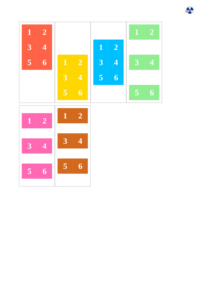 [pdfreactor__html_CSS_Properties_A_align-content.html.pdf](result/pdfreactor__html_CSS_Properties_A_align-content.html.pdf) | Ok
[align-items.html](/html/CSS%20Properties/A/align-items.html) |  [mpdf__html_CSS_Properties_A_align-items.html.pdf](result/mpdf__html_CSS_Properties_A_align-items.html.pdf) | Ok |  [typeset__html_CSS_Properties_A_align-items.html.pdf](result/typeset__html_CSS_Properties_A_align-items.html.pdf) | Ok |  [pdfreactor__html_CSS_Properties_A_align-items.html.pdf](result/pdfreactor__html_CSS_Properties_A_align-items.html.pdf) | Ok
[align-self.html](/html/CSS%20Properties/A/align-self.html) | 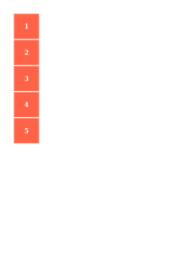 [mpdf__html_CSS_Properties_A_align-self.html.pdf](result/mpdf__html_CSS_Properties_A_align-self.html.pdf) | Ok |  [typeset__html_CSS_Properties_A_align-self.html.pdf](result/typeset__html_CSS_Properties_A_align-self.html.pdf) | Ok |  [pdfreactor__html_CSS_Properties_A_align-self.html.pdf](result/pdfreactor__html_CSS_Properties_A_align-self.html.pdf) | Ok
[all.html](/html/CSS%20Properties/A/all.html) |  [mpdf__html_CSS_Properties_A_all.html.pdf](result/mpdf__html_CSS_Properties_A_all.html.pdf) | Ok |  [typeset__html_CSS_Properties_A_all.html.pdf](result/typeset__html_CSS_Properties_A_all.html.pdf) | Ok |  [pdfreactor__html_CSS_Properties_A_all.html.pdf](result/pdfreactor__html_CSS_Properties_A_all.html.pdf) | Ok
[appearance.html](/html/CSS%20Properties/A/appearance.html) |  [mpdf__html_CSS_Properties_A_appearance.html.pdf](result/mpdf__html_CSS_Properties_A_appearance.html.pdf) | Ok |  [typeset__html_CSS_Properties_A_appearance.html.pdf](result/typeset__html_CSS_Properties_A_appearance.html.pdf) | Ok |  [pdfreactor__html_CSS_Properties_A_appearance.html.pdf](result/pdfreactor__html_CSS_Properties_A_appearance.html.pdf) | Ok

## /html/CSS Properties/B

HTML File | mPDF Result | mPDF Render Status | typeset.sh Result | typeset.sh Render Status | PDFreactor Result | PDFreactor Render Status
------------ | ------------- | ------------- | ------------- | ------------- | ------------- | -------------
[background-attachment.html](/html/CSS%20Properties/B/background-attachment.html) |  [mpdf__html_CSS_Properties_B_background-attachment.html.pdf](result/mpdf__html_CSS_Properties_B_background-attachment.html.pdf) | Ok |  [typeset__html_CSS_Properties_B_background-attachment.html.pdf](result/typeset__html_CSS_Properties_B_background-attachment.html.pdf) | Ok |  [pdfreactor__html_CSS_Properties_B_background-attachment.html.pdf](result/pdfreactor__html_CSS_Properties_B_background-attachment.html.pdf) | Ok
[background-blend-mode.html](/html/CSS%20Properties/B/background-blend-mode.html) |  [mpdf__html_CSS_Properties_B_background-blend-mode.html.pdf](result/mpdf__html_CSS_Properties_B_background-blend-mode.html.pdf) | Ok |  [typeset__html_CSS_Properties_B_background-blend-mode.html.pdf](result/typeset__html_CSS_Properties_B_background-blend-mode.html.pdf) | Ok |  [pdfreactor__html_CSS_Properties_B_background-blend-mode.html.pdf](result/pdfreactor__html_CSS_Properties_B_background-blend-mode.html.pdf) | Ok
[background-clip.html](/html/CSS%20Properties/B/background-clip.html) |  [mpdf__html_CSS_Properties_B_background-clip.html.pdf](result/mpdf__html_CSS_Properties_B_background-clip.html.pdf) | Ok |  [typeset__html_CSS_Properties_B_background-clip.html.pdf](result/typeset__html_CSS_Properties_B_background-clip.html.pdf) | Ok | 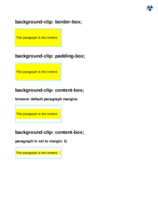 [pdfreactor__html_CSS_Properties_B_background-clip.html.pdf](result/pdfreactor__html_CSS_Properties_B_background-clip.html.pdf) | Ok
[background-color.html](/html/CSS%20Properties/B/background-color.html) |  [mpdf__html_CSS_Properties_B_background-color.html.pdf](result/mpdf__html_CSS_Properties_B_background-color.html.pdf) | Ok |  [typeset__html_CSS_Properties_B_background-color.html.pdf](result/typeset__html_CSS_Properties_B_background-color.html.pdf) | Ok |  [pdfreactor__html_CSS_Properties_B_background-color.html.pdf](result/pdfreactor__html_CSS_Properties_B_background-color.html.pdf) | Ok
[background-image.html](/html/CSS%20Properties/B/background-image.html) |  [mpdf__html_CSS_Properties_B_background-image.html.pdf](result/mpdf__html_CSS_Properties_B_background-image.html.pdf) | Ok |  [typeset__html_CSS_Properties_B_background-image.html.pdf](result/typeset__html_CSS_Properties_B_background-image.html.pdf) | Ok |  [pdfreactor__html_CSS_Properties_B_background-image.html.pdf](result/pdfreactor__html_CSS_Properties_B_background-image.html.pdf) | Ok
[background-origin.html](/html/CSS%20Properties/B/background-origin.html) |  [mpdf__html_CSS_Properties_B_background-origin.html.pdf](result/mpdf__html_CSS_Properties_B_background-origin.html.pdf) | Ok |  [typeset__html_CSS_Properties_B_background-origin.html.pdf](result/typeset__html_CSS_Properties_B_background-origin.html.pdf) | Ok |  [pdfreactor__html_CSS_Properties_B_background-origin.html.pdf](result/pdfreactor__html_CSS_Properties_B_background-origin.html.pdf) | Ok
[background-position.html](/html/CSS%20Properties/B/background-position.html) |  [mpdf__html_CSS_Properties_B_background-position.html.pdf](result/mpdf__html_CSS_Properties_B_background-position.html.pdf) | Ok |  [typeset__html_CSS_Properties_B_background-position.html.pdf](result/typeset__html_CSS_Properties_B_background-position.html.pdf) | Ok |  [pdfreactor__html_CSS_Properties_B_background-position.html.pdf](result/pdfreactor__html_CSS_Properties_B_background-position.html.pdf) | Ok
[background-repeat.html](/html/CSS%20Properties/B/background-repeat.html) |  [mpdf__html_CSS_Properties_B_background-repeat.html.pdf](result/mpdf__html_CSS_Properties_B_background-repeat.html.pdf) | Ok |  [typeset__html_CSS_Properties_B_background-repeat.html.pdf](result/typeset__html_CSS_Properties_B_background-repeat.html.pdf) | Ok |  [pdfreactor__html_CSS_Properties_B_background-repeat.html.pdf](result/pdfreactor__html_CSS_Properties_B_background-repeat.html.pdf) | Ok
[background-size.html](/html/CSS%20Properties/B/background-size.html) |  [mpdf__html_CSS_Properties_B_background-size.html.pdf](result/mpdf__html_CSS_Properties_B_background-size.html.pdf) | Ok |  [typeset__html_CSS_Properties_B_background-size.html.pdf](result/typeset__html_CSS_Properties_B_background-size.html.pdf) | Ok |  [pdfreactor__html_CSS_Properties_B_background-size.html.pdf](result/pdfreactor__html_CSS_Properties_B_background-size.html.pdf) | Ok
[background.html](/html/CSS%20Properties/B/background.html) |  [mpdf__html_CSS_Properties_B_background.html.pdf](result/mpdf__html_CSS_Properties_B_background.html.pdf) | Ok |  [typeset__html_CSS_Properties_B_background.html.pdf](result/typeset__html_CSS_Properties_B_background.html.pdf) | Ok |  [pdfreactor__html_CSS_Properties_B_background.html.pdf](result/pdfreactor__html_CSS_Properties_B_background.html.pdf) | Ok
[bleed.html](/html/CSS%20Properties/B/bleed.html) |  [mpdf__html_CSS_Properties_B_bleed.html.pdf](result/mpdf__html_CSS_Properties_B_bleed.html.pdf) | Ok |  [typeset__html_CSS_Properties_B_bleed.html.pdf](result/typeset__html_CSS_Properties_B_bleed.html.pdf) | Ok |  [pdfreactor__html_CSS_Properties_B_bleed.html.pdf](result/pdfreactor__html_CSS_Properties_B_bleed.html.pdf) | Ok
[border-collapse.html](/html/CSS%20Properties/B/border-collapse.html) |  [mpdf__html_CSS_Properties_B_border-collapse.html.pdf](result/mpdf__html_CSS_Properties_B_border-collapse.html.pdf) | Ok |  [typeset__html_CSS_Properties_B_border-collapse.html.pdf](result/typeset__html_CSS_Properties_B_border-collapse.html.pdf) | Ok |  [pdfreactor__html_CSS_Properties_B_border-collapse.html.pdf](result/pdfreactor__html_CSS_Properties_B_border-collapse.html.pdf) | Ok
[border-image.html](/html/CSS%20Properties/B/border-image.html) |  [mpdf__html_CSS_Properties_B_border-image.html.pdf](result/mpdf__html_CSS_Properties_B_border-image.html.pdf) | Ok |  [typeset__html_CSS_Properties_B_border-image.html.pdf](result/typeset__html_CSS_Properties_B_border-image.html.pdf) | Ok |  [pdfreactor__html_CSS_Properties_B_border-image.html.pdf](result/pdfreactor__html_CSS_Properties_B_border-image.html.pdf) | Ok
[border-radius.html](/html/CSS%20Properties/B/border-radius.html) |  [mpdf__html_CSS_Properties_B_border-radius.html.pdf](result/mpdf__html_CSS_Properties_B_border-radius.html.pdf) | Ok |  [typeset__html_CSS_Properties_B_border-radius.html.pdf](result/typeset__html_CSS_Properties_B_border-radius.html.pdf) | Ok |  [pdfreactor__html_CSS_Properties_B_border-radius.html.pdf](result/pdfreactor__html_CSS_Properties_B_border-radius.html.pdf) | Ok
[border-spacing.html](/html/CSS%20Properties/B/border-spacing.html) |  [mpdf__html_CSS_Properties_B_border-spacing.html.pdf](result/mpdf__html_CSS_Properties_B_border-spacing.html.pdf) | Ok |  [typeset__html_CSS_Properties_B_border-spacing.html.pdf](result/typeset__html_CSS_Properties_B_border-spacing.html.pdf) | Ok |  [pdfreactor__html_CSS_Properties_B_border-spacing.html.pdf](result/pdfreactor__html_CSS_Properties_B_border-spacing.html.pdf) | Ok
[border.html](/html/CSS%20Properties/B/border.html) |  [mpdf__html_CSS_Properties_B_border.html.pdf](result/mpdf__html_CSS_Properties_B_border.html.pdf) | Ok |  [typeset__html_CSS_Properties_B_border.html.pdf](result/typeset__html_CSS_Properties_B_border.html.pdf) | Ok | 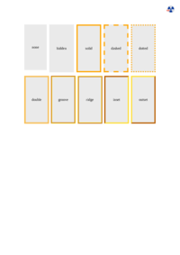 [pdfreactor__html_CSS_Properties_B_border.html.pdf](result/pdfreactor__html_CSS_Properties_B_border.html.pdf) | Ok
[bottom.html](/html/CSS%20Properties/B/bottom.html) |  [mpdf__html_CSS_Properties_B_bottom.html.pdf](result/mpdf__html_CSS_Properties_B_bottom.html.pdf) | Ok |  [typeset__html_CSS_Properties_B_bottom.html.pdf](result/typeset__html_CSS_Properties_B_bottom.html.pdf) | Ok |  [pdfreactor__html_CSS_Properties_B_bottom.html.pdf](result/pdfreactor__html_CSS_Properties_B_bottom.html.pdf) | Ok
[box-shadow.html](/html/CSS%20Properties/B/box-shadow.html) |  [mpdf__html_CSS_Properties_B_box-shadow.html.pdf](result/mpdf__html_CSS_Properties_B_box-shadow.html.pdf) | Ok | 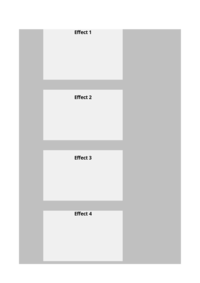 [typeset__html_CSS_Properties_B_box-shadow.html.pdf](result/typeset__html_CSS_Properties_B_box-shadow.html.pdf) | Ok |  [pdfreactor__html_CSS_Properties_B_box-shadow.html.pdf](result/pdfreactor__html_CSS_Properties_B_box-shadow.html.pdf) | Ok
[box-sizing.html](/html/CSS%20Properties/B/box-sizing.html) |  [mpdf__html_CSS_Properties_B_box-sizing.html.pdf](result/mpdf__html_CSS_Properties_B_box-sizing.html.pdf) | Ok |  [typeset__html_CSS_Properties_B_box-sizing.html.pdf](result/typeset__html_CSS_Properties_B_box-sizing.html.pdf) | Ok |  [pdfreactor__html_CSS_Properties_B_box-sizing.html.pdf](result/pdfreactor__html_CSS_Properties_B_box-sizing.html.pdf) | Ok
[break-inside.html](/html/CSS%20Properties/B/break-inside.html) |  [mpdf__html_CSS_Properties_B_break-inside.html.pdf](result/mpdf__html_CSS_Properties_B_break-inside.html.pdf) | Ok |  [typeset__html_CSS_Properties_B_break-inside.html.pdf](result/typeset__html_CSS_Properties_B_break-inside.html.pdf) | Ok |  [pdfreactor__html_CSS_Properties_B_break-inside.html.pdf](result/pdfreactor__html_CSS_Properties_B_break-inside.html.pdf) | Ok

## /html/CSS Properties/C

HTML File | mPDF Result | mPDF Render Status | typeset.sh Result | typeset.sh Render Status | PDFreactor Result | PDFreactor Render Status
------------ | ------------- | ------------- | ------------- | ------------- | ------------- | -------------
[caret-color.html](/html/CSS%20Properties/C/caret-color.html) |  [mpdf__html_CSS_Properties_C_caret-color.html.pdf](result/mpdf__html_CSS_Properties_C_caret-color.html.pdf) | Ok |  [typeset__html_CSS_Properties_C_caret-color.html.pdf](result/typeset__html_CSS_Properties_C_caret-color.html.pdf) | Ok |  [pdfreactor__html_CSS_Properties_C_caret-color.html.pdf](result/pdfreactor__html_CSS_Properties_C_caret-color.html.pdf) | Ok
[clear.html](/html/CSS%20Properties/C/clear.html) |  [mpdf__html_CSS_Properties_C_clear.html.pdf](result/mpdf__html_CSS_Properties_C_clear.html.pdf) | Ok |  [typeset__html_CSS_Properties_C_clear.html.pdf](result/typeset__html_CSS_Properties_C_clear.html.pdf) | Ok |  [pdfreactor__html_CSS_Properties_C_clear.html.pdf](result/pdfreactor__html_CSS_Properties_C_clear.html.pdf) | Ok
[color.html](/html/CSS%20Properties/C/color.html) |  [mpdf__html_CSS_Properties_C_color.html.pdf](result/mpdf__html_CSS_Properties_C_color.html.pdf) | Ok |  [typeset__html_CSS_Properties_C_color.html.pdf](result/typeset__html_CSS_Properties_C_color.html.pdf) | Ok |  [pdfreactor__html_CSS_Properties_C_color.html.pdf](result/pdfreactor__html_CSS_Properties_C_color.html.pdf) | Ok
[column-count.html](/html/CSS%20Properties/C/column-count.html) |  [mpdf__html_CSS_Properties_C_column-count.html.pdf](result/mpdf__html_CSS_Properties_C_column-count.html.pdf) | Ok |  [typeset__html_CSS_Properties_C_column-count.html.pdf](result/typeset__html_CSS_Properties_C_column-count.html.pdf) | Ok |  [pdfreactor__html_CSS_Properties_C_column-count.html.pdf](result/pdfreactor__html_CSS_Properties_C_column-count.html.pdf) | Ok
[column-fill.html](/html/CSS%20Properties/C/column-fill.html) |  [mpdf__html_CSS_Properties_C_column-fill.html.pdf](result/mpdf__html_CSS_Properties_C_column-fill.html.pdf) | Ok |  [typeset__html_CSS_Properties_C_column-fill.html.pdf](result/typeset__html_CSS_Properties_C_column-fill.html.pdf) | Ok |  [pdfreactor__html_CSS_Properties_C_column-fill.html.pdf](result/pdfreactor__html_CSS_Properties_C_column-fill.html.pdf) | Ok
[column-gap.html](/html/CSS%20Properties/C/column-gap.html) |  [mpdf__html_CSS_Properties_C_column-gap.html.pdf](result/mpdf__html_CSS_Properties_C_column-gap.html.pdf) | Ok |  [typeset__html_CSS_Properties_C_column-gap.html.pdf](result/typeset__html_CSS_Properties_C_column-gap.html.pdf) | Ok |  [pdfreactor__html_CSS_Properties_C_column-gap.html.pdf](result/pdfreactor__html_CSS_Properties_C_column-gap.html.pdf) | Ok
[column-rule.html](/html/CSS%20Properties/C/column-rule.html) |  [mpdf__html_CSS_Properties_C_column-rule.html.pdf](result/mpdf__html_CSS_Properties_C_column-rule.html.pdf) | Ok |  [typeset__html_CSS_Properties_C_column-rule.html.pdf](result/typeset__html_CSS_Properties_C_column-rule.html.pdf) | Ok | 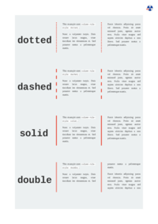 [pdfreactor__html_CSS_Properties_C_column-rule.html.pdf](result/pdfreactor__html_CSS_Properties_C_column-rule.html.pdf) | Ok
[column-span.html](/html/CSS%20Properties/C/column-span.html) |  [mpdf__html_CSS_Properties_C_column-span.html.pdf](result/mpdf__html_CSS_Properties_C_column-span.html.pdf) | Ok |  [typeset__html_CSS_Properties_C_column-span.html.pdf](result/typeset__html_CSS_Properties_C_column-span.html.pdf) | Ok |  [pdfreactor__html_CSS_Properties_C_column-span.html.pdf](result/pdfreactor__html_CSS_Properties_C_column-span.html.pdf) | Ok
[column-width.html](/html/CSS%20Properties/C/column-width.html) |  [mpdf__html_CSS_Properties_C_column-width.html.pdf](result/mpdf__html_CSS_Properties_C_column-width.html.pdf) | Ok |  [typeset__html_CSS_Properties_C_column-width.html.pdf](result/typeset__html_CSS_Properties_C_column-width.html.pdf) | Ok |  [pdfreactor__html_CSS_Properties_C_column-width.html.pdf](result/pdfreactor__html_CSS_Properties_C_column-width.html.pdf) | Ok
[columns.html](/html/CSS%20Properties/C/columns.html) |  [mpdf__html_CSS_Properties_C_columns.html.pdf](result/mpdf__html_CSS_Properties_C_columns.html.pdf) | Ok |  [typeset__html_CSS_Properties_C_columns.html.pdf](result/typeset__html_CSS_Properties_C_columns.html.pdf) | Ok |  [pdfreactor__html_CSS_Properties_C_columns.html.pdf](result/pdfreactor__html_CSS_Properties_C_columns.html.pdf) | Ok
[counter-reset.html](/html/CSS%20Properties/C/counter-reset.html) |  [mpdf__html_CSS_Properties_C_counter-reset.html.pdf](result/mpdf__html_CSS_Properties_C_counter-reset.html.pdf) | Ok |  [typeset__html_CSS_Properties_C_counter-reset.html.pdf](result/typeset__html_CSS_Properties_C_counter-reset.html.pdf) | Ok |  [pdfreactor__html_CSS_Properties_C_counter-reset.html.pdf](result/pdfreactor__html_CSS_Properties_C_counter-reset.html.pdf) | Ok

## /html/CSS Properties/D

HTML File | mPDF Result | mPDF Render Status | typeset.sh Result | typeset.sh Render Status | PDFreactor Result | PDFreactor Render Status
------------ | ------------- | ------------- | ------------- | ------------- | ------------- | -------------
[direction.html](/html/CSS%20Properties/D/direction.html) |  [mpdf__html_CSS_Properties_D_direction.html.pdf](result/mpdf__html_CSS_Properties_D_direction.html.pdf) | Ok |  [typeset__html_CSS_Properties_D_direction.html.pdf](result/typeset__html_CSS_Properties_D_direction.html.pdf) | Ok |  [pdfreactor__html_CSS_Properties_D_direction.html.pdf](result/pdfreactor__html_CSS_Properties_D_direction.html.pdf) | Ok

## /html/CSS Properties/E

HTML File | mPDF Result | mPDF Render Status | typeset.sh Result | typeset.sh Render Status | PDFreactor Result | PDFreactor Render Status
------------ | ------------- | ------------- | ------------- | ------------- | ------------- | -------------
[empty-cells.html](/html/CSS%20Properties/E/empty-cells.html) |  [mpdf__html_CSS_Properties_E_empty-cells.html.pdf](result/mpdf__html_CSS_Properties_E_empty-cells.html.pdf) | Ok |  [typeset__html_CSS_Properties_E_empty-cells.html.pdf](result/typeset__html_CSS_Properties_E_empty-cells.html.pdf) | Ok |  [pdfreactor__html_CSS_Properties_E_empty-cells.html.pdf](result/pdfreactor__html_CSS_Properties_E_empty-cells.html.pdf) | Ok

## /html/CSS Properties/F

HTML File | mPDF Result | mPDF Render Status | typeset.sh Result | typeset.sh Render Status | PDFreactor Result | PDFreactor Render Status
------------ | ------------- | ------------- | ------------- | ------------- | ------------- | -------------
[filter.html](/html/CSS%20Properties/F/filter.html) |  [mpdf__html_CSS_Properties_F_filter.html.pdf](result/mpdf__html_CSS_Properties_F_filter.html.pdf) | Ok |  [typeset__html_CSS_Properties_F_filter.html.pdf](result/typeset__html_CSS_Properties_F_filter.html.pdf) | Ok |  [pdfreactor__html_CSS_Properties_F_filter.html.pdf](result/pdfreactor__html_CSS_Properties_F_filter.html.pdf) | Ok
[flex-basis.html](/html/CSS%20Properties/F/flex-basis.html) |  [mpdf__html_CSS_Properties_F_flex-basis.html.pdf](result/mpdf__html_CSS_Properties_F_flex-basis.html.pdf) | Ok |  [typeset__html_CSS_Properties_F_flex-basis.html.pdf](result/typeset__html_CSS_Properties_F_flex-basis.html.pdf) | Ok |  [pdfreactor__html_CSS_Properties_F_flex-basis.html.pdf](result/pdfreactor__html_CSS_Properties_F_flex-basis.html.pdf) | Ok
[flex-direction.html](/html/CSS%20Properties/F/flex-direction.html) | 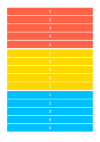 [mpdf__html_CSS_Properties_F_flex-direction.html.pdf](result/mpdf__html_CSS_Properties_F_flex-direction.html.pdf) | Ok |  [typeset__html_CSS_Properties_F_flex-direction.html.pdf](result/typeset__html_CSS_Properties_F_flex-direction.html.pdf) | Ok |  [pdfreactor__html_CSS_Properties_F_flex-direction.html.pdf](result/pdfreactor__html_CSS_Properties_F_flex-direction.html.pdf) | Ok
[flex-flow.html](/html/CSS%20Properties/F/flex-flow.html) |  [mpdf__html_CSS_Properties_F_flex-flow.html.pdf](result/mpdf__html_CSS_Properties_F_flex-flow.html.pdf) | Ok | 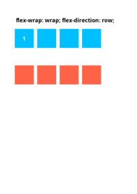 [typeset__html_CSS_Properties_F_flex-flow.html.pdf](result/typeset__html_CSS_Properties_F_flex-flow.html.pdf) | Ok | 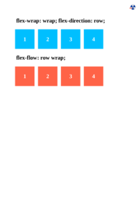 [pdfreactor__html_CSS_Properties_F_flex-flow.html.pdf](result/pdfreactor__html_CSS_Properties_F_flex-flow.html.pdf) | Ok
[flex-grow.html](/html/CSS%20Properties/F/flex-grow.html) |  [mpdf__html_CSS_Properties_F_flex-grow.html.pdf](result/mpdf__html_CSS_Properties_F_flex-grow.html.pdf) | Ok |  [typeset__html_CSS_Properties_F_flex-grow.html.pdf](result/typeset__html_CSS_Properties_F_flex-grow.html.pdf) | Ok |  [pdfreactor__html_CSS_Properties_F_flex-grow.html.pdf](result/pdfreactor__html_CSS_Properties_F_flex-grow.html.pdf) | Ok
[flex-shrink.html](/html/CSS%20Properties/F/flex-shrink.html) |  [mpdf__html_CSS_Properties_F_flex-shrink.html.pdf](result/mpdf__html_CSS_Properties_F_flex-shrink.html.pdf) | Ok |  [typeset__html_CSS_Properties_F_flex-shrink.html.pdf](result/typeset__html_CSS_Properties_F_flex-shrink.html.pdf) | Ok |  [pdfreactor__html_CSS_Properties_F_flex-shrink.html.pdf](result/pdfreactor__html_CSS_Properties_F_flex-shrink.html.pdf) | Ok
[flex-wrap.html](/html/CSS%20Properties/F/flex-wrap.html) | 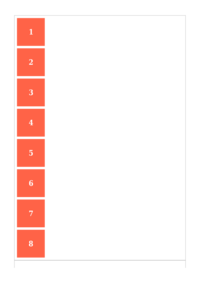 [mpdf__html_CSS_Properties_F_flex-wrap.html.pdf](result/mpdf__html_CSS_Properties_F_flex-wrap.html.pdf) | Ok |  [typeset__html_CSS_Properties_F_flex-wrap.html.pdf](result/typeset__html_CSS_Properties_F_flex-wrap.html.pdf) | Ok | 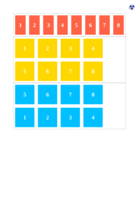 [pdfreactor__html_CSS_Properties_F_flex-wrap.html.pdf](result/pdfreactor__html_CSS_Properties_F_flex-wrap.html.pdf) | Ok
[flex.html](/html/CSS%20Properties/F/flex.html) |  [mpdf__html_CSS_Properties_F_flex.html.pdf](result/mpdf__html_CSS_Properties_F_flex.html.pdf) | Ok | 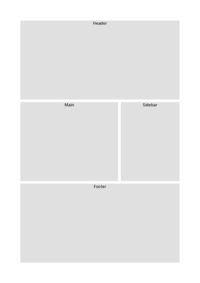 [typeset__html_CSS_Properties_F_flex.html.pdf](result/typeset__html_CSS_Properties_F_flex.html.pdf) | Ok |  [pdfreactor__html_CSS_Properties_F_flex.html.pdf](result/pdfreactor__html_CSS_Properties_F_flex.html.pdf) | Ok
[float.html](/html/CSS%20Properties/F/float.html) |  [mpdf__html_CSS_Properties_F_float.html.pdf](result/mpdf__html_CSS_Properties_F_float.html.pdf) | Ok |  [typeset__html_CSS_Properties_F_float.html.pdf](result/typeset__html_CSS_Properties_F_float.html.pdf) | Ok |  [pdfreactor__html_CSS_Properties_F_float.html.pdf](result/pdfreactor__html_CSS_Properties_F_float.html.pdf) | Ok
[font-family.html](/html/CSS%20Properties/F/font-family.html) |  [mpdf__html_CSS_Properties_F_font-family.html.pdf](result/mpdf__html_CSS_Properties_F_font-family.html.pdf) | Ok |  [typeset__html_CSS_Properties_F_font-family.html.pdf](result/typeset__html_CSS_Properties_F_font-family.html.pdf) | Ok |  [pdfreactor__html_CSS_Properties_F_font-family.html.pdf](result/pdfreactor__html_CSS_Properties_F_font-family.html.pdf) | Ok
[font-size.html](/html/CSS%20Properties/F/font-size.html) | 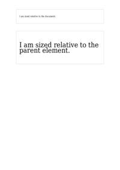 [mpdf__html_CSS_Properties_F_font-size.html.pdf](result/mpdf__html_CSS_Properties_F_font-size.html.pdf) | Ok |  [typeset__html_CSS_Properties_F_font-size.html.pdf](result/typeset__html_CSS_Properties_F_font-size.html.pdf) | Ok |  [pdfreactor__html_CSS_Properties_F_font-size.html.pdf](result/pdfreactor__html_CSS_Properties_F_font-size.html.pdf) | Ok
[font-style.html](/html/CSS%20Properties/F/font-style.html) |  [mpdf__html_CSS_Properties_F_font-style.html.pdf](result/mpdf__html_CSS_Properties_F_font-style.html.pdf) | Ok |  [typeset__html_CSS_Properties_F_font-style.html.pdf](result/typeset__html_CSS_Properties_F_font-style.html.pdf) | Ok |  [pdfreactor__html_CSS_Properties_F_font-style.html.pdf](result/pdfreactor__html_CSS_Properties_F_font-style.html.pdf) | Ok
[font-variant.html](/html/CSS%20Properties/F/font-variant.html) |  [mpdf__html_CSS_Properties_F_font-variant.html.pdf](result/mpdf__html_CSS_Properties_F_font-variant.html.pdf) | Ok |  [typeset__html_CSS_Properties_F_font-variant.html.pdf](result/typeset__html_CSS_Properties_F_font-variant.html.pdf) | Ok |  [pdfreactor__html_CSS_Properties_F_font-variant.html.pdf](result/pdfreactor__html_CSS_Properties_F_font-variant.html.pdf) | Ok
[font-weight.html](/html/CSS%20Properties/F/font-weight.html) |  [mpdf__html_CSS_Properties_F_font-weight.html.pdf](result/mpdf__html_CSS_Properties_F_font-weight.html.pdf) | Ok |  [typeset__html_CSS_Properties_F_font-weight.html.pdf](result/typeset__html_CSS_Properties_F_font-weight.html.pdf) | Ok |  [pdfreactor__html_CSS_Properties_F_font-weight.html.pdf](result/pdfreactor__html_CSS_Properties_F_font-weight.html.pdf) | Ok
[font.html](/html/CSS%20Properties/F/font.html) |  [mpdf__html_CSS_Properties_F_font.html.pdf](result/mpdf__html_CSS_Properties_F_font.html.pdf) | Ok |  [typeset__html_CSS_Properties_F_font.html.pdf](result/typeset__html_CSS_Properties_F_font.html.pdf) | Ok |  [pdfreactor__html_CSS_Properties_F_font.html.pdf](result/pdfreactor__html_CSS_Properties_F_font.html.pdf) | Ok

## /html/CSS Properties/G

HTML File | mPDF Result | mPDF Render Status | typeset.sh Result | typeset.sh Render Status | PDFreactor Result | PDFreactor Render Status
------------ | ------------- | ------------- | ------------- | ------------- | ------------- | -------------
[grid-row-column.html](/html/CSS%20Properties/G/grid-row-column.html) |  [mpdf__html_CSS_Properties_G_grid-row-column.html.pdf](result/mpdf__html_CSS_Properties_G_grid-row-column.html.pdf) | Ok |  [typeset__html_CSS_Properties_G_grid-row-column.html.pdf](result/typeset__html_CSS_Properties_G_grid-row-column.html.pdf) | Ok |  [pdfreactor__html_CSS_Properties_G_grid-row-column.html.pdf](result/pdfreactor__html_CSS_Properties_G_grid-row-column.html.pdf) | Ok

## /html/CSS Properties/H

HTML File | mPDF Result | mPDF Render Status | typeset.sh Result | typeset.sh Render Status | PDFreactor Result | PDFreactor Render Status
------------ | ------------- | ------------- | ------------- | ------------- | ------------- | -------------
[hanging-punctuation.html](/html/CSS%20Properties/H/hanging-punctuation.html) |  [mpdf__html_CSS_Properties_H_hanging-punctuation.html.pdf](result/mpdf__html_CSS_Properties_H_hanging-punctuation.html.pdf) | Ok |  [typeset__html_CSS_Properties_H_hanging-punctuation.html.pdf](result/typeset__html_CSS_Properties_H_hanging-punctuation.html.pdf) | Ok |  [pdfreactor__html_CSS_Properties_H_hanging-punctuation.html.pdf](result/pdfreactor__html_CSS_Properties_H_hanging-punctuation.html.pdf) | Ok
[height.html](/html/CSS%20Properties/H/height.html) |  [mpdf__html_CSS_Properties_H_height.html.pdf](result/mpdf__html_CSS_Properties_H_height.html.pdf) | Ok |  [typeset__html_CSS_Properties_H_height.html.pdf](result/typeset__html_CSS_Properties_H_height.html.pdf) | Ok |  [pdfreactor__html_CSS_Properties_H_height.html.pdf](result/pdfreactor__html_CSS_Properties_H_height.html.pdf) | Ok
[hyphens.html](/html/CSS%20Properties/H/hyphens.html) |  [mpdf__html_CSS_Properties_H_hyphens.html.pdf](result/mpdf__html_CSS_Properties_H_hyphens.html.pdf) | Ok |  [typeset__html_CSS_Properties_H_hyphens.html.pdf](result/typeset__html_CSS_Properties_H_hyphens.html.pdf) | Ok |  [pdfreactor__html_CSS_Properties_H_hyphens.html.pdf](result/pdfreactor__html_CSS_Properties_H_hyphens.html.pdf) | Ok

## /html/CSS Properties/I

HTML File | mPDF Result | mPDF Render Status | typeset.sh Result | typeset.sh Render Status | PDFreactor Result | PDFreactor Render Status
------------ | ------------- | ------------- | ------------- | ------------- | ------------- | -------------
[image-rendering.html](/html/CSS%20Properties/I/image-rendering.html) |  [mpdf__html_CSS_Properties_I_image-rendering.html.pdf](result/mpdf__html_CSS_Properties_I_image-rendering.html.pdf) | Ok |  [typeset__html_CSS_Properties_I_image-rendering.html.pdf](result/typeset__html_CSS_Properties_I_image-rendering.html.pdf) | Ok |  [pdfreactor__html_CSS_Properties_I_image-rendering.html.pdf](result/pdfreactor__html_CSS_Properties_I_image-rendering.html.pdf) | Ok
[initial-letter.html](/html/CSS%20Properties/I/initial-letter.html) |  [mpdf__html_CSS_Properties_I_initial-letter.html.pdf](result/mpdf__html_CSS_Properties_I_initial-letter.html.pdf) | Ok |  [typeset__html_CSS_Properties_I_initial-letter.html.pdf](result/typeset__html_CSS_Properties_I_initial-letter.html.pdf) | Ok |  [pdfreactor__html_CSS_Properties_I_initial-letter.html.pdf](result/pdfreactor__html_CSS_Properties_I_initial-letter.html.pdf) | Ok

## /html/CSS Properties/J

HTML File | mPDF Result | mPDF Render Status | typeset.sh Result | typeset.sh Render Status | PDFreactor Result | PDFreactor Render Status
------------ | ------------- | ------------- | ------------- | ------------- | ------------- | -------------
[justify-content.html](/html/CSS%20Properties/J/justify-content.html) |  [mpdf__html_CSS_Properties_J_justify-content.html.pdf](result/mpdf__html_CSS_Properties_J_justify-content.html.pdf) | Ok |  [typeset__html_CSS_Properties_J_justify-content.html.pdf](result/typeset__html_CSS_Properties_J_justify-content.html.pdf) | Ok | 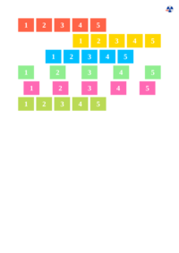 [pdfreactor__html_CSS_Properties_J_justify-content.html.pdf](result/pdfreactor__html_CSS_Properties_J_justify-content.html.pdf) | Ok

## /html/CSS Properties/L

HTML File | mPDF Result | mPDF Render Status | typeset.sh Result | typeset.sh Render Status | PDFreactor Result | PDFreactor Render Status
------------ | ------------- | ------------- | ------------- | ------------- | ------------- | -------------
[left.html](/html/CSS%20Properties/L/left.html) |  [mpdf__html_CSS_Properties_L_left.html.pdf](result/mpdf__html_CSS_Properties_L_left.html.pdf) | Ok |  [typeset__html_CSS_Properties_L_left.html.pdf](result/typeset__html_CSS_Properties_L_left.html.pdf) | Ok |  [pdfreactor__html_CSS_Properties_L_left.html.pdf](result/pdfreactor__html_CSS_Properties_L_left.html.pdf) | Ok
[letter-spacing.html](/html/CSS%20Properties/L/letter-spacing.html) |  [mpdf__html_CSS_Properties_L_letter-spacing.html.pdf](result/mpdf__html_CSS_Properties_L_letter-spacing.html.pdf) | Ok |  [typeset__html_CSS_Properties_L_letter-spacing.html.pdf](result/typeset__html_CSS_Properties_L_letter-spacing.html.pdf) | Ok |  [pdfreactor__html_CSS_Properties_L_letter-spacing.html.pdf](result/pdfreactor__html_CSS_Properties_L_letter-spacing.html.pdf) | Ok
[line-height.html](/html/CSS%20Properties/L/line-height.html) |  [mpdf__html_CSS_Properties_L_line-height.html.pdf](result/mpdf__html_CSS_Properties_L_line-height.html.pdf) | Ok |  [typeset__html_CSS_Properties_L_line-height.html.pdf](result/typeset__html_CSS_Properties_L_line-height.html.pdf) | Ok |  [pdfreactor__html_CSS_Properties_L_line-height.html.pdf](result/pdfreactor__html_CSS_Properties_L_line-height.html.pdf) | Ok
[list-style.html](/html/CSS%20Properties/L/list-style.html) |  [mpdf__html_CSS_Properties_L_list-style.html.pdf](result/mpdf__html_CSS_Properties_L_list-style.html.pdf) | Ok |  [typeset__html_CSS_Properties_L_list-style.html.pdf](result/typeset__html_CSS_Properties_L_list-style.html.pdf) | Ok |  [pdfreactor__html_CSS_Properties_L_list-style.html.pdf](result/pdfreactor__html_CSS_Properties_L_list-style.html.pdf) | Ok

## /html/CSS Properties/M

HTML File | mPDF Result | mPDF Render Status | typeset.sh Result | typeset.sh Render Status | PDFreactor Result | PDFreactor Render Status
------------ | ------------- | ------------- | ------------- | ------------- | ------------- | -------------
[margin.html](/html/CSS%20Properties/M/margin.html) |  [mpdf__html_CSS_Properties_M_margin.html.pdf](result/mpdf__html_CSS_Properties_M_margin.html.pdf) | Ok |  [typeset__html_CSS_Properties_M_margin.html.pdf](result/typeset__html_CSS_Properties_M_margin.html.pdf) | Ok |  [pdfreactor__html_CSS_Properties_M_margin.html.pdf](result/pdfreactor__html_CSS_Properties_M_margin.html.pdf) | Ok
[mask-image.html](/html/CSS%20Properties/M/mask-image.html) |  [mpdf__html_CSS_Properties_M_mask-image.html.pdf](result/mpdf__html_CSS_Properties_M_mask-image.html.pdf) | Ok |  [typeset__html_CSS_Properties_M_mask-image.html.pdf](result/typeset__html_CSS_Properties_M_mask-image.html.pdf) | Ok |  [pdfreactor__html_CSS_Properties_M_mask-image.html.pdf](result/pdfreactor__html_CSS_Properties_M_mask-image.html.pdf) | Ok
[mask-repeat.html](/html/CSS%20Properties/M/mask-repeat.html) |  [mpdf__html_CSS_Properties_M_mask-repeat.html.pdf](result/mpdf__html_CSS_Properties_M_mask-repeat.html.pdf) | Ok |  [typeset__html_CSS_Properties_M_mask-repeat.html.pdf](result/typeset__html_CSS_Properties_M_mask-repeat.html.pdf) | Ok |  [pdfreactor__html_CSS_Properties_M_mask-repeat.html.pdf](result/pdfreactor__html_CSS_Properties_M_mask-repeat.html.pdf) | Ok
[max-height.html](/html/CSS%20Properties/M/max-height.html) |  [mpdf__html_CSS_Properties_M_max-height.html.pdf](result/mpdf__html_CSS_Properties_M_max-height.html.pdf) | Ok |  [typeset__html_CSS_Properties_M_max-height.html.pdf](result/typeset__html_CSS_Properties_M_max-height.html.pdf) | Ok |  [pdfreactor__html_CSS_Properties_M_max-height.html.pdf](result/pdfreactor__html_CSS_Properties_M_max-height.html.pdf) | Ok
[max-width.html](/html/CSS%20Properties/M/max-width.html) | 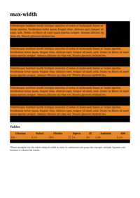 [mpdf__html_CSS_Properties_M_max-width.html.pdf](result/mpdf__html_CSS_Properties_M_max-width.html.pdf) | Ok |  [typeset__html_CSS_Properties_M_max-width.html.pdf](result/typeset__html_CSS_Properties_M_max-width.html.pdf) | Ok |  [pdfreactor__html_CSS_Properties_M_max-width.html.pdf](result/pdfreactor__html_CSS_Properties_M_max-width.html.pdf) | Ok
[min-height.html](/html/CSS%20Properties/M/min-height.html) |  [mpdf__html_CSS_Properties_M_min-height.html.pdf](result/mpdf__html_CSS_Properties_M_min-height.html.pdf) | Ok |  [typeset__html_CSS_Properties_M_min-height.html.pdf](result/typeset__html_CSS_Properties_M_min-height.html.pdf) | Ok |  [pdfreactor__html_CSS_Properties_M_min-height.html.pdf](result/pdfreactor__html_CSS_Properties_M_min-height.html.pdf) | Ok
[min-width.html](/html/CSS%20Properties/M/min-width.html) |  [mpdf__html_CSS_Properties_M_min-width.html.pdf](result/mpdf__html_CSS_Properties_M_min-width.html.pdf) | Ok |  [typeset__html_CSS_Properties_M_min-width.html.pdf](result/typeset__html_CSS_Properties_M_min-width.html.pdf) | Ok |  [pdfreactor__html_CSS_Properties_M_min-width.html.pdf](result/pdfreactor__html_CSS_Properties_M_min-width.html.pdf) | Ok
[mix-blend-mode.html](/html/CSS%20Properties/M/mix-blend-mode.html) |  [mpdf__html_CSS_Properties_M_mix-blend-mode.html.pdf](result/mpdf__html_CSS_Properties_M_mix-blend-mode.html.pdf) | Ok |  [typeset__html_CSS_Properties_M_mix-blend-mode.html.pdf](result/typeset__html_CSS_Properties_M_mix-blend-mode.html.pdf) | Ok |  [pdfreactor__html_CSS_Properties_M_mix-blend-mode.html.pdf](result/pdfreactor__html_CSS_Properties_M_mix-blend-mode.html.pdf) | Ok

## /html/CSS Properties/O

HTML File | mPDF Result | mPDF Render Status | typeset.sh Result | typeset.sh Render Status | PDFreactor Result | PDFreactor Render Status
------------ | ------------- | ------------- | ------------- | ------------- | ------------- | -------------
[object-fit.html](/html/CSS%20Properties/O/object-fit.html) |  [mpdf__html_CSS_Properties_O_object-fit.html.pdf](result/mpdf__html_CSS_Properties_O_object-fit.html.pdf) | Ok |  [typeset__html_CSS_Properties_O_object-fit.html.pdf](result/typeset__html_CSS_Properties_O_object-fit.html.pdf) | Ok |  [pdfreactor__html_CSS_Properties_O_object-fit.html.pdf](result/pdfreactor__html_CSS_Properties_O_object-fit.html.pdf) | Ok
[object-position.html](/html/CSS%20Properties/O/object-position.html) | 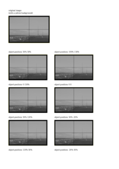 [mpdf__html_CSS_Properties_O_object-position.html.pdf](result/mpdf__html_CSS_Properties_O_object-position.html.pdf) | Ok |  [typeset__html_CSS_Properties_O_object-position.html.pdf](result/typeset__html_CSS_Properties_O_object-position.html.pdf) | Ok |  [pdfreactor__html_CSS_Properties_O_object-position.html.pdf](result/pdfreactor__html_CSS_Properties_O_object-position.html.pdf) | Ok
[offset-anchor.html](/html/CSS%20Properties/O/offset-anchor.html) |  [mpdf__html_CSS_Properties_O_offset-anchor.html.pdf](result/mpdf__html_CSS_Properties_O_offset-anchor.html.pdf) | Ok |  [typeset__html_CSS_Properties_O_offset-anchor.html.pdf](result/typeset__html_CSS_Properties_O_offset-anchor.html.pdf) | Ok |  [pdfreactor__html_CSS_Properties_O_offset-anchor.html.pdf](result/pdfreactor__html_CSS_Properties_O_offset-anchor.html.pdf) | Ok
[offset-distance.html](/html/CSS%20Properties/O/offset-distance.html) |  [mpdf__html_CSS_Properties_O_offset-distance.html.pdf](result/mpdf__html_CSS_Properties_O_offset-distance.html.pdf) | Ok |  [typeset__html_CSS_Properties_O_offset-distance.html.pdf](result/typeset__html_CSS_Properties_O_offset-distance.html.pdf) | Ok |  [pdfreactor__html_CSS_Properties_O_offset-distance.html.pdf](result/pdfreactor__html_CSS_Properties_O_offset-distance.html.pdf) | Ok
[offset-path.html](/html/CSS%20Properties/O/offset-path.html) |  [mpdf__html_CSS_Properties_O_offset-path.html.pdf](result/mpdf__html_CSS_Properties_O_offset-path.html.pdf) | Ok |  [typeset__html_CSS_Properties_O_offset-path.html.pdf](result/typeset__html_CSS_Properties_O_offset-path.html.pdf) | Ok |  [pdfreactor__html_CSS_Properties_O_offset-path.html.pdf](result/pdfreactor__html_CSS_Properties_O_offset-path.html.pdf) | Ok
[offset-rotate.html](/html/CSS%20Properties/O/offset-rotate.html) |  [mpdf__html_CSS_Properties_O_offset-rotate.html.pdf](result/mpdf__html_CSS_Properties_O_offset-rotate.html.pdf) | Ok |  [typeset__html_CSS_Properties_O_offset-rotate.html.pdf](result/typeset__html_CSS_Properties_O_offset-rotate.html.pdf) | Ok |  [pdfreactor__html_CSS_Properties_O_offset-rotate.html.pdf](result/pdfreactor__html_CSS_Properties_O_offset-rotate.html.pdf) | Ok
[opacity.html](/html/CSS%20Properties/O/opacity.html) |  [mpdf__html_CSS_Properties_O_opacity.html.pdf](result/mpdf__html_CSS_Properties_O_opacity.html.pdf) | Ok |  [typeset__html_CSS_Properties_O_opacity.html.pdf](result/typeset__html_CSS_Properties_O_opacity.html.pdf) | Ok |  [pdfreactor__html_CSS_Properties_O_opacity.html.pdf](result/pdfreactor__html_CSS_Properties_O_opacity.html.pdf) | Ok
[order.html](/html/CSS%20Properties/O/order.html) |  [mpdf__html_CSS_Properties_O_order.html.pdf](result/mpdf__html_CSS_Properties_O_order.html.pdf) | Ok |  [typeset__html_CSS_Properties_O_order.html.pdf](result/typeset__html_CSS_Properties_O_order.html.pdf) | Ok |  [pdfreactor__html_CSS_Properties_O_order.html.pdf](result/pdfreactor__html_CSS_Properties_O_order.html.pdf) | Ok
[orphans.html](/html/CSS%20Properties/O/orphans.html) |  [mpdf__html_CSS_Properties_O_orphans.html.pdf](result/mpdf__html_CSS_Properties_O_orphans.html.pdf) | Ok |  [typeset__html_CSS_Properties_O_orphans.html.pdf](result/typeset__html_CSS_Properties_O_orphans.html.pdf) | Ok |  [pdfreactor__html_CSS_Properties_O_orphans.html.pdf](result/pdfreactor__html_CSS_Properties_O_orphans.html.pdf) | Ok
[outline-offset.html](/html/CSS%20Properties/O/outline-offset.html) |  [mpdf__html_CSS_Properties_O_outline-offset.html.pdf](result/mpdf__html_CSS_Properties_O_outline-offset.html.pdf) | Ok |  [typeset__html_CSS_Properties_O_outline-offset.html.pdf](result/typeset__html_CSS_Properties_O_outline-offset.html.pdf) | Ok |  [pdfreactor__html_CSS_Properties_O_outline-offset.html.pdf](result/pdfreactor__html_CSS_Properties_O_outline-offset.html.pdf) | Ok
[outline.html](/html/CSS%20Properties/O/outline.html) |  [mpdf__html_CSS_Properties_O_outline.html.pdf](result/mpdf__html_CSS_Properties_O_outline.html.pdf) | Ok |  [typeset__html_CSS_Properties_O_outline.html.pdf](result/typeset__html_CSS_Properties_O_outline.html.pdf) | Ok |  [pdfreactor__html_CSS_Properties_O_outline.html.pdf](result/pdfreactor__html_CSS_Properties_O_outline.html.pdf) | Ok
[overflow.html](/html/CSS%20Properties/O/overflow.html) |  [mpdf__html_CSS_Properties_O_overflow.html.pdf](result/mpdf__html_CSS_Properties_O_overflow.html.pdf) | Ok |  [typeset__html_CSS_Properties_O_overflow.html.pdf](result/typeset__html_CSS_Properties_O_overflow.html.pdf) | Ok |  [pdfreactor__html_CSS_Properties_O_overflow.html.pdf](result/pdfreactor__html_CSS_Properties_O_overflow.html.pdf) | Ok
[overscroll-behavior.html](/html/CSS%20Properties/O/overscroll-behavior.html) |  [mpdf__html_CSS_Properties_O_overscroll-behavior.html.pdf](result/mpdf__html_CSS_Properties_O_overscroll-behavior.html.pdf) | Ok |  [typeset__html_CSS_Properties_O_overscroll-behavior.html.pdf](result/typeset__html_CSS_Properties_O_overscroll-behavior.html.pdf) | Ok |  [pdfreactor__html_CSS_Properties_O_overscroll-behavior.html.pdf](result/pdfreactor__html_CSS_Properties_O_overscroll-behavior.html.pdf) | Ok

## /html/CSS Properties/P

HTML File | mPDF Result | mPDF Render Status | typeset.sh Result | typeset.sh Render Status | PDFreactor Result | PDFreactor Render Status
------------ | ------------- | ------------- | ------------- | ------------- | ------------- | -------------
[padding.html](/html/CSS%20Properties/P/padding.html) |  [mpdf__html_CSS_Properties_P_padding.html.pdf](result/mpdf__html_CSS_Properties_P_padding.html.pdf) | Ok |  [typeset__html_CSS_Properties_P_padding.html.pdf](result/typeset__html_CSS_Properties_P_padding.html.pdf) | Ok |  [pdfreactor__html_CSS_Properties_P_padding.html.pdf](result/pdfreactor__html_CSS_Properties_P_padding.html.pdf) | Ok
[perspective-origin.html](/html/CSS%20Properties/P/perspective-origin.html) | 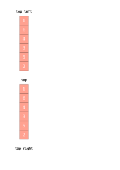 [mpdf__html_CSS_Properties_P_perspective-origin.html.pdf](result/mpdf__html_CSS_Properties_P_perspective-origin.html.pdf) | Ok |  [typeset__html_CSS_Properties_P_perspective-origin.html.pdf](result/typeset__html_CSS_Properties_P_perspective-origin.html.pdf) | Ok |  [pdfreactor__html_CSS_Properties_P_perspective-origin.html.pdf](result/pdfreactor__html_CSS_Properties_P_perspective-origin.html.pdf) | Ok
[perspective.html](/html/CSS%20Properties/P/perspective.html) |  [mpdf__html_CSS_Properties_P_perspective.html.pdf](result/mpdf__html_CSS_Properties_P_perspective.html.pdf) | Ok |  [typeset__html_CSS_Properties_P_perspective.html.pdf](result/typeset__html_CSS_Properties_P_perspective.html.pdf) | Ok |  [pdfreactor__html_CSS_Properties_P_perspective.html.pdf](result/pdfreactor__html_CSS_Properties_P_perspective.html.pdf) | Ok
[position.html](/html/CSS%20Properties/P/position.html) |  [mpdf__html_CSS_Properties_P_position.html.pdf](result/mpdf__html_CSS_Properties_P_position.html.pdf) | Ok |  [typeset__html_CSS_Properties_P_position.html.pdf](result/typeset__html_CSS_Properties_P_position.html.pdf) | Ok |  [pdfreactor__html_CSS_Properties_P_position.html.pdf](result/pdfreactor__html_CSS_Properties_P_position.html.pdf) | Ok

## /html/CSS Properties/R

HTML File | mPDF Result | mPDF Render Status | typeset.sh Result | typeset.sh Render Status | PDFreactor Result | PDFreactor Render Status
------------ | ------------- | ------------- | ------------- | ------------- | ------------- | -------------
[resize.html](/html/CSS%20Properties/R/resize.html) |  [mpdf__html_CSS_Properties_R_resize.html.pdf](result/mpdf__html_CSS_Properties_R_resize.html.pdf) | Ok |  [typeset__html_CSS_Properties_R_resize.html.pdf](result/typeset__html_CSS_Properties_R_resize.html.pdf) | Ok |  [pdfreactor__html_CSS_Properties_R_resize.html.pdf](result/pdfreactor__html_CSS_Properties_R_resize.html.pdf) | Ok
[right.html](/html/CSS%20Properties/R/right.html) |  [mpdf__html_CSS_Properties_R_right.html.pdf](result/mpdf__html_CSS_Properties_R_right.html.pdf) | Ok |  [typeset__html_CSS_Properties_R_right.html.pdf](result/typeset__html_CSS_Properties_R_right.html.pdf) | Ok |  [pdfreactor__html_CSS_Properties_R_right.html.pdf](result/pdfreactor__html_CSS_Properties_R_right.html.pdf) | Ok

## /html/CSS Properties/S

HTML File | mPDF Result | mPDF Render Status | typeset.sh Result | typeset.sh Render Status | PDFreactor Result | PDFreactor Render Status
------------ | ------------- | ------------- | ------------- | ------------- | ------------- | -------------
[shape-outside.html](/html/CSS%20Properties/S/shape-outside.html) |  [mpdf__html_CSS_Properties_S_shape-outside.html.pdf](result/mpdf__html_CSS_Properties_S_shape-outside.html.pdf) | Ok |  [typeset__html_CSS_Properties_S_shape-outside.html.pdf](result/typeset__html_CSS_Properties_S_shape-outside.html.pdf) | Ok |  [pdfreactor__html_CSS_Properties_S_shape-outside.html.pdf](result/pdfreactor__html_CSS_Properties_S_shape-outside.html.pdf) | Ok
[stroke-dasharray.html](/html/CSS%20Properties/S/stroke-dasharray.html) |  [mpdf__html_CSS_Properties_S_stroke-dasharray.html.pdf](result/mpdf__html_CSS_Properties_S_stroke-dasharray.html.pdf) | Ok |  [typeset__html_CSS_Properties_S_stroke-dasharray.html.pdf](result/typeset__html_CSS_Properties_S_stroke-dasharray.html.pdf) | Ok |  [pdfreactor__html_CSS_Properties_S_stroke-dasharray.html.pdf](result/pdfreactor__html_CSS_Properties_S_stroke-dasharray.html.pdf) | Ok
[stroke-dashoffset.html](/html/CSS%20Properties/S/stroke-dashoffset.html) |  [mpdf__html_CSS_Properties_S_stroke-dashoffset.html.pdf](result/mpdf__html_CSS_Properties_S_stroke-dashoffset.html.pdf) | Ok |  [typeset__html_CSS_Properties_S_stroke-dashoffset.html.pdf](result/typeset__html_CSS_Properties_S_stroke-dashoffset.html.pdf) | Ok |  [pdfreactor__html_CSS_Properties_S_stroke-dashoffset.html.pdf](result/pdfreactor__html_CSS_Properties_S_stroke-dashoffset.html.pdf) | Ok
[stroke-linecap.html](/html/CSS%20Properties/S/stroke-linecap.html) |  [mpdf__html_CSS_Properties_S_stroke-linecap.html.pdf](result/mpdf__html_CSS_Properties_S_stroke-linecap.html.pdf) | Ok |  [typeset__html_CSS_Properties_S_stroke-linecap.html.pdf](result/typeset__html_CSS_Properties_S_stroke-linecap.html.pdf) | Ok |  [pdfreactor__html_CSS_Properties_S_stroke-linecap.html.pdf](result/pdfreactor__html_CSS_Properties_S_stroke-linecap.html.pdf) | Ok
[stroke-linejoin.html](/html/CSS%20Properties/S/stroke-linejoin.html) |  [mpdf__html_CSS_Properties_S_stroke-linejoin.html.pdf](result/mpdf__html_CSS_Properties_S_stroke-linejoin.html.pdf) | Ok |  [typeset__html_CSS_Properties_S_stroke-linejoin.html.pdf](result/typeset__html_CSS_Properties_S_stroke-linejoin.html.pdf) | Ok |  [pdfreactor__html_CSS_Properties_S_stroke-linejoin.html.pdf](result/pdfreactor__html_CSS_Properties_S_stroke-linejoin.html.pdf) | Ok
[stroke-width.html](/html/CSS%20Properties/S/stroke-width.html) |  [mpdf__html_CSS_Properties_S_stroke-width.html.pdf](result/mpdf__html_CSS_Properties_S_stroke-width.html.pdf) | Ok |  [typeset__html_CSS_Properties_S_stroke-width.html.pdf](result/typeset__html_CSS_Properties_S_stroke-width.html.pdf) | Ok |  [pdfreactor__html_CSS_Properties_S_stroke-width.html.pdf](result/pdfreactor__html_CSS_Properties_S_stroke-width.html.pdf) | Ok
[stroke.html](/html/CSS%20Properties/S/stroke.html) |  [mpdf__html_CSS_Properties_S_stroke.html.pdf](result/mpdf__html_CSS_Properties_S_stroke.html.pdf) | Ok |  [typeset__html_CSS_Properties_S_stroke.html.pdf](result/typeset__html_CSS_Properties_S_stroke.html.pdf) | Ok |  [pdfreactor__html_CSS_Properties_S_stroke.html.pdf](result/pdfreactor__html_CSS_Properties_S_stroke.html.pdf) | Ok

## /html/CSS Properties/T

HTML File | mPDF Result | mPDF Render Status | typeset.sh Result | typeset.sh Render Status | PDFreactor Result | PDFreactor Render Status
------------ | ------------- | ------------- | ------------- | ------------- | ------------- | -------------
[tab-size.html](/html/CSS%20Properties/T/tab-size.html) |  [mpdf__html_CSS_Properties_T_tab-size.html.pdf](result/mpdf__html_CSS_Properties_T_tab-size.html.pdf) | Ok |  [typeset__html_CSS_Properties_T_tab-size.html.pdf](result/typeset__html_CSS_Properties_T_tab-size.html.pdf) | Ok |  [pdfreactor__html_CSS_Properties_T_tab-size.html.pdf](result/pdfreactor__html_CSS_Properties_T_tab-size.html.pdf) | Ok
[table-layout.html](/html/CSS%20Properties/T/table-layout.html) |  [mpdf__html_CSS_Properties_T_table-layout.html.pdf](result/mpdf__html_CSS_Properties_T_table-layout.html.pdf) | Ok |  [typeset__html_CSS_Properties_T_table-layout.html.pdf](result/typeset__html_CSS_Properties_T_table-layout.html.pdf) | Ok |  [pdfreactor__html_CSS_Properties_T_table-layout.html.pdf](result/pdfreactor__html_CSS_Properties_T_table-layout.html.pdf) | Ok
[text-align-last.html](/html/CSS%20Properties/T/text-align-last.html) | 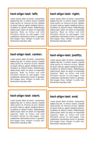 [mpdf__html_CSS_Properties_T_text-align-last.html.pdf](result/mpdf__html_CSS_Properties_T_text-align-last.html.pdf) | Ok |  [typeset__html_CSS_Properties_T_text-align-last.html.pdf](result/typeset__html_CSS_Properties_T_text-align-last.html.pdf) | Ok | 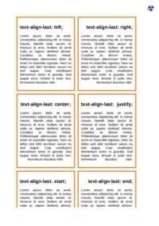 [pdfreactor__html_CSS_Properties_T_text-align-last.html.pdf](result/pdfreactor__html_CSS_Properties_T_text-align-last.html.pdf) | Ok
[text-align.html](/html/CSS%20Properties/T/text-align.html) |  [mpdf__html_CSS_Properties_T_text-align.html.pdf](result/mpdf__html_CSS_Properties_T_text-align.html.pdf) | Ok |  [typeset__html_CSS_Properties_T_text-align.html.pdf](result/typeset__html_CSS_Properties_T_text-align.html.pdf) | Ok |  [pdfreactor__html_CSS_Properties_T_text-align.html.pdf](result/pdfreactor__html_CSS_Properties_T_text-align.html.pdf) | Ok
[text-decoration-color.html](/html/CSS%20Properties/T/text-decoration-color.html) |  [mpdf__html_CSS_Properties_T_text-decoration-color.html.pdf](result/mpdf__html_CSS_Properties_T_text-decoration-color.html.pdf) | Ok |  [typeset__html_CSS_Properties_T_text-decoration-color.html.pdf](result/typeset__html_CSS_Properties_T_text-decoration-color.html.pdf) | Ok |  [pdfreactor__html_CSS_Properties_T_text-decoration-color.html.pdf](result/pdfreactor__html_CSS_Properties_T_text-decoration-color.html.pdf) | Ok
[text-decoration-line.html](/html/CSS%20Properties/T/text-decoration-line.html) |  [mpdf__html_CSS_Properties_T_text-decoration-line.html.pdf](result/mpdf__html_CSS_Properties_T_text-decoration-line.html.pdf) | Ok |  [typeset__html_CSS_Properties_T_text-decoration-line.html.pdf](result/typeset__html_CSS_Properties_T_text-decoration-line.html.pdf) | Ok |  [pdfreactor__html_CSS_Properties_T_text-decoration-line.html.pdf](result/pdfreactor__html_CSS_Properties_T_text-decoration-line.html.pdf) | Ok
[text-decoration-skip-ink.html](/html/CSS%20Properties/T/text-decoration-skip-ink.html) |  [mpdf__html_CSS_Properties_T_text-decoration-skip-ink.html.pdf](result/mpdf__html_CSS_Properties_T_text-decoration-skip-ink.html.pdf) | Ok |  [typeset__html_CSS_Properties_T_text-decoration-skip-ink.html.pdf](result/typeset__html_CSS_Properties_T_text-decoration-skip-ink.html.pdf) | Ok |  [pdfreactor__html_CSS_Properties_T_text-decoration-skip-ink.html.pdf](result/pdfreactor__html_CSS_Properties_T_text-decoration-skip-ink.html.pdf) | Ok
[text-decoration-skip.html](/html/CSS%20Properties/T/text-decoration-skip.html) |  [mpdf__html_CSS_Properties_T_text-decoration-skip.html.pdf](result/mpdf__html_CSS_Properties_T_text-decoration-skip.html.pdf) | Ok |  [typeset__html_CSS_Properties_T_text-decoration-skip.html.pdf](result/typeset__html_CSS_Properties_T_text-decoration-skip.html.pdf) | Ok |  [pdfreactor__html_CSS_Properties_T_text-decoration-skip.html.pdf](result/pdfreactor__html_CSS_Properties_T_text-decoration-skip.html.pdf) | Ok
[text-decoration.html](/html/CSS%20Properties/T/text-decoration.html) |  [mpdf__html_CSS_Properties_T_text-decoration.html.pdf](result/mpdf__html_CSS_Properties_T_text-decoration.html.pdf) | Ok |  [typeset__html_CSS_Properties_T_text-decoration.html.pdf](result/typeset__html_CSS_Properties_T_text-decoration.html.pdf) | Ok |  [pdfreactor__html_CSS_Properties_T_text-decoration.html.pdf](result/pdfreactor__html_CSS_Properties_T_text-decoration.html.pdf) | Ok
[text-indent.html](/html/CSS%20Properties/T/text-indent.html) |  [mpdf__html_CSS_Properties_T_text-indent.html.pdf](result/mpdf__html_CSS_Properties_T_text-indent.html.pdf) | Ok |  [typeset__html_CSS_Properties_T_text-indent.html.pdf](result/typeset__html_CSS_Properties_T_text-indent.html.pdf) | Ok |  [pdfreactor__html_CSS_Properties_T_text-indent.html.pdf](result/pdfreactor__html_CSS_Properties_T_text-indent.html.pdf) | Ok
[text-overflow.html](/html/CSS%20Properties/T/text-overflow.html) |  [mpdf__html_CSS_Properties_T_text-overflow.html.pdf](result/mpdf__html_CSS_Properties_T_text-overflow.html.pdf) | Ok |  [typeset__html_CSS_Properties_T_text-overflow.html.pdf](result/typeset__html_CSS_Properties_T_text-overflow.html.pdf) | Ok |  [pdfreactor__html_CSS_Properties_T_text-overflow.html.pdf](result/pdfreactor__html_CSS_Properties_T_text-overflow.html.pdf) | Ok
[text-shadow.html](/html/CSS%20Properties/T/text-shadow.html) |  [mpdf__html_CSS_Properties_T_text-shadow.html.pdf](result/mpdf__html_CSS_Properties_T_text-shadow.html.pdf) | Ok |  [typeset__html_CSS_Properties_T_text-shadow.html.pdf](result/typeset__html_CSS_Properties_T_text-shadow.html.pdf) | Ok |  [pdfreactor__html_CSS_Properties_T_text-shadow.html.pdf](result/pdfreactor__html_CSS_Properties_T_text-shadow.html.pdf) | Ok
[text-stroke.html](/html/CSS%20Properties/T/text-stroke.html) |  [mpdf__html_CSS_Properties_T_text-stroke.html.pdf](result/mpdf__html_CSS_Properties_T_text-stroke.html.pdf) | Ok |  [typeset__html_CSS_Properties_T_text-stroke.html.pdf](result/typeset__html_CSS_Properties_T_text-stroke.html.pdf) | Ok |  [pdfreactor__html_CSS_Properties_T_text-stroke.html.pdf](result/pdfreactor__html_CSS_Properties_T_text-stroke.html.pdf) | Ok
[text-transform.html](/html/CSS%20Properties/T/text-transform.html) |  [mpdf__html_CSS_Properties_T_text-transform.html.pdf](result/mpdf__html_CSS_Properties_T_text-transform.html.pdf) | Ok |  [typeset__html_CSS_Properties_T_text-transform.html.pdf](result/typeset__html_CSS_Properties_T_text-transform.html.pdf) | Ok |  [pdfreactor__html_CSS_Properties_T_text-transform.html.pdf](result/pdfreactor__html_CSS_Properties_T_text-transform.html.pdf) | Ok
[text-underline-offset.html](/html/CSS%20Properties/T/text-underline-offset.html) |  [mpdf__html_CSS_Properties_T_text-underline-offset.html.pdf](result/mpdf__html_CSS_Properties_T_text-underline-offset.html.pdf) | Ok |  [typeset__html_CSS_Properties_T_text-underline-offset.html.pdf](result/typeset__html_CSS_Properties_T_text-underline-offset.html.pdf) | Ok |  [pdfreactor__html_CSS_Properties_T_text-underline-offset.html.pdf](result/pdfreactor__html_CSS_Properties_T_text-underline-offset.html.pdf) | Ok
[text-underline-position.html](/html/CSS%20Properties/T/text-underline-position.html) |  [mpdf__html_CSS_Properties_T_text-underline-position.html.pdf](result/mpdf__html_CSS_Properties_T_text-underline-position.html.pdf) | Ok |  [typeset__html_CSS_Properties_T_text-underline-position.html.pdf](result/typeset__html_CSS_Properties_T_text-underline-position.html.pdf) | Ok |  [pdfreactor__html_CSS_Properties_T_text-underline-position.html.pdf](result/pdfreactor__html_CSS_Properties_T_text-underline-position.html.pdf) | Ok
[top.html](/html/CSS%20Properties/T/top.html) |  [mpdf__html_CSS_Properties_T_top.html.pdf](result/mpdf__html_CSS_Properties_T_top.html.pdf) | Ok |  [typeset__html_CSS_Properties_T_top.html.pdf](result/typeset__html_CSS_Properties_T_top.html.pdf) | Ok |  [pdfreactor__html_CSS_Properties_T_top.html.pdf](result/pdfreactor__html_CSS_Properties_T_top.html.pdf) | Ok
[transform.html](/html/CSS%20Properties/T/transform.html) |  [mpdf__html_CSS_Properties_T_transform.html.pdf](result/mpdf__html_CSS_Properties_T_transform.html.pdf) | Ok |  [typeset__html_CSS_Properties_T_transform.html.pdf](result/typeset__html_CSS_Properties_T_transform.html.pdf) | Ok |  [pdfreactor__html_CSS_Properties_T_transform.html.pdf](result/pdfreactor__html_CSS_Properties_T_transform.html.pdf) | Ok

## /html/CSS Properties/U

HTML File | mPDF Result | mPDF Render Status | typeset.sh Result | typeset.sh Render Status | PDFreactor Result | PDFreactor Render Status
------------ | ------------- | ------------- | ------------- | ------------- | ------------- | -------------
[unicode-bidi.html](/html/CSS%20Properties/U/unicode-bidi.html) |  [mpdf__html_CSS_Properties_U_unicode-bidi.html.pdf](result/mpdf__html_CSS_Properties_U_unicode-bidi.html.pdf) | Ok |  [typeset__html_CSS_Properties_U_unicode-bidi.html.pdf](result/typeset__html_CSS_Properties_U_unicode-bidi.html.pdf) | Ok |  [pdfreactor__html_CSS_Properties_U_unicode-bidi.html.pdf](result/pdfreactor__html_CSS_Properties_U_unicode-bidi.html.pdf) | Ok

## /html/CSS Properties/V

HTML File | mPDF Result | mPDF Render Status | typeset.sh Result | typeset.sh Render Status | PDFreactor Result | PDFreactor Render Status
------------ | ------------- | ------------- | ------------- | ------------- | ------------- | -------------
[vertical-align.html](/html/CSS%20Properties/V/vertical-align.html) |  [mpdf__html_CSS_Properties_V_vertical-align.html.pdf](result/mpdf__html_CSS_Properties_V_vertical-align.html.pdf) | Ok |  [typeset__html_CSS_Properties_V_vertical-align.html.pdf](result/typeset__html_CSS_Properties_V_vertical-align.html.pdf) | Ok |  [pdfreactor__html_CSS_Properties_V_vertical-align.html.pdf](result/pdfreactor__html_CSS_Properties_V_vertical-align.html.pdf) | Ok
[visibility.html](/html/CSS%20Properties/V/visibility.html) |  [mpdf__html_CSS_Properties_V_visibility.html.pdf](result/mpdf__html_CSS_Properties_V_visibility.html.pdf) | Ok |  [typeset__html_CSS_Properties_V_visibility.html.pdf](result/typeset__html_CSS_Properties_V_visibility.html.pdf) | Ok |  [pdfreactor__html_CSS_Properties_V_visibility.html.pdf](result/pdfreactor__html_CSS_Properties_V_visibility.html.pdf) | Ok

## /html/CSS Properties/W

HTML File | mPDF Result | mPDF Render Status | typeset.sh Result | typeset.sh Render Status | PDFreactor Result | PDFreactor Render Status
------------ | ------------- | ------------- | ------------- | ------------- | ------------- | -------------
[width.html](/html/CSS%20Properties/W/width.html) |  [mpdf__html_CSS_Properties_W_width.html.pdf](result/mpdf__html_CSS_Properties_W_width.html.pdf) | Ok |  [typeset__html_CSS_Properties_W_width.html.pdf](result/typeset__html_CSS_Properties_W_width.html.pdf) | Ok |  [pdfreactor__html_CSS_Properties_W_width.html.pdf](result/pdfreactor__html_CSS_Properties_W_width.html.pdf) | Ok
[word-break.html](/html/CSS%20Properties/W/word-break.html) |  [mpdf__html_CSS_Properties_W_word-break.html.pdf](result/mpdf__html_CSS_Properties_W_word-break.html.pdf) | Ok |  [typeset__html_CSS_Properties_W_word-break.html.pdf](result/typeset__html_CSS_Properties_W_word-break.html.pdf) | Ok |  [pdfreactor__html_CSS_Properties_W_word-break.html.pdf](result/pdfreactor__html_CSS_Properties_W_word-break.html.pdf) | Ok
[writing-mode.html](/html/CSS%20Properties/W/writing-mode.html) |  [mpdf__html_CSS_Properties_W_writing-mode.html.pdf](result/mpdf__html_CSS_Properties_W_writing-mode.html.pdf) | Ok |  [typeset__html_CSS_Properties_W_writing-mode.html.pdf](result/typeset__html_CSS_Properties_W_writing-mode.html.pdf) | Ok |  [pdfreactor__html_CSS_Properties_W_writing-mode.html.pdf](result/pdfreactor__html_CSS_Properties_W_writing-mode.html.pdf) | Ok

## /html/CSS Properties/Z

HTML File | mPDF Result | mPDF Render Status | typeset.sh Result | typeset.sh Render Status | PDFreactor Result | PDFreactor Render Status
------------ | ------------- | ------------- | ------------- | ------------- | ------------- | -------------
[zoom.html](/html/CSS%20Properties/Z/zoom.html) |  [mpdf__html_CSS_Properties_Z_zoom.html.pdf](result/mpdf__html_CSS_Properties_Z_zoom.html.pdf) | Ok |  [typeset__html_CSS_Properties_Z_zoom.html.pdf](result/typeset__html_CSS_Properties_Z_zoom.html.pdf) | Ok |  [pdfreactor__html_CSS_Properties_Z_zoom.html.pdf](result/pdfreactor__html_CSS_Properties_Z_zoom.html.pdf) | Ok
