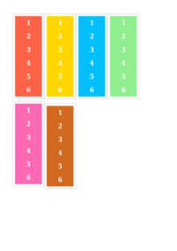
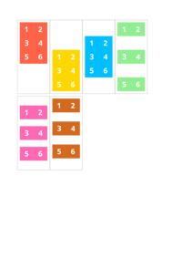
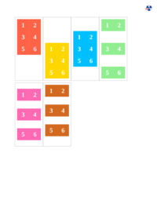
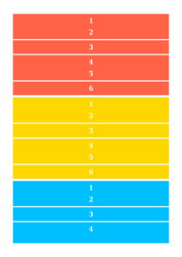
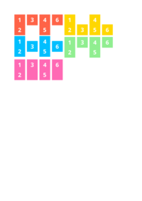
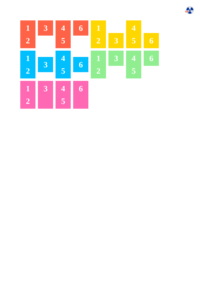

## ALIGN-CONTENT

See the Rendering results for [align-content.html](/html/CSS%20Properties/A/align-content.html):

### mPDF
 

Link to PDF: [mpdf__html_CSS_Properties_A_align-content.html.pdf](mpdf__html_CSS_Properties_A_align-content.html.pdf)

### typeset.sh
 

Link to PDF: [typeset__html_CSS_Properties_A_align-content.html.pdf](typeset__html_CSS_Properties_A_align-content.html.pdf)

### PDFreactor
 

Link to PDF: [pdfreactor__html_CSS_Properties_A_align-content.html.pdf](pdfreactor__html_CSS_Properties_A_align-content.html.pdf)

## ALIGN-ITEMS

See the Rendering results for [align-items.html](/html/CSS%20Properties/A/align-items.html):

### mPDF
 

Link to PDF: [mpdf__html_CSS_Properties_A_align-items.html.pdf](mpdf__html_CSS_Properties_A_align-items.html.pdf)

### typeset.sh
 

Link to PDF: [typeset__html_CSS_Properties_A_align-items.html.pdf](typeset__html_CSS_Properties_A_align-items.html.pdf)

### PDFreactor
 

Link to PDF: [pdfreactor__html_CSS_Properties_A_align-items.html.pdf](pdfreactor__html_CSS_Properties_A_align-items.html.pdf)

## ALIGN-SELF

See the Rendering results for [align-self.html](/html/CSS%20Properties/A/align-self.html):

### mPDF
 

Link to PDF: [mpdf__html_CSS_Properties_A_align-self.html.pdf](mpdf__html_CSS_Properties_A_align-self.html.pdf)

### typeset.sh
 

Link to PDF: [typeset__html_CSS_Properties_A_align-self.html.pdf](typeset__html_CSS_Properties_A_align-self.html.pdf)

### PDFreactor
 

Link to PDF: [pdfreactor__html_CSS_Properties_A_align-self.html.pdf](pdfreactor__html_CSS_Properties_A_align-self.html.pdf)

## ALL

See the Rendering results for [all.html](/html/CSS%20Properties/A/all.html):

### mPDF
 

Link to PDF: [mpdf__html_CSS_Properties_A_all.html.pdf](mpdf__html_CSS_Properties_A_all.html.pdf)

### typeset.sh
 

Link to PDF: [typeset__html_CSS_Properties_A_all.html.pdf](typeset__html_CSS_Properties_A_all.html.pdf)

### PDFreactor
 

Link to PDF: [pdfreactor__html_CSS_Properties_A_all.html.pdf](pdfreactor__html_CSS_Properties_A_all.html.pdf)

## APPEARANCE

See the Rendering results for [appearance.html](/html/CSS%20Properties/A/appearance.html):

### mPDF
 

Link to PDF: [mpdf__html_CSS_Properties_A_appearance.html.pdf](mpdf__html_CSS_Properties_A_appearance.html.pdf)

### typeset.sh
 

Link to PDF: [typeset__html_CSS_Properties_A_appearance.html.pdf](typeset__html_CSS_Properties_A_appearance.html.pdf)

### PDFreactor
 

Link to PDF: [pdfreactor__html_CSS_Properties_A_appearance.html.pdf](pdfreactor__html_CSS_Properties_A_appearance.html.pdf)

