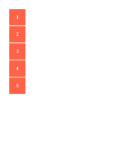

## 🔬 ALIGN-CONTENT

### Input HTML & CSS

    

        View ALIGN-CONTENT Code
    

    <pre><code class="hljs xml">&lt;!DOCTYPE html&gt;
&lt;!-- Sample from https://css-tricks.com/almanac/properties/a/align-content/ --&gt;
&lt;html lang="en"&gt;
    &lt;head&gt;
        &lt;style&gt;
.flex-container {
  padding: 0;
  margin: 0;
  list-style: none;
  float: left;
  width: 120px;
  height: 300px;
  padding: 10px;
  border: 1px solid silver;
  margin-top: 10px;
  
  -ms-box-orient: horizontal;
  display: -webkit-box;
  display: -moz-box;
  display: -ms-flexbox;
  display: -moz-flex;
  display: -webkit-flex;
  display: flex;
  
  -webkit-flex-flow: row wrap;
  flex-flow: row wrap;
}

.flex-start { 
  -webkit-align-content: flex-start; 
  align-content: flex-start; 
}

.flex-end { 
  -webkit-align-content: flex-end; 
  align-content: flex-end; 
}
.flex-end li {
  background: gold;
}

.center { 
  -webkit-align-content: center; 
  align-content: center; 
}
.center li {
  background: deepskyblue;
}

.space-between { 
  -webkit-align-content: space-between; 
  align-content: space-between; 
}  
.space-between li {
  background: lightgreen;
}

.space-around { 
  -webkit-align-content: space-around; 
  align-content: space-around; 
}
.space-around li {
  background: hotpink;
}

.stretch { 
  -webkit-align-content: stretch; 
  align-content: stretch; 
}
.stretch li {
  background: chocolate;
}

.flex-item {
  background: tomato;
  padding: 5px;
  width: 50px;
  height: 50px;
  
  line-height: 50px;
  color: white;
  font-weight: bold;
  font-size: 2em;
  text-align: center;
}
        &lt;/style&gt;
    &lt;/head&gt;
    &lt;body&gt;
        &lt;ul class="flex-container flex-start"&gt;
            &lt;li class="flex-item"&gt;1&lt;/li&gt;
            &lt;li class="flex-item"&gt;2&lt;/li&gt;
            &lt;li class="flex-item"&gt;3&lt;/li&gt;
            &lt;li class="flex-item"&gt;4&lt;/li&gt;
            &lt;li class="flex-item"&gt;5&lt;/li&gt;
            &lt;li class="flex-item"&gt;6&lt;/li&gt;
        &lt;/ul&gt;
        
        &lt;ul class="flex-container flex-end"&gt;
            &lt;li class="flex-item"&gt;1&lt;/li&gt;
            &lt;li class="flex-item"&gt;2&lt;/li&gt;
            &lt;li class="flex-item"&gt;3&lt;/li&gt;
            &lt;li class="flex-item"&gt;4&lt;/li&gt;
            &lt;li class="flex-item"&gt;5&lt;/li&gt;
            &lt;li class="flex-item"&gt;6&lt;/li&gt;
        &lt;/ul&gt;
        
        &lt;ul class="flex-container center"&gt;
            &lt;li class="flex-item"&gt;1&lt;/li&gt;
            &lt;li class="flex-item"&gt;2&lt;/li&gt;
            &lt;li class="flex-item"&gt;3&lt;/li&gt;
            &lt;li class="flex-item"&gt;4&lt;/li&gt;
            &lt;li class="flex-item"&gt;5&lt;/li&gt;
            &lt;li class="flex-item"&gt;6&lt;/li&gt;
        &lt;/ul&gt;
        
        &lt;ul class="flex-container space-between"&gt;
            &lt;li class="flex-item"&gt;1&lt;/li&gt;
            &lt;li class="flex-item"&gt;2&lt;/li&gt;
            &lt;li class="flex-item"&gt;3&lt;/li&gt;
            &lt;li class="flex-item"&gt;4&lt;/li&gt;
            &lt;li class="flex-item"&gt;5&lt;/li&gt;
            &lt;li class="flex-item"&gt;6&lt;/li&gt;
        &lt;/ul&gt;
        
        &lt;ul class="flex-container space-around"&gt;
            &lt;li class="flex-item"&gt;1&lt;/li&gt;
            &lt;li class="flex-item"&gt;2&lt;/li&gt;
            &lt;li class="flex-item"&gt;3&lt;/li&gt;
            &lt;li class="flex-item"&gt;4&lt;/li&gt;
            &lt;li class="flex-item"&gt;5&lt;/li&gt;
            &lt;li class="flex-item"&gt;6&lt;/li&gt;
        &lt;/ul&gt;
        
        &lt;ul class="flex-container stretch"&gt;
            &lt;li class="flex-item"&gt;1&lt;/li&gt;
            &lt;li class="flex-item"&gt;2&lt;/li&gt;
            &lt;li class="flex-item"&gt;3&lt;/li&gt;
            &lt;li class="flex-item"&gt;4&lt;/li&gt;
            &lt;li class="flex-item"&gt;5&lt;/li&gt;
            &lt;li class="flex-item"&gt;6&lt;/li&gt;
        &lt;/ul&gt;
    &lt;/body&gt;
&lt;/html&gt;</code></pre>
    

        <a href="https://raw.githubusercontent.com/azettl/compare.html2pdf.tools/master//html/CSS%20Properties/A/align-content.html" target="_blank" rel="noopener">📄 Get Input HTML on GitHub</a>
    

### Output PDF

    

        <h4>mPDF</h4>
        
        

            <a href="mpdf__html_CSS_Properties_A_align-content.html.pdf" target="_blank">📕 mPDF Output</a>
        

    

    

        <h4>typeset.sh</h4>
        
        

            <a href="typeset__html_CSS_Properties_A_align-content.html.pdf" target="_blank">📕 typeset Output</a>
        

    

    

        <h4>PDFreactor</h4>
        
        

            <a href="pdfreactor__html_CSS_Properties_A_align-content.html.pdf" target="_blank">📕 PDFreactor Output</a>
        

    

    

        <h4>wkhtmltopdf</h4>
        
        

            <a href="wkhtmltopdf__html_CSS_Properties_A_align-content.html.pdf" target="_blank">📕 wkhtmltopdf Output</a>
        

    

## 🔬 ALIGN-ITEMS

### Input HTML & CSS

    

        View ALIGN-ITEMS Code
    

    <pre><code class="hljs xml">&lt;!DOCTYPE html&gt;
&lt;!-- Sample from https://css-tricks.com/almanac/properties/a/align-items/ --&gt;
&lt;html lang="en"&gt;
    &lt;head&gt;
        &lt;style&gt;
.flex-container {
  padding: 0;
  margin: 0;
  list-style: none;
  
  -ms-box-orient: horizontal;
  display: -webkit-box;
  display: -moz-box;
  display: -ms-flexbox;
  display: -moz-flex;
  display: -webkit-flex;
  display: flex;
  float: left;
}

.flex-start { 
  -webkit-align-items: flex-start;
  align-items: flex-start; 
}

.flex-end { 
  -webkit-align-items: flex-end; 
  align-items: flex-end; 
}
.flex-end li {
  background: gold;
}

.center { 
  -webkit-align-items: center; 
  align-items: center; 
}  
.center li {
  background: deepskyblue;
}

.baseline { 
  -webkit-align-items: baseline; 
  align-items: baseline; 
}
.baseline li {
  background: lightgreen;
}

.stretch { 
  -webkit-align-items: stretch; 
  align-items: stretch; 
}  
.stretch li {
  background: hotpink;
}

.flex-item {
  background: tomato;
  padding: 5px;
  width: 50px;
  margin: 5px;
  
  line-height: 50px;
  color: white;
  font-weight: bold;
  font-size: 2em;
  text-align: center;
}
        &lt;/style&gt;
    &lt;/head&gt;
    &lt;body&gt;
        &lt;ul class="flex-container flex-start"&gt;
            &lt;li class="flex-item"&gt;1&lt;br&gt;2&lt;/li&gt;
            &lt;li class="flex-item"&gt;3&lt;/li&gt;
            &lt;li class="flex-item"&gt;4&lt;br&gt;5&lt;/li&gt;
            &lt;li class="flex-item"&gt;6&lt;/li&gt;
          &lt;/ul&gt;
          
          &lt;ul class="flex-container flex-end"&gt;
            &lt;li class="flex-item"&gt;1&lt;br&gt;2&lt;/li&gt;
            &lt;li class="flex-item"&gt;3&lt;/li&gt;
            &lt;li class="flex-item"&gt;4&lt;br&gt;5&lt;/li&gt;
            &lt;li class="flex-item"&gt;6&lt;/li&gt;
          &lt;/ul&gt;
          
          &lt;ul class="flex-container center"&gt;
            &lt;li class="flex-item"&gt;1&lt;br&gt;2&lt;/li&gt;
            &lt;li class="flex-item"&gt;3&lt;/li&gt;
            &lt;li class="flex-item"&gt;4&lt;br&gt;5&lt;/li&gt;
            &lt;li class="flex-item"&gt;6&lt;/li&gt;
          &lt;/ul&gt;
          
          &lt;ul class="flex-container baseline"&gt;
            &lt;li class="flex-item"&gt;1&lt;br&gt;2&lt;/li&gt;
            &lt;li class="flex-item"&gt;3&lt;/li&gt;
            &lt;li class="flex-item"&gt;4&lt;br&gt;5&lt;/li&gt;
            &lt;li class="flex-item"&gt;6&lt;/li&gt;
          &lt;/ul&gt;
          
          &lt;ul class="flex-container stretch"&gt;
            &lt;li class="flex-item"&gt;1&lt;br&gt;2&lt;/li&gt;
            &lt;li class="flex-item"&gt;3&lt;/li&gt;
            &lt;li class="flex-item"&gt;4&lt;br&gt;5&lt;/li&gt;
            &lt;li class="flex-item"&gt;6&lt;/li&gt;
          &lt;/ul&gt;
    &lt;/body&gt;
&lt;/html&gt;</code></pre>
    

        <a href="https://raw.githubusercontent.com/azettl/compare.html2pdf.tools/master//html/CSS%20Properties/A/align-items.html" target="_blank" rel="noopener">📄 Get Input HTML on GitHub</a>
    

### Output PDF

    

        <h4>mPDF</h4>
        
        

            <a href="mpdf__html_CSS_Properties_A_align-items.html.pdf" target="_blank">📕 mPDF Output</a>
        

    

    

        <h4>typeset.sh</h4>
        
        

            <a href="typeset__html_CSS_Properties_A_align-items.html.pdf" target="_blank">📕 typeset Output</a>
        

    

    

        <h4>PDFreactor</h4>
        
        

            <a href="pdfreactor__html_CSS_Properties_A_align-items.html.pdf" target="_blank">📕 PDFreactor Output</a>
        

    

    

        <h4>wkhtmltopdf</h4>
        
        

            <a href="wkhtmltopdf__html_CSS_Properties_A_align-items.html.pdf" target="_blank">📕 wkhtmltopdf Output</a>
        

    

## 🔬 ALIGN-SELF

### Input HTML & CSS

    

        View ALIGN-SELF Code
    

    <pre><code class="hljs xml">&lt;!DOCTYPE html&gt;
&lt;!-- Sample from  https://css-tricks.com/almanac/properties/a/align-self/ --&gt;
&lt;html lang="en"&gt;
    &lt;head&gt;
        &lt;style&gt;
        .flex-container {
  padding: 0;
  margin: 0;
  list-style: none;
  height: 200px;

  display: flex;
}

.flex-start { align-self: flex-start; }
.flex-end { align-self: flex-end; }
.center { align-self: center; }
.baseline { align-self: baseline; }
.stretch { align-self: stretch; }

.flex-item {
  background: tomato;
  padding: 5px;
  width: 100px;
  margin: 5px;
  line-height: 100px;
  color: white;
  font-weight: bold;
  font-size: 2em;
  text-align: center;
}
        &lt;/style&gt;
    &lt;/head&gt;
    &lt;body&gt;
        &lt;ul class="flex-container"&gt;
            &lt;li class="flex-item flex-start"&gt;1&lt;/li&gt;
            &lt;li class="flex-item flex-end"&gt;2&lt;/li&gt;
            &lt;li class="flex-item center"&gt;3&lt;/li&gt;
            &lt;li class="flex-item baseline"&gt;4&lt;/li&gt;
            &lt;li class="flex-item stretch"&gt;5&lt;/li&gt;
          &lt;/ul&gt;
    &lt;/body&gt;
&lt;/html&gt;</code></pre>
    

        <a href="https://raw.githubusercontent.com/azettl/compare.html2pdf.tools/master//html/CSS%20Properties/A/align-self.html" target="_blank" rel="noopener">📄 Get Input HTML on GitHub</a>
    

### Output PDF

    

        <h4>mPDF</h4>
        
        

            <a href="mpdf__html_CSS_Properties_A_align-self.html.pdf" target="_blank">📕 mPDF Output</a>
        

    

    

        <h4>typeset.sh</h4>
        
        

            <a href="typeset__html_CSS_Properties_A_align-self.html.pdf" target="_blank">📕 typeset Output</a>
        

    

    

        <h4>PDFreactor</h4>
        
        

            <a href="pdfreactor__html_CSS_Properties_A_align-self.html.pdf" target="_blank">📕 PDFreactor Output</a>
        

    

    

        <h4>wkhtmltopdf</h4>
        
        

            <a href="wkhtmltopdf__html_CSS_Properties_A_align-self.html.pdf" target="_blank">📕 wkhtmltopdf Output</a>
        

    

## 🔬 ALL

### Input HTML & CSS

    

        View ALL Code
    

    <pre><code class="hljs xml">&lt;!DOCTYPE html&gt;
&lt;!-- Sample from https://css-tricks.com/almanac/properties/a/all/ --&gt;
&lt;html lang="en"&gt;
    &lt;head&gt;
        &lt;style&gt;
        .container {
  font-family: sans-serif;
  /* inherited */
  
  font-size: 1.5em;
  /* inherited */
  
  text-align: center;
  /* inherited */
  
  text-transform: uppercase;
  /* inherited */
  
  text-shadow: 1px 1px 1px black;
  /* inherited */
}

.parent {
  color: green;
  /* inherited */
  
  background-color: gainsboro;
  /* not inherited */
  
  width: 80%;
  /* not inherited */
  
  padding: 1em;
  /* not inherited */
  
  border: 5px solid #E18728;
  /* not inherited */
}

.alltest{
    all:inherit;
}
        &lt;/style&gt;
    &lt;/head&gt;
    &lt;body&gt;
        &lt;div class="container"&gt;
          &lt;div class="parent"&gt;
            &lt;div class="alltest"&gt;
              &lt;p&gt;Change this div's &lt;code&gt;all&lt;/code&gt; value.&lt;/p&gt;
            &lt;/div&gt;
          &lt;/div&gt;
        &lt;/div&gt;    
    &lt;/body&gt;
&lt;/html&gt;</code></pre>
    

        <a href="https://raw.githubusercontent.com/azettl/compare.html2pdf.tools/master//html/CSS%20Properties/A/all.html" target="_blank" rel="noopener">📄 Get Input HTML on GitHub</a>
    

### Output PDF

    

        <h4>mPDF</h4>
        
        

            <a href="mpdf__html_CSS_Properties_A_all.html.pdf" target="_blank">📕 mPDF Output</a>
        

    

    

        <h4>typeset.sh</h4>
        
        

            <a href="typeset__html_CSS_Properties_A_all.html.pdf" target="_blank">📕 typeset Output</a>
        

    

    

        <h4>PDFreactor</h4>
        
        

            <a href="pdfreactor__html_CSS_Properties_A_all.html.pdf" target="_blank">📕 PDFreactor Output</a>
        

    

    

        <h4>wkhtmltopdf</h4>
        
        

            <a href="wkhtmltopdf__html_CSS_Properties_A_all.html.pdf" target="_blank">📕 wkhtmltopdf Output</a>
        

    

## 🔬 APPEARANCE

### Input HTML & CSS

    

        View APPEARANCE Code
    

    <pre><code class="hljs xml">&lt;!DOCTYPE html&gt;
&lt;!-- Sample from https://css-tricks.com/almanac/properties/a/appearance/ --&gt;
&lt;html lang="en"&gt;
    &lt;head&gt;
        &lt;style&gt;
        .reset {
  -webkit-appearance: none; 
}

.fake-like-search {
  -webkit-appearance: searchfield;   
}
        &lt;/style&gt;
    &lt;/head&gt;
    &lt;body&gt;
        &lt;input type="search"&gt; type=search 
        &lt;br&gt;&lt;br&gt;
        &lt;input type="text" class="fake-like-search"&gt; type=text, made like search
        &lt;br&gt;&lt;br&gt;
        &lt;input type="search" class="reset"&gt; type=search, reset 
        &lt;br&gt;&lt;br&gt;
        &lt;input type="text"&gt; type=text
        &lt;br&gt;&lt;br&gt;
        &lt;input type="text" class="reset"&gt; type=text, reset
    &lt;/body&gt;
&lt;/html&gt;</code></pre>
    

        <a href="https://raw.githubusercontent.com/azettl/compare.html2pdf.tools/master//html/CSS%20Properties/A/appearance.html" target="_blank" rel="noopener">📄 Get Input HTML on GitHub</a>
    

### Output PDF

    

        <h4>mPDF</h4>
        
        

            <a href="mpdf__html_CSS_Properties_A_appearance.html.pdf" target="_blank">📕 mPDF Output</a>
        

    

    

        <h4>typeset.sh</h4>
        
        

            <a href="typeset__html_CSS_Properties_A_appearance.html.pdf" target="_blank">📕 typeset Output</a>
        

    

    

        <h4>PDFreactor</h4>
        
        

            <a href="pdfreactor__html_CSS_Properties_A_appearance.html.pdf" target="_blank">📕 PDFreactor Output</a>
        

    

    

        <h4>wkhtmltopdf</h4>
        
        

            <a href="wkhtmltopdf__html_CSS_Properties_A_appearance.html.pdf" target="_blank">📕 wkhtmltopdf Output</a>
        

    

