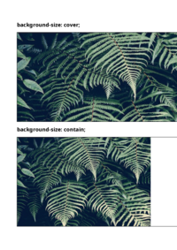

## 🔬 BACKFACE-VISIBILITY

### Input HTML & CSS

[📄 Input HTML](https://raw.githubusercontent.com/azettl/compare.html2pdf.tools/master//html/CSS%20Properties/B/backface-visibility.html)

    

        View BACKFACE-VISIBILITY Code
    

    <pre>
        <code>
            &lt;!DOCTYPE html&gt;
&lt;!-- Sample from https://www.w3schools.com/cssref/tryit.asp?filename=trycss3_backface-visibility --&gt;
&lt;html lang=&quot;en&quot;&gt;
    &lt;head&gt;
        &lt;style&gt;
   div {
  position: relative;
  height: 60px;
  width: 60px;
  background-color: red;
  transform: rotateY(180deg);
}

#div1 {
  -webkit-backface-visibility: hidden; /* Safari */
  backface-visibility: hidden;
}

#div2 {
  -webkit-backface-visibility: hidden; /* Safari */
  backface-visibility: visible;
}     
        &lt;/style&gt;
    &lt;/head&gt;
    &lt;body&gt;
        &lt;h1&gt;The backface-visibility Property&lt;/h1&gt;

        &lt;p&gt;This example shows the back face of two div elements.&lt;/p&gt;
        
        &lt;p&gt;This div element has &quot;backface-visibility: hidden&quot;, and the back face of the div element is invisible:&lt;/p&gt;
        &lt;div id=&quot;div1&quot;&gt;DIV 1&lt;/div&gt;
        
        &lt;p&gt;This div element has &quot;backface-visibility: visible&quot;, and the back face of the div element shows a mirror image of the front face:&lt;/p&gt;
        &lt;div id=&quot;div2&quot;&gt;DIV 2&lt;/div&gt;
        
        &lt;p&gt;&lt;strong&gt;Note:&lt;/strong&gt; The backface-visibility property is not supported in Internet Explorer 9 and earlier versions. Safari supports it with a webkit prefix.&lt;/p&gt;
        
    &lt;/body&gt;
&lt;/html&gt;
        </code>
    </pre>

### Output PDF

| mPDF | typeset.sh | PDFreactor |
|---------|---------|---------|
|  |  |  |
| [📕 mPDF Output](mpdf__html_CSS_Properties_B_backface-visibility.html.pdf) | [📕 typeset Output](typeset__html_CSS_Properties_B_backface-visibility.html.pdf) | [📕 PDFreactor Output](pdfreactor__html_CSS_Properties_B_backface-visibility.html.pdf) |

## 🔬 BACKGROUND-ATTACHMENT

### Input HTML & CSS

[📄 Input HTML](https://raw.githubusercontent.com/azettl/compare.html2pdf.tools/master//html/CSS%20Properties/B/background-attachment.html)

    

        View BACKGROUND-ATTACHMENT Code
    

    <pre>
        <code>
            &lt;!DOCTYPE html&gt;
&lt;!-- Sample from https://css-tricks.com/almanac/properties/b/background-attachment/ --&gt;
&lt;html lang=&quot;en&quot;&gt;
    &lt;head&gt;
        &lt;style&gt;
        h2 {
  text-align: center;
  margin-top: 48px;
}

div {
  height: 200px;
  width: 50%;
  max-width: 600px;
  margin: 32px auto;
  overflow-x: hidden;
  overflow-y: scroll;
}

.scroll {
  background: url(&quot;http://lorempixel.com/600/200/animals&quot;);
  background-attachment: scroll;
}

.fixed {
  background: url(&quot;http://lorempixel.com/600/200/animals&quot;);
  background-attachment: fixed;
}

.local {
  background: url(&quot;http://lorempixel.com/600/200/animals&quot;);
  background-attachment: local;
}

.expand {
  height: 400px;
  width: 100%;
}

.extra-space {
  margin-bottom: 50px;
}

        &lt;/style&gt;
    &lt;/head&gt;
    &lt;body&gt;
        &lt;h2&gt;&lt;code&gt;scroll (default)&lt;/code&gt;&lt;/h2&gt;
        &lt;div class=&quot;scroll&quot;&gt;&lt;div class=&quot;expand&quot;&gt;&lt;/div&gt;&lt;/div&gt;
        
        &lt;h2&gt;&lt;code&gt;fixed&lt;/code&gt;&lt;/h2&gt;
        &lt;div class=&quot;fixed&quot;&gt;&lt;div class=&quot;expand&quot;&gt;&lt;/div&gt;&lt;/div&gt;
        
        &lt;h2&gt;&lt;code&gt;local&lt;/code&gt;&lt;/h2&gt;
        &lt;div class=&quot;local&quot;&gt;&lt;div class=&quot;expand&quot;&gt;&lt;/div&gt;&lt;/div&gt;
        
        &lt;br class=&quot;extra-space&quot;&gt;
    &lt;/body&gt;
&lt;/html&gt;
        </code>
    </pre>

### Output PDF

| mPDF | typeset.sh | PDFreactor |
|---------|---------|---------|
|  |  |  |
| [📕 mPDF Output](mpdf__html_CSS_Properties_B_background-attachment.html.pdf) | [📕 typeset Output](typeset__html_CSS_Properties_B_background-attachment.html.pdf) | [📕 PDFreactor Output](pdfreactor__html_CSS_Properties_B_background-attachment.html.pdf) |

## 🔬 BACKGROUND-BLEND-MODE

### Input HTML & CSS

[📄 Input HTML](https://raw.githubusercontent.com/azettl/compare.html2pdf.tools/master//html/CSS%20Properties/B/background-blend-mode.html)

    

        View BACKGROUND-BLEND-MODE Code
    

    <pre>
        <code>
            &lt;!DOCTYPE html&gt;
&lt;!-- Sample from https://css-tricks.com/almanac/properties/b/background-blend-mode/ --&gt;
&lt;html lang=&quot;en&quot;&gt;
    &lt;head&gt;
        &lt;style&gt;
        body, html {
  margin: 0;
  padding: 0;
}

.container {
  background-image: url('https://s3-us-west-2.amazonaws.com/s.cdpn.io/14179/image.jpg');
  height: 500px;
  width: 50%;
  display: block;
  float: left;
  background-color: red;
  background-size: 100%;
  background-repeat: no-repeat;
}

.container--blend {
  background-blend-mode: screen;
}

h1 {
  color: white;
  text-align: center;
}
        &lt;/style&gt;
    &lt;/head&gt;
    &lt;body&gt;
        &lt;div class=&quot;container&quot;&gt;
            &lt;h1&gt;Example text&lt;/h1&gt;
          &lt;/div&gt;
          
          &lt;div class=&quot;container container--blend&quot;&gt;
              &lt;h1&gt;Example text&lt;/h1&gt;
          &lt;/div&gt;
          
    &lt;/body&gt;
&lt;/html&gt;
        </code>
    </pre>

### Output PDF

| mPDF | typeset.sh | PDFreactor |
|---------|---------|---------|
|  |  |  |
| [📕 mPDF Output](mpdf__html_CSS_Properties_B_background-blend-mode.html.pdf) | [📕 typeset Output](typeset__html_CSS_Properties_B_background-blend-mode.html.pdf) | [📕 PDFreactor Output](pdfreactor__html_CSS_Properties_B_background-blend-mode.html.pdf) |

## 🔬 BACKGROUND-CLIP

### Input HTML & CSS

[📄 Input HTML](https://raw.githubusercontent.com/azettl/compare.html2pdf.tools/master//html/CSS%20Properties/B/background-clip.html)

    

        View BACKGROUND-CLIP Code
    

    <pre>
        <code>
            &lt;!DOCTYPE html&gt;
&lt;!-- Sample from https://css-tricks.com/almanac/properties/b/background-clip/ --&gt;
&lt;html lang=&quot;en&quot;&gt;
    &lt;head&gt;
        &lt;style&gt;
        div { 
  background-color: yellow;
  width: 225px;
  padding: 1em 0;
  border: 5px solid rgba(156, 224, 251, .5);
}

.nomargin { margin: 0; }

#border-box { background-clip: border-box; }

#padding-box { background-clip: padding-box; }

#content-box { background-clip: content-box; }

/* styling for the Pen, unrelated to background-clip */

body { font-family: sans-serif; }

div { margin-bottom: 2em; }
        &lt;/style&gt;
    &lt;/head&gt;
    &lt;body&gt;
        &lt;h2&gt;background-clip: border-box;&lt;/h2&gt;
        &lt;div id=&quot;border-box&quot;&gt;
          &lt;p&gt;This paragraph is the content.&lt;/p&gt;
        &lt;/div&gt;
        
        &lt;h2&gt;background-clip: padding-box;&lt;/h2&gt;
        &lt;div id=&quot;padding-box&quot;&gt;
          &lt;p&gt;This paragraph is the content.&lt;/p&gt;
        &lt;/div&gt;
        
        &lt;h2&gt;background-clip: content-box;&lt;/h2&gt;
        &lt;h3&gt;browser default paragraph margins&lt;/h3&gt;
        &lt;div id=&quot;content-box&quot;&gt;
          &lt;p&gt;This paragraph is the content.&lt;/p&gt;
        &lt;/div&gt;
        
        &lt;h2&gt;background-clip: content-box;&lt;/h2&gt;
        &lt;h3&gt;paragraph is set to margin: 0;&lt;/h3&gt;
        &lt;div id=&quot;content-box&quot;&gt;
          &lt;p class=&quot;nomargin&quot;&gt;This paragraph is the content.&lt;/p&gt;
        &lt;/div&gt;
    &lt;/body&gt;
&lt;/html&gt;
        </code>
    </pre>

### Output PDF

| mPDF | typeset.sh | PDFreactor |
|---------|---------|---------|
|  |  |  |
| [📕 mPDF Output](mpdf__html_CSS_Properties_B_background-clip.html.pdf) | [📕 typeset Output](typeset__html_CSS_Properties_B_background-clip.html.pdf) | [📕 PDFreactor Output](pdfreactor__html_CSS_Properties_B_background-clip.html.pdf) |

## 🔬 BACKGROUND-COLOR

### Input HTML & CSS

[📄 Input HTML](https://raw.githubusercontent.com/azettl/compare.html2pdf.tools/master//html/CSS%20Properties/B/background-color.html)

    

        View BACKGROUND-COLOR Code
    

    <pre>
        <code>
            &lt;!DOCTYPE html&gt;
&lt;!-- Sample from https://css-tricks.com/almanac/properties/b/background-color/ --&gt;
&lt;html lang=&quot;en&quot;&gt;
    &lt;head&gt;
        &lt;style&gt;
        body {
  background-color: #82a43a;
}

#purple {
  background-color: #893AA4;
}

/* styling for Pen, unrelated to background color */
div {
  width: 300px;
  height: 300px;
}

p {
  padding: 1em;
  color: white;
  font-family: sans-serif;
  font-size: 1.5em;
}
        &lt;/style&gt;
    &lt;/head&gt;
    &lt;body&gt;
        &lt;p&gt;The &lt;code&gt;background-color&lt;/code&gt; for the body is #82a43a.&lt;/p&gt;
        &lt;div id=&quot;purple&quot;&gt;
          &lt;p&gt;The &lt;code&gt;background-color&lt;/code&gt; for this div is #893AA4.&lt;/p&gt;
        &lt;/div&gt;
    &lt;/body&gt;
&lt;/html&gt;
        </code>
    </pre>

### Output PDF

| mPDF | typeset.sh | PDFreactor |
|---------|---------|---------|
|  |  |  |
| [📕 mPDF Output](mpdf__html_CSS_Properties_B_background-color.html.pdf) | [📕 typeset Output](typeset__html_CSS_Properties_B_background-color.html.pdf) | [📕 PDFreactor Output](pdfreactor__html_CSS_Properties_B_background-color.html.pdf) |

## 🔬 BACKGROUND-IMAGE

### Input HTML & CSS

[📄 Input HTML](https://raw.githubusercontent.com/azettl/compare.html2pdf.tools/master//html/CSS%20Properties/B/background-image.html)

    

        View BACKGROUND-IMAGE Code
    

    <pre>
        <code>
            &lt;!DOCTYPE html&gt;
&lt;!-- Sample from https://css-tricks.com/almanac/properties/b/background-image/ --&gt;
&lt;html lang=&quot;en&quot;&gt;
    &lt;head&gt;
        &lt;style&gt;
        /* image background */
#imageonly {
  background: url(https://s3-us-west-2.amazonaws.com/s.cdpn.io/652/confectionary.png);
}

/* linear gradient background */
#linear-gradient {
  background: linear-gradient(black, white);
}

/* radial gradient background */
#radial-gradient {
  background: radial-gradient(circle, black, white);
}

/*multiple background images */

#multiimage {
  background: 
   url(https://s3-us-west-2.amazonaws.com/s.cdpn.io/652/codepen.png) bottom center no-repeat,
   url(https://s3-us-west-2.amazonaws.com/s.cdpn.io/652/confectionary.png) repeat; 
}

/* styling for the Pen, unrelated to background */
body { font-family: sans-serif; }

div {
  width: 300px;
  height: 300px;
  margin-bottom: 1.5em;
}
        &lt;/style&gt;
    &lt;/head&gt;
    &lt;body&gt;
        &lt;h2&gt;Image Background&lt;/h2&gt;
        &lt;div id=&quot;imageonly&quot;&gt;
          &lt;!-- image is from Subtle Patterns --&gt;
        &lt;/div&gt;
        
        &lt;h2&gt;Gradient Background: Linear&lt;/h2&gt;
        &lt;div id=&quot;linear-gradient&quot;&gt;
        &lt;/div&gt;
        
        &lt;h2&gt;Gradient Background: Radial&lt;/h2&gt;
        &lt;div id=&quot;radial-gradient&quot;&gt;
        &lt;/div&gt;
        
        &lt;h2&gt;Multiple Backgound Images&lt;/h2&gt;
        &lt;p&gt;Two images: CodePen logo &amp;amp; off-white pattern.&lt;/p&gt;
        &lt;div id=&quot;multiimage&quot;&gt;
        &lt;/div&gt;
    &lt;/body&gt;
&lt;/html&gt;
        </code>
    </pre>

### Output PDF

| mPDF | typeset.sh | PDFreactor |
|---------|---------|---------|
|  |  |  |
| [📕 mPDF Output](mpdf__html_CSS_Properties_B_background-image.html.pdf) | [📕 typeset Output](typeset__html_CSS_Properties_B_background-image.html.pdf) | [📕 PDFreactor Output](pdfreactor__html_CSS_Properties_B_background-image.html.pdf) |

## 🔬 BACKGROUND-ORIGIN

### Input HTML & CSS

[📄 Input HTML](https://raw.githubusercontent.com/azettl/compare.html2pdf.tools/master//html/CSS%20Properties/B/background-origin.html)

    

        View BACKGROUND-ORIGIN Code
    

    <pre>
        <code>
            &lt;!DOCTYPE html&gt;
&lt;!-- Sample from https://css-tricks.com/almanac/properties/b/background-origin/ --&gt;
&lt;html lang=&quot;en&quot;&gt;
    &lt;head&gt;
        &lt;style&gt;
        .background-origin {
  box-sizing: border-box;
  height: 300px;
  width: 300px;
  background: url(&quot;http://lorempixel.com/300/300/cats&quot;) no-repeat;
  border: 16px solid rgba(23, 23, 23, 0.5);
  background-origin: padding-box;
  background-size: cover;
  padding: 16px;
  margin: 0 auto;
}

        &lt;/style&gt;
    &lt;/head&gt;
    &lt;body&gt;
          
          &lt;div class=&quot;background-origin&quot;&gt;&lt;/div&gt;
    &lt;/body&gt;
&lt;/html&gt;
        </code>
    </pre>

### Output PDF

| mPDF | typeset.sh | PDFreactor |
|---------|---------|---------|
|  |  |  |
| [📕 mPDF Output](mpdf__html_CSS_Properties_B_background-origin.html.pdf) | [📕 typeset Output](typeset__html_CSS_Properties_B_background-origin.html.pdf) | [📕 PDFreactor Output](pdfreactor__html_CSS_Properties_B_background-origin.html.pdf) |

## 🔬 BACKGROUND-POSITION

### Input HTML & CSS

[📄 Input HTML](https://raw.githubusercontent.com/azettl/compare.html2pdf.tools/master//html/CSS%20Properties/B/background-position.html)

    

        View BACKGROUND-POSITION Code
    

    <pre>
        <code>
            &lt;!DOCTYPE html&gt;
&lt;!-- Sample from https://css-tricks.com/almanac/properties/b/background-position/ --&gt;
&lt;html lang=&quot;en&quot;&gt;
    &lt;head&gt;
        &lt;style&gt;
        div {
  width: 400px;
  height: 200px;
  border: 5px solid #E18728;
  margin-bottom: .5em;
  background: url(https://s3-us-west-2.amazonaws.com/s.cdpn.io/652/codepen.png); 
  background-repeat: no-repeat;
}

#pixels { background-position: 350px 0; }

#percentages { background-position: 100% 0; }

#keywords { background-position: top right; }

/* styling for Pen, unrelated to background-position */
p { 
  margin-top: 50px;
  padding: 0 1em;
}

        &lt;/style&gt;
    &lt;/head&gt;
    &lt;body&gt;
        &lt;div id=&quot;pixels&quot;&gt;
            &lt;p&gt;&lt;code&gt;background-position: 350px 0;&lt;/code&gt;&lt;/p&gt;
          &lt;/div&gt;
          
          &lt;div id=&quot;percentages&quot;&gt;
            &lt;p&gt;&lt;code&gt;background-position: 100% 0;&lt;/code&gt;&lt;/p&gt;
          &lt;/div&gt;
          
          &lt;div id=&quot;keywords&quot;&gt;
            &lt;p&gt;&lt;code&gt;background-position: top right;&lt;/code&gt;&lt;/p&gt;
          &lt;/div&gt;
    &lt;/body&gt;
&lt;/html&gt;
        </code>
    </pre>

### Output PDF

| mPDF | typeset.sh | PDFreactor |
|---------|---------|---------|
|  |  |  |
| [📕 mPDF Output](mpdf__html_CSS_Properties_B_background-position.html.pdf) | [📕 typeset Output](typeset__html_CSS_Properties_B_background-position.html.pdf) | [📕 PDFreactor Output](pdfreactor__html_CSS_Properties_B_background-position.html.pdf) |

## 🔬 BACKGROUND-REPEAT

### Input HTML & CSS

[📄 Input HTML](https://raw.githubusercontent.com/azettl/compare.html2pdf.tools/master//html/CSS%20Properties/B/background-repeat.html)

    

        View BACKGROUND-REPEAT Code
    

    <pre>
        <code>
            &lt;!DOCTYPE html&gt;
&lt;!-- Sample from https://css-tricks.com/almanac/properties/b/background-repeat/ --&gt;
&lt;html lang=&quot;en&quot;&gt;
    &lt;head&gt;
        &lt;style&gt;
        #repeat { background-repeat: repeat; }

#repeat-x { background-repeat: repeat-x; }

#repeat-y { background-repeat: repeat-y; }

#no-repeat { background-repeat: no-repeat; }

/* styling for the Pen */

body { font-family: sans-serif; }

div {
  width: 400px;
  height: 125px;
  border: 5px solid #E18728;
  margin-bottom: 2em;
  background: url(https://s3-us-west-2.amazonaws.com/s.cdpn.io/652/codepen.png); 
}
        &lt;/style&gt;
    &lt;/head&gt;
    &lt;body&gt;
        &lt;h2&gt;background-repeat: repeat; &lt;/h2&gt;
        &lt;div id=&quot;repeat&quot;&gt;
        &lt;/div&gt;
        
        &lt;h2&gt;background-repeat: repeat-x;&lt;/h2&gt;
        &lt;div id=&quot;repeat-x&quot;&gt;
        &lt;/div&gt;
        
        &lt;h2&gt;background-repeat: repeat-y;&lt;/h2&gt;
        &lt;div id=&quot;repeat-y&quot;&gt;
        &lt;/div&gt;
        
        &lt;h2&gt;background-repeat: no-repeat;&lt;/h2&gt;
        &lt;div id=&quot;no-repeat&quot;&gt;
        &lt;/div&gt;
    &lt;/body&gt;
&lt;/html&gt;
        </code>
    </pre>

### Output PDF

| mPDF | typeset.sh | PDFreactor |
|---------|---------|---------|
|  |  |  |
| [📕 mPDF Output](mpdf__html_CSS_Properties_B_background-repeat.html.pdf) | [📕 typeset Output](typeset__html_CSS_Properties_B_background-repeat.html.pdf) | [📕 PDFreactor Output](pdfreactor__html_CSS_Properties_B_background-repeat.html.pdf) |

## 🔬 BACKGROUND-SIZE

### Input HTML & CSS

[📄 Input HTML](https://raw.githubusercontent.com/azettl/compare.html2pdf.tools/master//html/CSS%20Properties/B/background-size.html)

    

        View BACKGROUND-SIZE Code
    

    <pre>
        <code>
            &lt;!DOCTYPE html&gt;
&lt;!-- Sample from https://css-tricks.com/almanac/properties/b/background-size/ --&gt;
&lt;html lang=&quot;en&quot;&gt;
    &lt;head&gt;
        &lt;style&gt;
        div {
  width: 900px;
  height: 400px;
  border: 1px solid black;
  margin-bottom: 1em;
  background-image: url(https://s3-us-west-2.amazonaws.com/s.cdpn.io/652/ferns-unsplash.jpg);
  background-repeat: no-repeat;
}

#cover { background-size: cover; }

#contain { background-size: contain; }

#multi {
  background-image: url(https://s3-us-west-2.amazonaws.com/s.cdpn.io/652/rectangle-overlay.png), url(https://s3-us-west-2.amazonaws.com/s.cdpn.io/652/ferns-unsplash.jpg);
  background-size: 300px 100px, cover;
}

/* styling for pen, unrelated to background-size */
body { font-family: sans-serif; }
        &lt;/style&gt;
    &lt;/head&gt;
    &lt;body&gt;
    &lt;!-- image from unsplash.com --&gt;
&lt;h2&gt;background-size: cover;&lt;/h2&gt;
&lt;div id=&quot;cover&quot;&gt;
&lt;/div&gt;

&lt;h2&gt;background-size: contain;&lt;/h2&gt;
&lt;div id=&quot;contain&quot;&gt;
&lt;/div&gt;

&lt;h2&gt;Multiple Images&lt;/h2&gt;
&lt;p&gt;Semi-transparent white overlay at top left and fern image. Overlay sized in pixels, fern image set to cover. &lt;/p&gt;
&lt;div id=&quot;multi&quot;&gt;
&lt;/div&gt;

    &lt;/body&gt;
&lt;/html&gt;
        </code>
    </pre>

### Output PDF

| mPDF | typeset.sh | PDFreactor |
|---------|---------|---------|
|  |  |  |
| [📕 mPDF Output](mpdf__html_CSS_Properties_B_background-size.html.pdf) | [📕 typeset Output](typeset__html_CSS_Properties_B_background-size.html.pdf) | [📕 PDFreactor Output](pdfreactor__html_CSS_Properties_B_background-size.html.pdf) |

## 🔬 BACKGROUND

### Input HTML & CSS

[📄 Input HTML](https://raw.githubusercontent.com/azettl/compare.html2pdf.tools/master//html/CSS%20Properties/B/background.html)

    

        View BACKGROUND Code
    

    <pre>
        <code>
            &lt;!DOCTYPE html&gt;
&lt;!-- Sample from https://www.w3schools.com/css/tryit.asp?filename=trycss_background-color_elements --&gt;
&lt;html lang=&quot;en&quot;&gt;
    &lt;head&gt;
        &lt;style&gt;
        h1 {
  background-color: green;
}

div {
  background-color: lightblue;
}

p {
  background-color: yellow;
}
        &lt;/style&gt;
    &lt;/head&gt;
    &lt;body&gt;
        &lt;h1&gt;CSS background-color example!&lt;/h1&gt;
        &lt;div&gt;
        This is a text inside a div element.
        &lt;p&gt;This paragraph has its own background color.&lt;/p&gt;
        We are still in the div element.
        &lt;/div&gt;
    &lt;/body&gt;
&lt;/html&gt;
        </code>
    </pre>

### Output PDF

| mPDF | typeset.sh | PDFreactor |
|---------|---------|---------|
|  |  |  |
| [📕 mPDF Output](mpdf__html_CSS_Properties_B_background.html.pdf) | [📕 typeset Output](typeset__html_CSS_Properties_B_background.html.pdf) | [📕 PDFreactor Output](pdfreactor__html_CSS_Properties_B_background.html.pdf) |

## 🔬 BLEED

### Input HTML & CSS

[📄 Input HTML](https://raw.githubusercontent.com/azettl/compare.html2pdf.tools/master//html/CSS%20Properties/B/bleed.html)

    

        View BLEED Code
    

    <pre>
        <code>
            &lt;!DOCTYPE html&gt;
&lt;!-- Sample from  --&gt;
&lt;html lang=&quot;en&quot;&gt;
    &lt;head&gt;
        &lt;style&gt;
        @page:left {
            bleed: 10pt;	
        }

        @page:top {
            bleed: 5cm;	
        }
        &lt;/style&gt;
    &lt;/head&gt;
    &lt;body&gt;
        &lt;h1&gt;Test Bleed&lt;/h1&gt;
    &lt;/body&gt;
&lt;/html&gt;
        </code>
    </pre>

### Output PDF

| mPDF | typeset.sh | PDFreactor |
|---------|---------|---------|
|  |  |  |
| [📕 mPDF Output](mpdf__html_CSS_Properties_B_bleed.html.pdf) | [📕 typeset Output](typeset__html_CSS_Properties_B_bleed.html.pdf) | [📕 PDFreactor Output](pdfreactor__html_CSS_Properties_B_bleed.html.pdf) |

## 🔬 BORDER-COLLAPSE

### Input HTML & CSS

[📄 Input HTML](https://raw.githubusercontent.com/azettl/compare.html2pdf.tools/master//html/CSS%20Properties/B/border-collapse.html)

    

        View BORDER-COLLAPSE Code
    

    <pre>
        <code>
            &lt;!DOCTYPE html&gt;
&lt;!-- Sample from https://css-tricks.com/almanac/properties/b/border-collapse/ --&gt;
&lt;html lang=&quot;en&quot;&gt;
    &lt;head&gt;
        &lt;style&gt;
   table {
  border-spacing: 1em;
  margin: 1rem auto;
  border-collapse: collapse;
}
td {
  padding: 1rem 1.2rem;
  border-radius: 6px;
  border: 1px solid red;
}
body {
  text-align: center;
}     
        &lt;/style&gt;
    &lt;/head&gt;
    &lt;body&gt;
        &lt;table&gt;
            &lt;tr&gt;
              &lt;td&gt;1&lt;/td&gt;
              &lt;td&gt;2&lt;/td&gt;
              &lt;td&gt;3&lt;/td&gt;
              &lt;td&gt;4&lt;/td&gt;
              &lt;td&gt;5&lt;/td&gt;
            &lt;/tr&gt;
            &lt;tr&gt;
              &lt;td&gt;1&lt;/td&gt;
              &lt;td&gt;2&lt;/td&gt;
              &lt;td&gt;3&lt;/td&gt;
              &lt;td&gt;4&lt;/td&gt;
              &lt;td&gt;5&lt;/td&gt;
            &lt;/tr&gt;
            &lt;tr&gt;
              &lt;td&gt;1&lt;/td&gt;
              &lt;td&gt;2&lt;/td&gt;
              &lt;td&gt;3&lt;/td&gt;
              &lt;td&gt;4&lt;/td&gt;
              &lt;td&gt;5&lt;/td&gt;
            &lt;/tr&gt;
            &lt;tr&gt;
              &lt;td&gt;1&lt;/td&gt;
              &lt;td&gt;2&lt;/td&gt;
              &lt;td&gt;3&lt;/td&gt;
              &lt;td&gt;4&lt;/td&gt;
              &lt;td&gt;5&lt;/td&gt;
            &lt;/tr&gt;
            &lt;tr&gt;
              &lt;td&gt;1&lt;/td&gt;
              &lt;td&gt;2&lt;/td&gt;
              &lt;td&gt;3&lt;/td&gt;
              &lt;td&gt;4&lt;/td&gt;
              &lt;td&gt;5&lt;/td&gt;
            &lt;/tr&gt;
          &lt;/table&gt;   
    &lt;/body&gt;
&lt;/html&gt;
        </code>
    </pre>

### Output PDF

| mPDF | typeset.sh | PDFreactor |
|---------|---------|---------|
|  |  |  |
| [📕 mPDF Output](mpdf__html_CSS_Properties_B_border-collapse.html.pdf) | [📕 typeset Output](typeset__html_CSS_Properties_B_border-collapse.html.pdf) | [📕 PDFreactor Output](pdfreactor__html_CSS_Properties_B_border-collapse.html.pdf) |

## 🔬 BORDER-IMAGE

### Input HTML & CSS

[📄 Input HTML](https://raw.githubusercontent.com/azettl/compare.html2pdf.tools/master//html/CSS%20Properties/B/border-image.html)

    

        View BORDER-IMAGE Code
    

    <pre>
        <code>
            &lt;!DOCTYPE html&gt;
&lt;!-- Sample from https://css-tricks.com/almanac/properties/b/border-image/ --&gt;
&lt;html lang=&quot;en&quot;&gt;
    &lt;head&gt;
        &lt;style&gt;
        .repeating-linear {
  color: pink;
  border: 10px solid pink;
  border-image: repeating-linear-gradient( 45deg, pink, pink 1%, purple 1%, purple 8%) 10;
}

.repeating-linear:hover {
  border-image: repeating-linear-gradient( 45deg, purple, purple 1%, pink 1%, pink 8%) 10;
  color: purple;
}
/* styling for Pen, unrelated to border-image */

* {
  box-sizing: border-box;
}

body {
  background-color: #1D1F1F;
}

div {
  margin: 4em auto;
  width: 40vw;
  height: 40vh;
}
        &lt;/style&gt;
    &lt;/head&gt;
    &lt;body&gt;
        &lt;div class=&quot;repeating-linear&quot;&gt;
        &lt;/div&gt;
    &lt;/body&gt;
&lt;/html&gt;
        </code>
    </pre>

### Output PDF

| mPDF | typeset.sh | PDFreactor |
|---------|---------|---------|
|  |  |  |
| [📕 mPDF Output](mpdf__html_CSS_Properties_B_border-image.html.pdf) | [📕 typeset Output](typeset__html_CSS_Properties_B_border-image.html.pdf) | [📕 PDFreactor Output](pdfreactor__html_CSS_Properties_B_border-image.html.pdf) |

## 🔬 BORDER-RADIUS

### Input HTML & CSS

[📄 Input HTML](https://raw.githubusercontent.com/azettl/compare.html2pdf.tools/master//html/CSS%20Properties/B/border-radius.html)

    

        View BORDER-RADIUS Code
    

    <pre>
        <code>
            &lt;!DOCTYPE html&gt;
&lt;!-- Sample from https://www.w3schools.com/css/tryit.asp?filename=trycss_border_round --&gt;
&lt;html lang=&quot;en&quot;&gt;
    &lt;head&gt;
        &lt;style&gt;
        p.normal {
  border: 2px solid red;
}

p.round1 {
  border: 2px solid red;
  border-radius: 5px;
}

p.round2 {
  border: 2px solid red;
  border-radius: 8px;
}

p.round3 {
  border: 2px solid red;
  border-radius: 12px;
}
        &lt;/style&gt;
    &lt;/head&gt;
    &lt;body&gt;
    
&lt;h2&gt;The border-radius Property&lt;/h2&gt;
&lt;p&gt;This property is used to add rounded borders to an element:&lt;/p&gt;

&lt;p class=&quot;normal&quot;&gt;Normal border&lt;/p&gt;
&lt;p class=&quot;round1&quot;&gt;Round border&lt;/p&gt;
&lt;p class=&quot;round2&quot;&gt;Rounder border&lt;/p&gt;
&lt;p class=&quot;round3&quot;&gt;Roundest border&lt;/p&gt;
    &lt;/body&gt;
&lt;/html&gt;
        </code>
    </pre>

### Output PDF

| mPDF | typeset.sh | PDFreactor |
|---------|---------|---------|
|  |  |  |
| [📕 mPDF Output](mpdf__html_CSS_Properties_B_border-radius.html.pdf) | [📕 typeset Output](typeset__html_CSS_Properties_B_border-radius.html.pdf) | [📕 PDFreactor Output](pdfreactor__html_CSS_Properties_B_border-radius.html.pdf) |

## 🔬 BORDER-SPACING

### Input HTML & CSS

[📄 Input HTML](https://raw.githubusercontent.com/azettl/compare.html2pdf.tools/master//html/CSS%20Properties/B/border-spacing.html)

    

        View BORDER-SPACING Code
    

    <pre>
        <code>
            &lt;!DOCTYPE html&gt;
&lt;!-- Sample from https://css-tricks.com/almanac/properties/b/border-spacing/ --&gt;
&lt;html lang=&quot;en&quot;&gt;
    &lt;head&gt;
        &lt;style&gt;
        table {
  border-spacing: 1em;
  margin: 1rem auto;
  border-collapse: collapse;
}
td {
  padding: 1rem 1.2rem;
  border-radius: 6px;
  border: 1px solid red;
}

body {
  text-align: center;
}
        &lt;/style&gt;
    &lt;/head&gt;
    &lt;body&gt;
        &lt;table&gt;
          &lt;tr&gt;
            &lt;td&gt;1&lt;/td&gt;
            &lt;td&gt;2&lt;/td&gt;
            &lt;td&gt;3&lt;/td&gt;
            &lt;td&gt;4&lt;/td&gt;
            &lt;td&gt;5&lt;/td&gt;
          &lt;/tr&gt;
          &lt;tr&gt;
            &lt;td&gt;1&lt;/td&gt;
            &lt;td&gt;2&lt;/td&gt;
            &lt;td&gt;3&lt;/td&gt;
            &lt;td&gt;4&lt;/td&gt;
            &lt;td&gt;5&lt;/td&gt;
          &lt;/tr&gt;
          &lt;tr&gt;
            &lt;td&gt;1&lt;/td&gt;
            &lt;td&gt;2&lt;/td&gt;
            &lt;td&gt;3&lt;/td&gt;
            &lt;td&gt;4&lt;/td&gt;
            &lt;td&gt;5&lt;/td&gt;
          &lt;/tr&gt;
          &lt;tr&gt;
            &lt;td&gt;1&lt;/td&gt;
            &lt;td&gt;2&lt;/td&gt;
            &lt;td&gt;3&lt;/td&gt;
            &lt;td&gt;4&lt;/td&gt;
            &lt;td&gt;5&lt;/td&gt;
          &lt;/tr&gt;
          &lt;tr&gt;
            &lt;td&gt;1&lt;/td&gt;
            &lt;td&gt;2&lt;/td&gt;
            &lt;td&gt;3&lt;/td&gt;
            &lt;td&gt;4&lt;/td&gt;
            &lt;td&gt;5&lt;/td&gt;
          &lt;/tr&gt;
        &lt;/table&gt;
    &lt;/body&gt;
&lt;/html&gt;
        </code>
    </pre>

### Output PDF

| mPDF | typeset.sh | PDFreactor |
|---------|---------|---------|
|  |  |  |
| [📕 mPDF Output](mpdf__html_CSS_Properties_B_border-spacing.html.pdf) | [📕 typeset Output](typeset__html_CSS_Properties_B_border-spacing.html.pdf) | [📕 PDFreactor Output](pdfreactor__html_CSS_Properties_B_border-spacing.html.pdf) |

## 🔬 BORDER

### Input HTML & CSS

[📄 Input HTML](https://raw.githubusercontent.com/azettl/compare.html2pdf.tools/master//html/CSS%20Properties/B/border.html)

    

        View BORDER Code
    

    <pre>
        <code>
            &lt;!DOCTYPE html&gt;
&lt;!-- Sample from https://css-tricks.com/almanac/properties/b/border/ --&gt;
&lt;html lang=&quot;en&quot;&gt;
    &lt;head&gt;
        &lt;style&gt;
        body {
  display: flex;
  align-items: flex-start;
  flex-wrap: wrap;
  justify-content: space-between;
  padding: 2em;
}

.box {
  background: #eaeaea;
  display: flex;
  align-items: center;
  justify-content: center;
  flex-basis: 17%;
  height: 200px;
  margin-bottom: 1em;
}

.box-1 {
  border: none;
}

.box-2 {
  border: 5px hidden red;
}

.box-3 {
  border: 5px solid orange;
}

.box-4 {
  border: 5px dashed orange;
}

.box-5 {
  border: 5px dotted orange;
}

.box-6 {
  border: 5px double orange;
}

.box-7 {
  border: 5px groove orange;
}

.box-8 {
  border: 5px ridge orange;
}

.box-9 {
  border: 5px inset orange;
}

.box-10 {
  border: 5px outset orange;
}

        &lt;/style&gt;
    &lt;/head&gt;
    &lt;body&gt;
        &lt;div class=&quot;box box-1&quot;&gt;
            none
          &lt;/div&gt;
          
          &lt;div class=&quot;box box-2&quot;&gt;
            hidden
          &lt;/div&gt;
          
          &lt;div class=&quot;box box-3&quot;&gt;
            solid
          &lt;/div&gt;
          
          &lt;div class=&quot;box box-4&quot;&gt;
            dashed
          &lt;/div&gt;
          
          &lt;div class=&quot;box box-5&quot;&gt;
            dotted
          &lt;/div&gt;
          
          &lt;div class=&quot;box box-6&quot;&gt;
            double
          &lt;/div&gt;
          
          &lt;div class=&quot;box box-7&quot;&gt;
            groove
          &lt;/div&gt;
          
          &lt;div class=&quot;box box-8&quot;&gt;
            ridge
          &lt;/div&gt;
          
          &lt;div class=&quot;box box-9&quot;&gt;
            inset
          &lt;/div&gt;
          
          &lt;div class=&quot;box box-10&quot;&gt;
            outset
          &lt;/div&gt;
    &lt;/body&gt;
&lt;/html&gt;
        </code>
    </pre>

### Output PDF

| mPDF | typeset.sh | PDFreactor |
|---------|---------|---------|
|  |  |  |
| [📕 mPDF Output](mpdf__html_CSS_Properties_B_border.html.pdf) | [📕 typeset Output](typeset__html_CSS_Properties_B_border.html.pdf) | [📕 PDFreactor Output](pdfreactor__html_CSS_Properties_B_border.html.pdf) |

## 🔬 BOTTOM

### Input HTML & CSS

[📄 Input HTML](https://raw.githubusercontent.com/azettl/compare.html2pdf.tools/master//html/CSS%20Properties/B/bottom.html)

    

        View BOTTOM Code
    

    <pre>
        <code>
            &lt;!DOCTYPE html&gt;
&lt;!-- Sample from https://css-tricks.com/almanac/properties/t/top-right-bottom-left/ --&gt;
&lt;html lang=&quot;en&quot;&gt;
    &lt;head&gt;
        &lt;style&gt;
        body {
  padding: 40px 0;
}

.box {
  width: 10rem;
  height: 10rem;
  display: flex;
  justify-content: center;
  align-items: center;
  background-color: Silver;
  position: relative;
}

.box--positive {
    bottom: 50px;
}

.box--negative {
  bottom: -50px;
}

.outline {
  display: inline-block;
  border: 2px dashed black;
  margin: 40px 0 0 40px;
}
        &lt;/style&gt;
    &lt;/head&gt;
    &lt;body&gt;
        &lt;div class=&quot;outline&quot;&gt;
            &lt;div class=&quot;box box--positive&quot;&gt;
              &lt;pre&gt;positive&lt;/pre&gt;
            &lt;/div&gt;
          &lt;/div&gt;
          
          &lt;div class=&quot;outline&quot;&gt;
            &lt;div class=&quot;box box--negative&quot;&gt;
              &lt;pre&gt;negative&lt;/pre&gt;
            &lt;/div&gt;
          &lt;/div&gt;
    &lt;/body&gt;
&lt;/html&gt;
        </code>
    </pre>

### Output PDF

| mPDF | typeset.sh | PDFreactor |
|---------|---------|---------|
|  |  |  |
| [📕 mPDF Output](mpdf__html_CSS_Properties_B_bottom.html.pdf) | [📕 typeset Output](typeset__html_CSS_Properties_B_bottom.html.pdf) | [📕 PDFreactor Output](pdfreactor__html_CSS_Properties_B_bottom.html.pdf) |

## 🔬 BOX-DECORATION-BREAK

### Input HTML & CSS

[📄 Input HTML](https://raw.githubusercontent.com/azettl/compare.html2pdf.tools/master//html/CSS%20Properties/B/box-decoration-break.html)

    

        View BOX-DECORATION-BREAK Code
    

    <pre>
        <code>
            &lt;!DOCTYPE html&gt;
&lt;!-- Sample from https://www.w3schools.com/cssref/tryit.asp?filename=trycss3_box-decoration-break --&gt;
&lt;html lang=&quot;en&quot;&gt;
    &lt;head&gt;
        &lt;style&gt;
       span {
  border: 5px solid red;
  padding:  0em 1em;
  border-radius: 16px;
  font-size: 24px;
  line-height: 2;
}

span.ex1 { 
  -webkit-box-decoration-break: clone;
  -o-box-decoration-break: clone;
  box-decoration-break: clone;
}

span.ex2 { 
  -webkit-box-decoration-break: slice;
  -o-box-decoration-break: slice;
  box-decoration-break: slice;
} 
        &lt;/style&gt;
    &lt;/head&gt;
    &lt;body&gt;
        &lt;h1&gt;The box-decoration-break Property&lt;/h1&gt;

        &lt;h2&gt;box-decoration-break: clone:&lt;/h2&gt;
        &lt;span class=&quot;ex1&quot;&gt;CSS&lt;br&gt;is&lt;br&gt;easy&lt;br&gt;to learn&lt;/span&gt;
        
        &lt;h2&gt;box-decoration-break: slice (default):&lt;/h2&gt;
        &lt;span class=&quot;ex2&quot;&gt;CSS&lt;br&gt;is&lt;br&gt;easy&lt;br&gt;to learn&lt;/span&gt;
        
        
    &lt;/body&gt;
&lt;/html&gt;
        </code>
    </pre>

### Output PDF

| mPDF | typeset.sh | PDFreactor |
|---------|---------|---------|
|  |  |  |
| [📕 mPDF Output](mpdf__html_CSS_Properties_B_box-decoration-break.html.pdf) | [📕 typeset Output](typeset__html_CSS_Properties_B_box-decoration-break.html.pdf) | [📕 PDFreactor Output](pdfreactor__html_CSS_Properties_B_box-decoration-break.html.pdf) |

## 🔬 BOX-SHADOW

### Input HTML & CSS

[📄 Input HTML](https://raw.githubusercontent.com/azettl/compare.html2pdf.tools/master//html/CSS%20Properties/B/box-shadow.html)

    

        View BOX-SHADOW Code
    

    <pre>
        <code>
            &lt;!DOCTYPE html&gt;
&lt;!-- Sample from https://css-tricks.com/almanac/properties/b/box-shadow/ --&gt;
&lt;html lang=&quot;en&quot;&gt;
    &lt;head&gt;
        &lt;style&gt;
        body {background:#ccc}

.box h3{
  text-align:center;
	position:relative;
	top:80px;
}
.box {
	width:70%;
	height:200px;
	background:#FFF;
	margin:40px auto;
}
/*==================================================
 * Effect 1
 * ===============================================*/
.effect1{
	-webkit-box-shadow: 0 10px 6px -6px #777;
	   -moz-box-shadow: 0 10px 6px -6px #777;
	        box-shadow: 0 10px 6px -6px #777;
}

/*==================================================
 * Effect 2
 * ===============================================*/
.effect2
{
  position: relative;
}
.effect2:before, .effect2:after
{
  z-index: -1;
  position: absolute;
  content: &quot;&quot;;
  bottom: 15px;
  left: 10px;
  width: 50%;
  top: 80%;
  max-width:300px;
  background: #777;
  -webkit-box-shadow: 0 15px 10px #777;
  -moz-box-shadow: 0 15px 10px #777;
  box-shadow: 0 15px 10px #777;
  -webkit-transform: rotate(-3deg);
  -moz-transform: rotate(-3deg);
  -o-transform: rotate(-3deg);
  -ms-transform: rotate(-3deg);
  transform: rotate(-3deg);
}
.effect2:after
{
  -webkit-transform: rotate(3deg);
  -moz-transform: rotate(3deg);
  -o-transform: rotate(3deg);
  -ms-transform: rotate(3deg);
  transform: rotate(3deg);
  right: 10px;
  left: auto;
}

/*==================================================
 * Effect 3
 * ===============================================*/
.effect3
{
  position: relative;
}
.effect3:before
{
  z-index: -1;
  position: absolute;
  content: &quot;&quot;;
  bottom: 15px;
  left: 10px;
  width: 50%;
  top: 80%;
  max-width:300px;
  background: #777;
  -webkit-box-shadow: 0 15px 10px #777;
  -moz-box-shadow: 0 15px 10px #777;
  box-shadow: 0 15px 10px #777;
  -webkit-transform: rotate(-3deg);
  -moz-transform: rotate(-3deg);
  -o-transform: rotate(-3deg);
  -ms-transform: rotate(-3deg);
  transform: rotate(-3deg);
}

/*==================================================
 * Effect 4
 * ===============================================*/
.effect4
{
  position: relative;
}
.effect4:after
{
  z-index: -1;
  position: absolute;
  content: &quot;&quot;;
  bottom: 15px;
  right: 10px;
  left: auto;
  width: 50%;
  top: 80%;
  max-width:300px;
  background: #777;
  -webkit-box-shadow: 0 15px 10px #777;
  -moz-box-shadow: 0 15px 10px #777;
  box-shadow: 0 15px 10px #777;
  -webkit-transform: rotate(3deg);
  -moz-transform: rotate(3deg);
  -o-transform: rotate(3deg);
  -ms-transform: rotate(3deg);
  transform: rotate(3deg);
}

/*==================================================
 * Effect 5
 * ===============================================*/
.effect5
{
  position: relative;
}
.effect5:before, .effect5:after
{
  z-index: -1;
  position: absolute;
  content: &quot;&quot;;
  bottom: 25px;
  left: 10px;
  width: 50%;
  top: 80%;
  max-width:300px;
  background: #777;
  -webkit-box-shadow: 0 35px 20px #777;
  -moz-box-shadow: 0 35px 20px #777;
  box-shadow: 0 35px 20px #777;
  -webkit-transform: rotate(-8deg);
  -moz-transform: rotate(-8deg);
  -o-transform: rotate(-8deg);
  -ms-transform: rotate(-8deg);
  transform: rotate(-8deg);
}
.effect5:after
{
  -webkit-transform: rotate(8deg);
  -moz-transform: rotate(8deg);
  -o-transform: rotate(8deg);
  -ms-transform: rotate(8deg);
  transform: rotate(8deg);
  right: 10px;
  left: auto;
}

/*==================================================
 * Effect 6
 * ===============================================*/
.effect6
{
  	position:relative;
    -webkit-box-shadow:0 1px 4px rgba(0, 0, 0, 0.3), 0 0 40px rgba(0, 0, 0, 0.1) inset;
       -moz-box-shadow:0 1px 4px rgba(0, 0, 0, 0.3), 0 0 40px rgba(0, 0, 0, 0.1) inset;
            box-shadow:0 1px 4px rgba(0, 0, 0, 0.3), 0 0 40px rgba(0, 0, 0, 0.1) inset;
}
.effect6:before, .effect6:after
{
	content:&quot;&quot;;
    position:absolute;
    z-index:-1;
    -webkit-box-shadow:0 0 20px rgba(0,0,0,0.8);
    -moz-box-shadow:0 0 20px rgba(0,0,0,0.8);
    box-shadow:0 0 20px rgba(0,0,0,0.8);
    top:50%;
    bottom:0;
    left:10px;
    right:10px;
    -moz-border-radius:100px / 10px;
    border-radius:100px / 10px;
}
.effect6:after
{
	right:10px;
    left:auto;
    -webkit-transform:skew(8deg) rotate(3deg);
       -moz-transform:skew(8deg) rotate(3deg);
        -ms-transform:skew(8deg) rotate(3deg);
         -o-transform:skew(8deg) rotate(3deg);
            transform:skew(8deg) rotate(3deg);
}

/*==================================================
 * Effect 7
 * ===============================================*/
.effect7
{
  	position:relative;
    -webkit-box-shadow:0 1px 4px rgba(0, 0, 0, 0.3), 0 0 40px rgba(0, 0, 0, 0.1) inset;
       -moz-box-shadow:0 1px 4px rgba(0, 0, 0, 0.3), 0 0 40px rgba(0, 0, 0, 0.1) inset;
            box-shadow:0 1px 4px rgba(0, 0, 0, 0.3), 0 0 40px rgba(0, 0, 0, 0.1) inset;
}
.effect7:before, .effect7:after
{
	content:&quot;&quot;;
    position:absolute;
    z-index:-1;
    -webkit-box-shadow:0 0 20px rgba(0,0,0,0.8);
    -moz-box-shadow:0 0 20px rgba(0,0,0,0.8);
    box-shadow:0 0 20px rgba(0,0,0,0.8);
    top:0;
    bottom:0;
    left:10px;
    right:10px;
    -moz-border-radius:100px / 10px;
    border-radius:100px / 10px;
}
.effect7:after
{
	right:10px;
    left:auto;
    -webkit-transform:skew(8deg) rotate(3deg);
       -moz-transform:skew(8deg) rotate(3deg);
        -ms-transform:skew(8deg) rotate(3deg);
         -o-transform:skew(8deg) rotate(3deg);
            transform:skew(8deg) rotate(3deg);
}

/*==================================================
 * Effect 8
 * ===============================================*/
.effect8
{
  	position:relative;
    -webkit-box-shadow:0 1px 4px rgba(0, 0, 0, 0.3), 0 0 40px rgba(0, 0, 0, 0.1) inset;
       -moz-box-shadow:0 1px 4px rgba(0, 0, 0, 0.3), 0 0 40px rgba(0, 0, 0, 0.1) inset;
            box-shadow:0 1px 4px rgba(0, 0, 0, 0.3), 0 0 40px rgba(0, 0, 0, 0.1) inset;
}
.effect8:before, .effect8:after
{
	content:&quot;&quot;;
    position:absolute;
    z-index:-1;
    -webkit-box-shadow:0 0 20px rgba(0,0,0,0.8);
    -moz-box-shadow:0 0 20px rgba(0,0,0,0.8);
    box-shadow:0 0 20px rgba(0,0,0,0.8);
    top:10px;
    bottom:10px;
    left:0;
    right:0;
    -moz-border-radius:100px / 10px;
    border-radius:100px / 10px;
}
.effect8:after
{
	right:10px;
    left:auto;
    -webkit-transform:skew(8deg) rotate(3deg);
       -moz-transform:skew(8deg) rotate(3deg);
        -ms-transform:skew(8deg) rotate(3deg);
         -o-transform:skew(8deg) rotate(3deg);
            transform:skew(8deg) rotate(3deg);
}
        &lt;/style&gt;
    &lt;/head&gt;
    &lt;body&gt;
        &lt;div class=&quot;box effect1&quot;&gt;
            &lt;h3&gt;Effect 1&lt;/h3&gt;
            &lt;/div&gt;
            
            &lt;div class=&quot;box effect2&quot;&gt;
            &lt;h3&gt;Effect 2&lt;/h3&gt;
            &lt;/div&gt;
            
            &lt;div class=&quot;box effect3&quot;&gt;
            &lt;h3&gt;Effect 3&lt;/h3&gt;
            &lt;/div&gt;
            
            &lt;div class=&quot;box effect4&quot;&gt;
            &lt;h3&gt;Effect 4&lt;/h3&gt;
            &lt;/div&gt;
            
            &lt;div class=&quot;box effect5&quot;&gt;
            &lt;h3&gt;Effect 5&lt;/h3&gt;
            &lt;/div&gt;
            
            &lt;div class=&quot;box effect6&quot;&gt;
            &lt;h3&gt;Effect 6&lt;/h3&gt;
            &lt;/div&gt;
            
            &lt;div class=&quot;box effect7&quot;&gt;
            &lt;h3&gt;Effect 7&lt;/h3&gt;
            &lt;/div&gt;
            
            &lt;div class=&quot;box effect8&quot;&gt;
            &lt;h3&gt;Effect 8&lt;/h3&gt;
            &lt;/div&gt;
    &lt;/body&gt;
&lt;/html&gt;
        </code>
    </pre>

### Output PDF

| mPDF | typeset.sh | PDFreactor |
|---------|---------|---------|
|  |  |  |
| [📕 mPDF Output](mpdf__html_CSS_Properties_B_box-shadow.html.pdf) | [📕 typeset Output](typeset__html_CSS_Properties_B_box-shadow.html.pdf) | [📕 PDFreactor Output](pdfreactor__html_CSS_Properties_B_box-shadow.html.pdf) |

## 🔬 BOX-SIZING

### Input HTML & CSS

[📄 Input HTML](https://raw.githubusercontent.com/azettl/compare.html2pdf.tools/master//html/CSS%20Properties/B/box-sizing.html)

    

        View BOX-SIZING Code
    

    <pre>
        <code>
            &lt;!DOCTYPE html&gt;
&lt;!-- Sample from https://css-tricks.com/almanac/properties/b/box-sizing/ --&gt;
&lt;html lang=&quot;en&quot;&gt;
    &lt;head&gt;
        &lt;style&gt;
        .content-box { 
  box-sizing: content-box; 
}
.padding-box {
  box-sizing: padding-box; 
}
.border-box { 
  box-sizing: border-box; 
}

/* Pen Styling, unrelated to box-sizing */
body { 
  font-family: sans-serif; 
}
.demo { 
  margin: 0 0 1rem 0;
  padding: 1rem;
  background: #eee;
}
h4 {
  margin: 0 0 0.5rem 0;
}
div[class*=&quot;box&quot;] {
  width: 300px;
  padding: 20px;
  background: #444;
  color: white;
  border: 10px solid red;
  background-clip: content-box;
  text-indent: 20px;
}
.image {
  width: 100px;
  height: 100px;
}

        &lt;/style&gt;
    &lt;/head&gt;
    &lt;body&gt;
        &lt;section class=&quot;demo&quot;&gt;
            &lt;h4&gt;box-sizing: content-box;&lt;/h4&gt;
          &lt;div class=&quot;content-box&quot;&gt;
            &lt;p&gt;content&lt;/p&gt;
          &lt;/div&gt;
          &lt;/section&gt;
          
          &lt;section class=&quot;demo&quot;&gt;
          &lt;h4&gt;box-sizing: padding-box;&lt;/h4&gt;
          &lt;div class=&quot;padding-box&quot;&gt;
            &lt;p&gt;content&lt;/p&gt;
          &lt;/div&gt;
          &lt;/section&gt;
            
          &lt;section class=&quot;demo&quot;&gt;  
          &lt;h4&gt;box-sizing: border-box;&lt;/h4&gt;
          &lt;div class=&quot;border-box&quot;&gt;
            &lt;p&gt;content&lt;/p&gt;
          &lt;/div&gt;
          &lt;/section&gt;
          
    &lt;/body&gt;
&lt;/html&gt;
        </code>
    </pre>

### Output PDF

| mPDF | typeset.sh | PDFreactor |
|---------|---------|---------|
|  |  |  |
| [📕 mPDF Output](mpdf__html_CSS_Properties_B_box-sizing.html.pdf) | [📕 typeset Output](typeset__html_CSS_Properties_B_box-sizing.html.pdf) | [📕 PDFreactor Output](pdfreactor__html_CSS_Properties_B_box-sizing.html.pdf) |

## 🔬 BREAK-INSIDE

### Input HTML & CSS

[📄 Input HTML](https://raw.githubusercontent.com/azettl/compare.html2pdf.tools/master//html/CSS%20Properties/B/break-inside.html)

    

        View BREAK-INSIDE Code
    

    <pre>
        <code>
            &lt;!DOCTYPE html&gt;
&lt;!-- Sample from https://css-tricks.com/almanac/properties/b/break-inside/ --&gt;
&lt;html lang=&quot;en&quot;&gt;
    &lt;head&gt;
        &lt;style&gt;
        .example {
  -webkit-columns: 150px;
  -moz-columns: 150px;
  columns: 150px;
  -webkit-column-gap: 2em;
  -moz-column-gap: 2em;
  column-gap: 2em;  
}

body {
  font-size: 12px;
  font-family: 'Georgia', serif;
  font-weight: 400;
  line-height: 1.45;
  color: #333;
  background: #ecf0f1;
  padding: 1em;
}

li {
  background: white;
  padding: 1em;
  margin-bottom: 1.3em;
  -webkit-column-break-inside: avoid;
  page-break-inside: avoid;
  break-inside: avoid;
}

        &lt;/style&gt;
    &lt;/head&gt;
    &lt;body&gt;
        &lt;ul class=&quot;example&quot;&gt;
            &lt;li&gt;Lorem ipsum dolor sit amet, consectetuer adipiscing elit.&lt;/li&gt;
            &lt;li&gt;Mauris eu risus.&lt;/li&gt;
            &lt;li&gt;Vestibulum auctor dapibus neque.&lt;/li&gt;
            &lt;li&gt;Consectetuer adipiscing elit.&lt;/li&gt;
            &lt;li&gt;Eu risus.&lt;/li&gt;
            &lt;li&gt;Vestibulum auctor dapibus neque.&lt;/li&gt; 
            &lt;li&gt;Lorem ipsum dolor sit amet&lt;/li&gt;
            &lt;li&gt;Aliquam tincidunt mauris eu risus. Lorem ipsum dolor sit amet, consectetur adipisicing elit.&lt;/li&gt;
            &lt;li&gt;Vestibulum auctor dapibus neque.&lt;/li&gt; 
          &lt;/ul&gt;   
    &lt;/body&gt;
&lt;/html&gt;
        </code>
    </pre>

### Output PDF

| mPDF | typeset.sh | PDFreactor |
|---------|---------|---------|
|  |  |  |
| [📕 mPDF Output](mpdf__html_CSS_Properties_B_break-inside.html.pdf) | [📕 typeset Output](typeset__html_CSS_Properties_B_break-inside.html.pdf) | [📕 PDFreactor Output](pdfreactor__html_CSS_Properties_B_break-inside.html.pdf) |

