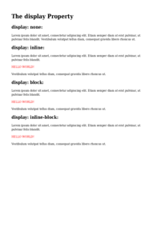
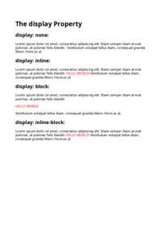
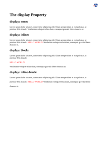

## DIRECTION

[📄 Input HTML](/html/CSS%20Properties/D/direction.html)

### Output PDF

| mPDF | typeset.sh | PDFreactor |
|---------|---------|---------|
|  |  |  |
| [📕 mPDF Output](mpdf__html_CSS_Properties_D_direction.html.pdf) | [📕 typeset Output](typeset__html_CSS_Properties_D_direction.html.pdf) | [📕 PDFreactor Output](pdfreactor__html_CSS_Properties_D_direction.html.pdf) |

## DISPLAY

[📄 Input HTML](/html/CSS%20Properties/D/display.html)

### Output PDF

| mPDF | typeset.sh | PDFreactor |
|---------|---------|---------|
|  |  |  |
| [📕 mPDF Output](mpdf__html_CSS_Properties_D_display.html.pdf) | [📕 typeset Output](typeset__html_CSS_Properties_D_display.html.pdf) | [📕 PDFreactor Output](pdfreactor__html_CSS_Properties_D_display.html.pdf) |

