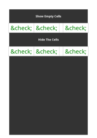

## EMPTY-CELLS

[📄 Input HTML](/html/CSS%20Properties/E/empty-cells.html):

### mPDF
 

[📕 mPDF Output](mpdf__html_CSS_Properties_E_empty-cells.html.pdf)

### typeset.sh
 

[📕 typeset Output](typeset__html_CSS_Properties_E_empty-cells.html.pdf)

### PDFreactor
 

[📕 PDFreactor Output](pdfreactor__html_CSS_Properties_E_empty-cells.html.pdf)

