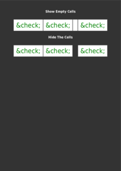
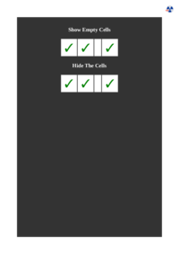

## 🔬 EMPTY-CELLS

[📄 Input HTML](https://raw.githubusercontent.com/azettl/compare.html2pdf.tools/master//html/CSS%20Properties/E/empty-cells.html)

### Output PDF

| mPDF | typeset.sh | PDFreactor |
|---------|---------|---------|
|  |  |  |
| [📕 mPDF Output](mpdf__html_CSS_Properties_E_empty-cells.html.pdf) | [📕 typeset Output](typeset__html_CSS_Properties_E_empty-cells.html.pdf) | [📕 PDFreactor Output](pdfreactor__html_CSS_Properties_E_empty-cells.html.pdf) |

