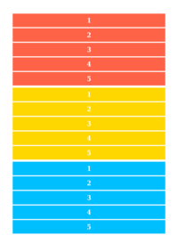
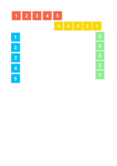
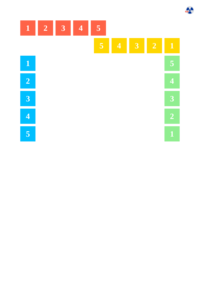
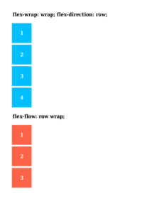
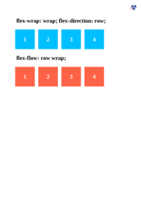
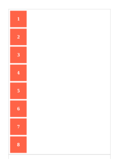
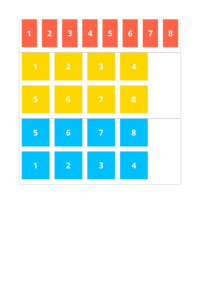
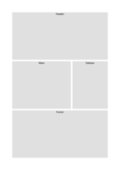
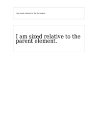
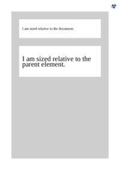

## FILTER

[📄 Input HTML](/html/CSS%20Properties/F/filter.html)

### Output PDF

| mPDF | typeset.sh | PDFreactor |
|---------|---------|---------|
|  |  |  |
| [📕 mPDF Output](mpdf__html_CSS_Properties_F_filter.html.pdf) | [📕 typeset Output](typeset__html_CSS_Properties_F_filter.html.pdf) | [📕 PDFreactor Output](pdfreactor__html_CSS_Properties_F_filter.html.pdf) |

## FLEX-BASIS

[📄 Input HTML](/html/CSS%20Properties/F/flex-basis.html)

### Output PDF

| mPDF | typeset.sh | PDFreactor |
|---------|---------|---------|
|  |  |  |
| [📕 mPDF Output](mpdf__html_CSS_Properties_F_flex-basis.html.pdf) | [📕 typeset Output](typeset__html_CSS_Properties_F_flex-basis.html.pdf) | [📕 PDFreactor Output](pdfreactor__html_CSS_Properties_F_flex-basis.html.pdf) |

## FLEX-DIRECTION

[📄 Input HTML](/html/CSS%20Properties/F/flex-direction.html)

### Output PDF

| mPDF | typeset.sh | PDFreactor |
|---------|---------|---------|
|  |  |  |
| [📕 mPDF Output](mpdf__html_CSS_Properties_F_flex-direction.html.pdf) | [📕 typeset Output](typeset__html_CSS_Properties_F_flex-direction.html.pdf) | [📕 PDFreactor Output](pdfreactor__html_CSS_Properties_F_flex-direction.html.pdf) |

## FLEX-FLOW

[📄 Input HTML](/html/CSS%20Properties/F/flex-flow.html)

### Output PDF

| mPDF | typeset.sh | PDFreactor |
|---------|---------|---------|
|  |  |  |
| [📕 mPDF Output](mpdf__html_CSS_Properties_F_flex-flow.html.pdf) | [📕 typeset Output](typeset__html_CSS_Properties_F_flex-flow.html.pdf) | [📕 PDFreactor Output](pdfreactor__html_CSS_Properties_F_flex-flow.html.pdf) |

## FLEX-GROW

[📄 Input HTML](/html/CSS%20Properties/F/flex-grow.html)

### Output PDF

| mPDF | typeset.sh | PDFreactor |
|---------|---------|---------|
|  |  |  |
| [📕 mPDF Output](mpdf__html_CSS_Properties_F_flex-grow.html.pdf) | [📕 typeset Output](typeset__html_CSS_Properties_F_flex-grow.html.pdf) | [📕 PDFreactor Output](pdfreactor__html_CSS_Properties_F_flex-grow.html.pdf) |

## FLEX-SHRINK

[📄 Input HTML](/html/CSS%20Properties/F/flex-shrink.html)

### Output PDF

| mPDF | typeset.sh | PDFreactor |
|---------|---------|---------|
|  |  |  |
| [📕 mPDF Output](mpdf__html_CSS_Properties_F_flex-shrink.html.pdf) | [📕 typeset Output](typeset__html_CSS_Properties_F_flex-shrink.html.pdf) | [📕 PDFreactor Output](pdfreactor__html_CSS_Properties_F_flex-shrink.html.pdf) |

## FLEX-WRAP

[📄 Input HTML](/html/CSS%20Properties/F/flex-wrap.html)

### Output PDF

| mPDF | typeset.sh | PDFreactor |
|---------|---------|---------|
|  |  |  |
| [📕 mPDF Output](mpdf__html_CSS_Properties_F_flex-wrap.html.pdf) | [📕 typeset Output](typeset__html_CSS_Properties_F_flex-wrap.html.pdf) | [📕 PDFreactor Output](pdfreactor__html_CSS_Properties_F_flex-wrap.html.pdf) |

## FLEX

[📄 Input HTML](/html/CSS%20Properties/F/flex.html)

### Output PDF

| mPDF | typeset.sh | PDFreactor |
|---------|---------|---------|
|  |  |  |
| [📕 mPDF Output](mpdf__html_CSS_Properties_F_flex.html.pdf) | [📕 typeset Output](typeset__html_CSS_Properties_F_flex.html.pdf) | [📕 PDFreactor Output](pdfreactor__html_CSS_Properties_F_flex.html.pdf) |

## FLOAT

[📄 Input HTML](/html/CSS%20Properties/F/float.html)

### Output PDF

| mPDF | typeset.sh | PDFreactor |
|---------|---------|---------|
|  |  |  |
| [📕 mPDF Output](mpdf__html_CSS_Properties_F_float.html.pdf) | [📕 typeset Output](typeset__html_CSS_Properties_F_float.html.pdf) | [📕 PDFreactor Output](pdfreactor__html_CSS_Properties_F_float.html.pdf) |

## FONT-FAMILY

[📄 Input HTML](/html/CSS%20Properties/F/font-family.html)

### Output PDF

| mPDF | typeset.sh | PDFreactor |
|---------|---------|---------|
|  |  |  |
| [📕 mPDF Output](mpdf__html_CSS_Properties_F_font-family.html.pdf) | [📕 typeset Output](typeset__html_CSS_Properties_F_font-family.html.pdf) | [📕 PDFreactor Output](pdfreactor__html_CSS_Properties_F_font-family.html.pdf) |

## FONT-FEATURE-SETTINGS

[📄 Input HTML](/html/CSS%20Properties/F/font-feature-settings.html)

### Output PDF

| mPDF | typeset.sh | PDFreactor |
|---------|---------|---------|
|  |  |  |
| [📕 mPDF Output](mpdf__html_CSS_Properties_F_font-feature-settings.html.pdf) | [📕 typeset Output](typeset__html_CSS_Properties_F_font-feature-settings.html.pdf) | [📕 PDFreactor Output](pdfreactor__html_CSS_Properties_F_font-feature-settings.html.pdf) |

## FONT-SIZE-ADJUST

[📄 Input HTML](/html/CSS%20Properties/F/font-size-adjust.html)

### Output PDF

| mPDF | typeset.sh | PDFreactor |
|---------|---------|---------|
|  |  |  |
| [📕 mPDF Output](mpdf__html_CSS_Properties_F_font-size-adjust.html.pdf) | [📕 typeset Output](typeset__html_CSS_Properties_F_font-size-adjust.html.pdf) | [📕 PDFreactor Output](pdfreactor__html_CSS_Properties_F_font-size-adjust.html.pdf) |

## FONT-SIZE

[📄 Input HTML](/html/CSS%20Properties/F/font-size.html)

### Output PDF

| mPDF | typeset.sh | PDFreactor |
|---------|---------|---------|
|  |  |  |
| [📕 mPDF Output](mpdf__html_CSS_Properties_F_font-size.html.pdf) | [📕 typeset Output](typeset__html_CSS_Properties_F_font-size.html.pdf) | [📕 PDFreactor Output](pdfreactor__html_CSS_Properties_F_font-size.html.pdf) |

## FONT-STRETCH

[📄 Input HTML](/html/CSS%20Properties/F/font-stretch.html)

### Output PDF

| mPDF | typeset.sh | PDFreactor |
|---------|---------|---------|
|  |  |  |
| [📕 mPDF Output](mpdf__html_CSS_Properties_F_font-stretch.html.pdf) | [📕 typeset Output](typeset__html_CSS_Properties_F_font-stretch.html.pdf) | [📕 PDFreactor Output](pdfreactor__html_CSS_Properties_F_font-stretch.html.pdf) |

## FONT-STYLE

[📄 Input HTML](/html/CSS%20Properties/F/font-style.html)

### Output PDF

| mPDF | typeset.sh | PDFreactor |
|---------|---------|---------|
|  |  |  |
| [📕 mPDF Output](mpdf__html_CSS_Properties_F_font-style.html.pdf) | [📕 typeset Output](typeset__html_CSS_Properties_F_font-style.html.pdf) | [📕 PDFreactor Output](pdfreactor__html_CSS_Properties_F_font-style.html.pdf) |

## FONT-VARIANT

[📄 Input HTML](/html/CSS%20Properties/F/font-variant.html)

### Output PDF

| mPDF | typeset.sh | PDFreactor |
|---------|---------|---------|
|  |  |  |
| [📕 mPDF Output](mpdf__html_CSS_Properties_F_font-variant.html.pdf) | [📕 typeset Output](typeset__html_CSS_Properties_F_font-variant.html.pdf) | [📕 PDFreactor Output](pdfreactor__html_CSS_Properties_F_font-variant.html.pdf) |

## FONT-WEIGHT

[📄 Input HTML](/html/CSS%20Properties/F/font-weight.html)

### Output PDF

| mPDF | typeset.sh | PDFreactor |
|---------|---------|---------|
|  |  |  |
| [📕 mPDF Output](mpdf__html_CSS_Properties_F_font-weight.html.pdf) | [📕 typeset Output](typeset__html_CSS_Properties_F_font-weight.html.pdf) | [📕 PDFreactor Output](pdfreactor__html_CSS_Properties_F_font-weight.html.pdf) |

## FONT

[📄 Input HTML](/html/CSS%20Properties/F/font.html)

### Output PDF

| mPDF | typeset.sh | PDFreactor |
|---------|---------|---------|
|  |  |  |
| [📕 mPDF Output](mpdf__html_CSS_Properties_F_font.html.pdf) | [📕 typeset Output](typeset__html_CSS_Properties_F_font.html.pdf) | [📕 PDFreactor Output](pdfreactor__html_CSS_Properties_F_font.html.pdf) |

