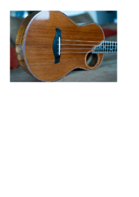
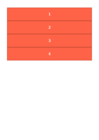
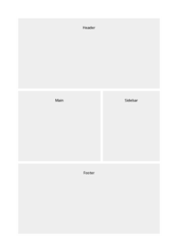

## 🔬 FILTER

### Input HTML & CSS

[📄 Input HTML](https://raw.githubusercontent.com/azettl/compare.html2pdf.tools/master//html/CSS%20Properties/F/filter.html)

    

        View FILTER Code
    

    <pre><code class="hljs xml">&lt;!DOCTYPE html&gt;
&lt;!-- Sample from https://css-tricks.com/almanac/properties/f/filter/ --&gt;
&lt;html lang="en"&gt;
    &lt;head&gt;
        &lt;style&gt;
        img { display: block; width: 90%; }

img {
  -webkit-filter: sepia(1);
  filter: sepia(1);
}
        &lt;/style&gt;
    &lt;/head&gt;
    &lt;body&gt;
        &lt;img src="https://s3-us-west-2.amazonaws.com/s.cdpn.io/392/redwood-ukulele-top.jpg" alt="ukulele"&gt;
    &lt;/body&gt;
&lt;/html&gt;</code><button class='button-code-copy'>📋 Copy Code</button></pre>

### Output PDF

| mPDF | typeset.sh | PDFreactor | wkhtmltopdf
|---------|---------|---------|---------|
|  |  |  |  |
| [📕 mPDF Output](mpdf__html_CSS_Properties_F_filter.html.pdf) | [📕 typeset Output](typeset__html_CSS_Properties_F_filter.html.pdf) | [📕 PDFreactor Output](pdfreactor__html_CSS_Properties_F_filter.html.pdf) | [📕 wkhtmltopdf Output](wkhtmltopdf__html_CSS_Properties_F_filter.html.pdf) |

## 🔬 FLEX-BASIS

### Input HTML & CSS

[📄 Input HTML](https://raw.githubusercontent.com/azettl/compare.html2pdf.tools/master//html/CSS%20Properties/F/flex-basis.html)

    

        View FLEX-BASIS Code
    

    <pre><code class="hljs xml">&lt;!DOCTYPE html&gt;
&lt;!-- Sample from https://css-tricks.com/almanac/properties/f/flex-basis/ --&gt;
&lt;html lang="en"&gt;
    &lt;head&gt;
        &lt;style&gt;
        .flex-container {
  padding: 0;
  margin: 0;
  list-style: none;
  
  -ms-box-orient: horizontal;
  display: -webkit-box;
  display: -moz-box;
  display: -ms-flexbox;
  display: -moz-flex;
  display: -webkit-flex;
  display: flex;
}

.flex-item {
  background: tomato;
  padding: 10px;
  border: 5px solid red;
  
  color: white;
  font-weight: bold;
  font-size: 2em;
  text-align: center;
}

.flex1 { flex: 1 1 20em; }
.flex2 { flex: 2 2 20em; } 
        &lt;/style&gt;
    &lt;/head&gt;
    &lt;body&gt;
        &lt;ul class="flex-container"&gt;
            &lt;li class="flex-item flex1"&gt;1&lt;/li&gt;
            &lt;li class="flex-item flex2"&gt;2&lt;/li&gt;
          &lt;/ul&gt;
    &lt;/body&gt;
&lt;/html&gt;</code><button class='button-code-copy'>📋 Copy Code</button></pre>

### Output PDF

| mPDF | typeset.sh | PDFreactor | wkhtmltopdf
|---------|---------|---------|---------|
|  |  |  |  |
| [📕 mPDF Output](mpdf__html_CSS_Properties_F_flex-basis.html.pdf) | [📕 typeset Output](typeset__html_CSS_Properties_F_flex-basis.html.pdf) | [📕 PDFreactor Output](pdfreactor__html_CSS_Properties_F_flex-basis.html.pdf) | [📕 wkhtmltopdf Output](wkhtmltopdf__html_CSS_Properties_F_flex-basis.html.pdf) |

## 🔬 FLEX-DIRECTION

### Input HTML & CSS

[📄 Input HTML](https://raw.githubusercontent.com/azettl/compare.html2pdf.tools/master//html/CSS%20Properties/F/flex-direction.html)

    

        View FLEX-DIRECTION Code
    

    <pre><code class="hljs xml">&lt;!DOCTYPE html&gt;
&lt;!-- Sample from https://css-tricks.com/almanac/properties/f/flex-direction/ --&gt;
&lt;html lang="en"&gt;
    &lt;head&gt;
        &lt;style&gt;
        .flex-container {
  padding: 0;
  margin: 0;
  list-style: none;
  
  -ms-box-orient: horizontal;
  display: -webkit-box;
  display: -moz-box;
  display: -ms-flexbox;
  display: -moz-flex;
  display: -webkit-flex;
  display: flex;
}

.row            { 
  -webkit-flex-direction: row; 
  flex-direction: row;
}

.row-reverse    { 
  -webkit-flex-direction: row-reverse; 
  flex-direction: row-reverse;
}  
.row-reverse li {
  background: gold;
}

.column { 
  -webkit-flex-direction: column; 
  flex-direction: column; 
  float: left;
}
.column li {
  background: deepskyblue;
}

.column-reverse { 
  -webkit-flex-direction: column-reverse; 
  flex-direction: column-reverse; 
  float: right;
}
.column-reverse li {
  background: lightgreen;
}

.flex-item {
  background: tomato;
  padding: 5px;
  width: 50px;
  height: 50px;
  margin: 5px;
  
  line-height: 50px;
  color: white;
  font-weight: bold;
  font-size: 2em;
  text-align: center;
}
        &lt;/style&gt;
    &lt;/head&gt;
    &lt;body&gt;
        &lt;ul class="flex-container row"&gt;
            &lt;li class="flex-item"&gt;1&lt;/li&gt;
            &lt;li class="flex-item"&gt;2&lt;/li&gt;
            &lt;li class="flex-item"&gt;3&lt;/li&gt;
            &lt;li class="flex-item"&gt;4&lt;/li&gt;
            &lt;li class="flex-item"&gt;5&lt;/li&gt;
          &lt;/ul&gt;
          
          &lt;ul class="flex-container row-reverse"&gt;
            &lt;li class="flex-item"&gt;1&lt;/li&gt;
            &lt;li class="flex-item"&gt;2&lt;/li&gt;
            &lt;li class="flex-item"&gt;3&lt;/li&gt;
            &lt;li class="flex-item"&gt;4&lt;/li&gt;
            &lt;li class="flex-item"&gt;5&lt;/li&gt;
          &lt;/ul&gt;
          
          &lt;ul class="flex-container column"&gt;
            &lt;li class="flex-item"&gt;1&lt;/li&gt;
            &lt;li class="flex-item"&gt;2&lt;/li&gt;
            &lt;li class="flex-item"&gt;3&lt;/li&gt;
            &lt;li class="flex-item"&gt;4&lt;/li&gt;
            &lt;li class="flex-item"&gt;5&lt;/li&gt;
          &lt;/ul&gt;
          
          &lt;ul class="flex-container column-reverse"&gt;
            &lt;li class="flex-item"&gt;1&lt;/li&gt;
            &lt;li class="flex-item"&gt;2&lt;/li&gt;
            &lt;li class="flex-item"&gt;3&lt;/li&gt;
            &lt;li class="flex-item"&gt;4&lt;/li&gt;
            &lt;li class="flex-item"&gt;5&lt;/li&gt;
          &lt;/ul&gt;
    &lt;/body&gt;
&lt;/html&gt;</code><button class='button-code-copy'>📋 Copy Code</button></pre>

### Output PDF

| mPDF | typeset.sh | PDFreactor | wkhtmltopdf
|---------|---------|---------|---------|
|  |  |  |  |
| [📕 mPDF Output](mpdf__html_CSS_Properties_F_flex-direction.html.pdf) | [📕 typeset Output](typeset__html_CSS_Properties_F_flex-direction.html.pdf) | [📕 PDFreactor Output](pdfreactor__html_CSS_Properties_F_flex-direction.html.pdf) | [📕 wkhtmltopdf Output](wkhtmltopdf__html_CSS_Properties_F_flex-direction.html.pdf) |

## 🔬 FLEX-FLOW

### Input HTML & CSS

[📄 Input HTML](https://raw.githubusercontent.com/azettl/compare.html2pdf.tools/master//html/CSS%20Properties/F/flex-flow.html)

    

        View FLEX-FLOW Code
    

    <pre><code class="hljs xml">&lt;!DOCTYPE html&gt;
&lt;!-- Sample from https://css-tricks.com/almanac/properties/f/flex-flow/ --&gt;
&lt;html lang="en"&gt;
    &lt;head&gt;
        &lt;style&gt;
        .flex-container {
  padding: 0;
  margin: 0;
  list-style: none;
  
  -ms-box-orient: horizontal;
  display: -webkit-box;
  display: -moz-box;
  display: -ms-flexbox;
  display: -moz-flex;
  display: -webkit-flex;
  display: flex;
}

h1 {
  padding-left: .5em; 
}

.shorthand { 
  -webkit-flex-wrap: wrap;
  flex-wrap: wrap;
  -webkit-flex-direction: row;
  flex-direction: row;
}

.longhand { 
  -webkit-flex-flow: wrap row;
  flex-flow: wrap row;
  
}

.longhand li {
  background: deepskyblue;
}

.flex-item {
  background: tomato;
  padding: 5px;
  width: 100px;
  height: 100px;
  margin: 10px;
  
  line-height: 100px;
  color: white;
  font-weight: bold;
  font-size: 2em;
  text-align: center;
}
        &lt;/style&gt;
    &lt;/head&gt;
    &lt;body&gt;
        &lt;h1&gt;flex-wrap: wrap; flex-direction: row;&lt;/h1&gt;
        &lt;ul class="flex-container longhand"&gt;
          &lt;li class="flex-item"&gt;1&lt;/li&gt;
          &lt;li class="flex-item"&gt;2&lt;/li&gt;
          &lt;li class="flex-item"&gt;3&lt;/li&gt;
          &lt;li class="flex-item"&gt;4&lt;/li&gt;
        &lt;/ul&gt;
        
        &lt;h1&gt;flex-flow: row wrap;&lt;/h1&gt;
        &lt;ul class="flex-container shorthand"&gt;
          &lt;li class="flex-item"&gt;1&lt;/li&gt;
          &lt;li class="flex-item"&gt;2&lt;/li&gt;
          &lt;li class="flex-item"&gt;3&lt;/li&gt;
          &lt;li class="flex-item"&gt;4&lt;/li&gt;
        &lt;/ul&gt;
    &lt;/body&gt;
&lt;/html&gt;</code><button class='button-code-copy'>📋 Copy Code</button></pre>

### Output PDF

| mPDF | typeset.sh | PDFreactor | wkhtmltopdf
|---------|---------|---------|---------|
|  |  |  |  |
| [📕 mPDF Output](mpdf__html_CSS_Properties_F_flex-flow.html.pdf) | [📕 typeset Output](typeset__html_CSS_Properties_F_flex-flow.html.pdf) | [📕 PDFreactor Output](pdfreactor__html_CSS_Properties_F_flex-flow.html.pdf) | [📕 wkhtmltopdf Output](wkhtmltopdf__html_CSS_Properties_F_flex-flow.html.pdf) |

## 🔬 FLEX-GROW

### Input HTML & CSS

[📄 Input HTML](https://raw.githubusercontent.com/azettl/compare.html2pdf.tools/master//html/CSS%20Properties/F/flex-grow.html)

    

        View FLEX-GROW Code
    

    <pre><code class="hljs xml">&lt;!DOCTYPE html&gt;
&lt;!-- Sample from https://css-tricks.com/almanac/properties/f/flex-grow/ --&gt;
&lt;html lang="en"&gt;
    &lt;head&gt;
        &lt;style&gt;
        .flex-container {
  padding: 0;
  margin: 0;
  list-style: none;
  
  -ms-box-orient: horizontal;
  display: -webkit-box;
  display: -moz-box;
  display: -ms-flexbox;
  display: -moz-flex;
  display: -webkit-flex;
  display: flex;
    
  -webkit-justify-content: space-around;
  justify-content: space-around;
  -webkit-flex-flow: row wrap;
  flex-flow: row wrap;
  -webkit-align-items: stretch;
  align-items: stretch;
}

.flex-item:nth-of-type(1) { flex-grow: 1; }
.flex-item:nth-of-type(2) { flex-grow: 1; }
.flex-item:nth-of-type(3) { flex-grow: 2; }
.flex-item:nth-of-type(4) { flex-grow: 1; }
.flex-item:nth-of-type(5) { flex-grow: 1; }

.flex-item {
  
  background: tomato;
  border: 3px solid rgba(0,0,0,.2);
  line-height: 100px;
  color: white;
  font-weight: bold;
  font-size: 2em;
  text-align: center;
}
        &lt;/style&gt;
    &lt;/head&gt;
    &lt;body&gt;
        &lt;ul class="flex-container"&gt;
            &lt;li class="flex-item"&gt;1&lt;/li&gt;
            &lt;li class="flex-item"&gt;2&lt;/li&gt;
            &lt;li class="flex-item"&gt;3&lt;/li&gt;
            &lt;li class="flex-item"&gt;4&lt;/li&gt;
          &lt;/ul&gt;
    &lt;/body&gt;
&lt;/html&gt;</code><button class='button-code-copy'>📋 Copy Code</button></pre>

### Output PDF

| mPDF | typeset.sh | PDFreactor | wkhtmltopdf
|---------|---------|---------|---------|
|  |  |  |  |
| [📕 mPDF Output](mpdf__html_CSS_Properties_F_flex-grow.html.pdf) | [📕 typeset Output](typeset__html_CSS_Properties_F_flex-grow.html.pdf) | [📕 PDFreactor Output](pdfreactor__html_CSS_Properties_F_flex-grow.html.pdf) | [📕 wkhtmltopdf Output](wkhtmltopdf__html_CSS_Properties_F_flex-grow.html.pdf) |

## 🔬 FLEX-SHRINK

### Input HTML & CSS

[📄 Input HTML](https://raw.githubusercontent.com/azettl/compare.html2pdf.tools/master//html/CSS%20Properties/F/flex-shrink.html)

    

        View FLEX-SHRINK Code
    

    <pre><code class="hljs xml">&lt;!DOCTYPE html&gt;
&lt;!-- Sample from https://css-tricks.com/almanac/properties/f/flex-shrink/ --&gt;
&lt;html lang="en"&gt;
    &lt;head&gt;
        &lt;style&gt;
        .flex-container {
  padding: 0;
  margin: 0;
  list-style: none;
  
  -ms-box-orient: horizontal;
  display: -webkit-box;
  display: -moz-box;
  display: -ms-flexbox;
  display: -moz-flex;
  display: -webkit-flex;
  display: flex;
}

.flex-item {
  background: tomato;
  padding: 10px;
  border: 5px solid red;
  
  color: white;
  font-weight: bold;
  font-size: 2em;
  text-align: center;
}

.flex1 { flex: 1 1 20em; }
.flex2 { flex: 2 2 20em; } 
        &lt;/style&gt;
    &lt;/head&gt;
    &lt;body&gt;
        &lt;ul class="flex-container"&gt;
            &lt;li class="flex-item flex1"&gt;1&lt;/li&gt;
            &lt;li class="flex-item flex2"&gt;2&lt;/li&gt;
          &lt;/ul&gt;
    &lt;/body&gt;
&lt;/html&gt;</code><button class='button-code-copy'>📋 Copy Code</button></pre>

### Output PDF

| mPDF | typeset.sh | PDFreactor | wkhtmltopdf
|---------|---------|---------|---------|
|  |  |  |  |
| [📕 mPDF Output](mpdf__html_CSS_Properties_F_flex-shrink.html.pdf) | [📕 typeset Output](typeset__html_CSS_Properties_F_flex-shrink.html.pdf) | [📕 PDFreactor Output](pdfreactor__html_CSS_Properties_F_flex-shrink.html.pdf) | [📕 wkhtmltopdf Output](wkhtmltopdf__html_CSS_Properties_F_flex-shrink.html.pdf) |

## 🔬 FLEX-WRAP

### Input HTML & CSS

[📄 Input HTML](https://raw.githubusercontent.com/azettl/compare.html2pdf.tools/master//html/CSS%20Properties/F/flex-wrap.html)

    

        View FLEX-WRAP Code
    

    <pre><code class="hljs xml">&lt;!DOCTYPE html&gt;
&lt;!-- Sample from https://css-tricks.com/almanac/properties/f/flex-wrap/ --&gt;
&lt;html lang="en"&gt;
    &lt;head&gt;
        &lt;style&gt;
        .flex-container {
  padding: 0;
  margin: 0;
  list-style: none;
  border: 1px solid silver;
  -ms-box-orient: horizontal;
  display: -webkit-box;
  display: -moz-box;
  display: -ms-flexbox;
  display: -moz-flex;
  display: -webkit-flex;
  display: flex;
}

.nowrap  { 
  -webkit-flex-wrap: nowrap;
  flex-wrap: nowrap;
}

.wrap    { 
  -webkit-flex-wrap: wrap;
  flex-wrap: wrap;
}  
.wrap li {
  background: gold;
}

.wrap-reverse         { 
  -webkit-flex-wrap: wrap-reverse;
  flex-wrap: wrap-reverse;
}  
.wrap-reverse li {
  background: deepskyblue;
}

.flex-item {
  background: tomato;
  padding: 5px;
  width: 100px;
  height: 100px;
  margin: 10px;
  
  line-height: 100px;
  color: white;
  font-weight: bold;
  font-size: 2em;
  text-align: center;
}
        &lt;/style&gt;
    &lt;/head&gt;
    &lt;body&gt;
        &lt;ul class="flex-container nowrap"&gt;
            &lt;li class="flex-item"&gt;1&lt;/li&gt;
            &lt;li class="flex-item"&gt;2&lt;/li&gt;
            &lt;li class="flex-item"&gt;3&lt;/li&gt;
            &lt;li class="flex-item"&gt;4&lt;/li&gt;
            &lt;li class="flex-item"&gt;5&lt;/li&gt;
            &lt;li class="flex-item"&gt;6&lt;/li&gt;
            &lt;li class="flex-item"&gt;7&lt;/li&gt;
            &lt;li class="flex-item"&gt;8&lt;/li&gt;
          &lt;/ul&gt;
          
          &lt;ul class="flex-container wrap"&gt;
            &lt;li class="flex-item"&gt;1&lt;/li&gt;
            &lt;li class="flex-item"&gt;2&lt;/li&gt;
            &lt;li class="flex-item"&gt;3&lt;/li&gt;
            &lt;li class="flex-item"&gt;4&lt;/li&gt;
            &lt;li class="flex-item"&gt;5&lt;/li&gt;
            &lt;li class="flex-item"&gt;6&lt;/li&gt;
            &lt;li class="flex-item"&gt;7&lt;/li&gt;
            &lt;li class="flex-item"&gt;8&lt;/li&gt;
          &lt;/ul&gt;
          
          &lt;ul class="flex-container wrap-reverse"&gt;
            &lt;li class="flex-item"&gt;1&lt;/li&gt;
            &lt;li class="flex-item"&gt;2&lt;/li&gt;
            &lt;li class="flex-item"&gt;3&lt;/li&gt;
            &lt;li class="flex-item"&gt;4&lt;/li&gt;
            &lt;li class="flex-item"&gt;5&lt;/li&gt;
            &lt;li class="flex-item"&gt;6&lt;/li&gt;
            &lt;li class="flex-item"&gt;7&lt;/li&gt;
            &lt;li class="flex-item"&gt;8&lt;/li&gt;
          &lt;/ul&gt;
    &lt;/body&gt;
&lt;/html&gt;</code><button class='button-code-copy'>📋 Copy Code</button></pre>

### Output PDF

| mPDF | typeset.sh | PDFreactor | wkhtmltopdf
|---------|---------|---------|---------|
|  |  |  |  |
| [📕 mPDF Output](mpdf__html_CSS_Properties_F_flex-wrap.html.pdf) | [📕 typeset Output](typeset__html_CSS_Properties_F_flex-wrap.html.pdf) | [📕 PDFreactor Output](pdfreactor__html_CSS_Properties_F_flex-wrap.html.pdf) | [📕 wkhtmltopdf Output](wkhtmltopdf__html_CSS_Properties_F_flex-wrap.html.pdf) |

## 🔬 FLEX

### Input HTML & CSS

[📄 Input HTML](https://raw.githubusercontent.com/azettl/compare.html2pdf.tools/master//html/CSS%20Properties/F/flex.html)

    

        View FLEX Code
    

    <pre><code class="hljs xml">&lt;!DOCTYPE html&gt;
&lt;!-- Sample from https://css-tricks.com/almanac/properties/f/flex/ --&gt;
&lt;html lang="en"&gt;
    &lt;head&gt;
        &lt;style&gt;
        body {
  display: flex;
  flex-wrap: wrap;
}
body &gt; * {
  background: #eee;
  padding: 2rem;
  text-align: center;
  border: 5px solid white;
}

.header,
.footer {
  flex: 1 100%;
}
.sidebar {
  flex: 1;
}
.main {
  flex: 2;
}

        &lt;/style&gt;
    &lt;/head&gt;
    &lt;body&gt;
        &lt;header class="header"&gt;Header&lt;/header&gt;
        &lt;main class="main"&gt;Main&lt;/main&gt;
        &lt;aside class="sidebar"&gt;Sidebar&lt;/aside&gt;
        &lt;footer class="footer"&gt;Footer&lt;/footer&gt;
    &lt;/body&gt;
&lt;/html&gt;</code><button class='button-code-copy'>📋 Copy Code</button></pre>

### Output PDF

| mPDF | typeset.sh | PDFreactor | wkhtmltopdf
|---------|---------|---------|---------|
|  |  |  |  |
| [📕 mPDF Output](mpdf__html_CSS_Properties_F_flex.html.pdf) | [📕 typeset Output](typeset__html_CSS_Properties_F_flex.html.pdf) | [📕 PDFreactor Output](pdfreactor__html_CSS_Properties_F_flex.html.pdf) | [📕 wkhtmltopdf Output](wkhtmltopdf__html_CSS_Properties_F_flex.html.pdf) |

## 🔬 FLOAT

### Input HTML & CSS

[📄 Input HTML](https://raw.githubusercontent.com/azettl/compare.html2pdf.tools/master//html/CSS%20Properties/F/float.html)

    

        View FLOAT Code
    

    <pre><code class="hljs xml">&lt;!DOCTYPE html&gt;
&lt;!-- Sample from https://www.w3schools.com/css/css_float_clear.asp --&gt;
&lt;html lang="en"&gt;
    &lt;head&gt;
        &lt;style&gt;
        .div1 {
  float: left;
  width: 100px;
  height: 50px;
  margin: 10px;
  border: 3px solid #73AD21;
}

.div2 {
  border: 1px solid red;
}
        &lt;/style&gt;
    &lt;/head&gt;
    &lt;body&gt;
        &lt;h2&gt;Float&lt;/h2&gt;
        &lt;div class="div1"&gt;div1&lt;/div&gt;
        &lt;div class="div2"&gt;div2 - Notice that div2 is after div1 in the HTML code. However, since div1 floats to the left, the text in div2 flows around div1.&lt;/div&gt;
     
    &lt;/body&gt;
&lt;/html&gt;</code><button class='button-code-copy'>📋 Copy Code</button></pre>

### Output PDF

| mPDF | typeset.sh | PDFreactor | wkhtmltopdf
|---------|---------|---------|---------|
|  |  |  |  |
| [📕 mPDF Output](mpdf__html_CSS_Properties_F_float.html.pdf) | [📕 typeset Output](typeset__html_CSS_Properties_F_float.html.pdf) | [📕 PDFreactor Output](pdfreactor__html_CSS_Properties_F_float.html.pdf) | [📕 wkhtmltopdf Output](wkhtmltopdf__html_CSS_Properties_F_float.html.pdf) |

## 🔬 FONT-FAMILY

### Input HTML & CSS

[📄 Input HTML](https://raw.githubusercontent.com/azettl/compare.html2pdf.tools/master//html/CSS%20Properties/F/font-family.html)

    

        View FONT-FAMILY Code
    

    <pre><code class="hljs xml">&lt;!DOCTYPE html&gt;
&lt;!-- Sample from https://www.w3schools.com/css/tryit.asp?filename=trycss_font-family --&gt;
&lt;html lang="en"&gt;
    &lt;head&gt;
        &lt;style&gt;
        .serif {
  font-family: "Times New Roman", Times, serif;
}

.sansserif {
  font-family: Arial, Helvetica, sans-serif;
}

.monospace {
  font-family: "Lucida Console", Courier, monospace;
}
        &lt;/style&gt;
    &lt;/head&gt;
    &lt;body&gt;
        &lt;h1&gt;CSS font-family&lt;/h1&gt;
        &lt;p class="serif"&gt;This is a paragraph, shown in the Times New Roman font.&lt;/p&gt;
        &lt;p class="sansserif"&gt;This is a paragraph, shown in the Arial font.&lt;/p&gt;
        &lt;p class="monospace"&gt;This is a paragraph, shown in the Lucida Console font.&lt;/p&gt;
        
    &lt;/body&gt;
&lt;/html&gt;</code><button class='button-code-copy'>📋 Copy Code</button></pre>

### Output PDF

| mPDF | typeset.sh | PDFreactor | wkhtmltopdf
|---------|---------|---------|---------|
|  |  |  |  |
| [📕 mPDF Output](mpdf__html_CSS_Properties_F_font-family.html.pdf) | [📕 typeset Output](typeset__html_CSS_Properties_F_font-family.html.pdf) | [📕 PDFreactor Output](pdfreactor__html_CSS_Properties_F_font-family.html.pdf) | [📕 wkhtmltopdf Output](wkhtmltopdf__html_CSS_Properties_F_font-family.html.pdf) |

## 🔬 FONT-FEATURE-SETTINGS

### Input HTML & CSS

[📄 Input HTML](https://raw.githubusercontent.com/azettl/compare.html2pdf.tools/master//html/CSS%20Properties/F/font-feature-settings.html)

    

        View FONT-FEATURE-SETTINGS Code
    

    <pre><code class="hljs xml">&lt;!DOCTYPE html&gt;
&lt;!-- Sample from https://www.w3schools.com/cssref/tryit.asp?filename=trycss3_font-feature-settings --&gt;
&lt;html lang="en"&gt;
    &lt;head&gt;
        &lt;style&gt;
        /* enable small-caps */
.ex1 { font-feature-settings: "smcp" on; }

/* convert both upper and lowercase to small caps */
.ex2 { font-feature-settings: "c2sc", "smcp"; }

/* no common ligatures */
.ex3 { font-feature-settings: "liga" 0; }

/* enable automatic fractions */
.ex4 { font-feature-settings: "frac"; }
        &lt;/style&gt;
    &lt;/head&gt;
    &lt;body&gt;
        &lt;h1&gt;The font-feature-settings Property&lt;/h1&gt;

        &lt;div class="ex1"&gt;This is some text 0123.&lt;/div&gt;
        &lt;div class="ex2"&gt;This is some text 0123.&lt;/div&gt;
        &lt;div class="ex3"&gt;This is some text 0123.&lt;/div&gt;
        &lt;div class="ex4"&gt;This is some text 0123.&lt;/div&gt;
        
        &lt;p&gt;&lt;b&gt;Note:&lt;/b&gt; Internet Explorer 9 and earlier versions do not support the font-feature-settings property.&lt;/p&gt;
    &lt;/body&gt;
&lt;/html&gt;</code><button class='button-code-copy'>📋 Copy Code</button></pre>

### Output PDF

| mPDF | typeset.sh | PDFreactor | wkhtmltopdf
|---------|---------|---------|---------|
|  |  |  |  |
| [📕 mPDF Output](mpdf__html_CSS_Properties_F_font-feature-settings.html.pdf) | [📕 typeset Output](typeset__html_CSS_Properties_F_font-feature-settings.html.pdf) | [📕 PDFreactor Output](pdfreactor__html_CSS_Properties_F_font-feature-settings.html.pdf) | [📕 wkhtmltopdf Output](wkhtmltopdf__html_CSS_Properties_F_font-feature-settings.html.pdf) |

## 🔬 FONT-SIZE-ADJUST

### Input HTML & CSS

[📄 Input HTML](https://raw.githubusercontent.com/azettl/compare.html2pdf.tools/master//html/CSS%20Properties/F/font-size-adjust.html)

    

        View FONT-SIZE-ADJUST Code
    

    <pre><code class="hljs xml">&lt;!DOCTYPE html&gt;
&lt;!-- Sample from https://www.w3schools.com/cssref/tryit.asp?filename=trycss3_font-size-adjust --&gt;
&lt;html lang="en"&gt;
    &lt;head&gt;
        &lt;style&gt;
        div.a {font-family: verdana;}
div.b {font-family: 'times new roman';}
#div1, #div2 {font-size-adjust: 0.58;}
        &lt;/style&gt;
    &lt;/head&gt;
    &lt;body&gt;
    
&lt;h1&gt;The font-size-adjust Property&lt;/h1&gt;

&lt;p&gt;&lt;b&gt;Note:&lt;/b&gt; Only Firefox supports the font-size-adjust property.&lt;/p&gt;

&lt;h2&gt;Two divs with the same font-size-adjust property:&lt;/h2&gt;
&lt;div id="div1" class="a"&gt;
You control the font size better with the font-size-adjust property.
&lt;/div&gt;
&lt;div id="div2" class="b"&gt;
You control the font size better with the font-size-adjust property.
&lt;/div&gt;

&lt;h2&gt;Two divs without the font-size-adjust property:&lt;/h2&gt;
&lt;div class="a"&gt;
You control the font size better with the font-size-adjust property.
&lt;/div&gt;
&lt;div class="b"&gt;
You control the font size better with the font-size-adjust property.
&lt;/div&gt;
    &lt;/body&gt;
&lt;/html&gt;</code><button class='button-code-copy'>📋 Copy Code</button></pre>

### Output PDF

| mPDF | typeset.sh | PDFreactor | wkhtmltopdf
|---------|---------|---------|---------|
|  |  |  |  |
| [📕 mPDF Output](mpdf__html_CSS_Properties_F_font-size-adjust.html.pdf) | [📕 typeset Output](typeset__html_CSS_Properties_F_font-size-adjust.html.pdf) | [📕 PDFreactor Output](pdfreactor__html_CSS_Properties_F_font-size-adjust.html.pdf) | [📕 wkhtmltopdf Output](wkhtmltopdf__html_CSS_Properties_F_font-size-adjust.html.pdf) |

## 🔬 FONT-SIZE

### Input HTML & CSS

[📄 Input HTML](https://raw.githubusercontent.com/azettl/compare.html2pdf.tools/master//html/CSS%20Properties/F/font-size.html)

    

        View FONT-SIZE Code
    

    <pre><code class="hljs xml">&lt;!DOCTYPE html&gt;
&lt;!-- Sample from https://css-tricks.com/almanac/properties/f/font-size/ --&gt;
&lt;html lang="en"&gt;
    &lt;head&gt;
        &lt;style&gt;
        html {
  background-color: #cecece;
  font-size: 24px;
  line-height: 36px;
}

div {
  background-color: #fff;
  border: 1px solid #ccc;
  border-radius: 5px;
  margin: 50px;
  padding: 20px;
}

.module-2 {
  font-size: 42px;
  line-height: 36px;
}

.module-2 p {
  font-size: 110%;
}
        &lt;/style&gt;
    &lt;/head&gt;
    &lt;body&gt;
        &lt;div class="module-1"&gt;
            &lt;p&gt;I am sized relative to the document.&lt;/p&gt;
          &lt;/div&gt;
          
          &lt;div class="module-2"&gt;
            &lt;p&gt;I am sized relative to the parent element.&lt;/p&gt;
          &lt;/div&gt;
    &lt;/body&gt;
&lt;/html&gt;</code><button class='button-code-copy'>📋 Copy Code</button></pre>

### Output PDF

| mPDF | typeset.sh | PDFreactor | wkhtmltopdf
|---------|---------|---------|---------|
|  |  |  |  |
| [📕 mPDF Output](mpdf__html_CSS_Properties_F_font-size.html.pdf) | [📕 typeset Output](typeset__html_CSS_Properties_F_font-size.html.pdf) | [📕 PDFreactor Output](pdfreactor__html_CSS_Properties_F_font-size.html.pdf) | [📕 wkhtmltopdf Output](wkhtmltopdf__html_CSS_Properties_F_font-size.html.pdf) |

## 🔬 FONT-STRETCH

### Input HTML & CSS

[📄 Input HTML](https://raw.githubusercontent.com/azettl/compare.html2pdf.tools/master//html/CSS%20Properties/F/font-stretch.html)

    

        View FONT-STRETCH Code
    

    <pre><code class="hljs xml">&lt;!DOCTYPE html&gt;
&lt;!-- Sample from https://www.w3schools.com/cssref/css3_pr_font-stretch.asp --&gt;
&lt;html lang="en"&gt;
    &lt;head&gt;
        &lt;style&gt;
        div {
  font-family: sans-serif, "Helvetica Neue", "Lucida Grande", Arial;
  font-stretch: expanded;
}
        &lt;/style&gt;
    &lt;/head&gt;
    &lt;body&gt;
        &lt;div&gt;
            &lt;p&gt;Font Stretch Example&lt;/p&gt;
        &lt;/div&gt;
    &lt;/body&gt;
&lt;/html&gt;</code><button class='button-code-copy'>📋 Copy Code</button></pre>

### Output PDF

| mPDF | typeset.sh | PDFreactor | wkhtmltopdf
|---------|---------|---------|---------|
|  |  |  |  |
| [📕 mPDF Output](mpdf__html_CSS_Properties_F_font-stretch.html.pdf) | [📕 typeset Output](typeset__html_CSS_Properties_F_font-stretch.html.pdf) | [📕 PDFreactor Output](pdfreactor__html_CSS_Properties_F_font-stretch.html.pdf) | [📕 wkhtmltopdf Output](wkhtmltopdf__html_CSS_Properties_F_font-stretch.html.pdf) |

## 🔬 FONT-STYLE

### Input HTML & CSS

[📄 Input HTML](https://raw.githubusercontent.com/azettl/compare.html2pdf.tools/master//html/CSS%20Properties/F/font-style.html)

    

        View FONT-STYLE Code
    

    <pre><code class="hljs xml">&lt;!DOCTYPE html&gt;
&lt;!-- Sample from https://css-tricks.com/almanac/properties/f/font-style/ --&gt;
&lt;html lang="en"&gt;
    &lt;head&gt;
        &lt;style&gt;
        p {
  font-family: sans-serif;
  padding: 0 20px;
  font-size: 20px;
}

.one { font-style: italic; }
.two { font-style: oblique; }
        &lt;/style&gt;
    &lt;/head&gt;
    &lt;body&gt;
        &lt;p class="one"&gt;This is italic text.&lt;/p&gt;

        &lt;p class="two"&gt;This is oblique text.&lt;/p&gt;
    &lt;/body&gt;
&lt;/html&gt;</code><button class='button-code-copy'>📋 Copy Code</button></pre>

### Output PDF

| mPDF | typeset.sh | PDFreactor | wkhtmltopdf
|---------|---------|---------|---------|
|  |  |  |  |
| [📕 mPDF Output](mpdf__html_CSS_Properties_F_font-style.html.pdf) | [📕 typeset Output](typeset__html_CSS_Properties_F_font-style.html.pdf) | [📕 PDFreactor Output](pdfreactor__html_CSS_Properties_F_font-style.html.pdf) | [📕 wkhtmltopdf Output](wkhtmltopdf__html_CSS_Properties_F_font-style.html.pdf) |

## 🔬 FONT-VARIANT

### Input HTML & CSS

[📄 Input HTML](https://raw.githubusercontent.com/azettl/compare.html2pdf.tools/master//html/CSS%20Properties/F/font-variant.html)

    

        View FONT-VARIANT Code
    

    <pre><code class="hljs xml">&lt;!DOCTYPE html&gt;
&lt;!-- Sample from https://css-tricks.com/almanac/properties/f/font-variant/ --&gt;
&lt;html lang="en"&gt;
    &lt;head&gt;
        &lt;style&gt;
        p {
  font-size: 20px;
  padding: 0 20px;
  font-variant: small-caps;
}
        &lt;/style&gt;
    &lt;/head&gt;
    &lt;body&gt;
        &lt;p&gt;This is small-caps.&lt;/p&gt;

        &lt;p&gt;THIS IS REGULAR CAPS.&lt;/p&gt;
    &lt;/body&gt;
&lt;/html&gt;</code><button class='button-code-copy'>📋 Copy Code</button></pre>

### Output PDF

| mPDF | typeset.sh | PDFreactor | wkhtmltopdf
|---------|---------|---------|---------|
|  |  |  |  |
| [📕 mPDF Output](mpdf__html_CSS_Properties_F_font-variant.html.pdf) | [📕 typeset Output](typeset__html_CSS_Properties_F_font-variant.html.pdf) | [📕 PDFreactor Output](pdfreactor__html_CSS_Properties_F_font-variant.html.pdf) | [📕 wkhtmltopdf Output](wkhtmltopdf__html_CSS_Properties_F_font-variant.html.pdf) |

## 🔬 FONT-WEIGHT

### Input HTML & CSS

[📄 Input HTML](https://raw.githubusercontent.com/azettl/compare.html2pdf.tools/master//html/CSS%20Properties/F/font-weight.html)

    

        View FONT-WEIGHT Code
    

    <pre><code class="hljs xml">&lt;!DOCTYPE html&gt;
&lt;!-- Sample from https://css-tricks.com/almanac/properties/f/font-weight/ --&gt;
&lt;html lang="en"&gt;
    &lt;head&gt;
        &lt;style&gt;
        body {
  padding: 0 20px;
  font-family: 'Open Sans';
}

.w100 {
  font-weight: 100;
}

.w200 {
  font-weight: 200;
}

.w300 {
  font-weight: 300;
}

.w400 {
  font-weight: 400;
}

.w500 {
  font-weight: 500;
}

.w600 {
  font-weight: 600;
}

.w700 {
  font-weight: 700;
}

.w800 {
  font-weight: 800;
}

.w900 {
  font-weight: 900;
}
        &lt;/style&gt;
    &lt;/head&gt;
    &lt;body&gt;
        &lt;link href='https://fonts.googleapis.com/css?family=Open+Sans:400,600,700,800,300' rel='stylesheet' type='text/css'&gt;
  
        &lt;p class="w100"&gt;This is 100 weight&lt;/p&gt;
        
        &lt;p class="w200"&gt;This is 200 weight&lt;/p&gt;
        
        &lt;p class="w300"&gt;This is 300 weight (available)&lt;/p&gt;
        
        &lt;p class="w400"&gt;This is 400 weight (available)&lt;/p&gt;
        
        &lt;p class="w500"&gt;This is 500 weight&lt;/p&gt;
        
        &lt;p class="w600"&gt;This is 600 weight (available)&lt;/p&gt;
        
        &lt;p class="w700"&gt;This is 700 weight (available)&lt;/p&gt;
        
        &lt;p class="w800"&gt;This is 800 weight (available)&lt;/p&gt;
        
        &lt;p class="w900"&gt;This is 900 weight&lt;/p&gt;
    &lt;/body&gt;
&lt;/html&gt;</code><button class='button-code-copy'>📋 Copy Code</button></pre>

### Output PDF

| mPDF | typeset.sh | PDFreactor | wkhtmltopdf
|---------|---------|---------|---------|
|  |  |  |  |
| [📕 mPDF Output](mpdf__html_CSS_Properties_F_font-weight.html.pdf) | [📕 typeset Output](typeset__html_CSS_Properties_F_font-weight.html.pdf) | [📕 PDFreactor Output](pdfreactor__html_CSS_Properties_F_font-weight.html.pdf) | [📕 wkhtmltopdf Output](wkhtmltopdf__html_CSS_Properties_F_font-weight.html.pdf) |

## 🔬 FONT

### Input HTML & CSS

[📄 Input HTML](https://raw.githubusercontent.com/azettl/compare.html2pdf.tools/master//html/CSS%20Properties/F/font.html)

    

        View FONT Code
    

    <pre><code class="hljs xml">&lt;!DOCTYPE html&gt;
&lt;!-- Sample from https://www.w3schools.com/css/tryit.asp?filename=trycss_font --&gt;
&lt;html lang="en"&gt;
    &lt;head&gt;
        &lt;style&gt;
        p.a {
  font: 20px Arial, sans-serif;
}

p.b {
  font: italic bold 12px/30px Georgia, serif;
}
        &lt;/style&gt;
    &lt;/head&gt;
    &lt;body&gt;
        &lt;p class="a"&gt;This is a paragraph. The font size is set to 20 pixels, and the font family is Arial.&lt;/p&gt;

        &lt;p class="b"&gt;This is a paragraph. The font is set to italic and bold, the font size is set to 12 pixels, the line height is set to 30 pixels, and the font family is Georgia.&lt;/p&gt;
        
    &lt;/body&gt;
&lt;/html&gt;</code><button class='button-code-copy'>📋 Copy Code</button></pre>

### Output PDF

| mPDF | typeset.sh | PDFreactor | wkhtmltopdf
|---------|---------|---------|---------|
|  |  |  |  |
| [📕 mPDF Output](mpdf__html_CSS_Properties_F_font.html.pdf) | [📕 typeset Output](typeset__html_CSS_Properties_F_font.html.pdf) | [📕 PDFreactor Output](pdfreactor__html_CSS_Properties_F_font.html.pdf) | [📕 wkhtmltopdf Output](wkhtmltopdf__html_CSS_Properties_F_font.html.pdf) |

