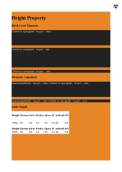

## HANGING-PUNCTUATION

[📄 Input HTML](/html/CSS%20Properties/H/hanging-punctuation.html)

### Output PDF

| mPDF | typeset.sh | PDFreactor |
|---------|---------|---------|
|  |  |  |
| [📕 mPDF Output](mpdf__html_CSS_Properties_H_hanging-punctuation.html.pdf) | [📕 typeset Output](typeset__html_CSS_Properties_H_hanging-punctuation.html.pdf) | [📕 PDFreactor Output](pdfreactor__html_CSS_Properties_H_hanging-punctuation.html.pdf) |

## HEIGHT

[📄 Input HTML](/html/CSS%20Properties/H/height.html)

### Output PDF

| mPDF | typeset.sh | PDFreactor |
|---------|---------|---------|
|  |  |  |
| [📕 mPDF Output](mpdf__html_CSS_Properties_H_height.html.pdf) | [📕 typeset Output](typeset__html_CSS_Properties_H_height.html.pdf) | [📕 PDFreactor Output](pdfreactor__html_CSS_Properties_H_height.html.pdf) |

## HYPHENS

[📄 Input HTML](/html/CSS%20Properties/H/hyphens.html)

### Output PDF

| mPDF | typeset.sh | PDFreactor |
|---------|---------|---------|
|  |  |  |
| [📕 mPDF Output](mpdf__html_CSS_Properties_H_hyphens.html.pdf) | [📕 typeset Output](typeset__html_CSS_Properties_H_hyphens.html.pdf) | [📕 PDFreactor Output](pdfreactor__html_CSS_Properties_H_hyphens.html.pdf) |

