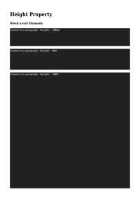

## 🔬 HANGING-PUNCTUATION

### Input HTML & CSS

[📄 Input HTML](https://raw.githubusercontent.com/azettl/compare.html2pdf.tools/master//html/CSS%20Properties/H/hanging-punctuation.html)

    

        View HANGING-PUNCTUATION Code
    

    <pre><code class="hljs xml">&lt;!DOCTYPE html&gt;
&lt;!-- Sample from https://css-tricks.com/almanac/properties/h/hanging-punctuation/ --&gt;
&lt;html lang="en"&gt;
    &lt;head&gt;
        &lt;style&gt;
        blockquote {
  font-style: italic;
  font-size: 2rem;
  width: 20em;
  border-left: 1px solid #ddd;
  padding: 3rem 0;
  
  hanging-punctuation: first;
}
        &lt;/style&gt;
    &lt;/head&gt;
    &lt;body&gt;
        &lt;blockquote&gt;
            “Let your tears flow, but let them also cease. Let deepest sighs be drawn from your breast, but let them also find an end.” — Seneca
          &lt;/blockquote&gt;
    &lt;/body&gt;
&lt;/html&gt;</code><button class='button-code-copy'>📋 Copy Code</button></pre>

### Output PDF

| mPDF | typeset.sh | PDFreactor |
|---------|---------|---------|
|  |  |  |
| [📕 mPDF Output](mpdf__html_CSS_Properties_H_hanging-punctuation.html.pdf) | [📕 typeset Output](typeset__html_CSS_Properties_H_hanging-punctuation.html.pdf) | [📕 PDFreactor Output](pdfreactor__html_CSS_Properties_H_hanging-punctuation.html.pdf) |

## 🔬 HEIGHT

### Input HTML & CSS

[📄 Input HTML](https://raw.githubusercontent.com/azettl/compare.html2pdf.tools/master//html/CSS%20Properties/H/height.html)

    

        View HEIGHT Code
    

    <pre><code class="hljs xml">&lt;!DOCTYPE html&gt;
&lt;!-- Sample from https://css-tricks.com/almanac/properties/h/height/ --&gt;
&lt;html lang="en"&gt;
    &lt;head&gt;
        &lt;style&gt;
        html {
  background: #e78629;
}

p {
  background: #212121;
  color: #FFF;
}

p.heightpx {
  height: 100px;
}

p.heightem {
  height: 8em;
}

p.heightpercent {
  height: 100%;
  /* height value determined by content */
}

.nesting {
  background: white;
}

.nesting.example1 {
  height: 100px;
}
.nesting.example1 .heightnested {
  height: 100%;
  /* fills the available space of the containing parent element*/
}

.nesting.example2 {
  height: 100%;
}
.nesting.example2 .heightnested {
  height: auto;
  /* fills the available space of the containing parent element*/
}

table {
  float: left;
  margin-right: .5em;
  background: white;
}

.table-example1 {
  height: 100px;
}

.table-example2 {
  height: 100%;
}

        &lt;/style&gt;
    &lt;/head&gt;
    &lt;body&gt;
        &lt;h1&gt;Height Property&lt;/h1&gt;
        &lt;h3&gt;Block Level Elements&lt;/h3&gt;
        &lt;p class="heightpx"&gt;Content in a paragraph : &lt;code&gt;height: 100px&lt;/code&gt;&lt;/p&gt;
        
        &lt;p class="heightem"&gt;Content in a paragraph : &lt;code&gt;height: 8em&lt;/code&gt;&lt;/p&gt;
        
        &lt;p class="heightpercent"&gt;Content in a paragraph : &lt;code&gt;height: 100%&lt;/code&gt;&lt;/p&gt;
        
        &lt;h3&gt;Elements Contained&lt;/h3&gt;
        &lt;div class="nesting example1"&gt;
          &lt;p class="heightnested"&gt;Containing element : &lt;code&gt;height: 100px&lt;/code&gt;.  Content in a paragraph : &lt;code&gt;height: 100%&lt;/code&gt;&lt;/p&gt;
        &lt;/div&gt;
        
        &lt;div class="nesting example2"&gt;
          &lt;p class="heightnested"&gt;Containing element : &lt;code&gt;height: 100%&lt;/code&gt;.  Content in a paragraph : &lt;code&gt;height: auto&lt;/code&gt;&lt;/p&gt;
        &lt;/div&gt;
        
        &lt;h3&gt;Table Height&lt;/h3&gt;
        &lt;table class="browser-support-table table-example1"&gt;
                &lt;thead&gt;
                    &lt;tr&gt;
                &lt;th&gt;Height&lt;/th&gt;
                        &lt;th class="chrome"&gt;&lt;span&gt;Chrome&lt;/span&gt;&lt;/th&gt;
                        &lt;th class="safari"&gt;&lt;span&gt;Safari&lt;/span&gt;&lt;/th&gt;
                        &lt;th class="firefox"&gt;&lt;span&gt;Firefox&lt;/span&gt;&lt;/th&gt;
                        &lt;th class="opera"&gt;&lt;span&gt;Opera&lt;/span&gt;&lt;/th&gt;
                        &lt;th class="ie"&gt;&lt;span&gt;IE&lt;/span&gt;&lt;/th&gt;
                        &lt;th class="android"&gt;&lt;span&gt;Android&lt;/span&gt;&lt;/th&gt;
                        &lt;th class="iOS"&gt;&lt;span&gt;iOS&lt;/span&gt;&lt;/th&gt;
                    &lt;/tr&gt;
                &lt;/thead&gt;
                &lt;tbody&gt;
                    &lt;tr&gt;
                &lt;td&gt;100px&lt;/td&gt;
                        &lt;td class="yep-nope"&gt;All&lt;/td&gt;
                        &lt;td class="yep-nope"&gt;All&lt;/td&gt;
                        &lt;td class="yep-nope"&gt;All&lt;/td&gt;
                        &lt;td class="yep-nope"&gt;All&lt;/td&gt;
                        &lt;td class="yep-nope"&gt;All&lt;/td&gt;
                        &lt;td class="yep-nope"&gt;All&lt;/td&gt;
                        &lt;td class="yep-nope"&gt;All&lt;/td&gt;
                    &lt;/tr&gt;
                &lt;/tbody&gt;
            &lt;/table&gt;
        
        &lt;table class="browser-support-table table-example2"&gt;
                &lt;thead&gt;
                    &lt;tr&gt;
                &lt;th&gt;Height&lt;/th&gt;
                        &lt;th class="chrome"&gt;&lt;span&gt;Chrome&lt;/span&gt;&lt;/th&gt;
                        &lt;th class="safari"&gt;&lt;span&gt;Safari&lt;/span&gt;&lt;/th&gt;
                        &lt;th class="firefox"&gt;&lt;span&gt;Firefox&lt;/span&gt;&lt;/th&gt;
                        &lt;th class="opera"&gt;&lt;span&gt;Opera&lt;/span&gt;&lt;/th&gt;
                        &lt;th class="ie"&gt;&lt;span&gt;IE&lt;/span&gt;&lt;/th&gt;
                        &lt;th class="android"&gt;&lt;span&gt;Android&lt;/span&gt;&lt;/th&gt;
                        &lt;th class="iOS"&gt;&lt;span&gt;iOS&lt;/span&gt;&lt;/th&gt;
                    &lt;/tr&gt;
                &lt;/thead&gt;
                &lt;tbody&gt;
                    &lt;tr&gt;
                &lt;td&gt;100%&lt;/td&gt;
                        &lt;td class="yep-nope"&gt;All&lt;/td&gt;
                        &lt;td class="yep-nope"&gt;All&lt;/td&gt;
                        &lt;td class="yep-nope"&gt;All&lt;/td&gt;
                        &lt;td class="yep-nope"&gt;All&lt;/td&gt;
                        &lt;td class="yep-nope"&gt;All&lt;/td&gt;
                        &lt;td class="yep-nope"&gt;All&lt;/td&gt;
                        &lt;td class="yep-nope"&gt;All&lt;/td&gt;
                    &lt;/tr&gt;
                &lt;/tbody&gt;
            &lt;/table&gt;
    &lt;/body&gt;
&lt;/html&gt;</code><button class='button-code-copy'>📋 Copy Code</button></pre>

### Output PDF

| mPDF | typeset.sh | PDFreactor |
|---------|---------|---------|
|  |  |  |
| [📕 mPDF Output](mpdf__html_CSS_Properties_H_height.html.pdf) | [📕 typeset Output](typeset__html_CSS_Properties_H_height.html.pdf) | [📕 PDFreactor Output](pdfreactor__html_CSS_Properties_H_height.html.pdf) |

## 🔬 HYPHENS

### Input HTML & CSS

[📄 Input HTML](https://raw.githubusercontent.com/azettl/compare.html2pdf.tools/master//html/CSS%20Properties/H/hyphens.html)

    

        View HYPHENS Code
    

    <pre><code class="hljs xml">&lt;!DOCTYPE html&gt;
&lt;!-- Sample from https://css-tricks.com/almanac/properties/h/hyphenate/ --&gt;
&lt;html lang="en"&gt;
    &lt;head&gt;
        &lt;style&gt;
        article {
  max-width: 500px;
  margin: 0 auto;
  width: 100%;
  text-align: justify;
}

article p {
  -webkit-hyphens: auto;
  -moz-hyphens: auto;
  -ms-hyphens: auto;
  hyphens: auto;
}
        &lt;/style&gt;
    &lt;/head&gt;
    &lt;body&gt;
        &lt;article lang="en"&gt;
            &lt;p&gt;As designers attempting to creating functional work, oftentimes we are required to make our designs look as finished as possible.&lt;/p&gt;
            &lt;p&gt;For example, if you are designing a brand new website for someone, most times you will have to make sure the prototype looks finished by inserting text or photos or what have you. The purpose of this is so the person viewing the prototype has a chance to actually feel and understand the idea behind what you have created.&lt;/p&gt;
            &lt;p&gt;Now in some circumstances, designers may use squares and rectangles to help you visualize what should and could be in a specific location.&lt;/p&gt;
            &lt;p&gt;We all have our own techniques, but one of the most effective techniques is to actually put some text where text goes and some pictures where pictures go to make sure everyone can see the vision you’ve created.&lt;/p&gt;
            &lt;p&gt;Coming up with filler text on the fly is not easy, but it is becoming more and more of a requirement. Fortunately, some designers and developers around the web know this and have put together a bunch of text generators to help you present your vision.&lt;/p&gt;
            &lt;p&gt;Some are standard (like the always popular ‘Lorem Ipsum’ generators) and some are really fun. Either way, pick one of your favorites from below and start generating text and completing your vision.&lt;/p&gt;
            &lt;p&gt;&lt;em&gt;From &lt;a href="http://www.webdesignerdepot.com/2012/03/15-dummy-text-generators-you-should-know/"&gt;this article&lt;/a&gt; on WebDesignerDepot.&lt;/em&gt;&lt;/p&gt;
          &lt;/article&gt;
    &lt;/body&gt;
&lt;/html&gt;</code><button class='button-code-copy'>📋 Copy Code</button></pre>

### Output PDF

| mPDF | typeset.sh | PDFreactor |
|---------|---------|---------|
|  |  |  |
| [📕 mPDF Output](mpdf__html_CSS_Properties_H_hyphens.html.pdf) | [📕 typeset Output](typeset__html_CSS_Properties_H_hyphens.html.pdf) | [📕 PDFreactor Output](pdfreactor__html_CSS_Properties_H_hyphens.html.pdf) |

