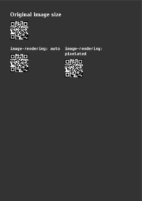
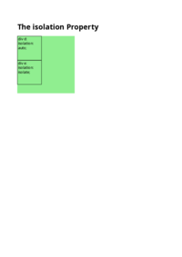
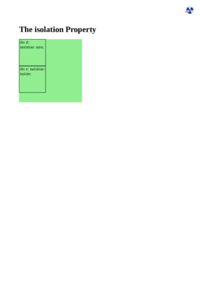

## IMAGE-RENDERING

[📄 Input HTML](/html/CSS%20Properties/I/image-rendering.html):

| mPDF | typeset.sh | PDFreactor |
|---------|---------|---------|
|  [📕 mPDF Output](mpdf__html_CSS_Properties_I_image-rendering.html.pdf) |  [📕 typeset Output](typeset__html_CSS_Properties_I_image-rendering.html.pdf) |  [📕 PDFreactor Output](pdfreactor__html_CSS_Properties_I_image-rendering.html.pdf)

## INITIAL-LETTER

[📄 Input HTML](/html/CSS%20Properties/I/initial-letter.html):

| mPDF | typeset.sh | PDFreactor |
|---------|---------|---------|
|  [📕 mPDF Output](mpdf__html_CSS_Properties_I_initial-letter.html.pdf) |  [📕 typeset Output](typeset__html_CSS_Properties_I_initial-letter.html.pdf) |  [📕 PDFreactor Output](pdfreactor__html_CSS_Properties_I_initial-letter.html.pdf)

## ISOLATION

[📄 Input HTML](/html/CSS%20Properties/I/isolation.html):

| mPDF | typeset.sh | PDFreactor |
|---------|---------|---------|
|  [📕 mPDF Output](mpdf__html_CSS_Properties_I_isolation.html.pdf) |  [📕 typeset Output](typeset__html_CSS_Properties_I_isolation.html.pdf) |  [📕 PDFreactor Output](pdfreactor__html_CSS_Properties_I_isolation.html.pdf)

