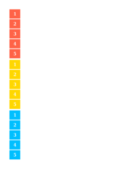
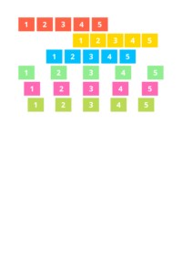
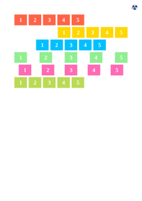
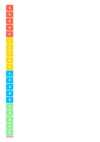

## 🔬 JUSTIFY-CONTENT

### Input HTML & CSS

[📄 View Input HTML on GitHub](https://raw.githubusercontent.com/azettl/compare.html2pdf.tools/master//html/CSS%20Properties/J/justify-content.html){:target="_blank"}

    

        View JUSTIFY-CONTENT Code
    

    <pre><code class="hljs xml">&lt;!DOCTYPE html&gt;
&lt;!-- Sample from https://css-tricks.com/almanac/properties/j/justify-content/ --&gt;
&lt;html lang="en"&gt;
    &lt;head&gt;
        &lt;style&gt;
        .flex-container {
  padding: 0;
  margin: 0;
  list-style: none;
  display: flex;
}

.flex-start { 
  justify-content: flex-start; 
}

.flex-end { 
  justify-content: flex-end; 
}  
.flex-end li {
  background: gold;
}

.center { 
  justify-content: center; 
}  
.center li {
  background: deepskyblue;
}

.space-between { 
  justify-content: space-between; 
}  
.space-between li {
  background: lightgreen;
}

.space-around { 
  justify-content: space-around; 
}
.space-around li {
  background: hotpink; 
}

.space-evenly { 
  justify-content: space-evenly; 
}
.space-evenly li {
  background: #bada55; 
}

.flex-item {
  background: tomato;
  padding: 5px;
  width: 60px;
  height: 50px;
  margin: 5px;
  line-height: 50px;
  color: white;
  font-weight: bold;
  font-size: 2em;
  text-align: center;
}
        &lt;/style&gt;
    &lt;/head&gt;
    &lt;body&gt;
        &lt;ul class="flex-container flex-start"&gt;
            &lt;li class="flex-item"&gt;1&lt;/li&gt;
            &lt;li class="flex-item"&gt;2&lt;/li&gt;
            &lt;li class="flex-item"&gt;3&lt;/li&gt;
            &lt;li class="flex-item"&gt;4&lt;/li&gt;
            &lt;li class="flex-item"&gt;5&lt;/li&gt;
          &lt;/ul&gt;
          
          &lt;ul class="flex-container flex-end"&gt;
            &lt;li class="flex-item"&gt;1&lt;/li&gt;
            &lt;li class="flex-item"&gt;2&lt;/li&gt;
            &lt;li class="flex-item"&gt;3&lt;/li&gt;
            &lt;li class="flex-item"&gt;4&lt;/li&gt;
            &lt;li class="flex-item"&gt;5&lt;/li&gt;
          &lt;/ul&gt;
          
          &lt;ul class="flex-container center"&gt;
            &lt;li class="flex-item"&gt;1&lt;/li&gt;
            &lt;li class="flex-item"&gt;2&lt;/li&gt;
            &lt;li class="flex-item"&gt;3&lt;/li&gt;
            &lt;li class="flex-item"&gt;4&lt;/li&gt;
            &lt;li class="flex-item"&gt;5&lt;/li&gt;
          &lt;/ul&gt;
          
          &lt;ul class="flex-container space-between"&gt;
            &lt;li class="flex-item"&gt;1&lt;/li&gt;
            &lt;li class="flex-item"&gt;2&lt;/li&gt;
            &lt;li class="flex-item"&gt;3&lt;/li&gt;
            &lt;li class="flex-item"&gt;4&lt;/li&gt;
            &lt;li class="flex-item"&gt;5&lt;/li&gt;
          &lt;/ul&gt;
          
          &lt;ul class="flex-container space-around"&gt;
            &lt;li class="flex-item"&gt;1&lt;/li&gt;
            &lt;li class="flex-item"&gt;2&lt;/li&gt;
            &lt;li class="flex-item"&gt;3&lt;/li&gt;
            &lt;li class="flex-item"&gt;4&lt;/li&gt;
            &lt;li class="flex-item"&gt;5&lt;/li&gt;
          &lt;/ul&gt;
          
          &lt;ul class="flex-container space-evenly"&gt;
            &lt;li class="flex-item"&gt;1&lt;/li&gt;
            &lt;li class="flex-item"&gt;2&lt;/li&gt;
            &lt;li class="flex-item"&gt;3&lt;/li&gt;
            &lt;li class="flex-item"&gt;4&lt;/li&gt;
            &lt;li class="flex-item"&gt;5&lt;/li&gt;
          &lt;/ul&gt;
    &lt;/body&gt;
&lt;/html&gt;</code></pre>

### Output PDF

| mPDF | typeset.sh | PDFreactor | wkhtmltopdf
|---------|---------|---------|---------|
|  |  |  |  |
| [📕 mPDF Output](mpdf__html_CSS_Properties_J_justify-content.html.pdf){:target="_blank"} | [📕 typeset Output](typeset__html_CSS_Properties_J_justify-content.html.pdf){:target="_blank"} | [📕 PDFreactor Output](pdfreactor__html_CSS_Properties_J_justify-content.html.pdf){:target="_blank"} | [📕 wkhtmltopdf Output](wkhtmltopdf__html_CSS_Properties_J_justify-content.html.pdf){:target="_blank"} |

