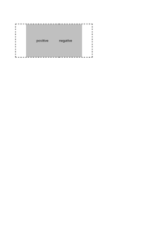

## LEFT

See the Rendering results for [left.html](/html/CSS%20Properties/L/left.html):

### mPDF
 

Link to PDF: [mpdf__html_CSS_Properties_L_left.html.pdf](mpdf__html_CSS_Properties_L_left.html.pdf)

### typeset.sh
 

Link to PDF: [typeset__html_CSS_Properties_L_left.html.pdf](typeset__html_CSS_Properties_L_left.html.pdf)

### PDFreactor
 

Link to PDF: [pdfreactor__html_CSS_Properties_L_left.html.pdf](pdfreactor__html_CSS_Properties_L_left.html.pdf)

## LETTER-SPACING

See the Rendering results for [letter-spacing.html](/html/CSS%20Properties/L/letter-spacing.html):

### mPDF
 

Link to PDF: [mpdf__html_CSS_Properties_L_letter-spacing.html.pdf](mpdf__html_CSS_Properties_L_letter-spacing.html.pdf)

### typeset.sh
 

Link to PDF: [typeset__html_CSS_Properties_L_letter-spacing.html.pdf](typeset__html_CSS_Properties_L_letter-spacing.html.pdf)

### PDFreactor
 

Link to PDF: [pdfreactor__html_CSS_Properties_L_letter-spacing.html.pdf](pdfreactor__html_CSS_Properties_L_letter-spacing.html.pdf)

## LINE-HEIGHT

See the Rendering results for [line-height.html](/html/CSS%20Properties/L/line-height.html):

### mPDF
 

Link to PDF: [mpdf__html_CSS_Properties_L_line-height.html.pdf](mpdf__html_CSS_Properties_L_line-height.html.pdf)

### typeset.sh
 

Link to PDF: [typeset__html_CSS_Properties_L_line-height.html.pdf](typeset__html_CSS_Properties_L_line-height.html.pdf)

### PDFreactor
 

Link to PDF: [pdfreactor__html_CSS_Properties_L_line-height.html.pdf](pdfreactor__html_CSS_Properties_L_line-height.html.pdf)

## LIST-STYLE

See the Rendering results for [list-style.html](/html/CSS%20Properties/L/list-style.html):

### mPDF
 

Link to PDF: [mpdf__html_CSS_Properties_L_list-style.html.pdf](mpdf__html_CSS_Properties_L_list-style.html.pdf)

### typeset.sh
 

Link to PDF: [typeset__html_CSS_Properties_L_list-style.html.pdf](typeset__html_CSS_Properties_L_list-style.html.pdf)

### PDFreactor
 

Link to PDF: [pdfreactor__html_CSS_Properties_L_list-style.html.pdf](pdfreactor__html_CSS_Properties_L_list-style.html.pdf)

