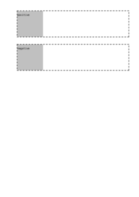

## 🔬 LEFT

### Input HTML & CSS

[📄 Input HTML](https://raw.githubusercontent.com/azettl/compare.html2pdf.tools/master//html/CSS%20Properties/L/left.html)

    

        View LEFT Code
    

    <pre>
        <code>
            &lt;!DOCTYPE html&gt;
&lt;!-- Sample from https://css-tricks.com/almanac/properties/t/top-right-bottom-left/ --&gt;
&lt;html lang=&quot;en&quot;&gt;
    &lt;head&gt;
        &lt;style&gt;
        body {
  padding: 40px 0;
}

.box {
  width: 10rem;
  height: 10rem;
  display: flex;
  justify-content: center;
  align-items: center;
  background-color: Silver;
  position: relative;
}

.box--positive {
  left: 50px;
}

.box--negative {
  left: -50px;
}

.outline {
  display: inline-block;
  border: 2px dashed black;
  margin: 40px 0 0 40px;
}
        &lt;/style&gt;
    &lt;/head&gt;
    &lt;body&gt;
        &lt;div class=&quot;outline&quot;&gt;
            &lt;div class=&quot;box box--positive&quot;&gt;
              &lt;pre&gt;positive&lt;/pre&gt;
            &lt;/div&gt;
          &lt;/div&gt;
          
          &lt;div class=&quot;outline&quot;&gt;
            &lt;div class=&quot;box box--negative&quot;&gt;
              &lt;pre&gt;negative&lt;/pre&gt;
            &lt;/div&gt;
          &lt;/div&gt;
    &lt;/body&gt;
&lt;/html&gt;
        </code>
    </pre>

### Output PDF

| mPDF | typeset.sh | PDFreactor |
|---------|---------|---------|
|  |  |  |
| [📕 mPDF Output](mpdf__html_CSS_Properties_L_left.html.pdf) | [📕 typeset Output](typeset__html_CSS_Properties_L_left.html.pdf) | [📕 PDFreactor Output](pdfreactor__html_CSS_Properties_L_left.html.pdf) |

## 🔬 LETTER-SPACING

### Input HTML & CSS

[📄 Input HTML](https://raw.githubusercontent.com/azettl/compare.html2pdf.tools/master//html/CSS%20Properties/L/letter-spacing.html)

    

        View LETTER-SPACING Code
    

    <pre>
        <code>
            &lt;!DOCTYPE html&gt;
&lt;!-- Sample from https://css-tricks.com/almanac/properties/l/letter-spacing/ --&gt;
&lt;html lang=&quot;en&quot;&gt;
    &lt;head&gt;
        &lt;style&gt;
        .loose {
  letter-spacing: 2px;
}
.tight {
  letter-spacing: -1px;
}
        &lt;/style&gt;
    &lt;/head&gt;
    &lt;body&gt;
        &lt;p&gt;This type has no additional letter-spacing applied.&lt;/p&gt;

        &lt;p class=&quot;loose&quot;&gt;This type is letter-spaced loosely at &lt;code&gt;2px&lt;/code&gt;.&lt;/p&gt;
        
        &lt;p class=&quot;tight&quot;&gt;This type is letter-spaced tightly at &lt;code&gt;-1px&lt;/code&gt;&lt;/p&gt;
    &lt;/body&gt;
&lt;/html&gt;
        </code>
    </pre>

### Output PDF

| mPDF | typeset.sh | PDFreactor |
|---------|---------|---------|
|  |  |  |
| [📕 mPDF Output](mpdf__html_CSS_Properties_L_letter-spacing.html.pdf) | [📕 typeset Output](typeset__html_CSS_Properties_L_letter-spacing.html.pdf) | [📕 PDFreactor Output](pdfreactor__html_CSS_Properties_L_letter-spacing.html.pdf) |

## 🔬 LINE-HEIGHT

### Input HTML & CSS

[📄 Input HTML](https://raw.githubusercontent.com/azettl/compare.html2pdf.tools/master//html/CSS%20Properties/L/line-height.html)

    

        View LINE-HEIGHT Code
    

    <pre>
        <code>
            &lt;!DOCTYPE html&gt;
&lt;!-- Sample from https://css-tricks.com/almanac/properties/l/line-height/ --&gt;
&lt;html lang=&quot;en&quot;&gt;
    &lt;head&gt;
        &lt;style&gt;
        body {
  line-height: 1;
  font-size: 20px;
}

p {
  margin: 20px auto;
  max-width: 600px;
}

.p1 {
  line-height: 150%;
}

.p2 {
  line-height: 200%;
}

.p3 {
  line-height: 250%;
}
        &lt;/style&gt;
    &lt;/head&gt;
    &lt;body&gt;
        &lt;p class=&quot;p1&quot;&gt;&lt;strong&gt;Paragraph 1:&lt;/strong&gt; Pellentesque habitant morbi tristique senectus et netus et malesuada fames ac turpis egestas.&lt;/p&gt;

        &lt;p class=&quot;p2&quot;&gt;&lt;strong&gt;Paragraph 2:&lt;/strong&gt; Pellentesque habitant morbi tristique senectus et netus et malesuada fames ac turpis egestas.&lt;/p&gt;
        
        &lt;p class=&quot;p3&quot;&gt;&lt;strong&gt;Paragraph 3:&lt;/strong&gt; Pellentesque habitant morbi tristique senectus et netus et malesuada fames ac turpis egestas.&lt;/p&gt;
    &lt;/body&gt;
&lt;/html&gt;
        </code>
    </pre>

### Output PDF

| mPDF | typeset.sh | PDFreactor |
|---------|---------|---------|
|  |  |  |
| [📕 mPDF Output](mpdf__html_CSS_Properties_L_line-height.html.pdf) | [📕 typeset Output](typeset__html_CSS_Properties_L_line-height.html.pdf) | [📕 PDFreactor Output](pdfreactor__html_CSS_Properties_L_line-height.html.pdf) |

## 🔬 LIST-STYLE

### Input HTML & CSS

[📄 Input HTML](https://raw.githubusercontent.com/azettl/compare.html2pdf.tools/master//html/CSS%20Properties/L/list-style.html)

    

        View LIST-STYLE Code
    

    <pre>
        <code>
            &lt;!DOCTYPE html&gt;
&lt;!-- Sample from https://css-tricks.com/almanac/properties/l/list-style/ --&gt;
&lt;html lang=&quot;en&quot;&gt;
    &lt;head&gt;
        &lt;style&gt;
        ul:nth-of-type(1) {
  list-style-type: disc;
}

ul:nth-of-type(2) {
  list-style-type: circle;
}

ul:nth-of-type(3) {
  list-style-type: square;
}

ul:nth-of-type(4) {
  list-style-type: decimal;
}

ul:nth-of-type(5) {
  list-style-type: decimal-leading-zero;
}

ul:nth-of-type(6) {
  list-style-type: lower-roman;
}

ul:nth-of-type(7) {
  list-style-type: upper-roman;
}

ul:nth-of-type(8) {
  list-style-type: lower-greek;
}

ul:nth-of-type(9) {
  list-style-type: lower-latin;
}

ul:nth-of-type(10) {
  list-style-type: upper-latin;
}

ul:nth-of-type(11) {
  list-style-type: armenian;
}

ul:nth-of-type(12) {
  list-style-type: georgian;
}

ul:nth-of-type(13) {
  list-style-type: lower-alpha;
}

ul:nth-of-type(14) {
  list-style-type: upper-alpha;
}

ul:nth-of-type(15) {
  list-style-type: none;
}
        &lt;/style&gt;
    &lt;/head&gt;
    &lt;body&gt;
        &lt;ul&gt;
            &lt;li&gt;Item&lt;/li&gt;
            &lt;li&gt;Item&lt;/li&gt;
            &lt;li&gt;Item&lt;/li&gt;  
          &lt;/ul&gt;
          
          &lt;ul&gt;
            &lt;li&gt;Item&lt;/li&gt;
            &lt;li&gt;Item&lt;/li&gt;
            &lt;li&gt;Item&lt;/li&gt;  
          &lt;/ul&gt;
          
          &lt;ul&gt;
            &lt;li&gt;Item&lt;/li&gt;
            &lt;li&gt;Item&lt;/li&gt;
            &lt;li&gt;Item&lt;/li&gt;  
          &lt;/ul&gt;
          
          &lt;ul&gt;
            &lt;li&gt;Item&lt;/li&gt;
            &lt;li&gt;Item&lt;/li&gt;
            &lt;li&gt;Item&lt;/li&gt;  
          &lt;/ul&gt;
          
          &lt;ul&gt;
            &lt;li&gt;Item&lt;/li&gt;
            &lt;li&gt;Item&lt;/li&gt;
            &lt;li&gt;Item&lt;/li&gt;  
          &lt;/ul&gt;
          
          &lt;ul&gt;
            &lt;li&gt;Item&lt;/li&gt;
            &lt;li&gt;Item&lt;/li&gt;
            &lt;li&gt;Item&lt;/li&gt;  
          &lt;/ul&gt;
          
          &lt;ul&gt;
            &lt;li&gt;Item&lt;/li&gt;
            &lt;li&gt;Item&lt;/li&gt;
            &lt;li&gt;Item&lt;/li&gt;  
          &lt;/ul&gt;
          
          &lt;ul&gt;
            &lt;li&gt;Item&lt;/li&gt;
            &lt;li&gt;Item&lt;/li&gt;
            &lt;li&gt;Item&lt;/li&gt;  
          &lt;/ul&gt;
          
          &lt;ul&gt;
            &lt;li&gt;Item&lt;/li&gt;
            &lt;li&gt;Item&lt;/li&gt;
            &lt;li&gt;Item&lt;/li&gt;  
          &lt;/ul&gt;
          
          &lt;ul&gt;
            &lt;li&gt;Item&lt;/li&gt;
            &lt;li&gt;Item&lt;/li&gt;
            &lt;li&gt;Item&lt;/li&gt;  
          &lt;/ul&gt;
          
          &lt;ul&gt;
            &lt;li&gt;Item&lt;/li&gt;
            &lt;li&gt;Item&lt;/li&gt;
            &lt;li&gt;Item&lt;/li&gt;  
          &lt;/ul&gt;
          
          &lt;ul&gt;
            &lt;li&gt;Item&lt;/li&gt;
            &lt;li&gt;Item&lt;/li&gt;
            &lt;li&gt;Item&lt;/li&gt;  
          &lt;/ul&gt;
          
          &lt;ul&gt;
            &lt;li&gt;Item&lt;/li&gt;
            &lt;li&gt;Item&lt;/li&gt;
            &lt;li&gt;Item&lt;/li&gt;  
          &lt;/ul&gt;
          
          &lt;ul&gt;
            &lt;li&gt;Item&lt;/li&gt;
            &lt;li&gt;Item&lt;/li&gt;
            &lt;li&gt;Item&lt;/li&gt;  
          &lt;/ul&gt;
          
          &lt;ul&gt;
            &lt;li&gt;Item&lt;/li&gt;
            &lt;li&gt;Item&lt;/li&gt;
            &lt;li&gt;Item&lt;/li&gt;  
          &lt;/ul&gt;
    &lt;/body&gt;
&lt;/html&gt;
        </code>
    </pre>

### Output PDF

| mPDF | typeset.sh | PDFreactor |
|---------|---------|---------|
|  |  |  |
| [📕 mPDF Output](mpdf__html_CSS_Properties_L_list-style.html.pdf) | [📕 typeset Output](typeset__html_CSS_Properties_L_list-style.html.pdf) | [📕 PDFreactor Output](pdfreactor__html_CSS_Properties_L_list-style.html.pdf) |

