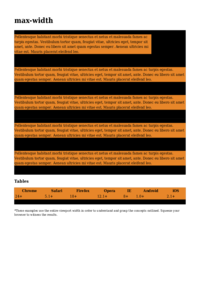
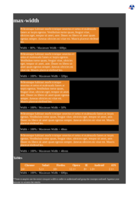
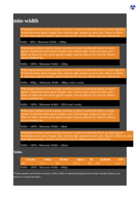

# M
HTML File | mPDF Result | typeset.sh Result | PDFreactor Result
------------ | ------------- | ------------- | -------------
[margin.html](/html/CSS%20Properties/M/margin.html) |  [mpdf__html_CSS_Properties_M_margin.html.pdf](mpdf__html_CSS_Properties_M_margin.html.pdf) |  [typeset__html_CSS_Properties_M_margin.html.pdf](typeset__html_CSS_Properties_M_margin.html.pdf) |  [pdfreactor__html_CSS_Properties_M_margin.html.pdf](pdfreactor__html_CSS_Properties_M_margin.html.pdf)
[mask-image.html](/html/CSS%20Properties/M/mask-image.html) |  [mpdf__html_CSS_Properties_M_mask-image.html.pdf](mpdf__html_CSS_Properties_M_mask-image.html.pdf) |  [typeset__html_CSS_Properties_M_mask-image.html.pdf](typeset__html_CSS_Properties_M_mask-image.html.pdf) |  [pdfreactor__html_CSS_Properties_M_mask-image.html.pdf](pdfreactor__html_CSS_Properties_M_mask-image.html.pdf)
[mask-repeat.html](/html/CSS%20Properties/M/mask-repeat.html) |  [mpdf__html_CSS_Properties_M_mask-repeat.html.pdf](mpdf__html_CSS_Properties_M_mask-repeat.html.pdf) |  [typeset__html_CSS_Properties_M_mask-repeat.html.pdf](typeset__html_CSS_Properties_M_mask-repeat.html.pdf) |  [pdfreactor__html_CSS_Properties_M_mask-repeat.html.pdf](pdfreactor__html_CSS_Properties_M_mask-repeat.html.pdf)
[max-height.html](/html/CSS%20Properties/M/max-height.html) |  [mpdf__html_CSS_Properties_M_max-height.html.pdf](mpdf__html_CSS_Properties_M_max-height.html.pdf) |  [typeset__html_CSS_Properties_M_max-height.html.pdf](typeset__html_CSS_Properties_M_max-height.html.pdf) |  [pdfreactor__html_CSS_Properties_M_max-height.html.pdf](pdfreactor__html_CSS_Properties_M_max-height.html.pdf)
[max-width.html](/html/CSS%20Properties/M/max-width.html) |  [mpdf__html_CSS_Properties_M_max-width.html.pdf](mpdf__html_CSS_Properties_M_max-width.html.pdf) |  [typeset__html_CSS_Properties_M_max-width.html.pdf](typeset__html_CSS_Properties_M_max-width.html.pdf) |  [pdfreactor__html_CSS_Properties_M_max-width.html.pdf](pdfreactor__html_CSS_Properties_M_max-width.html.pdf)
[min-height.html](/html/CSS%20Properties/M/min-height.html) |  [mpdf__html_CSS_Properties_M_min-height.html.pdf](mpdf__html_CSS_Properties_M_min-height.html.pdf) |  [typeset__html_CSS_Properties_M_min-height.html.pdf](typeset__html_CSS_Properties_M_min-height.html.pdf) |  [pdfreactor__html_CSS_Properties_M_min-height.html.pdf](pdfreactor__html_CSS_Properties_M_min-height.html.pdf)
[min-width.html](/html/CSS%20Properties/M/min-width.html) |  [mpdf__html_CSS_Properties_M_min-width.html.pdf](mpdf__html_CSS_Properties_M_min-width.html.pdf) |  [typeset__html_CSS_Properties_M_min-width.html.pdf](typeset__html_CSS_Properties_M_min-width.html.pdf) |  [pdfreactor__html_CSS_Properties_M_min-width.html.pdf](pdfreactor__html_CSS_Properties_M_min-width.html.pdf)
[mix-blend-mode.html](/html/CSS%20Properties/M/mix-blend-mode.html) |  [mpdf__html_CSS_Properties_M_mix-blend-mode.html.pdf](mpdf__html_CSS_Properties_M_mix-blend-mode.html.pdf) |  [typeset__html_CSS_Properties_M_mix-blend-mode.html.pdf](typeset__html_CSS_Properties_M_mix-blend-mode.html.pdf) |  [pdfreactor__html_CSS_Properties_M_mix-blend-mode.html.pdf](pdfreactor__html_CSS_Properties_M_mix-blend-mode.html.pdf)
