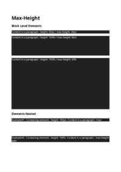
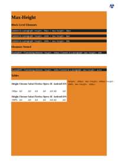
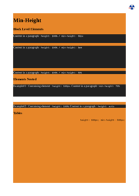

## 🔬 MARGIN

### Input HTML & CSS

[📄 Input HTML](https://raw.githubusercontent.com/azettl/compare.html2pdf.tools/master//html/CSS%20Properties/M/margin.html)

    

        View MARGIN Code
    

    <pre>
        <code>
            &lt;!DOCTYPE html&gt;
&lt;!-- Sample from https://css-tricks.com/almanac/properties/m/margin/ --&gt;
&lt;html lang=&quot;en&quot;&gt;
    &lt;head&gt;
        &lt;style&gt;
        h2 {
    margin: 0 0 20px 0;
}

p {
    margin: 10px 0 0 0;
}
        &lt;/style&gt;
    &lt;/head&gt;
    &lt;body&gt;
        &lt;h2&gt;Collapsing Margins&lt;/h2&gt;
        &lt;p&gt;Example text.&lt;/p&gt;
    &lt;/body&gt;
&lt;/html&gt;
        </code>
    </pre>

### Output PDF

| mPDF | typeset.sh | PDFreactor |
|---------|---------|---------|
|  |  |  |
| [📕 mPDF Output](mpdf__html_CSS_Properties_M_margin.html.pdf) | [📕 typeset Output](typeset__html_CSS_Properties_M_margin.html.pdf) | [📕 PDFreactor Output](pdfreactor__html_CSS_Properties_M_margin.html.pdf) |

## 🔬 MASK-IMAGE

### Input HTML & CSS

[📄 Input HTML](https://raw.githubusercontent.com/azettl/compare.html2pdf.tools/master//html/CSS%20Properties/M/mask-image.html)

    

        View MASK-IMAGE Code
    

    <pre>
        <code>
            &lt;!DOCTYPE html&gt;
&lt;!-- Sample from https://css-tricks.com/almanac/properties/m/mask-image/ --&gt;
&lt;html lang=&quot;en&quot;&gt;
    &lt;head&gt;
        &lt;style&gt;
        * {
  box-sizing: border-box;
}
body {
  margin: 0;
  background: #8f7a66;
}

.el {
  width: 100vw;
  height: 100vh;
  padding: 1rem;

  background-image: url(https://images.unsplash.com/photo-1528287942171-fbe365d1d9ac?ixlib=rb-1.2.1&amp;q=85&amp;fm=jpg&amp;crop=entropy&amp;w=1200&amp;cs=srgb&amp;ixid=eyJhcHBfaWQiOjE0NTg5fQ);
  background-size: contain;
  background-position: center;
  background-repeat: no-repeat;

  mask-image: url(https://s3-us-west-2.amazonaws.com/s.cdpn.io/3/sun.svg);
  mask-size: 100vmin;
  mask-repeat: no-repeat;
  mask-position: center;
}

        &lt;/style&gt;
    &lt;/head&gt;
    &lt;body&gt;
        &lt;div class=&quot;el&quot;&gt;&lt;/div&gt;
    &lt;/body&gt;
&lt;/html&gt;
        </code>
    </pre>

### Output PDF

| mPDF | typeset.sh | PDFreactor |
|---------|---------|---------|
|  |  |  |
| [📕 mPDF Output](mpdf__html_CSS_Properties_M_mask-image.html.pdf) | [📕 typeset Output](typeset__html_CSS_Properties_M_mask-image.html.pdf) | [📕 PDFreactor Output](pdfreactor__html_CSS_Properties_M_mask-image.html.pdf) |

## 🔬 MASK-REPEAT

### Input HTML & CSS

[📄 Input HTML](https://raw.githubusercontent.com/azettl/compare.html2pdf.tools/master//html/CSS%20Properties/M/mask-repeat.html)

    

        View MASK-REPEAT Code
    

    <pre>
        <code>
            &lt;!DOCTYPE html&gt;
&lt;!-- Sample from https://css-tricks.com/almanac/properties/m/mask-repeat/ --&gt;
&lt;html lang=&quot;en&quot;&gt;
    &lt;head&gt;
        &lt;style&gt;
        * {
  box-sizing: border-box;
}
body {
  margin: 0;
  background: #8f7a66;
}

.el {
  width: 100vw;
  height: 100vh;
  padding: 1rem;

  background-image: url(https://images.unsplash.com/photo-1528287942171-fbe365d1d9ac?ixlib=rb-1.2.1&amp;q=85&amp;fm=jpg&amp;crop=entropy&amp;w=1200&amp;cs=srgb&amp;ixid=eyJhcHBfaWQiOjE0NTg5fQ);
  background-size: contain;
  background-position: center;
  background-repeat: no-repeat;

  mask-image: url(https://s3-us-west-2.amazonaws.com/s.cdpn.io/3/sun.svg);
  mask-size: 100vmin;
  mask-repeat: no-repeat;
  mask-position: center;
}

        &lt;/style&gt;
    &lt;/head&gt;
    &lt;body&gt;
        &lt;div class=&quot;el&quot;&gt;&lt;/div&gt;
    &lt;/body&gt;
&lt;/html&gt;
        </code>
    </pre>

### Output PDF

| mPDF | typeset.sh | PDFreactor |
|---------|---------|---------|
|  |  |  |
| [📕 mPDF Output](mpdf__html_CSS_Properties_M_mask-repeat.html.pdf) | [📕 typeset Output](typeset__html_CSS_Properties_M_mask-repeat.html.pdf) | [📕 PDFreactor Output](pdfreactor__html_CSS_Properties_M_mask-repeat.html.pdf) |

## 🔬 MAX-HEIGHT

### Input HTML & CSS

[📄 Input HTML](https://raw.githubusercontent.com/azettl/compare.html2pdf.tools/master//html/CSS%20Properties/M/max-height.html)

    

        View MAX-HEIGHT Code
    

    <pre>
        <code>
            &lt;!DOCTYPE html&gt;
&lt;!-- Sample from https://css-tricks.com/almanac/properties/m/max-height/ --&gt;
&lt;html lang=&quot;en&quot;&gt;
    &lt;head&gt;
        &lt;style&gt;
        html {
  background: #e78629;
}

p {
  background: #212121;
  color: #FFF;
}

.nesting {
  background: white;
}

table {
  float: left;
  margin-right: .5em;
  background: white;
}

p.max-height-px {
  height: 50px;
  max-height: 20px;
}

p.max-height-em {
  height: 100%;
  max-height: 8em;
}

/**
* Two percentages will not produce a result
*/
p.max-height-percent {
  height: 100%;
  max-height: 50%;
}

.nesting.example1 {
  height: 100px;
}
.nesting.example1 .max-heightnested {
  max-height: 20%;
  /* works because height is an absolute length value */
}

.nesting.example2 {
  height: 100%;
}
.nesting.example2 .max-heightnested {
  height: auto;
}

.table-example1 {
  max-height: 800px;
  height: 100px;
}

.table-example2 {
  max-height: 100px;
  height: 100%;
}

        &lt;/style&gt;
    &lt;/head&gt;
    &lt;body&gt;
        &lt;h1&gt;Max-Height&lt;/h1&gt;
        &lt;h3&gt;Block Level Elements&lt;/h3&gt;
        &lt;p class=&quot;max-height-px&quot;&gt;Content in a paragraph : &lt;code&gt;height: 50px / max-height: 20px&lt;/code&gt;&lt;/p&gt;
        
        &lt;p class=&quot;max-height-em&quot;&gt;Content in a paragraph : &lt;code&gt;height: 100% / max-height: 8em&lt;/code&gt;&lt;/p&gt;
        
        &lt;p class=&quot;max-height-percent&quot;&gt;Content in a paragraph : &lt;code&gt;height: 100% / max-height: 50%&lt;/code&gt;&lt;/p&gt;
        
        &lt;h3&gt;Elements Nested&lt;/h3&gt;
        &lt;div class=&quot;nesting example1&quot;&gt;
          &lt;p class=&quot;max-heightnested&quot;&gt;Example#1 : Containing element : &lt;code&gt;height: 100px&lt;/code&gt;.  Content in a paragraph : &lt;code&gt;max-height: 20%&lt;/code&gt;&lt;/p&gt;
        &lt;/div&gt;
        
        &lt;div class=&quot;nesting example2&quot;&gt;
          &lt;p class=&quot;max-heightnested&quot;&gt;Example#2 : Containing element : &lt;code&gt;height: 100%&lt;/code&gt;.  Content in a paragraph : &lt;code&gt;max-height: auto&lt;/code&gt;&lt;/p&gt;
        &lt;/div&gt;
        
        &lt;h3&gt;Tables&lt;/h3&gt;
        &lt;code&gt;height: 100px; max-height: 800px;&lt;/code&gt;
        &lt;table class=&quot;browser-support-table table-example1&quot;&gt;
                &lt;thead&gt;
                    &lt;tr&gt;
                &lt;th&gt;Height&lt;/th&gt;
                        &lt;th class=&quot;chrome&quot;&gt;&lt;span&gt;Chrome&lt;/span&gt;&lt;/th&gt;
                        &lt;th class=&quot;safari&quot;&gt;&lt;span&gt;Safari&lt;/span&gt;&lt;/th&gt;
                        &lt;th class=&quot;firefox&quot;&gt;&lt;span&gt;Firefox&lt;/span&gt;&lt;/th&gt;
                        &lt;th class=&quot;opera&quot;&gt;&lt;span&gt;Opera&lt;/span&gt;&lt;/th&gt;
                        &lt;th class=&quot;ie&quot;&gt;&lt;span&gt;IE&lt;/span&gt;&lt;/th&gt;
                        &lt;th class=&quot;android&quot;&gt;&lt;span&gt;Android&lt;/span&gt;&lt;/th&gt;
                        &lt;th class=&quot;iOS&quot;&gt;&lt;span&gt;iOS&lt;/span&gt;&lt;/th&gt;
                    &lt;/tr&gt;
                &lt;/thead&gt;
                &lt;tbody&gt;
                    &lt;tr&gt;
                &lt;td&gt;100px&lt;/td&gt;
                        &lt;td class=&quot;yep-nope&quot;&gt;All&lt;/td&gt;
                        &lt;td class=&quot;yep-nope&quot;&gt;All&lt;/td&gt;
                        &lt;td class=&quot;yep-nope&quot;&gt;All&lt;/td&gt;
                        &lt;td class=&quot;yep-nope&quot;&gt;All&lt;/td&gt;
                        &lt;td class=&quot;yep-nope&quot;&gt;All&lt;/td&gt;
                        &lt;td class=&quot;yep-nope&quot;&gt;All&lt;/td&gt;
                        &lt;td class=&quot;yep-nope&quot;&gt;All&lt;/td&gt;
                    &lt;/tr&gt;
                &lt;/tbody&gt;
            &lt;/table&gt;
        
        &lt;code&gt;height: 100%; max-height: 100px;&lt;/code&gt;
        &lt;table class=&quot;browser-support-table table-example2&quot;&gt;
                &lt;thead&gt;
                    &lt;tr&gt;
                &lt;th&gt;Height&lt;/th&gt;
                        &lt;th class=&quot;chrome&quot;&gt;&lt;span&gt;Chrome&lt;/span&gt;&lt;/th&gt;
                        &lt;th class=&quot;safari&quot;&gt;&lt;span&gt;Safari&lt;/span&gt;&lt;/th&gt;
                        &lt;th class=&quot;firefox&quot;&gt;&lt;span&gt;Firefox&lt;/span&gt;&lt;/th&gt;
                        &lt;th class=&quot;opera&quot;&gt;&lt;span&gt;Opera&lt;/span&gt;&lt;/th&gt;
                        &lt;th class=&quot;ie&quot;&gt;&lt;span&gt;IE&lt;/span&gt;&lt;/th&gt;
                        &lt;th class=&quot;android&quot;&gt;&lt;span&gt;Android&lt;/span&gt;&lt;/th&gt;
                        &lt;th class=&quot;iOS&quot;&gt;&lt;span&gt;iOS&lt;/span&gt;&lt;/th&gt;
                    &lt;/tr&gt;
                &lt;/thead&gt;
                &lt;tbody&gt;
                    &lt;tr&gt;
                &lt;td&gt;100%&lt;/td&gt;
                        &lt;td class=&quot;yep&quot;&gt;All&lt;/td&gt;
                        &lt;td class=&quot;yep&quot;&gt;All&lt;/td&gt;
                        &lt;td class=&quot;yep&quot;&gt;All&lt;/td&gt;
                        &lt;td class=&quot;yep&quot;&gt;All&lt;/td&gt;
                        &lt;td class=&quot;yep&quot;&gt;All&lt;/td&gt;
                        &lt;td class=&quot;yep&quot;&gt;All&lt;/td&gt;
                        &lt;td class=&quot;yep&quot;&gt;All&lt;/td&gt;
                    &lt;/tr&gt;
                &lt;/tbody&gt;
            &lt;/table&gt;
    &lt;/body&gt;
&lt;/html&gt;
        </code>
    </pre>

### Output PDF

| mPDF | typeset.sh | PDFreactor |
|---------|---------|---------|
|  |  |  |
| [📕 mPDF Output](mpdf__html_CSS_Properties_M_max-height.html.pdf) | [📕 typeset Output](typeset__html_CSS_Properties_M_max-height.html.pdf) | [📕 PDFreactor Output](pdfreactor__html_CSS_Properties_M_max-height.html.pdf) |

## 🔬 MAX-WIDTH

### Input HTML & CSS

[📄 Input HTML](https://raw.githubusercontent.com/azettl/compare.html2pdf.tools/master//html/CSS%20Properties/M/max-width.html)

    

        View MAX-WIDTH Code
    

    <pre>
        <code>
            &lt;!DOCTYPE html&gt;
&lt;!-- Sample from https://css-tricks.com/almanac/properties/m/max-width/ --&gt;
&lt;html lang=&quot;en&quot;&gt;
    &lt;head&gt;
        &lt;style&gt;
        html {
  background: #444444;
  color: #ffffff;
}

.demo {
  background: #000;
}

.max {
  background: #e78629;
}

.max600 {
  width: 80%;
  max-width: 600px;
}

.max320 {
  width: 100%;
  max-width: 320px;
}

.max-percent {
  width: 100%;
  max-width: 50%;
}

.em40 {
  width: 100%;
  max-width: 40em;
}

.rem40 {
  width: 100%;
  max-width: 40rem;
}

.maxtable {
  width: 100%;
  max-width: 600px;
}

        &lt;/style&gt;
    &lt;/head&gt;
    &lt;body&gt;
        &lt;h1&gt;max-width&lt;/h1&gt;

        &lt;figure class=&quot;demo&quot;&gt;
          &lt;p class=&quot;max max600&quot;&gt;Pellentesque habitant morbi tristique senectus et netus et malesuada fames ac turpis egestas. Vestibulum tortor quam, feugiat vitae, ultricies eget, tempor sit amet, ante. Donec eu libero sit amet quam egestas semper. Aenean ultricies mi vitae est. Mauris placerat eleifend leo.&lt;/p&gt;
          &lt;figcaption&gt;Width = 80% / Maximum Width = 600px&lt;/figcaption&gt;
        &lt;/figure&gt;
        
        &lt;figure class=&quot;demo&quot;&gt;
          &lt;p class=&quot;max max320&quot;&gt;Pellentesque habitant morbi tristique senectus et netus et malesuada fames ac turpis egestas. Vestibulum tortor quam, feugiat vitae, ultricies eget, tempor sit amet, ante. Donec eu libero sit amet quam egestas semper. Aenean ultricies mi vitae est. Mauris placerat eleifend leo.&lt;/p&gt;
          &lt;figcaption&gt;Width = 100% / Maximum Width = 320px&lt;/figcaption&gt;
        &lt;/figure&gt;
        
        &lt;figure class=&quot;demo&quot;&gt;
          &lt;p class=&quot;max max-percent&quot;&gt;Pellentesque habitant morbi tristique senectus et netus et malesuada fames ac turpis egestas. Vestibulum tortor quam, feugiat vitae, ultricies eget, tempor sit amet, ante. Donec eu libero sit amet quam egestas semper. Aenean ultricies mi vitae est. Mauris placerat eleifend leo.&lt;/p&gt;
          &lt;figcaption&gt;Width = 100% / Maximum Width = 50%&lt;/figcaption&gt;
        &lt;/figure&gt;
        
        &lt;figure class=&quot;demo&quot;&gt;
          &lt;p class=&quot;max em40&quot;&gt;Pellentesque habitant morbi tristique senectus et netus et malesuada fames ac turpis egestas. Vestibulum tortor quam, feugiat vitae, ultricies eget, tempor sit amet, ante. Donec eu libero sit amet quam egestas semper. Aenean ultricies mi vitae est. Mauris placerat eleifend leo.&lt;/p&gt;
          &lt;figcaption&gt;Width = 100% / Maximum Width = 40em&lt;/figcaption&gt;
        &lt;/figure&gt;
        
        &lt;figure class=&quot;demo&quot;&gt;
          &lt;p class=&quot;max rem40&quot;&gt;Pellentesque habitant morbi tristique senectus et netus et malesuada fames ac turpis egestas. Vestibulum tortor quam, feugiat vitae, ultricies eget, tempor sit amet, ante. Donec eu libero sit amet quam egestas semper. Aenean ultricies mi vitae est. Mauris placerat eleifend leo.&lt;/p&gt;
          &lt;figcaption&gt;Width = 100% / Maximum Width = 40rem&lt;/figcaption&gt;
        &lt;/figure&gt;
        
        &lt;h3&gt;Tables&lt;/h3&gt;
        &lt;figure class=&quot;demo&quot;&gt;
          &lt;table class=&quot;max maxtable&quot;&gt;
                &lt;thead&gt;
                    &lt;tr&gt;
                        &lt;th class=&quot;chrome&quot;&gt;&lt;span&gt;Chrome&lt;/span&gt;&lt;/th&gt;
                        &lt;th class=&quot;safari&quot;&gt;&lt;span&gt;Safari&lt;/span&gt;&lt;/th&gt;
                        &lt;th class=&quot;firefox&quot;&gt;&lt;span&gt;Firefox&lt;/span&gt;&lt;/th&gt;
                        &lt;th class=&quot;opera&quot;&gt;&lt;span&gt;Opera&lt;/span&gt;&lt;/th&gt;
                        &lt;th class=&quot;ie&quot;&gt;&lt;span&gt;IE&lt;/span&gt;&lt;/th&gt;
                        &lt;th class=&quot;android&quot;&gt;&lt;span&gt;Android&lt;/span&gt;&lt;/th&gt;
                        &lt;th class=&quot;iOS&quot;&gt;&lt;span&gt;iOS&lt;/span&gt;&lt;/th&gt;
                    &lt;/tr&gt;
                &lt;/thead&gt;
                &lt;tbody&gt;
                    &lt;tr&gt;
                        &lt;td class=&quot;yep-nope&quot;&gt;24+&lt;/td&gt;
                        &lt;td class=&quot;yep-nope&quot;&gt;5.1+&lt;/td&gt;
                        &lt;td class=&quot;yep-nope&quot;&gt;18+&lt;/td&gt;
                        &lt;td class=&quot;yep-nope&quot;&gt;12.1+&lt;/td&gt;
                        &lt;td class=&quot;yep-nope&quot;&gt;8+&lt;/td&gt;
                        &lt;td class=&quot;yep-nope&quot;&gt;1.0+&lt;/td&gt;
                        &lt;td class=&quot;yep-nope&quot;&gt;2.1+&lt;/td&gt;
                    &lt;/tr&gt;
                &lt;/tbody&gt;
            &lt;/table&gt;
          &lt;figcaption&gt;Width = 100% / Maximum Width = 600px&lt;/figcaption&gt;
        &lt;/figure&gt;
        
        &lt;footer&gt;
          &lt;p&gt;&lt;small&gt;*These examples use the entire viewport width in order to understand and grasp the concepts outlined. Squeeze your browser to witness the results.&lt;/small&gt;&lt;/p&gt;
        &lt;/footer&gt;
    &lt;/body&gt;
&lt;/html&gt;
        </code>
    </pre>

### Output PDF

| mPDF | typeset.sh | PDFreactor |
|---------|---------|---------|
|  |  |  |
| [📕 mPDF Output](mpdf__html_CSS_Properties_M_max-width.html.pdf) | [📕 typeset Output](typeset__html_CSS_Properties_M_max-width.html.pdf) | [📕 PDFreactor Output](pdfreactor__html_CSS_Properties_M_max-width.html.pdf) |

## 🔬 MIN-HEIGHT

### Input HTML & CSS

[📄 Input HTML](https://raw.githubusercontent.com/azettl/compare.html2pdf.tools/master//html/CSS%20Properties/M/min-height.html)

    

        View MIN-HEIGHT Code
    

    <pre>
        <code>
            &lt;!DOCTYPE html&gt;
&lt;!-- Sample from https://css-tricks.com/almanac/properties/m/min-height/ --&gt;
&lt;html lang=&quot;en&quot;&gt;
    &lt;head&gt;
        &lt;style&gt;
        html {
  background: #e78629;
}

p {
  background: #212121;
  color: #FFF;
}

.nesting {
  background: white;
}

table {
  float: left;
  margin-right: .5em;
  background: white;
}

p.min-height-px {
  height: 100%;
  min-height: 50px;
}

p.min-height-em {
  height: 100%;
  min-height: 8em;
}

/**
* height value determined by 
* content and not these % values
*/
p.min-height-percent {
  height: 100%;
  min-height: 50%;
}

.nesting.example1 {
  height: 100px;
}
.nesting.example1 .min-heightnested {
  min-height: 70%;
  /* works because height is an absolute length value */
}

.nesting.example2 {
  height: 100%;
}
.nesting.example2 .min-heightnested {
  height: auto;
}

.table-example1 {
  min-height: 500px;
  height: 100px;
}

.table-example2 {
  min-height: 100px;
  height: 100%;
}

        &lt;/style&gt;
    &lt;/head&gt;
    &lt;body&gt;
        &lt;h1&gt;Min-Height&lt;/h1&gt;
        &lt;h3&gt;Block Level Elements&lt;/h3&gt;
        &lt;p class=&quot;min-height-px&quot;&gt;Content in a paragraph : &lt;code&gt;height: 100% / min-height: 50px&lt;/code&gt;&lt;/p&gt;
        
        &lt;p class=&quot;min-height-em&quot;&gt;Content in a paragraph : &lt;code&gt;height: 100% / min-height: 8em&lt;/code&gt;&lt;/p&gt;
        
        &lt;p class=&quot;min-height-percent&quot;&gt;Content in a paragraph : &lt;code&gt;height: 100% / min-height: 50%&lt;/code&gt;&lt;/p&gt;
        
        &lt;h3&gt;Elements Nested&lt;/h3&gt;
        &lt;div class=&quot;nesting example1&quot;&gt;
          &lt;p class=&quot;min-heightnested&quot;&gt;Example#1 : Containing element : &lt;code&gt;height: 100px&lt;/code&gt;.  Content in a paragraph : &lt;code&gt;min-height: 70%&lt;/code&gt;&lt;/p&gt;
        &lt;/div&gt;
        
        &lt;div class=&quot;nesting example2&quot;&gt;
          &lt;p class=&quot;min-heightnested&quot;&gt;Example#2 : Containing element : &lt;code&gt;height: 100%&lt;/code&gt;.  Content in a paragraph : &lt;code&gt;height: auto&lt;/code&gt;&lt;/p&gt;
        &lt;/div&gt;
        
        &lt;h3&gt;Tables&lt;/h3&gt;
        &lt;code&gt;height: 100px; min-height: 500px;&lt;/code&gt;
        &lt;table class=&quot;browser-support-table table-example1&quot;&gt;
                &lt;thead&gt;
                    &lt;tr&gt;
                &lt;th&gt;Height&lt;/th&gt;
                        &lt;th class=&quot;chrome&quot;&gt;&lt;span&gt;Chrome&lt;/span&gt;&lt;/th&gt;
                        &lt;th class=&quot;safari&quot;&gt;&lt;span&gt;Safari&lt;/span&gt;&lt;/th&gt;
                        &lt;th class=&quot;firefox&quot;&gt;&lt;span&gt;Firefox&lt;/span&gt;&lt;/th&gt;
                        &lt;th class=&quot;opera&quot;&gt;&lt;span&gt;Opera&lt;/span&gt;&lt;/th&gt;
                        &lt;th class=&quot;ie&quot;&gt;&lt;span&gt;IE&lt;/span&gt;&lt;/th&gt;
                        &lt;th class=&quot;android&quot;&gt;&lt;span&gt;Android&lt;/span&gt;&lt;/th&gt;
                        &lt;th class=&quot;iOS&quot;&gt;&lt;span&gt;iOS&lt;/span&gt;&lt;/th&gt;
                    &lt;/tr&gt;
                &lt;/thead&gt;
                &lt;tbody&gt;
                    &lt;tr&gt;
                &lt;td&gt;100px&lt;/td&gt;
                        &lt;td class=&quot;yep-nope&quot;&gt;All&lt;/td&gt;
                        &lt;td class=&quot;yep-nope&quot;&gt;All&lt;/td&gt;
                        &lt;td class=&quot;yep-nope&quot;&gt;All&lt;/td&gt;
                        &lt;td class=&quot;yep-nope&quot;&gt;All&lt;/td&gt;
                        &lt;td class=&quot;yep-nope&quot;&gt;All&lt;/td&gt;
                        &lt;td class=&quot;yep-nope&quot;&gt;All&lt;/td&gt;
                        &lt;td class=&quot;yep-nope&quot;&gt;All&lt;/td&gt;
                    &lt;/tr&gt;
                &lt;/tbody&gt;
            &lt;/table&gt;
        
        &lt;code&gt;height: 100%; min-height: 100px;&lt;/code&gt;
        &lt;table class=&quot;browser-support-table table-example2&quot;&gt;
                &lt;thead&gt;
                    &lt;tr&gt;
                &lt;th&gt;Height&lt;/th&gt;
                        &lt;th class=&quot;chrome&quot;&gt;&lt;span&gt;Chrome&lt;/span&gt;&lt;/th&gt;
                        &lt;th class=&quot;safari&quot;&gt;&lt;span&gt;Safari&lt;/span&gt;&lt;/th&gt;
                        &lt;th class=&quot;firefox&quot;&gt;&lt;span&gt;Firefox&lt;/span&gt;&lt;/th&gt;
                        &lt;th class=&quot;opera&quot;&gt;&lt;span&gt;Opera&lt;/span&gt;&lt;/th&gt;
                        &lt;th class=&quot;ie&quot;&gt;&lt;span&gt;IE&lt;/span&gt;&lt;/th&gt;
                        &lt;th class=&quot;android&quot;&gt;&lt;span&gt;Android&lt;/span&gt;&lt;/th&gt;
                        &lt;th class=&quot;iOS&quot;&gt;&lt;span&gt;iOS&lt;/span&gt;&lt;/th&gt;
                    &lt;/tr&gt;
                &lt;/thead&gt;
                &lt;tbody&gt;
                    &lt;tr&gt;
                &lt;td&gt;100%&lt;/td&gt;
                        &lt;td class=&quot;yep&quot;&gt;All&lt;/td&gt;
                        &lt;td class=&quot;yep&quot;&gt;All&lt;/td&gt;
                        &lt;td class=&quot;yep&quot;&gt;All&lt;/td&gt;
                        &lt;td class=&quot;yep&quot;&gt;All&lt;/td&gt;
                        &lt;td class=&quot;yep&quot;&gt;All&lt;/td&gt;
                        &lt;td class=&quot;yep&quot;&gt;All&lt;/td&gt;
                        &lt;td class=&quot;yep&quot;&gt;All&lt;/td&gt;
                    &lt;/tr&gt;
                &lt;/tbody&gt;
            &lt;/table&gt;
    &lt;/body&gt;
&lt;/html&gt;
        </code>
    </pre>

### Output PDF

| mPDF | typeset.sh | PDFreactor |
|---------|---------|---------|
|  |  |  |
| [📕 mPDF Output](mpdf__html_CSS_Properties_M_min-height.html.pdf) | [📕 typeset Output](typeset__html_CSS_Properties_M_min-height.html.pdf) | [📕 PDFreactor Output](pdfreactor__html_CSS_Properties_M_min-height.html.pdf) |

## 🔬 MIN-WIDTH

### Input HTML & CSS

[📄 Input HTML](https://raw.githubusercontent.com/azettl/compare.html2pdf.tools/master//html/CSS%20Properties/M/min-width.html)

    

        View MIN-WIDTH Code
    

    <pre>
        <code>
            &lt;!DOCTYPE html&gt;
&lt;!-- Sample from https://css-tricks.com/almanac/properties/m/min-width/ --&gt;
&lt;html lang=&quot;en&quot;&gt;
    &lt;head&gt;
        &lt;style&gt;
        html {
  background: #444444;
  color: #ffffff;
}

.demo {
  background: #000;
}

.min {
  background: #e78629;
}

.min600 {
  width: 80%;
  min-width: 600px;
}

.min320 {
  width: 100%;
  min-width: 320px;
}

.min480 {
  width: 600px;
  min-width: 480px;
}

.min-percent {
  width: 100%;
  min-width: 50%;
}

.rem40 {
  width: 100%;
  min-width: 40em;
}

.rem40 {
  width: 100%;
  min-width: 40rem;
}

.mintable {
  width: 100%;
  min-width: 600px;
}

        &lt;/style&gt;
    &lt;/head&gt;
    &lt;body&gt;
        &lt;h1&gt;min-width&lt;/h1&gt;

        &lt;figure class=&quot;demo&quot;&gt;
          &lt;p class=&quot;min min600&quot;&gt;Pellentesque habitant morbi tristique senectus et netus et malesuada fames ac turpis egestas. Vestibulum tortor quam, feugiat vitae, ultricies eget, tempor sit amet, ante. Donec eu libero sit amet quam egestas semper. Aenean ultricies mi vitae est. Mauris placerat eleifend leo.&lt;/p&gt;
          &lt;figcaption&gt;Width = 80% / Minimum Width = 600px&lt;/figcaption&gt;
        &lt;/figure&gt;
        
        &lt;figure class=&quot;demo&quot;&gt;
          &lt;p class=&quot;min min320&quot;&gt;Pellentesque habitant morbi tristique senectus et netus et malesuada fames ac turpis egestas. Vestibulum tortor quam, feugiat vitae, ultricies eget, tempor sit amet, ante. Donec eu libero sit amet quam egestas semper. Aenean ultricies mi vitae est. Mauris placerat eleifend leo.&lt;/p&gt;
          &lt;figcaption&gt;Width = 100% / Minimum Width = 320px&lt;/figcaption&gt;
        &lt;/figure&gt;
        
        &lt;figure class=&quot;demo&quot;&gt;
          &lt;p class=&quot;min min480&quot;&gt;Pellentesque habitant morbi tristique senectus et netus et malesuada fames ac turpis egestas. Vestibulum tortor quam, feugiat vitae, ultricies eget, tempor sit amet, ante. Donec eu libero sit amet quam egestas semper. Aenean ultricies mi vitae est. Mauris placerat eleifend leo.&lt;/p&gt;
          &lt;figcaption&gt;Width = 600px / Minimum Width = 480px (won't work)&lt;/figcaption&gt;
        &lt;/figure&gt;
        
        &lt;figure class=&quot;demo&quot;&gt;
          &lt;p class=&quot;min min-percent&quot;&gt;Pellentesque habitant morbi tristique senectus et netus et malesuada fames ac turpis egestas. Vestibulum tortor quam, feugiat vitae, ultricies eget, tempor sit amet, ante. Donec eu libero sit amet quam egestas semper. Aenean ultricies mi vitae est. Mauris placerat eleifend leo.&lt;/p&gt;
          &lt;figcaption&gt;Width = 100% / Minimum Width = 50% (won't work)&lt;/figcaption&gt;
        &lt;/figure&gt;
        
        &lt;figure class=&quot;demo&quot;&gt;
          &lt;p class=&quot;min em40&quot;&gt;Pellentesque habitant morbi tristique senectus et netus et malesuada fames ac turpis egestas. Vestibulum tortor quam, feugiat vitae, ultricies eget, tempor sit amet, ante. Donec eu libero sit amet quam egestas semper. Aenean ultricies mi vitae est. Mauris placerat eleifend leo.&lt;/p&gt;
          &lt;figcaption&gt;Width = 100% / Minimum Width = 40em&lt;/figcaption&gt;
        &lt;/figure&gt;
        
        &lt;figure class=&quot;demo&quot;&gt;
          &lt;p class=&quot;min rem40&quot;&gt;Pellentesque habitant morbi tristique senectus et netus et malesuada fames ac turpis egestas. Vestibulum tortor quam, feugiat vitae, ultricies eget, tempor sit amet, ante. Donec eu libero sit amet quam egestas semper. Aenean ultricies mi vitae est. Mauris placerat eleifend leo.&lt;/p&gt;
          &lt;figcaption&gt;Width = 100% / Minimum Width = 40rem&lt;/figcaption&gt;
        &lt;/figure&gt;
        
        &lt;h3&gt;Tables&lt;/h3&gt;
        &lt;figure class=&quot;demo&quot;&gt;
          &lt;table class=&quot;min mintable&quot;&gt;
                &lt;thead&gt;
                    &lt;tr&gt;
                        &lt;th class=&quot;chrome&quot;&gt;&lt;span&gt;Chrome&lt;/span&gt;&lt;/th&gt;
                        &lt;th class=&quot;safari&quot;&gt;&lt;span&gt;Safari&lt;/span&gt;&lt;/th&gt;
                        &lt;th class=&quot;firefox&quot;&gt;&lt;span&gt;Firefox&lt;/span&gt;&lt;/th&gt;
                        &lt;th class=&quot;opera&quot;&gt;&lt;span&gt;Opera&lt;/span&gt;&lt;/th&gt;
                        &lt;th class=&quot;ie&quot;&gt;&lt;span&gt;IE&lt;/span&gt;&lt;/th&gt;
                        &lt;th class=&quot;android&quot;&gt;&lt;span&gt;Android&lt;/span&gt;&lt;/th&gt;
                        &lt;th class=&quot;iOS&quot;&gt;&lt;span&gt;iOS&lt;/span&gt;&lt;/th&gt;
                    &lt;/tr&gt;
                &lt;/thead&gt;
                &lt;tbody&gt;
                    &lt;tr&gt;
                        &lt;td class=&quot;yep-nope&quot;&gt;24+&lt;/td&gt;
                        &lt;td class=&quot;yep-nope&quot;&gt;5.1+&lt;/td&gt;
                        &lt;td class=&quot;yep-nope&quot;&gt;18+&lt;/td&gt;
                        &lt;td class=&quot;yep-nope&quot;&gt;12.1+&lt;/td&gt;
                        &lt;td class=&quot;yep-nope&quot;&gt;8+&lt;/td&gt;
                        &lt;td class=&quot;yep-nope&quot;&gt;1.0+&lt;/td&gt;
                        &lt;td class=&quot;yep-nope&quot;&gt;2.1+&lt;/td&gt;
                    &lt;/tr&gt;
                &lt;/tbody&gt;
            &lt;/table&gt;
          &lt;figcaption&gt;Width = 100% / Minimum Width = 600px&lt;/figcaption&gt;
        &lt;/figure&gt;
        
        &lt;footer&gt;
          &lt;p&gt;&lt;small&gt;*These examples use the entire viewport width in order to understand and grasp the concepts outlined. Squeeze your browser to witness the results.&lt;/small&gt;&lt;/p&gt;
        &lt;/footer&gt;
    &lt;/body&gt;
&lt;/html&gt;
        </code>
    </pre>

### Output PDF

| mPDF | typeset.sh | PDFreactor |
|---------|---------|---------|
|  |  |  |
| [📕 mPDF Output](mpdf__html_CSS_Properties_M_min-width.html.pdf) | [📕 typeset Output](typeset__html_CSS_Properties_M_min-width.html.pdf) | [📕 PDFreactor Output](pdfreactor__html_CSS_Properties_M_min-width.html.pdf) |

## 🔬 MIX-BLEND-MODE

### Input HTML & CSS

[📄 Input HTML](https://raw.githubusercontent.com/azettl/compare.html2pdf.tools/master//html/CSS%20Properties/M/mix-blend-mode.html)

    

        View MIX-BLEND-MODE Code
    

    <pre>
        <code>
            &lt;!DOCTYPE html&gt;
&lt;!-- Sample from https://css-tricks.com/almanac/properties/m/mix-blend-mode/ --&gt;
&lt;html lang=&quot;en&quot;&gt;
    &lt;head&gt;
        &lt;style&gt;
        html {
  background: #fff;
}

body {
  height: 100%;
}

html, body {
  padding: 0;
  margin: 0;
  font-family: &quot;Nocturno Display Medium 4&quot;, Georgia;
  font-style: normal;
  font-weight: normal;
  font-stretch: normal;
}

body {
  background: url(http://unsplash.it/1499/1000);
  background-size: 100%;
  background-size: cover;
  background-repeat: no-repeat;
}

.blend {
  mix-blend-mode: exclusion;
  color: white;
  display: block;
  height: 100%;
  width: 100%;
  display: -webkit-box;
  display: flex;
  -webkit-box-orient: vertical;
  -webkit-box-direction: normal;
          flex-direction: column;
  -webkit-box-pack: center;
          justify-content: center;
  -webkit-box-align: center;
          align-items: center;
  text-align: center;
  font-size: 6vw;
}

.red {
  color: red;
}

.blue {
  color: blue;
}

.green {
  color: green;
}

blockquote {
  margin-bottom: 100px;
  line-height: 1.1;
}

        &lt;/style&gt;
    &lt;/head&gt;
    &lt;body&gt;
        &lt;div class=&quot;blend&quot;&gt;
            &lt;blockquote class=&quot;red&quot;&gt;&ldquo;Attack design doldrums with stylistic souplesse&rdquo;&lt;/blockquote&gt;
            &lt;blockquote class=&quot;yellow&quot;&gt;&ldquo;Fashionable figures break away from the populist peloton&rdquo;&lt;/blockquote&gt;
            &lt;blockquote class=&quot;green&quot;&gt;&ldquo;Comprehensive characters for culturally correct creations&rdquo;&lt;/blockquote&gt;
          &lt;/div&gt;
          
          &lt;!-- 
          All quotes are taken from House Industries&rsquo; introduction of Velo:
          
          http://houseindustries.cmail1.com/t/ViewEmail/y/68885BCE0F413AE5/B9C37F14E9781D9EA7F290B8E8FDC6A0
          --&gt;
    &lt;/body&gt;
&lt;/html&gt;
        </code>
    </pre>

### Output PDF

| mPDF | typeset.sh | PDFreactor |
|---------|---------|---------|
|  |  |  |
| [📕 mPDF Output](mpdf__html_CSS_Properties_M_mix-blend-mode.html.pdf) | [📕 typeset Output](typeset__html_CSS_Properties_M_mix-blend-mode.html.pdf) | [📕 PDFreactor Output](pdfreactor__html_CSS_Properties_M_mix-blend-mode.html.pdf) |

