## 🔬 OBJECT-FIT

### Input HTML & CSS

[📄 Input HTML](https://raw.githubusercontent.com/azettl/compare.html2pdf.tools/master//html/CSS%20Properties/O/object-fit.html)

    

        View OBJECT-FIT Code
    

    <pre><code class="hljs xml">&lt;!DOCTYPE html&gt;
&lt;!-- Sample from https://css-tricks.com/almanac/properties/o/object-fit/ --&gt;
&lt;html lang="en"&gt;
    &lt;head&gt;
        &lt;style&gt;
        .object-fit_fill {
  -o-object-fit: fill;
     object-fit: fill;
}

.object-fit_contain {
  -o-object-fit: contain;
     object-fit: contain;
}

.object-fit_cover {
  -o-object-fit: cover;
     object-fit: cover;
}

.object-fit_none {
  -o-object-fit: none;
     object-fit: none;
}

.object-fit_scale-down {
  -o-object-fit: scale-down;
     object-fit: scale-down;
}

html {
  color: #eee;
  padding: 30px;
  font-family: 'Source Code Pro', Monaco;
  background-color: #333;
}

p {
  font-weight: 200;
  font-size: 13px;
  margin-bottom: 10px;
  margin-top: 0;
}

img {
  height: 120px;
  background-color: #444;
}

img[class] {
  width: 100%;
}

.original-image {
  margin-bottom: 50px;
}

.image {
  float: left;
  width: 40%;
  margin: 0 30px 20px 0;
}
.image:nth-child(2n) {
  clear: left;
}
.image:nth-child(2n+1) {
  margin-right: 0;
}

        &lt;/style&gt;
    &lt;/head&gt;
    &lt;body&gt;
        &lt;div class="original-image"&gt;
            &lt;p&gt;original image&lt;/p&gt;
            &lt;img src="https://s3-us-west-2.amazonaws.com/s.cdpn.io/14179/image.png"&gt; 
            &lt;/div&gt;
            
            &lt;div class="image"&gt;
              &lt;p&gt;object-fit: fill&lt;/p&gt;
            &lt;img class="object-fit_fill" src="https://s3-us-west-2.amazonaws.com/s.cdpn.io/14179/image.png"&gt;
            &lt;/div&gt;
            
            &lt;div class="image"&gt;
              &lt;p&gt;object-fit: contain&lt;/p&gt;
            &lt;img class="object-fit_contain" src="https://s3-us-west-2.amazonaws.com/s.cdpn.io/14179/image.png"&gt;
            &lt;/div&gt;
            
            &lt;div class="image"&gt;
              &lt;p&gt;object-fit: cover&lt;/p&gt;
            &lt;img class="object-fit_cover" src="https://s3-us-west-2.amazonaws.com/s.cdpn.io/14179/image.png"&gt;
            &lt;/div&gt;
            
            &lt;div class="image"&gt;
              &lt;p&gt;object-fit: none&lt;/p&gt;
            &lt;img class="object-fit_none" src="https://s3-us-west-2.amazonaws.com/s.cdpn.io/14179/image.png"&gt;
            &lt;/div&gt;
            
            &lt;div class="image"&gt;
              &lt;p&gt;object-fit: scale-down&lt;/p&gt;
            &lt;img class="object-fit_scale-down" src="https://s3-us-west-2.amazonaws.com/s.cdpn.io/14179/image.png"&gt;
             &lt;/div&gt;
    &lt;/body&gt;
&lt;/html&gt;</code><button class='button-code-copy'>📋 Copy Code</button></pre>

### Output PDF

| mPDF | typeset.sh | PDFreactor | wkhtmltopdf
|---------|---------|---------|---------|
|  | 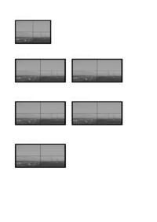 | 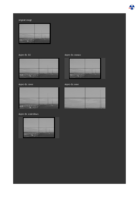 | 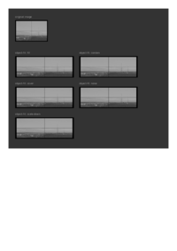 |
| [📕 mPDF Output](mpdf__html_CSS_Properties_O_object-fit.html.pdf) | [📕 typeset Output](typeset__html_CSS_Properties_O_object-fit.html.pdf) | [📕 PDFreactor Output](pdfreactor__html_CSS_Properties_O_object-fit.html.pdf) | [📕 wkhtmltopdf Output](wkhtmltopdf__html_CSS_Properties_O_object-fit.html.pdf) |

## 🔬 OBJECT-POSITION

### Input HTML & CSS

[📄 Input HTML](https://raw.githubusercontent.com/azettl/compare.html2pdf.tools/master//html/CSS%20Properties/O/object-position.html)

    

        View OBJECT-POSITION Code
    

    <pre><code class="hljs xml">&lt;!DOCTYPE html&gt;
&lt;!-- Sample from https://css-tricks.com/almanac/properties/o/object-position/ --&gt;
&lt;html lang="en"&gt;
    &lt;head&gt;
        &lt;style&gt;
        img {
  background-color: yellow;
  height: 180px;
}

.image {
  height: 170px;
  object-fit: none;
  /*  background-color: yellow;*/
}

.image--center {
  object-position: 50% 50%;
}

.image--bottom-right {
  object-position: 100% 100%;
}

.image--bottom-left {
  object-position: 0  100%;
}

.image--top-left {
  object-position: 0  0;
}

.image--up {
  object-position: 50%  120%;
}

.image--down {
  object-position: 50%  -20%;
}

.image--left {
  object-position: 120%  50%;
}

.image--right {
  object-position: -20%  50%;
}

.image--background-image {
  object-position: 140%  90%;
  background-image: url("http://fillmurray.com/g/50/50");
}

html {
  color: #eee;
  padding: 30px;
  font-family: 'Source Code Pro', Monaco;
  background-color: #333;
}

.container {
  float: left;
  margin: 0 20px 20px 0;
  padding: 0;
  width: 45%;
}
.container:nth-child(2n + 1) {
  margin-right: 0;
}

p {
  font-weight: 600;
  font-size: 13px;
  margin-bottom: 10px;
  margin-top: 0;
}

img[class] {
  width: 100%;
}

.original-image {
  margin-bottom: 50px;
}

        &lt;/style&gt;
    &lt;/head&gt;
    &lt;body&gt;
        &lt;div class="original-image"&gt;
            &lt;p&gt;original image &lt;br&gt; (with a yellow background)&lt;/p&gt;
          &lt;img src="https://s3-us-west-2.amazonaws.com/s.cdpn.io/t-90/image.png"&gt; 
          &lt;/div&gt;
          
          
          &lt;div class="container"&gt;
              &lt;p&gt;object-position: 50% 50%&lt;/p&gt;
          &lt;img class="image image--center" src="https://s3-us-west-2.amazonaws.com/s.cdpn.io/t-90/image.png"&gt; 
          &lt;/div&gt;
          
          &lt;div class="container"&gt;
              &lt;p&gt;object-position: 100% 150%&lt;/p&gt;
          &lt;img class="image image--bottom-right" src="https://s3-us-west-2.amazonaws.com/s.cdpn.io/t-90/image.png"&gt; 
          &lt;/div&gt;
          
          &lt;div class="container"&gt;
              &lt;p&gt;object-position: 0 150%&lt;/p&gt;
          &lt;img class="image image--bottom-left" src="https://s3-us-west-2.amazonaws.com/s.cdpn.io/t-90/image.png"&gt; 
          &lt;/div&gt;
          
          &lt;div class="container"&gt;
                &lt;p&gt;object-position: 0 0&lt;/p&gt;
          &lt;img class="image image--top-left" src="https://s3-us-west-2.amazonaws.com/s.cdpn.io/t-90/image.png"&gt; 
          &lt;/div&gt;
          
          &lt;div class="container"&gt;
              &lt;p&gt;object-position: 50% 120%&lt;/p&gt;
          &lt;img class="image image--up" src="https://s3-us-west-2.amazonaws.com/s.cdpn.io/t-90/image.png"&gt; 
          &lt;/div&gt;
          
          &lt;div class="container"&gt;
              &lt;p&gt;object-position: 50% -20%&lt;/p&gt;
          &lt;img class="image image--down" src="https://s3-us-west-2.amazonaws.com/s.cdpn.io/t-90/image.png"&gt; 
          &lt;/div&gt;
          
          &lt;div class="container"&gt;
              &lt;p&gt;object-position: 120% 50%&lt;/p&gt;
          &lt;img class="image image--left" src="https://s3-us-west-2.amazonaws.com/s.cdpn.io/t-90/image.png"&gt; 
          &lt;/div&gt;
          
          &lt;div class="container"&gt;
              &lt;p&gt;object-position: -20% 50%&lt;/p&gt;
          &lt;img class="image image--right" src="https://s3-us-west-2.amazonaws.com/s.cdpn.io/t-90/image.png"&gt; 
          &lt;/div&gt;
          
          
          &lt;div class="container"&gt;
              &lt;p&gt;object-position: 140% 90% &lt;br&gt;(with background image)&lt;/p&gt;
          &lt;img class="image image--background-image" src="https://s3-us-west-2.amazonaws.com/s.cdpn.io/t-90/image.png"&gt; 
          &lt;/div&gt;
    &lt;/body&gt;
&lt;/html&gt;</code><button class='button-code-copy'>📋 Copy Code</button></pre>

### Output PDF

| mPDF | typeset.sh | PDFreactor | wkhtmltopdf
|---------|---------|---------|---------|
| 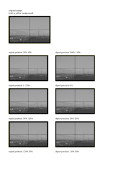 |  | 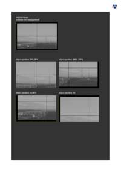 |  |
| [📕 mPDF Output](mpdf__html_CSS_Properties_O_object-position.html.pdf) | [📕 typeset Output](typeset__html_CSS_Properties_O_object-position.html.pdf) | [📕 PDFreactor Output](pdfreactor__html_CSS_Properties_O_object-position.html.pdf) | [📕 wkhtmltopdf Output](wkhtmltopdf__html_CSS_Properties_O_object-position.html.pdf) |

## 🔬 OFFSET-ANCHOR

### Input HTML & CSS

[📄 Input HTML](https://raw.githubusercontent.com/azettl/compare.html2pdf.tools/master//html/CSS%20Properties/O/offset-anchor.html)

    

        View OFFSET-ANCHOR Code
    

    <pre><code class="hljs xml">&lt;!DOCTYPE html&gt;
&lt;!-- Sample from  --&gt;
&lt;html lang="en"&gt;
    &lt;head&gt;
        &lt;style&gt;
        
        &lt;/style&gt;
    &lt;/head&gt;
    &lt;body&gt;
    
    &lt;/body&gt;
&lt;/html&gt;</code><button class='button-code-copy'>📋 Copy Code</button></pre>

### Output PDF

| mPDF | typeset.sh | PDFreactor | wkhtmltopdf
|---------|---------|---------|---------|
|  |  |  |  |
| [📕 mPDF Output](mpdf__html_CSS_Properties_O_offset-anchor.html.pdf) | [📕 typeset Output](typeset__html_CSS_Properties_O_offset-anchor.html.pdf) | [📕 PDFreactor Output](pdfreactor__html_CSS_Properties_O_offset-anchor.html.pdf) | [📕 wkhtmltopdf Output](wkhtmltopdf__html_CSS_Properties_O_offset-anchor.html.pdf) |

## 🔬 OFFSET-DISTANCE

### Input HTML & CSS

[📄 Input HTML](https://raw.githubusercontent.com/azettl/compare.html2pdf.tools/master//html/CSS%20Properties/O/offset-distance.html)

    

        View OFFSET-DISTANCE Code
    

    <pre><code class="hljs xml">&lt;!DOCTYPE html&gt;
&lt;!-- Sample from  --&gt;
&lt;html lang="en"&gt;
    &lt;head&gt;
        &lt;style&gt;
        
        &lt;/style&gt;
    &lt;/head&gt;
    &lt;body&gt;
    
    &lt;/body&gt;
&lt;/html&gt;</code><button class='button-code-copy'>📋 Copy Code</button></pre>

### Output PDF

| mPDF | typeset.sh | PDFreactor | wkhtmltopdf
|---------|---------|---------|---------|
|  |  |  |  |
| [📕 mPDF Output](mpdf__html_CSS_Properties_O_offset-distance.html.pdf) | [📕 typeset Output](typeset__html_CSS_Properties_O_offset-distance.html.pdf) | [📕 PDFreactor Output](pdfreactor__html_CSS_Properties_O_offset-distance.html.pdf) | [📕 wkhtmltopdf Output](wkhtmltopdf__html_CSS_Properties_O_offset-distance.html.pdf) |

## 🔬 OFFSET-PATH

### Input HTML & CSS

[📄 Input HTML](https://raw.githubusercontent.com/azettl/compare.html2pdf.tools/master//html/CSS%20Properties/O/offset-path.html)

    

        View OFFSET-PATH Code
    

    <pre><code class="hljs xml">&lt;!DOCTYPE html&gt;
&lt;!-- Sample from  --&gt;
&lt;html lang="en"&gt;
    &lt;head&gt;
        &lt;style&gt;
        
        &lt;/style&gt;
    &lt;/head&gt;
    &lt;body&gt;
    
    &lt;/body&gt;
&lt;/html&gt;</code><button class='button-code-copy'>📋 Copy Code</button></pre>

### Output PDF

| mPDF | typeset.sh | PDFreactor | wkhtmltopdf
|---------|---------|---------|---------|
|  |  |  |  |
| [📕 mPDF Output](mpdf__html_CSS_Properties_O_offset-path.html.pdf) | [📕 typeset Output](typeset__html_CSS_Properties_O_offset-path.html.pdf) | [📕 PDFreactor Output](pdfreactor__html_CSS_Properties_O_offset-path.html.pdf) | [📕 wkhtmltopdf Output](wkhtmltopdf__html_CSS_Properties_O_offset-path.html.pdf) |

## 🔬 OFFSET-ROTATE

### Input HTML & CSS

[📄 Input HTML](https://raw.githubusercontent.com/azettl/compare.html2pdf.tools/master//html/CSS%20Properties/O/offset-rotate.html)

    

        View OFFSET-ROTATE Code
    

    <pre><code class="hljs xml">&lt;!DOCTYPE html&gt;
&lt;!-- Sample from  --&gt;
&lt;html lang="en"&gt;
    &lt;head&gt;
        &lt;style&gt;
        
        &lt;/style&gt;
    &lt;/head&gt;
    &lt;body&gt;
    
    &lt;/body&gt;
&lt;/html&gt;</code><button class='button-code-copy'>📋 Copy Code</button></pre>

### Output PDF

| mPDF | typeset.sh | PDFreactor | wkhtmltopdf
|---------|---------|---------|---------|
|  |  |  |  |
| [📕 mPDF Output](mpdf__html_CSS_Properties_O_offset-rotate.html.pdf) | [📕 typeset Output](typeset__html_CSS_Properties_O_offset-rotate.html.pdf) | [📕 PDFreactor Output](pdfreactor__html_CSS_Properties_O_offset-rotate.html.pdf) | [📕 wkhtmltopdf Output](wkhtmltopdf__html_CSS_Properties_O_offset-rotate.html.pdf) |

## 🔬 OPACITY

### Input HTML & CSS

[📄 Input HTML](https://raw.githubusercontent.com/azettl/compare.html2pdf.tools/master//html/CSS%20Properties/O/opacity.html)

    

        View OPACITY Code
    

    <pre><code class="hljs xml">&lt;!DOCTYPE html&gt;
&lt;!-- Sample from https://css-tricks.com/almanac/properties/o/opacity/ --&gt;
&lt;html lang="en"&gt;
    &lt;head&gt;
        &lt;style&gt;
        /* General Box Styling */
/*===========================*/
.container &gt; div {
  display: inline-block;
  height: 100px;
  width: 100px;
  background: #d58a3c;
}

/* Begin Opacity Demo Styles */
/*===========================*/
div.opacity100 {
  opacity: 1;
}

div.opacity90 {
  opacity: 0.9;
}

div.opacity80 {
  opacity: 0.8;
}

div.opacity70 {
  opacity: 0.7;
}

div.opacity60 {
  opacity: 0.6;
}

div.opacity50 {
  opacity: 0.5;
}

div.opacity40 {
  opacity: 0.4;
}

div.opacity30 {
  opacity: 0.3;
}

div.opacity20 {
  opacity: 0.2;
}

div.opacity10 {
  opacity: 0.1;
}

div.opacity0 {
  opacity: 0;
}

        &lt;/style&gt;
    &lt;/head&gt;
    &lt;body&gt;
        &lt;div class="container"&gt;
            &lt;h3&gt;Opacity without child elements&lt;/h3&gt;
            &lt;div class="opacity100"&gt;opacity: 1&lt;/div&gt;
            &lt;div class="opacity90"&gt;opacity: 0.9&lt;/div&gt;
            &lt;div class="opacity80"&gt;opacity: 0.8&lt;/div&gt;
            &lt;div class="opacity70"&gt;opacity: 0.7&lt;/div&gt;
            &lt;div class="opacity60"&gt;opacity: 0.6&lt;/div&gt;
            &lt;div class="opacity50"&gt;opacity: 0.5&lt;/div&gt;
            &lt;div class="opacity40"&gt;opacity: 0.4&lt;/div&gt;
            &lt;div class="opacity30"&gt;opacity: 0.3&lt;/div&gt;
            &lt;div class="opacity20"&gt;opacity: 0.2&lt;/div&gt;
            &lt;div class="opacity10"&gt;opacity: 0.1&lt;/div&gt;
            &lt;div class="opacity0"&gt;opacity: 0&lt;/div&gt;
          &lt;/div&gt;
          
          &lt;div class="container"&gt;
            &lt;h3&gt;Opacity with child elements&lt;/h3&gt;
            &lt;div class="opacity100"&gt;
              opacity: 1
              &lt;p&gt;Paragraph Element&lt;/p&gt;
            &lt;/div&gt;
            &lt;div class="opacity90"&gt;
              opacity: 0.9
              &lt;p&gt;Paragraph Element&lt;/p&gt;
            &lt;/div&gt;
            &lt;div class="opacity80"&gt;
              opacity: 0.8
              &lt;p&gt;Paragraph Element&lt;/p&gt;
            &lt;/div&gt;
            &lt;div class="opacity70"&gt;
              opacity: 0.7
              &lt;p&gt;Paragraph Element&lt;/p&gt;
            &lt;/div&gt;
            &lt;div class="opacity60"&gt;
              opacity: 0.6
              &lt;p&gt;Paragraph Element&lt;/p&gt;
            &lt;/div&gt;
            &lt;div class="opacity50"&gt;
              opacity: 0.5
              &lt;p&gt;Paragraph Element&lt;/p&gt;
            &lt;/div&gt;
            &lt;div class="opacity40"&gt;
              opacity: 0.4
              &lt;p&gt;Paragraph Element&lt;/p&gt;
            &lt;/div&gt;
            &lt;div class="opacity30"&gt;
              opacity: 0.3
              &lt;p&gt;Paragraph Element&lt;/p&gt;
            &lt;/div&gt;
            &lt;div class="opacity20"&gt;
              opacity: 0.2
              &lt;p&gt;Paragraph Element&lt;/p&gt;
            &lt;/div&gt;
            &lt;div class="opacity10"&gt;
              opacity: 0.1
              &lt;p&gt;Paragraph Element&lt;/p&gt;
            &lt;/div&gt;
            &lt;div class="opacity0"&gt;
              opacity: 0
              &lt;p&gt;Paragraph Element&lt;/p&gt;
            &lt;/div&gt;
            
            &lt;p&gt;&lt;small&gt;Elements with an &lt;code&gt;opacity&lt;/code&gt; value of '0' are invisible&lt;/small&gt;&lt;/p&gt;
          &lt;/div&gt;
    &lt;/body&gt;
&lt;/html&gt;</code><button class='button-code-copy'>📋 Copy Code</button></pre>

### Output PDF

| mPDF | typeset.sh | PDFreactor | wkhtmltopdf
|---------|---------|---------|---------|
|  | 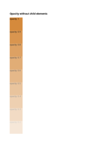 | 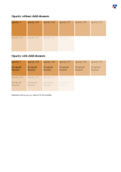 | 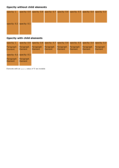 |
| [📕 mPDF Output](mpdf__html_CSS_Properties_O_opacity.html.pdf) | [📕 typeset Output](typeset__html_CSS_Properties_O_opacity.html.pdf) | [📕 PDFreactor Output](pdfreactor__html_CSS_Properties_O_opacity.html.pdf) | [📕 wkhtmltopdf Output](wkhtmltopdf__html_CSS_Properties_O_opacity.html.pdf) |

## 🔬 ORDER

### Input HTML & CSS

[📄 Input HTML](https://raw.githubusercontent.com/azettl/compare.html2pdf.tools/master//html/CSS%20Properties/O/order.html)

    

        View ORDER Code
    

    <pre><code class="hljs xml">&lt;!DOCTYPE html&gt;
&lt;!-- Sample from https://css-tricks.com/almanac/properties/o/order/ --&gt;
&lt;html lang="en"&gt;
    &lt;head&gt;
        &lt;style&gt;
        .flex-container {
  padding: 0;
  margin: 0;
  list-style: none;
  
  -ms-box-orient: horizontal;
  display: -webkit-box;
  display: -moz-box;
  display: -ms-flexbox;
  display: -moz-flex;
  display: -webkit-flex;
  display: flex;
  
  -webkit-flex-flow: row wrap;
  flex-flow: row wrap;
}

.flex-item:nth-of-type(1) { order: 3; }
.flex-item:nth-of-type(2) { order: 4; }
.flex-item:nth-of-type(3) { order: 1; }
.flex-item:nth-of-type(4) { order: 5; }
.flex-item:nth-of-type(5) { order: 2; }

.flex-item {
  background: tomato;
  padding: 5px;
  width: 100px;
  height: 100px;
  margin: 5px;
  
  line-height: 100px;
  color: white;
  font-weight: bold;
  font-size: 2em;
  text-align: center;
}
        &lt;/style&gt;
    &lt;/head&gt;
    &lt;body&gt;
        &lt;ul class="flex-container"&gt;
            &lt;li class="flex-item"&gt;1&lt;/li&gt;
            &lt;li class="flex-item"&gt;2&lt;/li&gt;
            &lt;li class="flex-item"&gt;3&lt;/li&gt;
            &lt;li class="flex-item"&gt;4&lt;/li&gt;
            &lt;li class="flex-item"&gt;5&lt;/li&gt;
          &lt;/ul&gt;
    &lt;/body&gt;
&lt;/html&gt;</code><button class='button-code-copy'>📋 Copy Code</button></pre>

### Output PDF

| mPDF | typeset.sh | PDFreactor | wkhtmltopdf
|---------|---------|---------|---------|
| 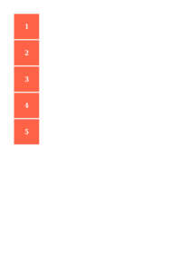 |  |  | 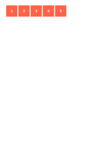 |
| [📕 mPDF Output](mpdf__html_CSS_Properties_O_order.html.pdf) | [📕 typeset Output](typeset__html_CSS_Properties_O_order.html.pdf) | [📕 PDFreactor Output](pdfreactor__html_CSS_Properties_O_order.html.pdf) | [📕 wkhtmltopdf Output](wkhtmltopdf__html_CSS_Properties_O_order.html.pdf) |

## 🔬 ORPHANS

### Input HTML & CSS

[📄 Input HTML](https://raw.githubusercontent.com/azettl/compare.html2pdf.tools/master//html/CSS%20Properties/O/orphans.html)

    

        View ORPHANS Code
    

    <pre><code class="hljs xml">&lt;!DOCTYPE html&gt;
&lt;!-- Sample from https://www.w3schools.com/jsref/prop_style_orphans.asp --&gt;
&lt;html lang="en"&gt;
    &lt;head&gt;
        &lt;style&gt;
        .othercontent {
  width: 400px;
  border-top: 19cm solid #c3c3c3;
}

@page {
  /* set size of printed page */
  size:21cm 27cm;
  margin-top:2cm;
}

  .orphans {
    orphans:2;
  }
        &lt;/style&gt;
    &lt;/head&gt;
    &lt;body&gt;
        &lt;div class="othercontent"&gt;
            
            &lt;p style="font-size:120%" id="p1"&gt;
                orphans &lt;br&gt;
                orphans &lt;br&gt;
                orphans &lt;br&gt;
                orphans &lt;br&gt;
                orphans &lt;br&gt;
                orphans &lt;br&gt;
                orphans &lt;br&gt;
                orphans &lt;br&gt;
                orphans &lt;br&gt;
            Line 2&lt;br&gt;
            Line 3&lt;br&gt;
            Line 4&lt;br&gt;
            Line 5&lt;br&gt;
            Line 6&lt;br&gt;
            Line 7&lt;br&gt;
            Line 8&lt;br&gt;
            &lt;/p&gt; 
    &lt;/body&gt;
&lt;/html&gt;</code><button class='button-code-copy'>📋 Copy Code</button></pre>

### Output PDF

| mPDF | typeset.sh | PDFreactor | wkhtmltopdf
|---------|---------|---------|---------|
| 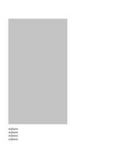 | 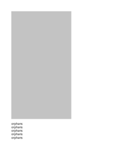 | 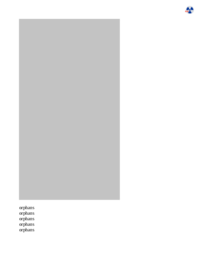 | 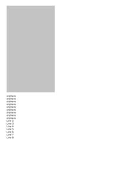 |
| [📕 mPDF Output](mpdf__html_CSS_Properties_O_orphans.html.pdf) | [📕 typeset Output](typeset__html_CSS_Properties_O_orphans.html.pdf) | [📕 PDFreactor Output](pdfreactor__html_CSS_Properties_O_orphans.html.pdf) | [📕 wkhtmltopdf Output](wkhtmltopdf__html_CSS_Properties_O_orphans.html.pdf) |

## 🔬 OUTLINE-OFFSET

### Input HTML & CSS

[📄 Input HTML](https://raw.githubusercontent.com/azettl/compare.html2pdf.tools/master//html/CSS%20Properties/O/outline-offset.html)

    

        View OUTLINE-OFFSET Code
    

    <pre><code class="hljs xml">&lt;!DOCTYPE html&gt;
&lt;!-- Sample from https://css-tricks.com/almanac/properties/o/outline-offset/ --&gt;
&lt;html lang="en"&gt;
    &lt;head&gt;
        &lt;style&gt;
        body {
  padding: 40px;
}

h2 {
  text-align: center;
  margin: 0 0 40px;
}

.box {
  width: 200px;
  height: 200px;
  background: #ccc;
  margin: auto;
  border: solid 8px yellow;
  outline: solid 8px orange;
}
        &lt;/style&gt;
    &lt;/head&gt;
    &lt;body&gt;
        &lt;h2&gt;Dual border effect with outline and border&lt;/h2&gt;

        &lt;div class="box"&gt;&lt;/div&gt;
    &lt;/body&gt;
&lt;/html&gt;</code><button class='button-code-copy'>📋 Copy Code</button></pre>

### Output PDF

| mPDF | typeset.sh | PDFreactor | wkhtmltopdf
|---------|---------|---------|---------|
|  |  |  |  |
| [📕 mPDF Output](mpdf__html_CSS_Properties_O_outline-offset.html.pdf) | [📕 typeset Output](typeset__html_CSS_Properties_O_outline-offset.html.pdf) | [📕 PDFreactor Output](pdfreactor__html_CSS_Properties_O_outline-offset.html.pdf) | [📕 wkhtmltopdf Output](wkhtmltopdf__html_CSS_Properties_O_outline-offset.html.pdf) |

## 🔬 OUTLINE

### Input HTML & CSS

[📄 Input HTML](https://raw.githubusercontent.com/azettl/compare.html2pdf.tools/master//html/CSS%20Properties/O/outline.html)

    

        View OUTLINE Code
    

    <pre><code class="hljs xml">&lt;!DOCTYPE html&gt;
&lt;!-- Sample from https://css-tricks.com/almanac/properties/o/outline-offset/ --&gt;
&lt;html lang="en"&gt;
    &lt;head&gt;
        &lt;style&gt;
        body {
  padding: 40px;
}

h2 {
  text-align: center;
  margin: 0 0 40px;
}

.box {
  width: 200px;
  height: 200px;
  background: #ccc;
  margin: auto;
  outline: solid 8px orange;
}
        &lt;/style&gt;
    &lt;/head&gt;
    &lt;body&gt;
        &lt;h2&gt;outline&lt;/h2&gt;

        &lt;div class="box"&gt;&lt;/div&gt;
    &lt;/body&gt;
&lt;/html&gt;</code><button class='button-code-copy'>📋 Copy Code</button></pre>

### Output PDF

| mPDF | typeset.sh | PDFreactor | wkhtmltopdf
|---------|---------|---------|---------|
|  | 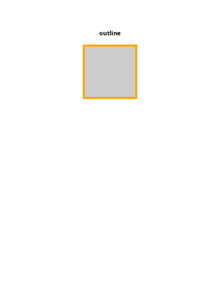 |  |  |
| [📕 mPDF Output](mpdf__html_CSS_Properties_O_outline.html.pdf) | [📕 typeset Output](typeset__html_CSS_Properties_O_outline.html.pdf) | [📕 PDFreactor Output](pdfreactor__html_CSS_Properties_O_outline.html.pdf) | [📕 wkhtmltopdf Output](wkhtmltopdf__html_CSS_Properties_O_outline.html.pdf) |

## 🔬 OVERFLOW

### Input HTML & CSS

[📄 Input HTML](https://raw.githubusercontent.com/azettl/compare.html2pdf.tools/master//html/CSS%20Properties/O/overflow.html)

    

        View OVERFLOW Code
    

    <pre><code class="hljs xml">&lt;!DOCTYPE html&gt;
&lt;!-- Sample from https://css-tricks.com/almanac/properties/o/overflow/ --&gt;
&lt;html lang="en"&gt;
    &lt;head&gt;
        &lt;style&gt;
        .box {
  border: 1px solid #222;
  width: 300px;
  height: 300px;
  overflow-y: hidden;
  overflow-x: scroll;
}
        &lt;/style&gt;
    &lt;/head&gt;
    &lt;body&gt;
        &lt;div class="box"&gt;
            &lt;img src="http://placehold.it/450x150" alt="" /&gt;
            &lt;p&gt;Lorem ipsum dolor sit amet, consectetur adipisicing elit. Recusandae suscipit, autem magnam ab. Possimus perferendis officiis doloremque impedit quia quos labore optio quas cum incidunt. Blanditiis dicta, sunt numquam quos.&lt;/p&gt;
            &lt;p&gt;Lorem ipsum dolor sit amet, consectetur adipisicing elit. Recusandae suscipit, autem magnam ab. Possimus perferendis officiis doloremque impedit quia quos labore optio quas cum incidunt. Blanditiis dicta, sunt numquam quos.&lt;/p&gt;
          &lt;/div&gt;
    &lt;/body&gt;
&lt;/html&gt;</code><button class='button-code-copy'>📋 Copy Code</button></pre>

### Output PDF

| mPDF | typeset.sh | PDFreactor | wkhtmltopdf
|---------|---------|---------|---------|
|  | 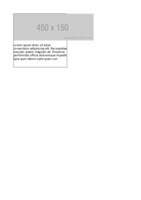 |  |  |
| [📕 mPDF Output](mpdf__html_CSS_Properties_O_overflow.html.pdf) | [📕 typeset Output](typeset__html_CSS_Properties_O_overflow.html.pdf) | [📕 PDFreactor Output](pdfreactor__html_CSS_Properties_O_overflow.html.pdf) | [📕 wkhtmltopdf Output](wkhtmltopdf__html_CSS_Properties_O_overflow.html.pdf) |

## 🔬 OVERSCROLL-BEHAVIOR

### Input HTML & CSS

[📄 Input HTML](https://raw.githubusercontent.com/azettl/compare.html2pdf.tools/master//html/CSS%20Properties/O/overscroll-behavior.html)

    

        View OVERSCROLL-BEHAVIOR Code
    

    <pre><code class="hljs xml">&lt;!DOCTYPE html&gt;
&lt;!-- Sample from https://css-tricks.com/almanac/properties/o/overscroll-behavior/ --&gt;
&lt;html lang="en"&gt;
    &lt;head&gt;
        &lt;style&gt;
        p {
  height: 100px;
  width: 100px;
  overflow: scroll;
  margin: 20px;
}

p:nth-child(2) {
  overscroll-behavior: contain;
}

body {
  display: flex;
  padding: 20px;
  min-height: 200vh;
}
        &lt;/style&gt;
    &lt;/head&gt;
    &lt;body&gt;
        &lt;p&gt;&lt;strong&gt;Default!&lt;/strong&gt; Lorem ipsum, dolor sit amet consectetur adipisicing elit. Fugiat placeat qui praesentium. Earum itaque architecto laboriosam voluptates beatae dolore molestiae quas magni quo non vel doloribus, accusamus repellendus quaerat aut!&lt;/p&gt;
        &lt;p&gt;&lt;strong&gt;Contain!&lt;/strong&gt; Perspiciatis dolorum corporis minus soluta! Culpa aspernatur non facilis porro. Magni qui cumque eligendi ducimus neque dolor minima, provident quod nihil? Nostrum deleniti laudantium illum corporis iure quasi error earum?&lt;/p&gt;
    &lt;/body&gt;
&lt;/html&gt;</code><button class='button-code-copy'>📋 Copy Code</button></pre>

### Output PDF

| mPDF | typeset.sh | PDFreactor | wkhtmltopdf
|---------|---------|---------|---------|
|  |  |  |  |
| [📕 mPDF Output](mpdf__html_CSS_Properties_O_overscroll-behavior.html.pdf) | [📕 typeset Output](typeset__html_CSS_Properties_O_overscroll-behavior.html.pdf) | [📕 PDFreactor Output](pdfreactor__html_CSS_Properties_O_overscroll-behavior.html.pdf) | [📕 wkhtmltopdf Output](wkhtmltopdf__html_CSS_Properties_O_overscroll-behavior.html.pdf) |

