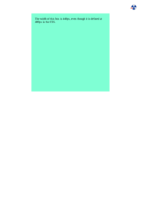
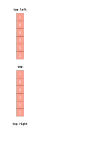
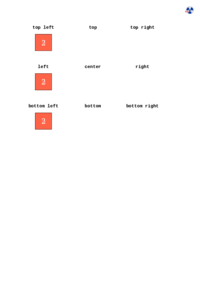
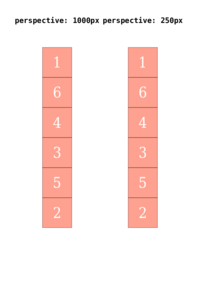
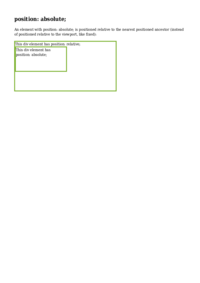
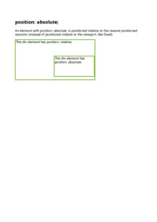
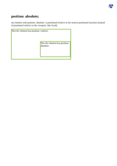

## PADDING

See the Rendering results for [padding.html](/html/CSS%20Properties/P/padding.html):

### mPDF
 

Link to PDF: [mpdf__html_CSS_Properties_P_padding.html.pdf](mpdf__html_CSS_Properties_P_padding.html.pdf)

### typeset.sh
 

Link to PDF: [typeset__html_CSS_Properties_P_padding.html.pdf](typeset__html_CSS_Properties_P_padding.html.pdf)

### PDFreactor
 

Link to PDF: [pdfreactor__html_CSS_Properties_P_padding.html.pdf](pdfreactor__html_CSS_Properties_P_padding.html.pdf)

## PERSPECTIVE-ORIGIN

See the Rendering results for [perspective-origin.html](/html/CSS%20Properties/P/perspective-origin.html):

### mPDF
 

Link to PDF: [mpdf__html_CSS_Properties_P_perspective-origin.html.pdf](mpdf__html_CSS_Properties_P_perspective-origin.html.pdf)

### typeset.sh
 

Link to PDF: [typeset__html_CSS_Properties_P_perspective-origin.html.pdf](typeset__html_CSS_Properties_P_perspective-origin.html.pdf)

### PDFreactor
 

Link to PDF: [pdfreactor__html_CSS_Properties_P_perspective-origin.html.pdf](pdfreactor__html_CSS_Properties_P_perspective-origin.html.pdf)

## PERSPECTIVE

See the Rendering results for [perspective.html](/html/CSS%20Properties/P/perspective.html):

### mPDF
 

Link to PDF: [mpdf__html_CSS_Properties_P_perspective.html.pdf](mpdf__html_CSS_Properties_P_perspective.html.pdf)

### typeset.sh
 

Link to PDF: [typeset__html_CSS_Properties_P_perspective.html.pdf](typeset__html_CSS_Properties_P_perspective.html.pdf)

### PDFreactor
 

Link to PDF: [pdfreactor__html_CSS_Properties_P_perspective.html.pdf](pdfreactor__html_CSS_Properties_P_perspective.html.pdf)

## POSITION

See the Rendering results for [position.html](/html/CSS%20Properties/P/position.html):

### mPDF
 

Link to PDF: [mpdf__html_CSS_Properties_P_position.html.pdf](mpdf__html_CSS_Properties_P_position.html.pdf)

### typeset.sh
 

Link to PDF: [typeset__html_CSS_Properties_P_position.html.pdf](typeset__html_CSS_Properties_P_position.html.pdf)

### PDFreactor
 

Link to PDF: [pdfreactor__html_CSS_Properties_P_position.html.pdf](pdfreactor__html_CSS_Properties_P_position.html.pdf)

