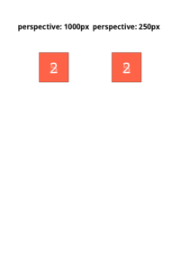

## <a name="PADDING" id="PADDING" href="#PADDING">#</a> PADDING

[📄 Input HTML](/html/CSS%20Properties/P/padding.html)

### Output PDF

| mPDF | typeset.sh | PDFreactor |
|---------|---------|---------|
|  |  |  |
| [📕 mPDF Output](mpdf__html_CSS_Properties_P_padding.html.pdf) | [📕 typeset Output](typeset__html_CSS_Properties_P_padding.html.pdf) | [📕 PDFreactor Output](pdfreactor__html_CSS_Properties_P_padding.html.pdf) |

## <a name="PERSPECTIVE-ORIGIN" id="PERSPECTIVE-ORIGIN" href="#PERSPECTIVE-ORIGIN">#</a> PERSPECTIVE-ORIGIN

[📄 Input HTML](/html/CSS%20Properties/P/perspective-origin.html)

### Output PDF

| mPDF | typeset.sh | PDFreactor |
|---------|---------|---------|
|  |  |  |
| [📕 mPDF Output](mpdf__html_CSS_Properties_P_perspective-origin.html.pdf) | [📕 typeset Output](typeset__html_CSS_Properties_P_perspective-origin.html.pdf) | [📕 PDFreactor Output](pdfreactor__html_CSS_Properties_P_perspective-origin.html.pdf) |

## <a name="PERSPECTIVE" id="PERSPECTIVE" href="#PERSPECTIVE">#</a> PERSPECTIVE

[📄 Input HTML](/html/CSS%20Properties/P/perspective.html)

### Output PDF

| mPDF | typeset.sh | PDFreactor |
|---------|---------|---------|
|  |  |  |
| [📕 mPDF Output](mpdf__html_CSS_Properties_P_perspective.html.pdf) | [📕 typeset Output](typeset__html_CSS_Properties_P_perspective.html.pdf) | [📕 PDFreactor Output](pdfreactor__html_CSS_Properties_P_perspective.html.pdf) |

## <a name="POSITION" id="POSITION" href="#POSITION">#</a> POSITION

[📄 Input HTML](/html/CSS%20Properties/P/position.html)

### Output PDF

| mPDF | typeset.sh | PDFreactor |
|---------|---------|---------|
|  |  |  |
| [📕 mPDF Output](mpdf__html_CSS_Properties_P_position.html.pdf) | [📕 typeset Output](typeset__html_CSS_Properties_P_position.html.pdf) | [📕 PDFreactor Output](pdfreactor__html_CSS_Properties_P_position.html.pdf) |

