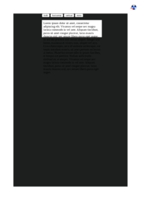

## 🔬 RESIZE

### Input HTML & CSS

[📄 Input HTML](https://raw.githubusercontent.com/azettl/compare.html2pdf.tools/master//html/CSS%20Properties/R/resize.html)

    

        View RESIZE Code
    

    <pre><code class="hljs xml">&lt;!DOCTYPE html&gt;
&lt;!-- Sample from https://css-tricks.com/almanac/properties/r/resize/ --&gt;
&lt;html lang="en"&gt;
    &lt;head&gt;
        &lt;style&gt;
        body {
  background-color: #1D1F1F;
}

section { 
  width: 50%;
  margin: 0 auto;
}

p {
  width: 100%;
  height: 5em;
  background-color: white;
  padding: .5em;
  overflow: scroll;
  resize: vertical;
}
        &lt;/style&gt;
    &lt;/head&gt;
    &lt;body&gt;
        &lt;section&gt;
            &lt;button&gt;both&lt;/button&gt;
            &lt;button&gt;horizontal&lt;/button&gt;
            &lt;button&gt;vertical&lt;/button&gt;
            &lt;button&gt;none&lt;/button&gt;
          &lt;p class="resize"&gt;
          Lorem ipsum dolor sit amet, consectetur adipiscing elit. Vivamus vel neque nec magna lacinia commodo in vel ante. Aliquam tincidunt, purus sit amet congue placerat, lacus mauris rhoncus nisl, nec ornare libero purus eget augue. In sed dui placerat nisl cursus aliquet. Integer nisl lorem, maximus et viverra non, aliquet vel arcu. Cras ullamcorper, arcu id molestie scelerisque, est turpis interdum mauris, sit amet pretium mi lectus at metus. Phasellus ornare odio in ipsum faucibus, et tempus est porttitor. Nullam sollicitudin eleifend mi at semper. Vivamus vel neque nec magna lacinia commodo in vel ante. Aliquam tincidunt, purus sit amet congue placerat, lacus mauris rhoncus nisl, nec ornare libero purus eget augue.&lt;/p&gt;
          &lt;/section&gt;
    &lt;/body&gt;
&lt;/html&gt;</code></pre>

### Output PDF

| mPDF | typeset.sh | PDFreactor |
|---------|---------|---------|
|  |  |  |
| [📕 mPDF Output](mpdf__html_CSS_Properties_R_resize.html.pdf) | [📕 typeset Output](typeset__html_CSS_Properties_R_resize.html.pdf) | [📕 PDFreactor Output](pdfreactor__html_CSS_Properties_R_resize.html.pdf) |

## 🔬 RIGHT

### Input HTML & CSS

[📄 Input HTML](https://raw.githubusercontent.com/azettl/compare.html2pdf.tools/master//html/CSS%20Properties/R/right.html)

    

        View RIGHT Code
    

    <pre><code class="hljs xml">&lt;!DOCTYPE html&gt;
&lt;!-- Sample from https://css-tricks.com/almanac/properties/t/top-right-bottom-left/ --&gt;
&lt;html lang="en"&gt;
    &lt;head&gt;
        &lt;style&gt;
        body {
  padding: 40px 0;
}

.box {
  width: 10rem;
  height: 10rem;
  display: flex;
  justify-content: center;
  align-items: center;
  background-color: Silver;
  position: relative;
}

.box--positive {
  right: 50px;
}

.box--negative {
  right: -50px;
}

.outline {
  display: inline-block;
  border: 2px dashed black;
  margin: 40px 0 0 40px;
}
        &lt;/style&gt;
    &lt;/head&gt;
    &lt;body&gt;
        &lt;div class="outline"&gt;
            &lt;div class="box box--positive"&gt;
              &lt;pre&gt;positive&lt;/pre&gt;
            &lt;/div&gt;
          &lt;/div&gt;
          
          &lt;div class="outline"&gt;
            &lt;div class="box box--negative"&gt;
              &lt;pre&gt;negative&lt;/pre&gt;
            &lt;/div&gt;
          &lt;/div&gt;
    &lt;/body&gt;
&lt;/html&gt;</code></pre>

### Output PDF

| mPDF | typeset.sh | PDFreactor |
|---------|---------|---------|
|  |  |  |
| [📕 mPDF Output](mpdf__html_CSS_Properties_R_right.html.pdf) | [📕 typeset Output](typeset__html_CSS_Properties_R_right.html.pdf) | [📕 PDFreactor Output](pdfreactor__html_CSS_Properties_R_right.html.pdf) |

