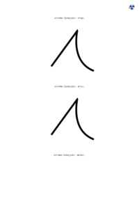

## <a name="SHAPE-OUTSIDE" id="SHAPE-OUTSIDE" href="#SHAPE-OUTSIDE">#</a> SHAPE-OUTSIDE

[📄 Input HTML](/html/CSS%20Properties/S/shape-outside.html)

### Output PDF

| mPDF | typeset.sh | PDFreactor |
|---------|---------|---------|
|  |  |  |
| [📕 mPDF Output](mpdf__html_CSS_Properties_S_shape-outside.html.pdf) | [📕 typeset Output](typeset__html_CSS_Properties_S_shape-outside.html.pdf) | [📕 PDFreactor Output](pdfreactor__html_CSS_Properties_S_shape-outside.html.pdf) |

## <a name="STROKE-DASHARRAY" id="STROKE-DASHARRAY" href="#STROKE-DASHARRAY">#</a> STROKE-DASHARRAY

[📄 Input HTML](/html/CSS%20Properties/S/stroke-dasharray.html)

### Output PDF

| mPDF | typeset.sh | PDFreactor |
|---------|---------|---------|
|  |  |  |
| [📕 mPDF Output](mpdf__html_CSS_Properties_S_stroke-dasharray.html.pdf) | [📕 typeset Output](typeset__html_CSS_Properties_S_stroke-dasharray.html.pdf) | [📕 PDFreactor Output](pdfreactor__html_CSS_Properties_S_stroke-dasharray.html.pdf) |

## <a name="STROKE-DASHOFFSET" id="STROKE-DASHOFFSET" href="#STROKE-DASHOFFSET">#</a> STROKE-DASHOFFSET

[📄 Input HTML](/html/CSS%20Properties/S/stroke-dashoffset.html)

### Output PDF

| mPDF | typeset.sh | PDFreactor |
|---------|---------|---------|
|  |  |  |
| [📕 mPDF Output](mpdf__html_CSS_Properties_S_stroke-dashoffset.html.pdf) | [📕 typeset Output](typeset__html_CSS_Properties_S_stroke-dashoffset.html.pdf) | [📕 PDFreactor Output](pdfreactor__html_CSS_Properties_S_stroke-dashoffset.html.pdf) |

## <a name="STROKE-LINECAP" id="STROKE-LINECAP" href="#STROKE-LINECAP">#</a> STROKE-LINECAP

[📄 Input HTML](/html/CSS%20Properties/S/stroke-linecap.html)

### Output PDF

| mPDF | typeset.sh | PDFreactor |
|---------|---------|---------|
|  |  |  |
| [📕 mPDF Output](mpdf__html_CSS_Properties_S_stroke-linecap.html.pdf) | [📕 typeset Output](typeset__html_CSS_Properties_S_stroke-linecap.html.pdf) | [📕 PDFreactor Output](pdfreactor__html_CSS_Properties_S_stroke-linecap.html.pdf) |

## <a name="STROKE-LINEJOIN" id="STROKE-LINEJOIN" href="#STROKE-LINEJOIN">#</a> STROKE-LINEJOIN

[📄 Input HTML](/html/CSS%20Properties/S/stroke-linejoin.html)

### Output PDF

| mPDF | typeset.sh | PDFreactor |
|---------|---------|---------|
|  |  |  |
| [📕 mPDF Output](mpdf__html_CSS_Properties_S_stroke-linejoin.html.pdf) | [📕 typeset Output](typeset__html_CSS_Properties_S_stroke-linejoin.html.pdf) | [📕 PDFreactor Output](pdfreactor__html_CSS_Properties_S_stroke-linejoin.html.pdf) |

## <a name="STROKE-WIDTH" id="STROKE-WIDTH" href="#STROKE-WIDTH">#</a> STROKE-WIDTH

[📄 Input HTML](/html/CSS%20Properties/S/stroke-width.html)

### Output PDF

| mPDF | typeset.sh | PDFreactor |
|---------|---------|---------|
|  |  |  |
| [📕 mPDF Output](mpdf__html_CSS_Properties_S_stroke-width.html.pdf) | [📕 typeset Output](typeset__html_CSS_Properties_S_stroke-width.html.pdf) | [📕 PDFreactor Output](pdfreactor__html_CSS_Properties_S_stroke-width.html.pdf) |

## <a name="STROKE" id="STROKE" href="#STROKE">#</a> STROKE

[📄 Input HTML](/html/CSS%20Properties/S/stroke.html)

### Output PDF

| mPDF | typeset.sh | PDFreactor |
|---------|---------|---------|
|  |  |  |
| [📕 mPDF Output](mpdf__html_CSS_Properties_S_stroke.html.pdf) | [📕 typeset Output](typeset__html_CSS_Properties_S_stroke.html.pdf) | [📕 PDFreactor Output](pdfreactor__html_CSS_Properties_S_stroke.html.pdf) |

