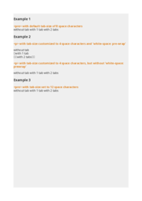
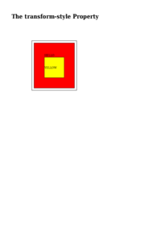
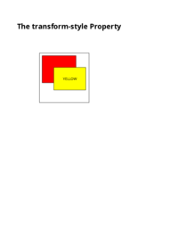

# T

## TAB-SIZE

See the Rendering results for [tab-size.html](/html/CSS%20Properties/T/tab-size.html):

### mPDF
 

Link to PDF: [mpdf__html_CSS_Properties_T_tab-size.html.pdf](mpdf__html_CSS_Properties_T_tab-size.html.pdf)

### typeset.sh
 

Link to PDF: [typeset__html_CSS_Properties_T_tab-size.html.pdf](typeset__html_CSS_Properties_T_tab-size.html.pdf)

### PDFreactor
 

Link to PDF: [pdfreactor__html_CSS_Properties_T_tab-size.html.pdf](pdfreactor__html_CSS_Properties_T_tab-size.html.pdf)

## TABLE-LAYOUT

See the Rendering results for [table-layout.html](/html/CSS%20Properties/T/table-layout.html):

### mPDF
 

Link to PDF: [mpdf__html_CSS_Properties_T_table-layout.html.pdf](mpdf__html_CSS_Properties_T_table-layout.html.pdf)

### typeset.sh
 

Link to PDF: [typeset__html_CSS_Properties_T_table-layout.html.pdf](typeset__html_CSS_Properties_T_table-layout.html.pdf)

### PDFreactor
 

Link to PDF: [pdfreactor__html_CSS_Properties_T_table-layout.html.pdf](pdfreactor__html_CSS_Properties_T_table-layout.html.pdf)

## TEXT-ALIGN-LAST

See the Rendering results for [text-align-last.html](/html/CSS%20Properties/T/text-align-last.html):

### mPDF
 

Link to PDF: [mpdf__html_CSS_Properties_T_text-align-last.html.pdf](mpdf__html_CSS_Properties_T_text-align-last.html.pdf)

### typeset.sh
 

Link to PDF: [typeset__html_CSS_Properties_T_text-align-last.html.pdf](typeset__html_CSS_Properties_T_text-align-last.html.pdf)

### PDFreactor
 

Link to PDF: [pdfreactor__html_CSS_Properties_T_text-align-last.html.pdf](pdfreactor__html_CSS_Properties_T_text-align-last.html.pdf)

## TEXT-ALIGN

See the Rendering results for [text-align.html](/html/CSS%20Properties/T/text-align.html):

### mPDF
 

Link to PDF: [mpdf__html_CSS_Properties_T_text-align.html.pdf](mpdf__html_CSS_Properties_T_text-align.html.pdf)

### typeset.sh
 

Link to PDF: [typeset__html_CSS_Properties_T_text-align.html.pdf](typeset__html_CSS_Properties_T_text-align.html.pdf)

### PDFreactor
 

Link to PDF: [pdfreactor__html_CSS_Properties_T_text-align.html.pdf](pdfreactor__html_CSS_Properties_T_text-align.html.pdf)

## TEXT-DECORATION-COLOR

See the Rendering results for [text-decoration-color.html](/html/CSS%20Properties/T/text-decoration-color.html):

### mPDF
 

Link to PDF: [mpdf__html_CSS_Properties_T_text-decoration-color.html.pdf](mpdf__html_CSS_Properties_T_text-decoration-color.html.pdf)

### typeset.sh
 

Link to PDF: [typeset__html_CSS_Properties_T_text-decoration-color.html.pdf](typeset__html_CSS_Properties_T_text-decoration-color.html.pdf)

### PDFreactor
 

Link to PDF: [pdfreactor__html_CSS_Properties_T_text-decoration-color.html.pdf](pdfreactor__html_CSS_Properties_T_text-decoration-color.html.pdf)

## TEXT-DECORATION-LINE

See the Rendering results for [text-decoration-line.html](/html/CSS%20Properties/T/text-decoration-line.html):

### mPDF
 

Link to PDF: [mpdf__html_CSS_Properties_T_text-decoration-line.html.pdf](mpdf__html_CSS_Properties_T_text-decoration-line.html.pdf)

### typeset.sh
 

Link to PDF: [typeset__html_CSS_Properties_T_text-decoration-line.html.pdf](typeset__html_CSS_Properties_T_text-decoration-line.html.pdf)

### PDFreactor
 

Link to PDF: [pdfreactor__html_CSS_Properties_T_text-decoration-line.html.pdf](pdfreactor__html_CSS_Properties_T_text-decoration-line.html.pdf)

## TEXT-DECORATION-SKIP-INK

See the Rendering results for [text-decoration-skip-ink.html](/html/CSS%20Properties/T/text-decoration-skip-ink.html):

### mPDF
 

Link to PDF: [mpdf__html_CSS_Properties_T_text-decoration-skip-ink.html.pdf](mpdf__html_CSS_Properties_T_text-decoration-skip-ink.html.pdf)

### typeset.sh
 

Link to PDF: [typeset__html_CSS_Properties_T_text-decoration-skip-ink.html.pdf](typeset__html_CSS_Properties_T_text-decoration-skip-ink.html.pdf)

### PDFreactor
 

Link to PDF: [pdfreactor__html_CSS_Properties_T_text-decoration-skip-ink.html.pdf](pdfreactor__html_CSS_Properties_T_text-decoration-skip-ink.html.pdf)

## TEXT-DECORATION-SKIP

See the Rendering results for [text-decoration-skip.html](/html/CSS%20Properties/T/text-decoration-skip.html):

### mPDF
 

Link to PDF: [mpdf__html_CSS_Properties_T_text-decoration-skip.html.pdf](mpdf__html_CSS_Properties_T_text-decoration-skip.html.pdf)

### typeset.sh
 

Link to PDF: [typeset__html_CSS_Properties_T_text-decoration-skip.html.pdf](typeset__html_CSS_Properties_T_text-decoration-skip.html.pdf)

### PDFreactor
 

Link to PDF: [pdfreactor__html_CSS_Properties_T_text-decoration-skip.html.pdf](pdfreactor__html_CSS_Properties_T_text-decoration-skip.html.pdf)

## TEXT-DECORATION-STYLE

See the Rendering results for [text-decoration-style.html](/html/CSS%20Properties/T/text-decoration-style.html):

### mPDF
 

Link to PDF: [mpdf__html_CSS_Properties_T_text-decoration-style.html.pdf](mpdf__html_CSS_Properties_T_text-decoration-style.html.pdf)

### typeset.sh
 

Link to PDF: [typeset__html_CSS_Properties_T_text-decoration-style.html.pdf](typeset__html_CSS_Properties_T_text-decoration-style.html.pdf)

### PDFreactor
 

Link to PDF: [pdfreactor__html_CSS_Properties_T_text-decoration-style.html.pdf](pdfreactor__html_CSS_Properties_T_text-decoration-style.html.pdf)

## TEXT-DECORATION

See the Rendering results for [text-decoration.html](/html/CSS%20Properties/T/text-decoration.html):

### mPDF
 

Link to PDF: [mpdf__html_CSS_Properties_T_text-decoration.html.pdf](mpdf__html_CSS_Properties_T_text-decoration.html.pdf)

### typeset.sh
 

Link to PDF: [typeset__html_CSS_Properties_T_text-decoration.html.pdf](typeset__html_CSS_Properties_T_text-decoration.html.pdf)

### PDFreactor
 

Link to PDF: [pdfreactor__html_CSS_Properties_T_text-decoration.html.pdf](pdfreactor__html_CSS_Properties_T_text-decoration.html.pdf)

## TEXT-INDENT

See the Rendering results for [text-indent.html](/html/CSS%20Properties/T/text-indent.html):

### mPDF
 

Link to PDF: [mpdf__html_CSS_Properties_T_text-indent.html.pdf](mpdf__html_CSS_Properties_T_text-indent.html.pdf)

### typeset.sh
 

Link to PDF: [typeset__html_CSS_Properties_T_text-indent.html.pdf](typeset__html_CSS_Properties_T_text-indent.html.pdf)

### PDFreactor
 

Link to PDF: [pdfreactor__html_CSS_Properties_T_text-indent.html.pdf](pdfreactor__html_CSS_Properties_T_text-indent.html.pdf)

## TEXT-JUSTIFY

See the Rendering results for [text-justify.html](/html/CSS%20Properties/T/text-justify.html):

### mPDF
 

Link to PDF: [mpdf__html_CSS_Properties_T_text-justify.html.pdf](mpdf__html_CSS_Properties_T_text-justify.html.pdf)

### typeset.sh
 

Link to PDF: [typeset__html_CSS_Properties_T_text-justify.html.pdf](typeset__html_CSS_Properties_T_text-justify.html.pdf)

### PDFreactor
 

Link to PDF: [pdfreactor__html_CSS_Properties_T_text-justify.html.pdf](pdfreactor__html_CSS_Properties_T_text-justify.html.pdf)

## TEXT-OVERFLOW

See the Rendering results for [text-overflow.html](/html/CSS%20Properties/T/text-overflow.html):

### mPDF
 

Link to PDF: [mpdf__html_CSS_Properties_T_text-overflow.html.pdf](mpdf__html_CSS_Properties_T_text-overflow.html.pdf)

### typeset.sh
 

Link to PDF: [typeset__html_CSS_Properties_T_text-overflow.html.pdf](typeset__html_CSS_Properties_T_text-overflow.html.pdf)

### PDFreactor
 

Link to PDF: [pdfreactor__html_CSS_Properties_T_text-overflow.html.pdf](pdfreactor__html_CSS_Properties_T_text-overflow.html.pdf)

## TEXT-SHADOW

See the Rendering results for [text-shadow.html](/html/CSS%20Properties/T/text-shadow.html):

### mPDF
 

Link to PDF: [mpdf__html_CSS_Properties_T_text-shadow.html.pdf](mpdf__html_CSS_Properties_T_text-shadow.html.pdf)

### typeset.sh
 

Link to PDF: [typeset__html_CSS_Properties_T_text-shadow.html.pdf](typeset__html_CSS_Properties_T_text-shadow.html.pdf)

### PDFreactor
 

Link to PDF: [pdfreactor__html_CSS_Properties_T_text-shadow.html.pdf](pdfreactor__html_CSS_Properties_T_text-shadow.html.pdf)

## TEXT-STROKE

See the Rendering results for [text-stroke.html](/html/CSS%20Properties/T/text-stroke.html):

### mPDF
 

Link to PDF: [mpdf__html_CSS_Properties_T_text-stroke.html.pdf](mpdf__html_CSS_Properties_T_text-stroke.html.pdf)

### typeset.sh
 

Link to PDF: [typeset__html_CSS_Properties_T_text-stroke.html.pdf](typeset__html_CSS_Properties_T_text-stroke.html.pdf)

### PDFreactor
 

Link to PDF: [pdfreactor__html_CSS_Properties_T_text-stroke.html.pdf](pdfreactor__html_CSS_Properties_T_text-stroke.html.pdf)

## TEXT-TRANSFORM

See the Rendering results for [text-transform.html](/html/CSS%20Properties/T/text-transform.html):

### mPDF
 

Link to PDF: [mpdf__html_CSS_Properties_T_text-transform.html.pdf](mpdf__html_CSS_Properties_T_text-transform.html.pdf)

### typeset.sh
 

Link to PDF: [typeset__html_CSS_Properties_T_text-transform.html.pdf](typeset__html_CSS_Properties_T_text-transform.html.pdf)

### PDFreactor
 

Link to PDF: [pdfreactor__html_CSS_Properties_T_text-transform.html.pdf](pdfreactor__html_CSS_Properties_T_text-transform.html.pdf)

## TEXT-UNDERLINE-OFFSET

See the Rendering results for [text-underline-offset.html](/html/CSS%20Properties/T/text-underline-offset.html):

### mPDF
 

Link to PDF: [mpdf__html_CSS_Properties_T_text-underline-offset.html.pdf](mpdf__html_CSS_Properties_T_text-underline-offset.html.pdf)

### typeset.sh
 

Link to PDF: [typeset__html_CSS_Properties_T_text-underline-offset.html.pdf](typeset__html_CSS_Properties_T_text-underline-offset.html.pdf)

### PDFreactor
 

Link to PDF: [pdfreactor__html_CSS_Properties_T_text-underline-offset.html.pdf](pdfreactor__html_CSS_Properties_T_text-underline-offset.html.pdf)

## TEXT-UNDERLINE-POSITION

See the Rendering results for [text-underline-position.html](/html/CSS%20Properties/T/text-underline-position.html):

### mPDF
 

Link to PDF: [mpdf__html_CSS_Properties_T_text-underline-position.html.pdf](mpdf__html_CSS_Properties_T_text-underline-position.html.pdf)

### typeset.sh
 

Link to PDF: [typeset__html_CSS_Properties_T_text-underline-position.html.pdf](typeset__html_CSS_Properties_T_text-underline-position.html.pdf)

### PDFreactor
 

Link to PDF: [pdfreactor__html_CSS_Properties_T_text-underline-position.html.pdf](pdfreactor__html_CSS_Properties_T_text-underline-position.html.pdf)

## TOP

See the Rendering results for [top.html](/html/CSS%20Properties/T/top.html):

### mPDF
 

Link to PDF: [mpdf__html_CSS_Properties_T_top.html.pdf](mpdf__html_CSS_Properties_T_top.html.pdf)

### typeset.sh
 

Link to PDF: [typeset__html_CSS_Properties_T_top.html.pdf](typeset__html_CSS_Properties_T_top.html.pdf)

### PDFreactor
 

Link to PDF: [pdfreactor__html_CSS_Properties_T_top.html.pdf](pdfreactor__html_CSS_Properties_T_top.html.pdf)

## TRANSFORM-ORIGIN

See the Rendering results for [transform-origin.html](/html/CSS%20Properties/T/transform-origin.html):

### mPDF
 

Link to PDF: [mpdf__html_CSS_Properties_T_transform-origin.html.pdf](mpdf__html_CSS_Properties_T_transform-origin.html.pdf)

### typeset.sh
 

Link to PDF: [typeset__html_CSS_Properties_T_transform-origin.html.pdf](typeset__html_CSS_Properties_T_transform-origin.html.pdf)

### PDFreactor
 

Link to PDF: [pdfreactor__html_CSS_Properties_T_transform-origin.html.pdf](pdfreactor__html_CSS_Properties_T_transform-origin.html.pdf)

## TRANSFORM-STYLE

See the Rendering results for [transform-style.html](/html/CSS%20Properties/T/transform-style.html):

### mPDF
 

Link to PDF: [mpdf__html_CSS_Properties_T_transform-style.html.pdf](mpdf__html_CSS_Properties_T_transform-style.html.pdf)

### typeset.sh
 

Link to PDF: [typeset__html_CSS_Properties_T_transform-style.html.pdf](typeset__html_CSS_Properties_T_transform-style.html.pdf)

### PDFreactor
 

Link to PDF: [pdfreactor__html_CSS_Properties_T_transform-style.html.pdf](pdfreactor__html_CSS_Properties_T_transform-style.html.pdf)

## TRANSFORM

See the Rendering results for [transform.html](/html/CSS%20Properties/T/transform.html):

### mPDF
 

Link to PDF: [mpdf__html_CSS_Properties_T_transform.html.pdf](mpdf__html_CSS_Properties_T_transform.html.pdf)

### typeset.sh
 

Link to PDF: [typeset__html_CSS_Properties_T_transform.html.pdf](typeset__html_CSS_Properties_T_transform.html.pdf)

### PDFreactor
 

Link to PDF: [pdfreactor__html_CSS_Properties_T_transform.html.pdf](pdfreactor__html_CSS_Properties_T_transform.html.pdf)

