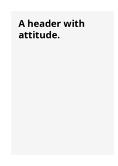

## 🔬 TAB-SIZE

### Input HTML & CSS

[📄 Input HTML](https://raw.githubusercontent.com/azettl/compare.html2pdf.tools/master//html/CSS%20Properties/T/tab-size.html)

    

        View TAB-SIZE Code
    

    <pre>
        <code>
            &lt;!DOCTYPE html&gt;
&lt;!-- Sample from https://css-tricks.com/almanac/properties/t/tab-size/ --&gt;
&lt;html lang=&quot;en&quot;&gt;
    &lt;head&gt;
        &lt;style&gt;
        p.fourtabs {
	tab-size:4;
	-moz-tab-size: 4;
	-o-tab-size:  4;
  white-space: pre-wrap;
}

pre.twelvetabs {
	tab-size: 12;
	-moz-tab-size: 12;
	-o-tab-size:  12;
}

h4 {
 color:#e08628;
 margin-bottom: 0px;
}

body {
 background-color:#efefef;
 color:#3c3c3c;
}
        &lt;/style&gt;
    &lt;/head&gt;
    &lt;body&gt;
    
&lt;h3&gt;Example 1&lt;/h3&gt;
&lt;h4&gt;&amp;lt;pre&amp;gt; with default tab-size of 8 space characters&lt;/h4&gt;
&lt;pre&gt;
without tab
	with 1 tab
		with 2 tabs
&lt;/pre&gt;

&lt;h3&gt;Example 2&lt;/h3&gt;

&lt;h4&gt;&amp;lt;p&amp;gt; with tab-size customized to 4 space characters and 'white-space: pre-wrap'&lt;/h4&gt;
&lt;p class=&quot;fourtabs&quot;&gt;without tab
	with 1 tab
		with 2 tabs		
&lt;/p&gt;
&lt;h4&gt;&amp;lt;p&amp;gt; with tab-size customized to 4 space characters, but without 'white-space: prewrap'&lt;/h4&gt;
&lt;p&gt;without tab
	with 1 tab
		with 2 tabs		
&lt;/p&gt;

&lt;h3&gt;Example 3&lt;/h3&gt;
&lt;h4&gt;&amp;lt;pre&amp;gt; with tab-size set to 12 space characters&lt;/h4&gt;
&lt;pre class=&quot;twelvetabs&quot;&gt;without tab
	with 1 tab
		with 2 tabs	
&lt;/pre&gt;
    &lt;/body&gt;
&lt;/html&gt;
        </code>
    </pre>

### Output PDF

| mPDF | typeset.sh | PDFreactor |
|---------|---------|---------|
|  |  |  |
| [📕 mPDF Output](mpdf__html_CSS_Properties_T_tab-size.html.pdf) | [📕 typeset Output](typeset__html_CSS_Properties_T_tab-size.html.pdf) | [📕 PDFreactor Output](pdfreactor__html_CSS_Properties_T_tab-size.html.pdf) |

## 🔬 TABLE-LAYOUT

### Input HTML & CSS

[📄 Input HTML](https://raw.githubusercontent.com/azettl/compare.html2pdf.tools/master//html/CSS%20Properties/T/table-layout.html)

    

        View TABLE-LAYOUT Code
    

    <pre>
        <code>
            &lt;!DOCTYPE html&gt;
&lt;!-- Sample from https://css-tricks.com/almanac/properties/t/table-layout/ --&gt;
&lt;html lang=&quot;en&quot;&gt;
    &lt;head&gt;
        &lt;style&gt;
        body {
  padding: 14px;
  text-align: center;
}

table {
  width: 100%;
  margin: 20px auto;
  table-layout: fixed;
}

.fixed {
  table-layout: fixed;
}

table,
td,
th {
  border-collapse: collapse;
}

th,
td {
  padding: 10px;
  border: solid 1px;
  text-align: center;
}
        &lt;/style&gt;
    &lt;/head&gt;
    &lt;body&gt;
        &lt;h2&gt;Using the &lt;code&gt;table-layout&lt;/code&gt; property&lt;/h2&gt;

        &lt;table id=&quot;t&quot;&gt;
          &lt;thead&gt;
            &lt;tr&gt;
              &lt;th&gt;Example text&lt;/th&gt;
              &lt;th&gt;Example text&lt;/th&gt;
              &lt;th&gt;Example text&lt;/th&gt;
              &lt;th&gt;Example text&lt;/th&gt;
            &lt;/tr&gt;
          &lt;/thead&gt;
          &lt;tbody&gt;
            &lt;tr&gt;
              &lt;td&gt;A much longer piece of content for demo purposes. More goes here.&lt;/td&gt;
              &lt;td&gt;Example text&lt;/td&gt;
              &lt;td&gt;Example text&lt;/td&gt;
              &lt;td&gt;Example text&lt;/td&gt;
            &lt;/tr&gt;
            &lt;tr&gt;
              &lt;td&gt;Example text&lt;/td&gt;
              &lt;td&gt;Example text&lt;/td&gt;
              &lt;td&gt;Example text&lt;/td&gt;
              &lt;td&gt;Example text&lt;/td&gt;
            &lt;/tr&gt;
          &lt;/tbody&gt;
          &lt;tfoot&gt;
            &lt;tr&gt;
              &lt;td&gt;Example text&lt;/td&gt;
              &lt;td&gt;Example text&lt;/td&gt;
              &lt;td&gt;Example text&lt;/td&gt;
              &lt;td&gt;Example text&lt;/td&gt;
            &lt;/tr&gt;
          &lt;/tfoot&gt;
        &lt;/table&gt;
        
        &lt;button class=&quot;tl&quot;&gt;&lt;b&gt;Toggle table-layout: fixed&lt;/b&gt;&lt;/button&gt;
    &lt;/body&gt;
&lt;/html&gt;
        </code>
    </pre>

### Output PDF

| mPDF | typeset.sh | PDFreactor |
|---------|---------|---------|
|  |  |  |
| [📕 mPDF Output](mpdf__html_CSS_Properties_T_table-layout.html.pdf) | [📕 typeset Output](typeset__html_CSS_Properties_T_table-layout.html.pdf) | [📕 PDFreactor Output](pdfreactor__html_CSS_Properties_T_table-layout.html.pdf) |

## 🔬 TEXT-ALIGN-LAST

### Input HTML & CSS

[📄 Input HTML](https://raw.githubusercontent.com/azettl/compare.html2pdf.tools/master//html/CSS%20Properties/T/text-align-last.html)

    

        View TEXT-ALIGN-LAST Code
    

    <pre>
        <code>
            &lt;!DOCTYPE html&gt;
&lt;!-- Sample from https://css-tricks.com/almanac/properties/t/text-align-last/ --&gt;
&lt;html lang=&quot;en&quot;&gt;
    &lt;head&gt;
        &lt;style&gt;
        #left { 
  -ms-text-align-last: left;
  -moz-text-align-last: left;
  text-align-last: left; 
}

#right { 
  -ms-text-align-last: right;
  -moz-text-align-last: right;
  text-align-last: right; 
}

#center { 
  -ms-text-align-last: center;
  -moz-text-align-last: center;
  text-align-last: center;
}

#justify { 
  -ms-text-align-last: justify;
  -moz-text-align-last: justify;
  text-align-last: justify; 
}

#start { 
  /* IE does not recognize text-align-last: start; */
  -moz-text-align-last: start;
  text-align-last: start; 
}

#end { 
  /* IE does not recognize text-align-last: end; */
  -moz-text-align-last: end;
  text-align-last: end; 
}

/* styling for Pen, unrelated to text-align-last */

body { font-family: sans-serif; }

div {
  width: 40%;
  padding: 2%;
  line-height: 1.2;
  border: 5px solid #E18728;
  text-align: justify;
  float: left;
  margin: 1%;
}
        &lt;/style&gt;
    &lt;/head&gt;
    &lt;body&gt;
        &lt;div id=&quot;left&quot;&gt;
            &lt;h2&gt;text-align-last: left; &lt;/h2&gt;
            &lt;p&gt;Lorem ipsum dolor sit amet, consectetur adipiscing elit. In metus mauris, blandit vitae auctor id, rhoncus id eros. Nullam sit amet nulla ac sapien eleifend ultrices. Curabitur ac dictum metus. Pellentesque ullamcorper dolor sit amet mi imperdiet egestas. Nam eu tellus sed nibh tincidunt rutrum eu sed augue. Cras vestibulum elementum tortor in gravida. Sed augue risus, tempor in justo non, fermentum faucibus nibh.&lt;/p&gt;
            &lt;/div&gt;
            &lt;div id=&quot;right&quot;&gt;
            &lt;h2&gt;text-align-last: right; &lt;/h2&gt;
            &lt;p&gt;Lorem ipsum dolor sit amet, consectetur adipiscing elit. In metus mauris, blandit vitae auctor id, rhoncus id eros. Nullam sit amet nulla ac sapien eleifend ultrices. Curabitur ac dictum metus. Pellentesque ullamcorper dolor sit amet mi imperdiet egestas. Nam eu tellus sed nibh tincidunt rutrum eu sed augue. Cras vestibulum elementum tortor in gravida. Sed augue risus, tempor in justo non, fermentum faucibus nibh.&lt;/p&gt;
            &lt;/div&gt;
            
            &lt;div id=&quot;center&quot;&gt;
            &lt;h2&gt;text-align-last: center;&lt;/h2&gt;
            &lt;p&gt;Lorem ipsum dolor sit amet, consectetur adipiscing elit. In metus mauris, blandit vitae auctor id, rhoncus id eros. Nullam sit amet nulla ac sapien eleifend ultrices. Curabitur ac dictum metus. Pellentesque ullamcorper dolor sit amet mi imperdiet egestas. Nam eu tellus sed nibh tincidunt rutrum eu sed augue. Cras vestibulum elementum tortor in gravida. Sed augue risus, tempor in justo non, fermentum faucibus nibh.&lt;/p&gt;
            &lt;/div&gt;
            
            &lt;div id=&quot;justify&quot;&gt;
            &lt;h2&gt;text-align-last: justify;&lt;/h2&gt;
            &lt;p&gt;Lorem ipsum dolor sit amet, consectetur adipiscing elit. In metus mauris, blandit vitae auctor id, rhoncus id eros. Nullam sit amet nulla ac sapien eleifend ultrices. Curabitur ac dictum metus. Pellentesque ullamcorper dolor sit amet mi imperdiet egestas. Nam eu tellus sed nibh tincidunt rutrum eu sed augue. Cras vestibulum elementum tortor in gravida. Sed augue risus, tempor in justo non, fermentum faucibus nibh.&lt;/p&gt;
            &lt;/div&gt;
            
            &lt;div id=&quot;start&quot;&gt;
            &lt;h2&gt;text-align-last: start;&lt;/h2&gt;
            &lt;p&gt;Lorem ipsum dolor sit amet, consectetur adipiscing elit. In metus mauris, blandit vitae auctor id, rhoncus id eros. Nullam sit amet nulla ac sapien eleifend ultrices. Curabitur ac dictum metus. Pellentesque ullamcorper dolor sit amet mi imperdiet egestas. Nam eu tellus sed nibh tincidunt rutrum eu sed augue. Cras vestibulum elementum tortor in gravida. Sed augue risus, tempor in justo non, fermentum faucibus nibh.&lt;/p&gt;
            &lt;/div&gt;
            &lt;div id=&quot;end&quot;&gt;
            &lt;h2&gt;text-align-last: end;&lt;/h2&gt;
            &lt;p&gt;Lorem ipsum dolor sit amet, consectetur adipiscing elit. In metus mauris, blandit vitae auctor id, rhoncus id eros. Nullam sit amet nulla ac sapien eleifend ultrices. Curabitur ac dictum metus. Pellentesque ullamcorper dolor sit amet mi imperdiet egestas. Nam eu tellus sed nibh tincidunt rutrum eu sed augue. Cras vestibulum elementum tortor in gravida. Sed augue risus, tempor in justo non, fermentum faucibus nibh.&lt;/p&gt;
            &lt;/div&gt;
    &lt;/body&gt;
&lt;/html&gt;
        </code>
    </pre>

### Output PDF

| mPDF | typeset.sh | PDFreactor |
|---------|---------|---------|
|  |  |  |
| [📕 mPDF Output](mpdf__html_CSS_Properties_T_text-align-last.html.pdf) | [📕 typeset Output](typeset__html_CSS_Properties_T_text-align-last.html.pdf) | [📕 PDFreactor Output](pdfreactor__html_CSS_Properties_T_text-align-last.html.pdf) |

## 🔬 TEXT-ALIGN

### Input HTML & CSS

[📄 Input HTML](https://raw.githubusercontent.com/azettl/compare.html2pdf.tools/master//html/CSS%20Properties/T/text-align.html)

    

        View TEXT-ALIGN Code
    

    <pre>
        <code>
            &lt;!DOCTYPE html&gt;
&lt;!-- Sample from https://www.w3schools.com/css/tryit.asp?filename=trycss_text-align --&gt;
&lt;html lang=&quot;en&quot;&gt;
    &lt;head&gt;
        &lt;style&gt;
        h1 {
  text-align: center;
}

h2 {
  text-align: left;
}

h3 {
  text-align: right;
}
        &lt;/style&gt;
    &lt;/head&gt;
    &lt;body&gt;
    
&lt;h1&gt;Heading 1 (center)&lt;/h1&gt;
&lt;h2&gt;Heading 2 (left)&lt;/h2&gt;
&lt;h3&gt;Heading 3 (right)&lt;/h3&gt;

&lt;p&gt;The three headings above are aligned center, left and right.&lt;/p&gt;

    &lt;/body&gt;
&lt;/html&gt;
        </code>
    </pre>

### Output PDF

| mPDF | typeset.sh | PDFreactor |
|---------|---------|---------|
|  |  |  |
| [📕 mPDF Output](mpdf__html_CSS_Properties_T_text-align.html.pdf) | [📕 typeset Output](typeset__html_CSS_Properties_T_text-align.html.pdf) | [📕 PDFreactor Output](pdfreactor__html_CSS_Properties_T_text-align.html.pdf) |

## 🔬 TEXT-DECORATION-COLOR

### Input HTML & CSS

[📄 Input HTML](https://raw.githubusercontent.com/azettl/compare.html2pdf.tools/master//html/CSS%20Properties/T/text-decoration-color.html)

    

        View TEXT-DECORATION-COLOR Code
    

    <pre>
        <code>
            &lt;!DOCTYPE html&gt;
&lt;!-- Sample from https://css-tricks.com/almanac/properties/t/text-decoration-color/ --&gt;
&lt;html lang=&quot;en&quot;&gt;
    &lt;head&gt;
        &lt;style&gt;
         p, a {
  text-decoration: underline;
  -webkit-text-decoration-color: #E18728;
  text-decoration-color: #E18728; 
 }

a:visited {
  -webkit-text-decoration-color: #94530D;
  text-decoration-color: #94530D; 
}

a:hover { 
  -webkit-text-decoration-color: #28B1E1;
  text-decoration-color: #28B1E1; 
}

a:active {
  -webkit-text-decoration-color: #006E94;
  text-decoration-color: #006E94; 
}

/* styling for Pen, unrelated to text-decoration-color */
body {
  font-family: sans-serif; 
  font-size: 2.5em;
}
        &lt;/style&gt;
    &lt;/head&gt;
    &lt;body&gt;
        &lt;p&gt;Check out my cool underline.&lt;/p&gt;

        &lt;a href=&quot;#&quot;&gt;I'm a link with a cool underline. Hover me!&lt;/a&gt;
        
    &lt;/body&gt;
&lt;/html&gt;
        </code>
    </pre>

### Output PDF

| mPDF | typeset.sh | PDFreactor |
|---------|---------|---------|
|  |  |  |
| [📕 mPDF Output](mpdf__html_CSS_Properties_T_text-decoration-color.html.pdf) | [📕 typeset Output](typeset__html_CSS_Properties_T_text-decoration-color.html.pdf) | [📕 PDFreactor Output](pdfreactor__html_CSS_Properties_T_text-decoration-color.html.pdf) |

## 🔬 TEXT-DECORATION-LINE

### Input HTML & CSS

[📄 Input HTML](https://raw.githubusercontent.com/azettl/compare.html2pdf.tools/master//html/CSS%20Properties/T/text-decoration-line.html)

    

        View TEXT-DECORATION-LINE Code
    

    <pre>
        <code>
            &lt;!DOCTYPE html&gt;
&lt;!-- Sample from https://css-tricks.com/almanac/properties/t/text-decoration-line/ --&gt;
&lt;html lang=&quot;en&quot;&gt;
    &lt;head&gt;
        &lt;style&gt;
        .underline {
  -webkit-text-decoration-line: underline;
  text-decoration-line: underline; 
}

.overline { 
  -webkit-text-decoration-line: overline;
  text-decoration-line: overline;
}

.line-through {
  -webkit-text-decoration-line: line-through;
  text-decoration-line: line-through;
}

.blink { 
  -webkit-text-decoration-line: blink;
  text-decoration-line: blink;
}

.multilines {
  -webkit-text-decoration-line: underline overline line-through;
  text-decoration-line: underline overline line-through;
}

/* Styling for Pen, unrelated to text-decoration-line */

body { 
  font-family: sans-serif;
  font-size: 2em;
}
        &lt;/style&gt;
    &lt;/head&gt;
    &lt;body&gt;
        &lt;p class=&quot;underline&quot;&gt;text-decoration-line: underline;&lt;/p&gt;
        &lt;p class=&quot;overline&quot;&gt;text-decoration-line: overline;&lt;/p&gt;
        &lt;p class=&quot;line-through&quot;&gt;text-decoration-line: line-through;&lt;/p&gt;
        &lt;p class=&quot;multilines&quot;&gt; text-decoration-line: underline overline line-through;&lt;/p&gt;
    &lt;/body&gt;
&lt;/html&gt;
        </code>
    </pre>

### Output PDF

| mPDF | typeset.sh | PDFreactor |
|---------|---------|---------|
|  |  |  |
| [📕 mPDF Output](mpdf__html_CSS_Properties_T_text-decoration-line.html.pdf) | [📕 typeset Output](typeset__html_CSS_Properties_T_text-decoration-line.html.pdf) | [📕 PDFreactor Output](pdfreactor__html_CSS_Properties_T_text-decoration-line.html.pdf) |

## 🔬 TEXT-DECORATION-SKIP-INK

### Input HTML & CSS

[📄 Input HTML](https://raw.githubusercontent.com/azettl/compare.html2pdf.tools/master//html/CSS%20Properties/T/text-decoration-skip-ink.html)

    

        View TEXT-DECORATION-SKIP-INK Code
    

    <pre>
        <code>
            &lt;!DOCTYPE html&gt;
&lt;!-- Sample from https://css-tricks.com/almanac/properties/t/text-decoration-skip-ink/ --&gt;
&lt;html lang=&quot;en&quot;&gt;
    &lt;head&gt;
        &lt;style&gt;
        .no-support {
  text-align: center;
  padding: 10px;
  width: 450px;
  margin-left: auto;
  margin-right: auto;
  background: #ee6620;
  color: #fff;
  font-size: 14px;
  font-family: sans-serif;
}

@supports(text-decoration-skip-ink: none) {
  .no-support {
    display: none;
  }
}

.example-wrapper {
  font-family: serif;
  width: 300px;
  margin-left: auto;
  margin-right: auto;
}

.underline {
  text-decoration: underline blue;
  font-size: 26px;
}

.skip-ink-auto {
  text-decoration-skip-ink: auto;
}

.skip-ink-none {
  text-decoration-skip-ink: none;
}
        &lt;/style&gt;
    &lt;/head&gt;
    &lt;body&gt;
        &lt;div class=&quot;no-support&quot;&gt;
            &lt;p&gt;Heads up: It doesn't look like your browser supports &lt;code&gt;text-decoration-skip-ink&lt;/code&gt;! Check &lt;a href=&quot;https://caniuse.com/#feat=text-decoration&quot;&gt;Can I use&lt;/a&gt; for current browser support. Maybe try opening this CodePen in a different browser that supports &lt;code&gt;text-decoration-skip-ink&lt;/code&gt;?&lt;/p&gt;
          &lt;/div&gt;
          
          &lt;div class=&quot;example-wrapper&quot;&gt;
            &lt;p&gt;&lt;code&gt;text-decoration-skip-ink: auto;&lt;/code&gt;
            &lt;p class=&quot;underline skip-ink-auto&quot;&gt;Great green gobs of greasy, grimy gopher guts&lt;/p&gt;
          &lt;/div&gt;
          
          &lt;div class=&quot;example-wrapper&quot;&gt;
            &lt;p&gt;&lt;code&gt;text-decoration-skip-ink: none;&lt;/code&gt;
            &lt;p class=&quot;underline skip-ink-none&quot;&gt;Great green gobs of greasy, grimy gopher guts&lt;/p&gt;
          &lt;/div&gt;
    &lt;/body&gt;
&lt;/html&gt;
        </code>
    </pre>

### Output PDF

| mPDF | typeset.sh | PDFreactor |
|---------|---------|---------|
|  |  |  |
| [📕 mPDF Output](mpdf__html_CSS_Properties_T_text-decoration-skip-ink.html.pdf) | [📕 typeset Output](typeset__html_CSS_Properties_T_text-decoration-skip-ink.html.pdf) | [📕 PDFreactor Output](pdfreactor__html_CSS_Properties_T_text-decoration-skip-ink.html.pdf) |

## 🔬 TEXT-DECORATION-SKIP

### Input HTML & CSS

[📄 Input HTML](https://raw.githubusercontent.com/azettl/compare.html2pdf.tools/master//html/CSS%20Properties/T/text-decoration-skip.html)

    

        View TEXT-DECORATION-SKIP Code
    

    <pre>
        <code>
            &lt;!DOCTYPE html&gt;
&lt;!-- Sample from https://css-tricks.com/almanac/properties/t/text-decoration-skip/ --&gt;
&lt;html lang=&quot;en&quot;&gt;
    &lt;head&gt;
        &lt;style&gt;
        p {
  font-size: 23px;
  font-family: Georgia;
}

a {
  color: blue;
}

.ink {
  text-decoration-skip: ink;
}
        &lt;/style&gt;
    &lt;/head&gt;
    &lt;body&gt;
        &lt;p&gt;An example of the default &lt;a href='https://css-tricks.com/almanac/properties/t/text-decoration-skip/'&gt;text-decoration style to compare&lt;/a&gt;&lt;/p&gt;

        &lt;p class='ink'&gt;An example of the &lt;a href='https://css-tricks.com/almanac/properties/t/text-decoration-skip/'&gt;very cool text-decoration-skip property&lt;/a&gt;&lt;/p&gt;
    &lt;/body&gt;
&lt;/html&gt;
        </code>
    </pre>

### Output PDF

| mPDF | typeset.sh | PDFreactor |
|---------|---------|---------|
|  |  |  |
| [📕 mPDF Output](mpdf__html_CSS_Properties_T_text-decoration-skip.html.pdf) | [📕 typeset Output](typeset__html_CSS_Properties_T_text-decoration-skip.html.pdf) | [📕 PDFreactor Output](pdfreactor__html_CSS_Properties_T_text-decoration-skip.html.pdf) |

## 🔬 TEXT-DECORATION-STYLE

### Input HTML & CSS

[📄 Input HTML](https://raw.githubusercontent.com/azettl/compare.html2pdf.tools/master//html/CSS%20Properties/T/text-decoration-style.html)

    

        View TEXT-DECORATION-STYLE Code
    

    <pre>
        <code>
            &lt;!DOCTYPE html&gt;
&lt;!-- Sample from https://www.w3schools.com/cssref/tryit.asp?filename=trycss3_text-decoration-style --&gt;
&lt;html lang=&quot;en&quot;&gt;
    &lt;head&gt;
        &lt;style&gt;
        div.a {
  text-decoration-line: underline;
  text-decoration-style: solid;
}

div.b {
  text-decoration-line: underline;
  text-decoration-style: wavy;
}

div.c {
  text-decoration-line: underline;
  text-decoration-style: double;
}

div.d {
  text-decoration-line: overline underline;
  text-decoration-style: wavy;
}
        &lt;/style&gt;
    &lt;/head&gt;
    &lt;body&gt;
    
&lt;h1&gt;The text-decoration-style Property&lt;/h1&gt;

&lt;div class=&quot;a&quot;&gt;This is some text with a solid underline.&lt;/div&gt;
&lt;br&gt;

&lt;div class=&quot;b&quot;&gt;This is some text with a wavy underline.&lt;/div&gt;
&lt;br&gt;

&lt;div class=&quot;c&quot;&gt;This is some text with a double underline.&lt;/div&gt;
&lt;br&gt;

&lt;div class=&quot;d&quot;&gt;This is some text with a wavy over- and underline.&lt;/div&gt;

    &lt;/body&gt;
&lt;/html&gt;
        </code>
    </pre>

### Output PDF

| mPDF | typeset.sh | PDFreactor |
|---------|---------|---------|
|  |  |  |
| [📕 mPDF Output](mpdf__html_CSS_Properties_T_text-decoration-style.html.pdf) | [📕 typeset Output](typeset__html_CSS_Properties_T_text-decoration-style.html.pdf) | [📕 PDFreactor Output](pdfreactor__html_CSS_Properties_T_text-decoration-style.html.pdf) |

## 🔬 TEXT-DECORATION

### Input HTML & CSS

[📄 Input HTML](https://raw.githubusercontent.com/azettl/compare.html2pdf.tools/master//html/CSS%20Properties/T/text-decoration.html)

    

        View TEXT-DECORATION Code
    

    <pre>
        <code>
            &lt;!DOCTYPE html&gt;
&lt;!-- Sample from https://css-tricks.com/almanac/properties/t/text-decoration/ --&gt;
&lt;html lang=&quot;en&quot;&gt;
    &lt;head&gt;
        &lt;style&gt;
        .underline {
  text-decoration: underline;
}
.overline {
  text-decoration: overline;
}
.strikethrough {
  text-decoration: line-through;
}
.multiple {
  text-decoration: underline overline line-through;
}
.blink {
  text-decoration: blink;
}
.wavy {
  text-decoration: red underline overline wavy;
}

body {
  padding: 1em 2em;
}
        &lt;/style&gt;
    &lt;/head&gt;
    &lt;body&gt;
        &lt;p class=&quot;underline&quot;&gt;text-decoration: underline;&lt;/p&gt;
        &lt;p class=&quot;overline&quot;&gt;text-decoration: overline;&lt;/p&gt;
        &lt;p class=&quot;strikethrough&quot;&gt;text-decoration: line-through;&lt;/p&gt;
        &lt;p class=&quot;multiple&quot;&gt;text-decoration: underline overline line-through;&lt;/p&gt;
        &lt;p class=&quot;blink&quot;&gt;text-decoration: blink;&lt;/p&gt;
        &lt;p class=&quot;wavy&quot;&gt;text-decoration: red underline overline wavy;&lt;/p&gt;
    &lt;/body&gt;
&lt;/html&gt;
        </code>
    </pre>

### Output PDF

| mPDF | typeset.sh | PDFreactor |
|---------|---------|---------|
|  |  |  |
| [📕 mPDF Output](mpdf__html_CSS_Properties_T_text-decoration.html.pdf) | [📕 typeset Output](typeset__html_CSS_Properties_T_text-decoration.html.pdf) | [📕 PDFreactor Output](pdfreactor__html_CSS_Properties_T_text-decoration.html.pdf) |

## 🔬 TEXT-INDENT

### Input HTML & CSS

[📄 Input HTML](https://raw.githubusercontent.com/azettl/compare.html2pdf.tools/master//html/CSS%20Properties/T/text-indent.html)

    

        View TEXT-INDENT Code
    

    <pre>
        <code>
            &lt;!DOCTYPE html&gt;
&lt;!-- Sample from https://css-tricks.com/almanac/properties/t/text-indent/ --&gt;
&lt;html lang=&quot;en&quot;&gt;
    &lt;head&gt;
        &lt;style&gt;
        article {
  padding: 1em;
}

.first {
  text-indent: 2em;
}

.second {
  text-indent: -2em;
}

.third {
  text-indent: 50%;
}

.fourth {
  text-indent: 100%;
}

        &lt;/style&gt;
    &lt;/head&gt;
    &lt;body&gt;
        &lt;article&gt;
            &lt;h2&gt;text-indent: 2em&lt;/h2&gt;
            &lt;p class=&quot;first&quot;&gt;Pellentesque habitant morbi tristique senectus et netus et malesuada fames ac turpis egestas. Vestibulum tortor quam, feugiat vitae, ultricies eget, tempor sit amet, ante. Donec eu libero sit amet quam egestas semper. Aenean ultricies mi vitae est. Mauris placerat eleifend leo.&lt;/p&gt;
            
            &lt;h2&gt;text-indent: -2em&lt;/h2&gt;
            &lt;p class=&quot;second&quot;&gt;Pellentesque habitant morbi tristique senectus et netus et malesuada fames ac turpis egestas. Vestibulum tortor quam, feugiat vitae, ultricies eget, tempor sit amet, ante. Donec eu libero sit amet quam egestas semper. Aenean ultricies mi vitae est. Mauris placerat eleifend leo.&lt;/p&gt;
            
            &lt;h2&gt;text-indent: 50%&lt;/h2&gt;
            &lt;p class=&quot;third&quot;&gt;Pellentesque habitant morbi tristique senectus et netus et malesuada fames ac turpis egestas. Vestibulum tortor quam, feugiat vitae, ultricies eget, tempor sit amet, ante. Donec eu libero sit amet quam egestas semper. Aenean ultricies mi vitae est. Mauris placerat eleifend leo
            
            &lt;h2&gt;text-indent: 100%&lt;/h2&gt;
            &lt;p class=&quot;fourth&quot;&gt;Pellentesque habitant morbi tristique senectus et netus et malesuada fames ac turpis egestas. Vestibulum tortor quam, feugiat vitae, ultricies eget, tempor sit amet, ante. Donec eu libero sit amet quam egestas semper. Aenean ultricies mi vitae est. Mauris placerat eleifend leo.&lt;/p&gt;
          &lt;/article&gt;
    &lt;/body&gt;
&lt;/html&gt;
        </code>
    </pre>

### Output PDF

| mPDF | typeset.sh | PDFreactor |
|---------|---------|---------|
|  |  |  |
| [📕 mPDF Output](mpdf__html_CSS_Properties_T_text-indent.html.pdf) | [📕 typeset Output](typeset__html_CSS_Properties_T_text-indent.html.pdf) | [📕 PDFreactor Output](pdfreactor__html_CSS_Properties_T_text-indent.html.pdf) |

## 🔬 TEXT-JUSTIFY

### Input HTML & CSS

[📄 Input HTML](https://raw.githubusercontent.com/azettl/compare.html2pdf.tools/master//html/CSS%20Properties/T/text-justify.html)

    

        View TEXT-JUSTIFY Code
    

    <pre>
        <code>
            &lt;!DOCTYPE html&gt;
&lt;!-- Sample from https://www.w3schools.com/cssref/tryit.asp?filename=trycss3_text-justify --&gt;
&lt;html lang=&quot;en&quot;&gt;
    &lt;head&gt;
        &lt;style&gt;
        div {
  text-align: justify;
  text-justify: inter-word;
  width:200px;
}
        &lt;/style&gt;
    &lt;/head&gt;
    &lt;body&gt;
        &lt;h1&gt;The text-justify Property&lt;/h1&gt;

        &lt;div&gt;In my younger and more vulnerable years my father gave me some advice that I've been turning over in my mind ever since. 'Whenever you feel like criticizing anyone,' he told me, 'just remember that all the people in this world haven't had the advantages that you've had.'&lt;/div&gt;
    &lt;/body&gt;
&lt;/html&gt;
        </code>
    </pre>

### Output PDF

| mPDF | typeset.sh | PDFreactor |
|---------|---------|---------|
|  |  |  |
| [📕 mPDF Output](mpdf__html_CSS_Properties_T_text-justify.html.pdf) | [📕 typeset Output](typeset__html_CSS_Properties_T_text-justify.html.pdf) | [📕 PDFreactor Output](pdfreactor__html_CSS_Properties_T_text-justify.html.pdf) |

## 🔬 TEXT-OVERFLOW

### Input HTML & CSS

[📄 Input HTML](https://raw.githubusercontent.com/azettl/compare.html2pdf.tools/master//html/CSS%20Properties/T/text-overflow.html)

    

        View TEXT-OVERFLOW Code
    

    <pre>
        <code>
            &lt;!DOCTYPE html&gt;
&lt;!-- Sample from https://css-tricks.com/almanac/properties/t/text-overflow/ --&gt;
&lt;html lang=&quot;en&quot;&gt;
    &lt;head&gt;
        &lt;style&gt;
        .overflow {
  	width: 10em;
  outline: 1px solid #000;
  margin: 0 0 2em 0;
  
  /**
   * Required properties to achieve text-overflow
   */
	  white-space: nowrap;
  	overflow: hidden;
}

body style {
  display: block;
  font: 14px monospace;
  padding: 3px;
  margin: 0 0 5px 0;
}

        &lt;/style&gt;
    &lt;/head&gt;
    &lt;body&gt;
        &lt;style&gt;.clip { text-overflow: clip; }&lt;/style&gt;
        &lt;p class=&quot;overflow clip&quot;&gt;This is an example text showing nothing interesting but the truncated content via text-overflow shorthand property.&lt;/p&gt;
        
        &lt;style&gt;.ellipsis { text-overflow: ellipsis; }&lt;/style&gt;
        &lt;p class=&quot;overflow ellipsis&quot;&gt;This is an example text showing nothing interesting but the truncated content via text-overflow shorthand property.&lt;/p&gt;
        
        &lt;style&gt;.word { text-overflow: ellipsis-word; }&lt;/style&gt;
        &lt;p class=&quot;overflow word&quot;&gt;This is an example text showing nothing interesting but the truncated content via text-overflow shorthand property.&lt;/p&gt;
        
        &lt;style&gt;.text { text-overflow: &quot;---&quot;; }&lt;/style&gt;
        &lt;p class=&quot;overflow text&quot;&gt;This is an example text showing nothing interesting but the truncated content via text-overflow shorthand property.&lt;/p&gt;
        
        &lt;style&gt;.double { text-overflow: ellipsis ellipsis; text-align: center; }&lt;/style&gt;
        &lt;p class=&quot;overflow double&quot;&gt;This is an example text showing nothing interesting but the truncated content via text-overflow shorthand property.&lt;/p&gt;
    &lt;/body&gt;
&lt;/html&gt;
        </code>
    </pre>

### Output PDF

| mPDF | typeset.sh | PDFreactor |
|---------|---------|---------|
|  |  |  |
| [📕 mPDF Output](mpdf__html_CSS_Properties_T_text-overflow.html.pdf) | [📕 typeset Output](typeset__html_CSS_Properties_T_text-overflow.html.pdf) | [📕 PDFreactor Output](pdfreactor__html_CSS_Properties_T_text-overflow.html.pdf) |

## 🔬 TEXT-SHADOW

### Input HTML & CSS

[📄 Input HTML](https://raw.githubusercontent.com/azettl/compare.html2pdf.tools/master//html/CSS%20Properties/T/text-shadow.html)

    

        View TEXT-SHADOW Code
    

    <pre>
        <code>
            &lt;!DOCTYPE html&gt;
&lt;!-- Sample from https://css-tricks.com/almanac/properties/t/text-shadow/ --&gt;
&lt;html lang=&quot;en&quot;&gt;
    &lt;head&gt;
        &lt;style&gt;
        h1 {
  text-align: center;
  font: bold 80px Sans-Serif;
  padding: 40px 0;
}

.simple {
  background: #91877b;
  text-shadow: 0 1px 0 rgba(255, 255, 255, 0.4);
}

.otto {
  background: #0e8dbc;
  color: white;
  text-shadow: 0 1px 0 #ccc,
               0 2px 0 #c9c9c9,
               0 3px 0 #bbb,
               0 4px 0 #b9b9b9,
               0 5px 0 #aaa,
               0 6px 1px rgba(0,0,0,.1),
               0 0 5px rgba(0,0,0,.1),
               0 1px 3px rgba(0,0,0,.3),
               0 3px 5px rgba(0,0,0,.2),
               0 5px 10px rgba(0,0,0,.25),
               0 10px 10px rgba(0,0,0,.2),
               0 20px 20px rgba(0,0,0,.15);
}

.relief {
  background-color: #3a50d9;
  color: #e0eff2;
  font: italic bold 100px Georgia, Serif;
  text-shadow: -4px 3px 0 #3a50d9, -14px 7px 0 #0a0e27;
}

.close {
  background-color: #fff;	
  color: #202c2d;
  text-shadow:
    0 1px #808d93,
    -1px 0 #cdd2d5,
    -1px 2px #808d93,
    -2px 1px #cdd2d5,
    -2px 3px #808d93,
    -3px 2px #cdd2d5,
    -3px 4px #808d93,
    -4px 3px #cdd2d5,
    -4px 5px #808d93,
    -5px 4px #cdd2d5,
    -5px 6px #808d93,
    -6px 5px #cdd2d5,
    -6px 7px #808d93,
    -7px 6px #cdd2d5,
    -7px 8px #808d93,
    -8px 7px #cdd2d5;
}

.printers {
  background-color: #edde9c;
  color: #bc2e1e;
  text-shadow:
    0 1px 0px #378ab4,
    1px 0 0px #5dabcd,
    1px 2px 1px #378ab4,
    2px 1px 1px #5dabcd,
    2px 3px 2px #378ab4,
    3px 2px 2px #5dabcd,
    3px 4px 2px #378ab4,
    4px 3px 3px #5dabcd,
    4px 5px 3px #378ab4,
    5px 4px 2px #5dabcd,
    5px 6px 2px #378ab4,
    6px 5px 2px #5dabcd,
    6px 7px 1px #378ab4,
    7px 6px 1px #5dabcd,
    7px 8px 0px #378ab4,
    8px 7px 0px #5dabcd;
}

.glow {
  color: #444;
  text-shadow: 
    1px 0px 1px #ccc, 0px 1px 1px #eee, 
    2px 1px 1px #ccc, 1px 2px 1px #eee,
    3px 2px 1px #ccc, 2px 3px 1px #eee,
    4px 3px 1px #ccc, 3px 4px 1px #eee,
    5px 4px 1px #ccc, 4px 5px 1px #eee,
    6px 5px 1px #ccc, 5px 6px 1px #eee,
    7px 6px 1px #ccc;
}

.vamp {
  color: #92a5de;
  background: red;
  text-shadow:0px 0px 0 rgb(137,156,213),1px 1px 0 rgb(129,148,205),2px 2px 0 rgb(120,139,196),3px 3px 0 rgb(111,130,187),4px 4px 0 rgb(103,122,179),5px 5px 0 rgb(94,113,170),6px 6px 0 rgb(85,104,161),7px 7px 0 rgb(76,95,152),8px 8px 0 rgb(68,87,144),9px 9px 0 rgb(59,78,135),10px 10px 0 rgb(50,69,126),11px 11px 0 rgb(42,61,118),12px 12px 0 rgb(33,52,109),13px 13px 0 rgb(24,43,100),14px 14px 0 rgb(15,34,91),15px 15px 0 rgb(7,26,83),16px 16px 0 rgb(-2,17,74),17px 17px 0 rgb(-11,8,65),18px 18px 0 rgb(-19,0,57),19px 19px 0 rgb(-28,-9,48), 20px 20px 0 rgb(-37,-18,39),21px 21px 20px rgba(0,0,0,1),21px 21px 1px rgba(0,0,0,0.5),0px 0px 20px rgba(0,0,0,.2);
}
        &lt;/style&gt;
    &lt;/head&gt;
    &lt;body&gt;
        &lt;h1 class=&quot;simple&quot;&gt;
            Monster Mash
          &lt;/h1&gt;
          &lt;h1 class=&quot;otto&quot;&gt;
            Slippery Slime
          &lt;/h1&gt;
          &lt;h1 class=&quot;relief&quot;&gt;
            Mummy Mommy
          &lt;/h1&gt;
          &lt;h1 class=&quot;close&quot;&gt;
            Graveyard Smash
          &lt;/h1&gt;
          &lt;h1 class=&quot;printers&quot;&gt;
            Skeleton Crew
          &lt;/h1&gt;
          &lt;h1 class=&quot;glow&quot;&gt;
            Smooth Zombie
          &lt;/h1&gt;
          &lt;h1 class=&quot;vamp&quot;&gt;
            Vampire Diaries
          &lt;/h1&gt;
    &lt;/body&gt;
&lt;/html&gt;
        </code>
    </pre>

### Output PDF

| mPDF | typeset.sh | PDFreactor |
|---------|---------|---------|
|  |  |  |
| [📕 mPDF Output](mpdf__html_CSS_Properties_T_text-shadow.html.pdf) | [📕 typeset Output](typeset__html_CSS_Properties_T_text-shadow.html.pdf) | [📕 PDFreactor Output](pdfreactor__html_CSS_Properties_T_text-shadow.html.pdf) |

## 🔬 TEXT-STROKE

### Input HTML & CSS

[📄 Input HTML](https://raw.githubusercontent.com/azettl/compare.html2pdf.tools/master//html/CSS%20Properties/T/text-stroke.html)

    

        View TEXT-STROKE Code
    

    <pre>
        <code>
            &lt;!DOCTYPE html&gt;
&lt;!-- Sample from https://css-tricks.com/almanac/properties/t/text-stroke/ --&gt;
&lt;html lang=&quot;en&quot;&gt;
    &lt;head&gt;
        &lt;style&gt;
        body {
  padding: 0 0 0 3em;
  background: whitesmoke;
}

h1 {
  font-size: 4em;
  -webkit-text-stroke: 3px darkgrey;
  -webkit-text-fill-color: white;
}

        &lt;/style&gt;
    &lt;/head&gt;
    &lt;body&gt;
        &lt;h1&gt;A header with attitude.&lt;/h1&gt;
    &lt;/body&gt;
&lt;/html&gt;
        </code>
    </pre>

### Output PDF

| mPDF | typeset.sh | PDFreactor |
|---------|---------|---------|
|  |  |  |
| [📕 mPDF Output](mpdf__html_CSS_Properties_T_text-stroke.html.pdf) | [📕 typeset Output](typeset__html_CSS_Properties_T_text-stroke.html.pdf) | [📕 PDFreactor Output](pdfreactor__html_CSS_Properties_T_text-stroke.html.pdf) |

## 🔬 TEXT-TRANSFORM

### Input HTML & CSS

[📄 Input HTML](https://raw.githubusercontent.com/azettl/compare.html2pdf.tools/master//html/CSS%20Properties/T/text-transform.html)

    

        View TEXT-TRANSFORM Code
    

    <pre>
        <code>
            &lt;!DOCTYPE html&gt;
&lt;!-- Sample from https://css-tricks.com/almanac/properties/t/text-transform/ --&gt;
&lt;html lang=&quot;en&quot;&gt;
    &lt;head&gt;
        &lt;style&gt;
        .lowercase {text-transform: lowercase; }
.uppercase { text-transform: uppercase; }
.capitalize { text-transform: capitalize; }

hr { margin: 2.5em 0; }
        &lt;/style&gt;
    &lt;/head&gt;
    &lt;body&gt;
        &lt;p&gt;&lt;strong&gt;text-transform: lowercase;&lt;/strong&gt;&lt;/p&gt;
        &lt;p class=&quot;lowercase&quot;&gt;THIS WILL BE TRANSFORMED TO LOWERCASE.&lt;/p&gt;
        &lt;hr&gt;
        &lt;p&gt;&lt;strong&gt;text-transform: uppercase;&lt;/strong&gt;&lt;/p&gt;
        &lt;p class=&quot;uppercase&quot;&gt;this will be transformed to uppercase.&lt;/p&gt;
        &lt;hr&gt;
        &lt;p&gt;&lt;strong&gt;text-transform: capitalize; &lt;/strong&gt;&lt;/p&gt;
        &lt;p class=&quot;capitalize&quot;&gt;This will be transformed to capitalize all words, including both parts of this hyphenated word: double-parked.&lt;/p&gt;
        &lt;p class=&quot;capitalize&quot;&gt;&quot;These words are in 'quotes'.&quot;&lt;/p&gt;
        &lt;p class=&quot;capitalize&quot;&gt;This text includes a date: February 4th, 2015.&lt;/p&gt;
        &lt;p class=&quot;capitalize&quot;&gt;This text includes an acronym: CSS.&lt;/p&gt;
        
    &lt;/body&gt;
&lt;/html&gt;
        </code>
    </pre>

### Output PDF

| mPDF | typeset.sh | PDFreactor |
|---------|---------|---------|
|  |  |  |
| [📕 mPDF Output](mpdf__html_CSS_Properties_T_text-transform.html.pdf) | [📕 typeset Output](typeset__html_CSS_Properties_T_text-transform.html.pdf) | [📕 PDFreactor Output](pdfreactor__html_CSS_Properties_T_text-transform.html.pdf) |

## 🔬 TEXT-UNDERLINE-OFFSET

### Input HTML & CSS

[📄 Input HTML](https://raw.githubusercontent.com/azettl/compare.html2pdf.tools/master//html/CSS%20Properties/T/text-underline-offset.html)

    

        View TEXT-UNDERLINE-OFFSET Code
    

    <pre>
        <code>
            &lt;!DOCTYPE html&gt;
&lt;!-- Sample from https://css-tricks.com/almanac/properties/t/text-underline-offset/ --&gt;
&lt;html lang=&quot;en&quot;&gt;
    &lt;head&gt;
        &lt;style&gt;
        .fixed h1 {
  text-underline-offset: 8px;
}

.relative h1 {
  text-underline-offset: 0.5em;
}

h1:first-child {
  font-size: 16px; 
}

h1:last-child {
  font-size: 60px;
}

section {
  display: flex;
  flex-wrap: wrap;
  min-height: 100vh;
}

.demo {
  padding: 2rem;
  flex-grow: 1;
  display: flex;
  flex-direction: column;
  align-items: center;
  justify-content: space-around;
}

.fixed {
  background-color: #FA5900;
}

.relative {
  background-color: #0C5BB6;
}

h1 {
  color: #fff;
  font-family: cursive;
  text-align: center;
  text-decoration: underline;  
}

@supports not (text-underline-offset: auto) {
  section::before {    
    content: &quot;Your browser doesn't support text-underline-offset&quot;;
    display: block;
    color: #e43;
    font-weight: bold;
    background-color: #fff;
    padding: 1em;
    position: fixed;
    top: 20px;
    left: 0;
    right: 0;
    text-align: center;
  }
}
        &lt;/style&gt;
    &lt;/head&gt;
    &lt;body&gt;
        &lt;section&gt;
            &lt;div class=&quot;demo fixed&quot;&gt;
              &lt;h1&gt;using offset&lt;/h1&gt;
              &lt;h1&gt;using px&lt;/h1&gt;
            &lt;/div&gt;
            &lt;div class=&quot;demo relative&quot;&gt;
              &lt;h1&gt;using offset&lt;/h1&gt;
              &lt;h1&gt;using em&lt;/h1&gt;
            &lt;/div&gt;
          &lt;/section&gt;
    &lt;/body&gt;
&lt;/html&gt;
        </code>
    </pre>

### Output PDF

| mPDF | typeset.sh | PDFreactor |
|---------|---------|---------|
|  |  |  |
| [📕 mPDF Output](mpdf__html_CSS_Properties_T_text-underline-offset.html.pdf) | [📕 typeset Output](typeset__html_CSS_Properties_T_text-underline-offset.html.pdf) | [📕 PDFreactor Output](pdfreactor__html_CSS_Properties_T_text-underline-offset.html.pdf) |

## 🔬 TEXT-UNDERLINE-POSITION

### Input HTML & CSS

[📄 Input HTML](https://raw.githubusercontent.com/azettl/compare.html2pdf.tools/master//html/CSS%20Properties/T/text-underline-position.html)

    

        View TEXT-UNDERLINE-POSITION Code
    

    <pre>
        <code>
            &lt;!DOCTYPE html&gt;
&lt;!-- Sample from https://css-tricks.com/almanac/properties/t/text-underline-position/ --&gt;
&lt;html lang=&quot;en&quot;&gt;
    &lt;head&gt;
        &lt;style&gt;
        p { text-decoration: underline; }

.under-below { 
  -webkit-text-underline-position: under;
  -ms-text-underline-position: below;
  text-underline-position: under; 
}

/* styling for Pen, unrelated to text-underline-position */

body { 
  font-size: 2em; 
  font-family: sans-serif;
}
        &lt;/style&gt;
    &lt;/head&gt;
    &lt;body&gt;
        &lt;p class=&quot;under-below&quot;&gt;Hey, get some yellow spaghetti squash.&lt;/p&gt;
    &lt;/body&gt;
&lt;/html&gt;
        </code>
    </pre>

### Output PDF

| mPDF | typeset.sh | PDFreactor |
|---------|---------|---------|
|  |  |  |
| [📕 mPDF Output](mpdf__html_CSS_Properties_T_text-underline-position.html.pdf) | [📕 typeset Output](typeset__html_CSS_Properties_T_text-underline-position.html.pdf) | [📕 PDFreactor Output](pdfreactor__html_CSS_Properties_T_text-underline-position.html.pdf) |

## 🔬 TOP

### Input HTML & CSS

[📄 Input HTML](https://raw.githubusercontent.com/azettl/compare.html2pdf.tools/master//html/CSS%20Properties/T/top.html)

    

        View TOP Code
    

    <pre>
        <code>
            &lt;!DOCTYPE html&gt;
&lt;!-- Sample from https://css-tricks.com/almanac/properties/t/top-right-bottom-left/ --&gt;
&lt;html lang=&quot;en&quot;&gt;
    &lt;head&gt;
        &lt;style&gt;
        body {
  padding: 40px 0;
}

.box {
  width: 10rem;
  height: 10rem;
  display: flex;
  justify-content: center;
  align-items: center;
  background-color: Silver;
  position: relative;
}

.box--positive {
  top: 50px;
}

.box--negative {
  top: -50px;
}

.outline {
  display: inline-block;
  border: 2px dashed black;
  margin: 40px 0 0 40px;
}
        &lt;/style&gt;
    &lt;/head&gt;
    &lt;body&gt;
        &lt;div class=&quot;outline&quot;&gt;
            &lt;div class=&quot;box box--positive&quot;&gt;
              &lt;pre&gt;positive&lt;/pre&gt;
            &lt;/div&gt;
          &lt;/div&gt;
          
          &lt;div class=&quot;outline&quot;&gt;
            &lt;div class=&quot;box box--negative&quot;&gt;
              &lt;pre&gt;negative&lt;/pre&gt;
            &lt;/div&gt;
          &lt;/div&gt;
    &lt;/body&gt;
&lt;/html&gt;
        </code>
    </pre>

### Output PDF

| mPDF | typeset.sh | PDFreactor |
|---------|---------|---------|
|  |  |  |
| [📕 mPDF Output](mpdf__html_CSS_Properties_T_top.html.pdf) | [📕 typeset Output](typeset__html_CSS_Properties_T_top.html.pdf) | [📕 PDFreactor Output](pdfreactor__html_CSS_Properties_T_top.html.pdf) |

## 🔬 TRANSFORM-ORIGIN

### Input HTML & CSS

[📄 Input HTML](https://raw.githubusercontent.com/azettl/compare.html2pdf.tools/master//html/CSS%20Properties/T/transform-origin.html)

    

        View TRANSFORM-ORIGIN Code
    

    <pre>
        <code>
            &lt;!DOCTYPE html&gt;
&lt;!-- Sample from https://www.w3schools.com/cssref/tryit.asp?filename=trycss3_transform-origin --&gt;
&lt;html lang=&quot;en&quot;&gt;
    &lt;head&gt;
        &lt;style&gt;
      #div1 {
  position: relative;
  height: 200px;
  width: 200px;
  margin: 100px;
  padding: 10px;
  border: 1px solid black;
}

#div2 {
  padding: 50px;
  position: absolute;
  border: 1px solid black;
  background-color: red;
  -ms-transform: rotate(45deg); /* IE 9 */
  -ms-transform-origin: 20% 40%; /* IE 9 */
  transform: rotate(45deg);
  transform-origin: 20% 40%;
}  
        &lt;/style&gt;
    &lt;/head&gt;
    &lt;body&gt;
    
&lt;h1&gt;The transform-origin Property&lt;/h1&gt;

&lt;div id=&quot;div1&quot;&gt;
  &lt;div id=&quot;div2&quot;&gt;HELLO&lt;/div&gt;
&lt;/div&gt;

    &lt;/body&gt;
&lt;/html&gt;
        </code>
    </pre>

### Output PDF

| mPDF | typeset.sh | PDFreactor |
|---------|---------|---------|
|  |  |  |
| [📕 mPDF Output](mpdf__html_CSS_Properties_T_transform-origin.html.pdf) | [📕 typeset Output](typeset__html_CSS_Properties_T_transform-origin.html.pdf) | [📕 PDFreactor Output](pdfreactor__html_CSS_Properties_T_transform-origin.html.pdf) |

## 🔬 TRANSFORM-STYLE

### Input HTML & CSS

[📄 Input HTML](https://raw.githubusercontent.com/azettl/compare.html2pdf.tools/master//html/CSS%20Properties/T/transform-style.html)

    

        View TRANSFORM-STYLE Code
    

    <pre>
        <code>
            &lt;!DOCTYPE html&gt;
&lt;!-- Sample from https://www.w3schools.com/cssref/tryit.asp?filename=trycss3_transform-style --&gt;
&lt;html lang=&quot;en&quot;&gt;
    &lt;head&gt;
        &lt;style&gt;
        #div1 {
  position: relative;
  height: 200px;
  width: 200px;
  margin: 100px;
  padding: 10px;
  border: 1px solid black;
}

#div2 {
  padding: 50px;
  position: absolute;
  border: 1px solid black;
  background-color: red;
  transform: rotateY(60deg);
  transform-style: preserve-3d;
}

#div3 {
  padding: 40px;
  position: absolute;
  border: 1px solid black;
  background-color: yellow;
  transform: rotateY(-60deg);

}
        &lt;/style&gt;
    &lt;/head&gt;
    &lt;body&gt;
        &lt;h1&gt;The transform-style Property&lt;/h1&gt;

        &lt;div id=&quot;div1&quot;&gt;
          &lt;div id=&quot;div2&quot;&gt;HELLO
          &lt;div id=&quot;div3&quot;&gt;YELLOW&lt;/div&gt;
          &lt;/div&gt;
        &lt;/div&gt;
    &lt;/body&gt;
&lt;/html&gt;
        </code>
    </pre>

### Output PDF

| mPDF | typeset.sh | PDFreactor |
|---------|---------|---------|
|  |  |  |
| [📕 mPDF Output](mpdf__html_CSS_Properties_T_transform-style.html.pdf) | [📕 typeset Output](typeset__html_CSS_Properties_T_transform-style.html.pdf) | [📕 PDFreactor Output](pdfreactor__html_CSS_Properties_T_transform-style.html.pdf) |

## 🔬 TRANSFORM

### Input HTML & CSS

[📄 Input HTML](https://raw.githubusercontent.com/azettl/compare.html2pdf.tools/master//html/CSS%20Properties/T/transform.html)

    

        View TRANSFORM Code
    

    <pre>
        <code>
            &lt;!DOCTYPE html&gt;
&lt;!-- Sample from https://css-tricks.com/almanac/properties/t/transform/ --&gt;
&lt;html lang=&quot;en&quot;&gt;
    &lt;head&gt;
        &lt;style&gt;
        .element {
  background-color: #0074d9;
  height: 20px;
  width: 20px;
  -webkit-transform: scale(20);
          transform: scale(20);
  font-size: 1px;
  padding: 1px;
  color: white;
  line-height: 2px;
}

body, html {
  height: 100%;
}

body {
  display: -webkit-box;
  display: flex;
  -webkit-box-align: center;
          align-items: center;
  -webkit-box-pack: center;
          justify-content: center;
  padding: 0;
  font-family: Helvetica, sans-serif;
}

        &lt;/style&gt;
    &lt;/head&gt;
    &lt;body&gt;
        &lt;div class=&quot;element&quot;&gt;
            This element is 20px wide and 20px tall but, with the scale function set to 20, it is now 400px wide and 400px tall. Text, padding and margins are also effected by this property.
            &lt;/div&gt;
    &lt;/body&gt;
&lt;/html&gt;
        </code>
    </pre>

### Output PDF

| mPDF | typeset.sh | PDFreactor |
|---------|---------|---------|
|  |  |  |
| [📕 mPDF Output](mpdf__html_CSS_Properties_T_transform.html.pdf) | [📕 typeset Output](typeset__html_CSS_Properties_T_transform.html.pdf) | [📕 PDFreactor Output](pdfreactor__html_CSS_Properties_T_transform.html.pdf) |

