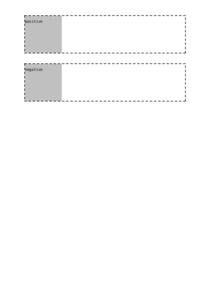
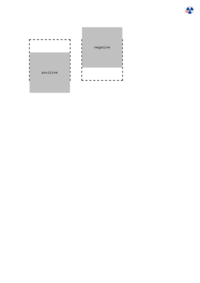

# TOP

See the Rendering results for [top.html](/html/CSS%20Properties/T/top.html):

## mPDF
 

Link to PDF: [mpdf__html_CSS_Properties_T_top.html.pdf](mpdf__html_CSS_Properties_T_top.html.pdf)

## typeset.sh
 

Link to PDF: [typeset__html_CSS_Properties_T_top.html.pdf](typeset__html_CSS_Properties_T_top.html.pdf)

## PDFreactor
 

Link to PDF: [pdfreactor__html_CSS_Properties_T_top.html.pdf](pdfreactor__html_CSS_Properties_T_top.html.pdf)
