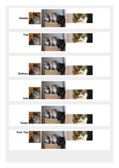

## 🔬 VERTICAL-ALIGN

### Input HTML & CSS

[📄 Input HTML](https://raw.githubusercontent.com/azettl/compare.html2pdf.tools/master//html/CSS%20Properties/V/vertical-align.html)

    

        View VERTICAL-ALIGN Code
    

    <pre><code class="hljs xml">&lt;!DOCTYPE html&gt;
&lt;!-- Sample from https://css-tricks.com/almanac/properties/v/vertical-align/ --&gt;
&lt;html lang="en"&gt;
    &lt;head&gt;
        &lt;style&gt;
        .middle &gt; * {
  vertical-align: middle;
}

.top &gt; * {
  vertical-align: top;
}

.bottom &gt; * {
  vertical-align: bottom;
}

.sub &gt; * {
  vertical-align: sub;
}

.super &gt; * {
  vertical-align: super;
}

.text-top &gt; * {
  vertical-align: text-top;
}

.text-bottom &gt; * {
  vertical-align: text-bottom;
}

.baseline &gt; * {
  vertical-align: baseline;
}

.pixel &gt; * {
  vertical-align: 30px;
}

.percentage &gt; * {
  vertical-align: -500%;
}

body {
  padding: 20px;
  background: #eee;
}

h2 {
  display: inline-block;
  margin: 0;
  width: 150px;
  text-align: right;
  font: bold 20px Sans-Serif;
}

div {
  margin: 0 0 30px 0;
  padding: 10px;
  background: white;
  white-space: nowrap;
}
        &lt;/style&gt;
    &lt;/head&gt;
    &lt;body&gt;
        &lt;div class="middle"&gt;
            &lt;h2&gt;Middle&lt;/h2&gt;
            &lt;img src="http://placekitten.com/100/100"&gt;
            &lt;img src="http://placekitten.com/200/150"&gt;
            &lt;img src="http://placekitten.com/220/80"&gt;
          &lt;/div&gt;
          
          &lt;div class="top"&gt;
            &lt;h2&gt;Top&lt;/h2&gt;
            &lt;img src="http://placekitten.com/100/100"&gt;
            &lt;img src="http://placekitten.com/200/150"&gt;
            &lt;img src="http://placekitten.com/220/80"&gt;
          &lt;/div&gt;
          
          &lt;div class="bottom"&gt;
            &lt;h2&gt;Bottom&lt;/h2&gt;
            &lt;img src="http://placekitten.com/100/100"&gt;
            &lt;img src="http://placekitten.com/200/150"&gt;
            &lt;img src="http://placekitten.com/220/80"&gt;
          &lt;/div&gt;
          
          &lt;div class="sub"&gt;
            &lt;h2&gt;Sub&lt;/h2&gt;
            &lt;img src="http://placekitten.com/100/100"&gt;
            &lt;img src="http://placekitten.com/200/150"&gt;
            &lt;img src="http://placekitten.com/220/80"&gt;
          &lt;/div&gt;
          
          &lt;div class="super"&gt;
            &lt;h2&gt;Super&lt;/h2&gt;
            &lt;img src="http://placekitten.com/100/100"&gt;
            &lt;img src="http://placekitten.com/200/150"&gt;
            &lt;img src="http://placekitten.com/220/80"&gt;
          &lt;/div&gt;
          
          &lt;div class="text-top"&gt;
            &lt;h2&gt;Text Top&lt;/h2&gt;
            &lt;img src="http://placekitten.com/100/100"&gt;
            &lt;img src="http://placekitten.com/200/150"&gt;
            &lt;img src="http://placekitten.com/220/80"&gt;
          &lt;/div&gt;
          
          &lt;div class="text-bottom"&gt;
            &lt;h2&gt;Text Bottom&lt;/h2&gt;
            &lt;img src="http://placekitten.com/100/100"&gt;
            &lt;img src="http://placekitten.com/200/150"&gt;
            &lt;img src="http://placekitten.com/220/80"&gt;
          &lt;/div&gt;
          
          &lt;div class="baseline"&gt;
            &lt;h2&gt;Baseline&lt;/h2&gt;
            &lt;img src="http://placekitten.com/100/100"&gt;
            &lt;img src="http://placekitten.com/200/150"&gt;
            &lt;img src="http://placekitten.com/220/80"&gt;
          &lt;/div&gt;
          
          &lt;div class="pixel"&gt;
            &lt;h2&gt;30px&lt;/h2&gt;
            &lt;img src="http://placekitten.com/100/100"&gt;
            &lt;img src="http://placekitten.com/200/150"&gt;
            &lt;img src="http://placekitten.com/220/80"&gt;
          &lt;/div&gt;
          
          &lt;div class="percentage"&gt;
            &lt;h2&gt;-500%&lt;/h2&gt;
            &lt;img src="http://placekitten.com/100/100"&gt;
            &lt;img src="http://placekitten.com/200/150"&gt;
            &lt;img src="http://placekitten.com/220/80"&gt;
          &lt;/div&gt;
            
    &lt;/body&gt;
&lt;/html&gt;</code><button class='button-code-copy'>📋 Copy Code</button></pre>

### Output PDF

| mPDF | typeset.sh | PDFreactor | wkhtmltopdf
|---------|---------|---------|---------|
|  |  |  |  |
| [📕 mPDF Output](mpdf__html_CSS_Properties_V_vertical-align.html.pdf) | [📕 typeset Output](typeset__html_CSS_Properties_V_vertical-align.html.pdf) | [📕 PDFreactor Output](pdfreactor__html_CSS_Properties_V_vertical-align.html.pdf) | [📕 wkhtmltopdf Output](wkhtmltopdf__html_CSS_Properties_V_vertical-align.html.pdf) |

## 🔬 VISIBILITY

### Input HTML & CSS

[📄 Input HTML](https://raw.githubusercontent.com/azettl/compare.html2pdf.tools/master//html/CSS%20Properties/V/visibility.html)

    

        View VISIBILITY Code
    

    <pre><code class="hljs xml">&lt;!DOCTYPE html&gt;
&lt;!-- Sample from https://css-tricks.com/almanac/properties/v/visibility/ --&gt;
&lt;html lang="en"&gt;
    &lt;head&gt;
        &lt;style&gt;
        .hidden {
  visibility: hidden;
  background: pink;
  border: 10px dotted teal;
  padding: 10px;
}

.visible {
  border: 1px solid black;
  visibility: visible;
}

        &lt;/style&gt;
    &lt;/head&gt;
    &lt;body&gt;
        &lt;div class="hidden"&gt;
            Hi, I'm hidden. Notice that all of my styling is hidden as well, and that I still take up space, even though you can't see me.
            &lt;div class="visible"&gt;
              Howdy, my parent element is hidden, but I'm still visible. &lt;br&gt;Hover over me to make my parent visible.
            &lt;/div&gt;
          &lt;/div&gt;
    &lt;/body&gt;
&lt;/html&gt;</code><button class='button-code-copy'>📋 Copy Code</button></pre>

### Output PDF

| mPDF | typeset.sh | PDFreactor | wkhtmltopdf
|---------|---------|---------|---------|
|  |  |  |  |
| [📕 mPDF Output](mpdf__html_CSS_Properties_V_visibility.html.pdf) | [📕 typeset Output](typeset__html_CSS_Properties_V_visibility.html.pdf) | [📕 PDFreactor Output](pdfreactor__html_CSS_Properties_V_visibility.html.pdf) | [📕 wkhtmltopdf Output](wkhtmltopdf__html_CSS_Properties_V_visibility.html.pdf) |

