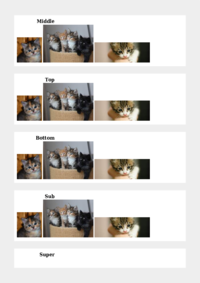
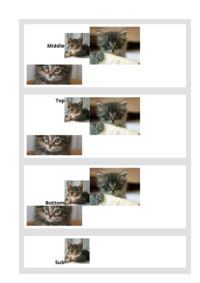
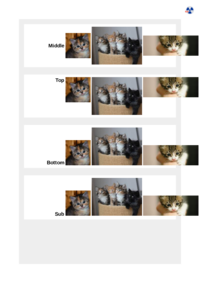
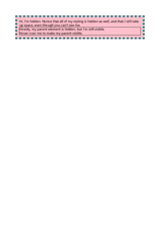

# V
| HTML File | mPDF Result | typeset.sh Result | PDFreactor Result |
|---------|---------|---------|---------|
| [vertical-align.html](/html/CSS%20Properties/V/vertical-align.html) |  [mpdf__html_CSS_Properties_V_vertical-align.html.pdf](mpdf__html_CSS_Properties_V_vertical-align.html.pdf) |  [typeset__html_CSS_Properties_V_vertical-align.html.pdf](typeset__html_CSS_Properties_V_vertical-align.html.pdf) |  [pdfreactor__html_CSS_Properties_V_vertical-align.html.pdf](pdfreactor__html_CSS_Properties_V_vertical-align.html.pdf) |
| [visibility.html](/html/CSS%20Properties/V/visibility.html) |  [mpdf__html_CSS_Properties_V_visibility.html.pdf](mpdf__html_CSS_Properties_V_visibility.html.pdf) |  [typeset__html_CSS_Properties_V_visibility.html.pdf](typeset__html_CSS_Properties_V_visibility.html.pdf) |  [pdfreactor__html_CSS_Properties_V_visibility.html.pdf](pdfreactor__html_CSS_Properties_V_visibility.html.pdf) |
