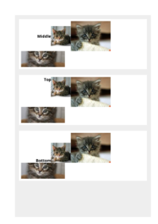

## VERTICAL-ALIGN

[📄 Input HTML](/html/CSS%20Properties/V/vertical-align.html):

| mPDF | typeset.sh | PDFreactor |
|---------|---------|---------|
|  |  |  |
| [📕 mPDF Output](mpdf__html_CSS_Properties_V_vertical-align.html.pdf) | [📕 typeset Output](typeset__html_CSS_Properties_V_vertical-align.html.pdf) | [📕 PDFreactor Output](pdfreactor__html_CSS_Properties_V_vertical-align.html.pdf) |

## VISIBILITY

[📄 Input HTML](/html/CSS%20Properties/V/visibility.html):

| mPDF | typeset.sh | PDFreactor |
|---------|---------|---------|
|  |  |  |
| [📕 mPDF Output](mpdf__html_CSS_Properties_V_visibility.html.pdf) | [📕 typeset Output](typeset__html_CSS_Properties_V_visibility.html.pdf) | [📕 PDFreactor Output](pdfreactor__html_CSS_Properties_V_visibility.html.pdf) |

