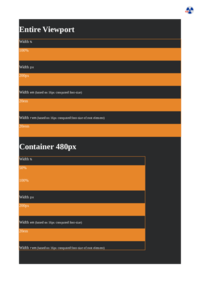

# W

## Sub Pages

## Direct HTML Files

| HTML File | mPDF Result | typeset.sh Result | PDFreactor Result |
|---------|---------|---------|---------|
| [white-space.html](/html/CSS%20Properties/W/white-space.html) |  [mpdf__html_CSS_Properties_W_white-space.html.pdf](mpdf__html_CSS_Properties_W_white-space.html.pdf) |  [typeset__html_CSS_Properties_W_white-space.html.pdf](typeset__html_CSS_Properties_W_white-space.html.pdf) |  [pdfreactor__html_CSS_Properties_W_white-space.html.pdf](pdfreactor__html_CSS_Properties_W_white-space.html.pdf) |
| [widows.html](/html/CSS%20Properties/W/widows.html) |  [mpdf__html_CSS_Properties_W_widows.html.pdf](mpdf__html_CSS_Properties_W_widows.html.pdf) |  [typeset__html_CSS_Properties_W_widows.html.pdf](typeset__html_CSS_Properties_W_widows.html.pdf) |  [pdfreactor__html_CSS_Properties_W_widows.html.pdf](pdfreactor__html_CSS_Properties_W_widows.html.pdf) |
| [width.html](/html/CSS%20Properties/W/width.html) |  [mpdf__html_CSS_Properties_W_width.html.pdf](mpdf__html_CSS_Properties_W_width.html.pdf) |  [typeset__html_CSS_Properties_W_width.html.pdf](typeset__html_CSS_Properties_W_width.html.pdf) |  [pdfreactor__html_CSS_Properties_W_width.html.pdf](pdfreactor__html_CSS_Properties_W_width.html.pdf) |
| [word-break.html](/html/CSS%20Properties/W/word-break.html) |  [mpdf__html_CSS_Properties_W_word-break.html.pdf](mpdf__html_CSS_Properties_W_word-break.html.pdf) |  [typeset__html_CSS_Properties_W_word-break.html.pdf](typeset__html_CSS_Properties_W_word-break.html.pdf) |  [pdfreactor__html_CSS_Properties_W_word-break.html.pdf](pdfreactor__html_CSS_Properties_W_word-break.html.pdf) |
| [word-spacing.html](/html/CSS%20Properties/W/word-spacing.html) |  [mpdf__html_CSS_Properties_W_word-spacing.html.pdf](mpdf__html_CSS_Properties_W_word-spacing.html.pdf) |  [typeset__html_CSS_Properties_W_word-spacing.html.pdf](typeset__html_CSS_Properties_W_word-spacing.html.pdf) |  [pdfreactor__html_CSS_Properties_W_word-spacing.html.pdf](pdfreactor__html_CSS_Properties_W_word-spacing.html.pdf) |
| [writing-mode.html](/html/CSS%20Properties/W/writing-mode.html) |  [mpdf__html_CSS_Properties_W_writing-mode.html.pdf](mpdf__html_CSS_Properties_W_writing-mode.html.pdf) |  [typeset__html_CSS_Properties_W_writing-mode.html.pdf](typeset__html_CSS_Properties_W_writing-mode.html.pdf) |  [pdfreactor__html_CSS_Properties_W_writing-mode.html.pdf](pdfreactor__html_CSS_Properties_W_writing-mode.html.pdf) |
