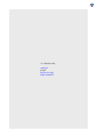

# ANY-LINK

See the Rendering results for [any-link.html](/html/CSS%20Selectors/A/any-link.html):

## mPDF
 

Link to PDF: [mpdf__html_CSS_Selectors_A_any-link.html.pdf](mpdf__html_CSS_Selectors_A_any-link.html.pdf)

## typeset.sh
 

Link to PDF: [typeset__html_CSS_Selectors_A_any-link.html.pdf](typeset__html_CSS_Selectors_A_any-link.html.pdf)

## PDFreactor
 

Link to PDF: [pdfreactor__html_CSS_Selectors_A_any-link.html.pdf](pdfreactor__html_CSS_Selectors_A_any-link.html.pdf)
