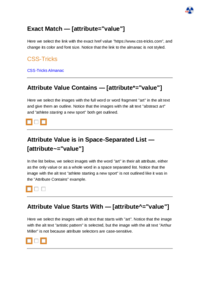

# ATTRIBUTE

See the Rendering results for [attribute.html](/html/CSS%20Selectors/A/attribute.html):

## mPDF
 

Link to PDF: [mpdf__html_CSS_Selectors_A_attribute.html.pdf](mpdf__html_CSS_Selectors_A_attribute.html.pdf)

## typeset.sh
 

Link to PDF: [typeset__html_CSS_Selectors_A_attribute.html.pdf](typeset__html_CSS_Selectors_A_attribute.html.pdf)

## PDFreactor
 

Link to PDF: [pdfreactor__html_CSS_Selectors_A_attribute.html.pdf](pdfreactor__html_CSS_Selectors_A_attribute.html.pdf)
