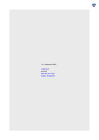
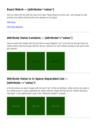
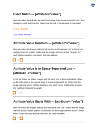

# A
| HTML File | mPDF Result | typeset.sh Result | PDFreactor Result |
| ------------- | ------------- | ------------- | ------------- |
| [active.html](/html/CSS%20Selectors/A/active.html) |  [mpdf__html_CSS_Selectors_A_active.html.pdf](mpdf__html_CSS_Selectors_A_active.html.pdf) |  [typeset__html_CSS_Selectors_A_active.html.pdf](typeset__html_CSS_Selectors_A_active.html.pdf) |  [pdfreactor__html_CSS_Selectors_A_active.html.pdf](pdfreactor__html_CSS_Selectors_A_active.html.pdf) |
| [adjacent-sibling.html](/html/CSS%20Selectors/A/adjacent-sibling.html) |  [mpdf__html_CSS_Selectors_A_adjacent-sibling.html.pdf](mpdf__html_CSS_Selectors_A_adjacent-sibling.html.pdf) |  [typeset__html_CSS_Selectors_A_adjacent-sibling.html.pdf](typeset__html_CSS_Selectors_A_adjacent-sibling.html.pdf) |  [pdfreactor__html_CSS_Selectors_A_adjacent-sibling.html.pdf](pdfreactor__html_CSS_Selectors_A_adjacent-sibling.html.pdf) |
| [after.html](/html/CSS%20Selectors/A/after.html) |  [mpdf__html_CSS_Selectors_A_after.html.pdf](mpdf__html_CSS_Selectors_A_after.html.pdf) |  [typeset__html_CSS_Selectors_A_after.html.pdf](typeset__html_CSS_Selectors_A_after.html.pdf) |  [pdfreactor__html_CSS_Selectors_A_after.html.pdf](pdfreactor__html_CSS_Selectors_A_after.html.pdf) |
| [any-link.html](/html/CSS%20Selectors/A/any-link.html) |  [mpdf__html_CSS_Selectors_A_any-link.html.pdf](mpdf__html_CSS_Selectors_A_any-link.html.pdf) |  [typeset__html_CSS_Selectors_A_any-link.html.pdf](typeset__html_CSS_Selectors_A_any-link.html.pdf) |  [pdfreactor__html_CSS_Selectors_A_any-link.html.pdf](pdfreactor__html_CSS_Selectors_A_any-link.html.pdf) |
| [attribute.html](/html/CSS%20Selectors/A/attribute.html) |  [mpdf__html_CSS_Selectors_A_attribute.html.pdf](mpdf__html_CSS_Selectors_A_attribute.html.pdf) |  [typeset__html_CSS_Selectors_A_attribute.html.pdf](typeset__html_CSS_Selectors_A_attribute.html.pdf) |  [pdfreactor__html_CSS_Selectors_A_attribute.html.pdf](pdfreactor__html_CSS_Selectors_A_attribute.html.pdf) |
