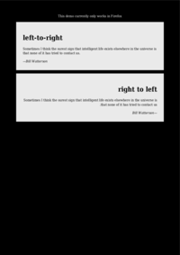
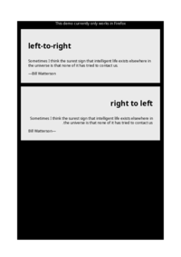
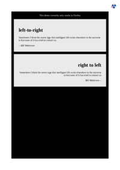
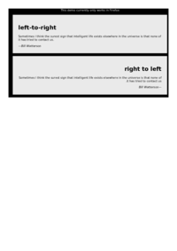
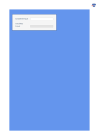

## 🔬 DEFAULT

### Input HTML & CSS

[📄 View Input HTML on GitHub](https://raw.githubusercontent.com/azettl/compare.html2pdf.tools/master//html/CSS%20Selectors/D/default.html){:target="_blank"}

    

        View DEFAULT Code
    

    <pre><code class="hljs xml">&lt;!DOCTYPE html&gt;
&lt;!-- Sample from https://css-tricks.com/almanac/selectors/d/default/ --&gt;
&lt;html lang="en"&gt;
    &lt;head&gt;
        &lt;style&gt;
        input[type="radio"]:default + label:after {
   content: ' (default)';
   color: #999;
   font-style: italic;
}
        &lt;/style&gt;
    &lt;/head&gt;
    &lt;body&gt;
        &lt;ul&gt;
            &lt;li&gt;
              &lt;input type="radio" name="color" value="red" id="red"&gt; 
              &lt;label for="red"&gt;red&lt;/label&gt;
            &lt;/li&gt;
            &lt;li&gt;
              &lt;input type="radio" name="green" value="green" id="green" checked&gt; 
              &lt;label for="green"&gt;green&lt;/label&gt;
            &lt;/li&gt;
            &lt;li&gt;
              &lt;input type="radio" name="blue" value="blue" id="blue"&gt; 
              &lt;label for="blue"&gt;blue&lt;/label&gt;
            &lt;/li&gt;
          &lt;/ul&gt;
    &lt;/body&gt;
&lt;/html&gt;</code></pre>

### Output PDF

| mPDF | typeset.sh | PDFreactor | wkhtmltopdf
|---------|---------|---------|---------|
|  |  |  |  |
| [📕 mPDF Output](mpdf__html_CSS_Selectors_D_default.html.pdf){:target="_blank"} | [📕 typeset Output](typeset__html_CSS_Selectors_D_default.html.pdf){:target="_blank"} | [📕 PDFreactor Output](pdfreactor__html_CSS_Selectors_D_default.html.pdf){:target="_blank"} | [📕 wkhtmltopdf Output](wkhtmltopdf__html_CSS_Selectors_D_default.html.pdf){:target="_blank"} |

## 🔬 DESCENDANT

### Input HTML & CSS

[📄 View Input HTML on GitHub](https://raw.githubusercontent.com/azettl/compare.html2pdf.tools/master//html/CSS%20Selectors/D/descendant.html){:target="_blank"}

    

        View DESCENDANT Code
    

    <pre><code class="hljs xml">&lt;!DOCTYPE html&gt;
&lt;!-- Sample from https://css-tricks.com/almanac/selectors/d/descendant/ --&gt;
&lt;html lang="en"&gt;
    &lt;head&gt;
        &lt;style&gt;
            div span{
                color:red;
            }
        &lt;/style&gt;
    &lt;/head&gt;
    &lt;body&gt;
        &lt;div&gt;
            &lt;span&gt;I will match&lt;/span&gt;
            &lt;ul&gt;
              &lt;li&gt;
                 &lt;span&gt;I will match too&lt;/span&gt;
              &lt;/li&gt;
            &lt;/ul&gt;
          &lt;/div&gt;
    &lt;/body&gt;
&lt;/html&gt;</code></pre>

### Output PDF

| mPDF | typeset.sh | PDFreactor | wkhtmltopdf
|---------|---------|---------|---------|
|  |  |  |  |
| [📕 mPDF Output](mpdf__html_CSS_Selectors_D_descendant.html.pdf){:target="_blank"} | [📕 typeset Output](typeset__html_CSS_Selectors_D_descendant.html.pdf){:target="_blank"} | [📕 PDFreactor Output](pdfreactor__html_CSS_Selectors_D_descendant.html.pdf){:target="_blank"} | [📕 wkhtmltopdf Output](wkhtmltopdf__html_CSS_Selectors_D_descendant.html.pdf){:target="_blank"} |

## 🔬 DIR

### Input HTML & CSS

[📄 View Input HTML on GitHub](https://raw.githubusercontent.com/azettl/compare.html2pdf.tools/master//html/CSS%20Selectors/D/dir.html){:target="_blank"}

    

        View DIR Code
    

    <pre><code class="hljs xml">&lt;!DOCTYPE html&gt;
&lt;!-- Sample from https://css-tricks.com/almanac/selectors/d/dir/ --&gt;
&lt;html lang="en"&gt;
    &lt;head&gt;
        &lt;style&gt;
        body {
  background-color: #000;
  width: 100%;
}

div {
  background-color: #eaeaea;
  margin: 1em;
  padding: 2em;
  max-width: 100%;
}

div:dir(ltr) {
  background-color: #333;
  color: #fff;
}

div:dir(rtl) {
  background: red;
  color: #fff;
}

.support {
  color: #fff;
  text-align: center;
  display: block;
}
        &lt;/style&gt;
    &lt;/head&gt;
    &lt;body&gt;
        &lt;p class="support"&gt;This demo currently only works in Firefox&lt;/p&gt;

        &lt;div dir="ltr"&gt;
          &lt;h1&gt;left-to-right&lt;/h1&gt;
          &lt;p&gt;Sometimes I think the surest sign that intelligent life exists elsewhere in the universe is that none of it has tried to contact us.&lt;/p&gt;
          &lt;cite&gt;&amp;mdash;Bill Watterson&lt;/cite&gt;
        &lt;/div&gt;
        &lt;div dir="rtl"&gt;
          &lt;h1&gt;right to left&lt;/h1&gt;
          &lt;p&gt;Sometimes I think the surest sign that intelligent life exists elsewhere in the universe is that none of it has tried to contact us.&lt;/p&gt;
          &lt;cite&gt;&amp;mdash;Bill Watterson&lt;/cite&gt;
        &lt;/div&gt;
    &lt;/body&gt;
&lt;/html&gt;</code></pre>

### Output PDF

| mPDF | typeset.sh | PDFreactor | wkhtmltopdf
|---------|---------|---------|---------|
|  |  |  |  |
| [📕 mPDF Output](mpdf__html_CSS_Selectors_D_dir.html.pdf){:target="_blank"} | [📕 typeset Output](typeset__html_CSS_Selectors_D_dir.html.pdf){:target="_blank"} | [📕 PDFreactor Output](pdfreactor__html_CSS_Selectors_D_dir.html.pdf){:target="_blank"} | [📕 wkhtmltopdf Output](wkhtmltopdf__html_CSS_Selectors_D_dir.html.pdf){:target="_blank"} |

## 🔬 DISABLED

### Input HTML & CSS

[📄 View Input HTML on GitHub](https://raw.githubusercontent.com/azettl/compare.html2pdf.tools/master//html/CSS%20Selectors/D/disabled.html){:target="_blank"}

    

        View DISABLED Code
    

    <pre><code class="hljs xml">&lt;!DOCTYPE html&gt;
&lt;!-- Sample from https://css-tricks.com/almanac/selectors/d/disabled/ --&gt;
&lt;html lang="en"&gt;
    &lt;head&gt;
        &lt;style&gt;
        /* The good stuff starts here :)
*/

  input {
    width: 60%;
    margin: 0;
    border: none;
    outline: 1px solid lightgrey;
    outline-offset: 2px;
  }

input:disabled {
  background: url(data:image/png;base64,iVBORw0KGgoAAAANSUhEUgAAAAQAAAAECAYAAACp8Z5+AAAAIklEQVQIW2NkQAKrVq36zwjjgzhhYWGMYAEYB8RmROaABADeOQ8CXl/xfgAAAABJRU5ErkJggg==) repeat;
}

/* BASIC PAGE CSS. NOT PART OF THE EXAMPLE
*/

* {
  -webkit-box-sizing: border-box;
  -moz-box-sizing: border-box;
  box-sizing: border-box;
}

body {
  font: 300 16px/1.25 "Helvetica Neue", sans-serif;
  color: slategrey;
  background: cornflowerblue;
  padding: 1.5em;
}

form {
  background: whitesmoke;
  padding: 1.5em;
  max-width: 400px;
  width: 100%;
  outline: 3px solid rgba(0, 0, 0, 0.25);
}

  hr {
    visibility: hidden;
  }

  label {
    margin-right: 3%;
  text-align: left;
    display: inline-block;
    width: 35%;
  }

        &lt;/style&gt;
    &lt;/head&gt;
    &lt;body&gt;
        &lt;form action="#"&gt;
            &lt;label for="name"&gt;Enabled Input:&lt;/label&gt;
            &lt;input type="text" autofocus&gt;
              &lt;hr&gt;
            &lt;label for="name"&gt;Disabled Input:&lt;/label&gt;
            &lt;input type="text" disabled&gt;
        &lt;/form&gt;  
    &lt;/body&gt;
&lt;/html&gt;</code></pre>

### Output PDF

| mPDF | typeset.sh | PDFreactor | wkhtmltopdf
|---------|---------|---------|---------|
|  |  |  |  |
| [📕 mPDF Output](mpdf__html_CSS_Selectors_D_disabled.html.pdf){:target="_blank"} | [📕 typeset Output](typeset__html_CSS_Selectors_D_disabled.html.pdf){:target="_blank"} | [📕 PDFreactor Output](pdfreactor__html_CSS_Selectors_D_disabled.html.pdf){:target="_blank"} | [📕 wkhtmltopdf Output](wkhtmltopdf__html_CSS_Selectors_D_disabled.html.pdf){:target="_blank"} |

