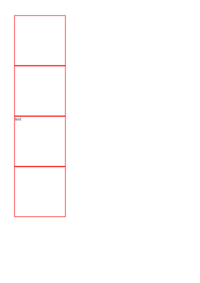

# E
HTML File | mPDF Result | typeset.sh Result | PDFreactor Result
------------- | ------------- | ------------- | -------------
[empty.html](/html/CSS%20Selectors/E/empty.html) |  [mpdf__html_CSS_Selectors_E_empty.html.pdf](mpdf__html_CSS_Selectors_E_empty.html.pdf) |  [typeset__html_CSS_Selectors_E_empty.html.pdf](typeset__html_CSS_Selectors_E_empty.html.pdf) |  [pdfreactor__html_CSS_Selectors_E_empty.html.pdf](pdfreactor__html_CSS_Selectors_E_empty.html.pdf)
[enabled.html](/html/CSS%20Selectors/E/enabled.html) |  [mpdf__html_CSS_Selectors_E_enabled.html.pdf](mpdf__html_CSS_Selectors_E_enabled.html.pdf) |  [typeset__html_CSS_Selectors_E_enabled.html.pdf](typeset__html_CSS_Selectors_E_enabled.html.pdf) |  [pdfreactor__html_CSS_Selectors_E_enabled.html.pdf](pdfreactor__html_CSS_Selectors_E_enabled.html.pdf)
