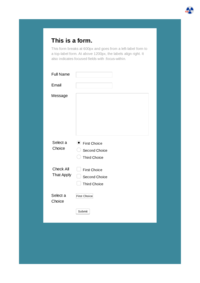

## <a name="FIRST-CHILD" id="FIRST-CHILD" href="#FIRST-CHILD">#</a> FIRST-CHILD

[📄 Input HTML](/html/CSS%20Selectors/F/first-child.html)

### Output PDF

| mPDF | typeset.sh | PDFreactor |
|---------|---------|---------|
|  |  |  |
| [📕 mPDF Output](mpdf__html_CSS_Selectors_F_first-child.html.pdf) | [📕 typeset Output](typeset__html_CSS_Selectors_F_first-child.html.pdf) | [📕 PDFreactor Output](pdfreactor__html_CSS_Selectors_F_first-child.html.pdf) |

## <a name="FIRST-LETTER" id="FIRST-LETTER" href="#FIRST-LETTER">#</a> FIRST-LETTER

[📄 Input HTML](/html/CSS%20Selectors/F/first-letter.html)

### Output PDF

| mPDF | typeset.sh | PDFreactor |
|---------|---------|---------|
|  |  |  |
| [📕 mPDF Output](mpdf__html_CSS_Selectors_F_first-letter.html.pdf) | [📕 typeset Output](typeset__html_CSS_Selectors_F_first-letter.html.pdf) | [📕 PDFreactor Output](pdfreactor__html_CSS_Selectors_F_first-letter.html.pdf) |

## <a name="FIRST-LINE" id="FIRST-LINE" href="#FIRST-LINE">#</a> FIRST-LINE

[📄 Input HTML](/html/CSS%20Selectors/F/first-line.html)

### Output PDF

| mPDF | typeset.sh | PDFreactor |
|---------|---------|---------|
|  |  |  |
| [📕 mPDF Output](mpdf__html_CSS_Selectors_F_first-line.html.pdf) | [📕 typeset Output](typeset__html_CSS_Selectors_F_first-line.html.pdf) | [📕 PDFreactor Output](pdfreactor__html_CSS_Selectors_F_first-line.html.pdf) |

## <a name="FIRST-OF-TYPE" id="FIRST-OF-TYPE" href="#FIRST-OF-TYPE">#</a> FIRST-OF-TYPE

[📄 Input HTML](/html/CSS%20Selectors/F/first-of-type.html)

### Output PDF

| mPDF | typeset.sh | PDFreactor |
|---------|---------|---------|
|  |  |  |
| [📕 mPDF Output](mpdf__html_CSS_Selectors_F_first-of-type.html.pdf) | [📕 typeset Output](typeset__html_CSS_Selectors_F_first-of-type.html.pdf) | [📕 PDFreactor Output](pdfreactor__html_CSS_Selectors_F_first-of-type.html.pdf) |

## <a name="FOCUS-VISIBLE" id="FOCUS-VISIBLE" href="#FOCUS-VISIBLE">#</a> FOCUS-VISIBLE

[📄 Input HTML](/html/CSS%20Selectors/F/focus-visible.html)

### Output PDF

| mPDF | typeset.sh | PDFreactor |
|---------|---------|---------|
|  |  |  |
| [📕 mPDF Output](mpdf__html_CSS_Selectors_F_focus-visible.html.pdf) | [📕 typeset Output](typeset__html_CSS_Selectors_F_focus-visible.html.pdf) | [📕 PDFreactor Output](pdfreactor__html_CSS_Selectors_F_focus-visible.html.pdf) |

## <a name="FOCUS-WITHIN" id="FOCUS-WITHIN" href="#FOCUS-WITHIN">#</a> FOCUS-WITHIN

[📄 Input HTML](/html/CSS%20Selectors/F/focus-within.html)

### Output PDF

| mPDF | typeset.sh | PDFreactor |
|---------|---------|---------|
|  |  |  |
| [📕 mPDF Output](mpdf__html_CSS_Selectors_F_focus-within.html.pdf) | [📕 typeset Output](typeset__html_CSS_Selectors_F_focus-within.html.pdf) | [📕 PDFreactor Output](pdfreactor__html_CSS_Selectors_F_focus-within.html.pdf) |

## <a name="FOCUS" id="FOCUS" href="#FOCUS">#</a> FOCUS

[📄 Input HTML](/html/CSS%20Selectors/F/focus.html)

### Output PDF

| mPDF | typeset.sh | PDFreactor |
|---------|---------|---------|
|  |  |  |
| [📕 mPDF Output](mpdf__html_CSS_Selectors_F_focus.html.pdf) | [📕 typeset Output](typeset__html_CSS_Selectors_F_focus.html.pdf) | [📕 PDFreactor Output](pdfreactor__html_CSS_Selectors_F_focus.html.pdf) |

