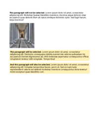
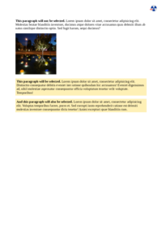

# G
| HTML File | mPDF Result | typeset.sh Result | PDFreactor Result |
| ------------- | ------------- | ------------- | ------------- |
| [general-sibling.html](/html/CSS%20Selectors/G/general-sibling.html) |  [mpdf__html_CSS_Selectors_G_general-sibling.html.pdf](mpdf__html_CSS_Selectors_G_general-sibling.html.pdf) |  [typeset__html_CSS_Selectors_G_general-sibling.html.pdf](typeset__html_CSS_Selectors_G_general-sibling.html.pdf) |  [pdfreactor__html_CSS_Selectors_G_general-sibling.html.pdf](pdfreactor__html_CSS_Selectors_G_general-sibling.html.pdf) |
