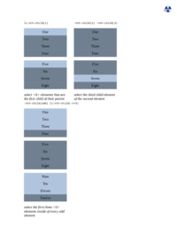
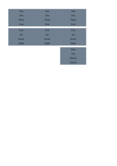
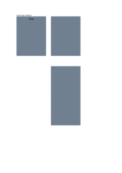
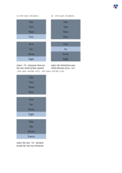
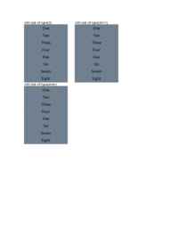
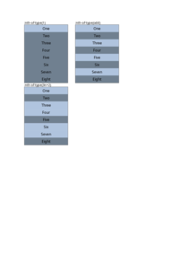
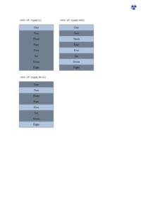

# N

| HTML File | mPDF Result | typeset.sh Result | PDFreactor Result |
|---------|---------|---------|---------|
| [not.html](/html/CSS%20Selectors/N/not.html) |  [mpdf__html_CSS_Selectors_N_not.html.pdf](mpdf__html_CSS_Selectors_N_not.html.pdf) |  [typeset__html_CSS_Selectors_N_not.html.pdf](typeset__html_CSS_Selectors_N_not.html.pdf) |  [pdfreactor__html_CSS_Selectors_N_not.html.pdf](pdfreactor__html_CSS_Selectors_N_not.html.pdf) |
| [nth-child.html](/html/CSS%20Selectors/N/nth-child.html) |  [mpdf__html_CSS_Selectors_N_nth-child.html.pdf](mpdf__html_CSS_Selectors_N_nth-child.html.pdf) |  [typeset__html_CSS_Selectors_N_nth-child.html.pdf](typeset__html_CSS_Selectors_N_nth-child.html.pdf) |  [pdfreactor__html_CSS_Selectors_N_nth-child.html.pdf](pdfreactor__html_CSS_Selectors_N_nth-child.html.pdf) |
| [nth-last-child.html](/html/CSS%20Selectors/N/nth-last-child.html) |  [mpdf__html_CSS_Selectors_N_nth-last-child.html.pdf](mpdf__html_CSS_Selectors_N_nth-last-child.html.pdf) |  [typeset__html_CSS_Selectors_N_nth-last-child.html.pdf](typeset__html_CSS_Selectors_N_nth-last-child.html.pdf) |  [pdfreactor__html_CSS_Selectors_N_nth-last-child.html.pdf](pdfreactor__html_CSS_Selectors_N_nth-last-child.html.pdf) |
| [nth-last-of-type.html](/html/CSS%20Selectors/N/nth-last-of-type.html) |  [mpdf__html_CSS_Selectors_N_nth-last-of-type.html.pdf](mpdf__html_CSS_Selectors_N_nth-last-of-type.html.pdf) |  [typeset__html_CSS_Selectors_N_nth-last-of-type.html.pdf](typeset__html_CSS_Selectors_N_nth-last-of-type.html.pdf) |  [pdfreactor__html_CSS_Selectors_N_nth-last-of-type.html.pdf](pdfreactor__html_CSS_Selectors_N_nth-last-of-type.html.pdf) |
| [nth-of-type.html](/html/CSS%20Selectors/N/nth-of-type.html) |  [mpdf__html_CSS_Selectors_N_nth-of-type.html.pdf](mpdf__html_CSS_Selectors_N_nth-of-type.html.pdf) |  [typeset__html_CSS_Selectors_N_nth-of-type.html.pdf](typeset__html_CSS_Selectors_N_nth-of-type.html.pdf) |  [pdfreactor__html_CSS_Selectors_N_nth-of-type.html.pdf](pdfreactor__html_CSS_Selectors_N_nth-of-type.html.pdf) |
