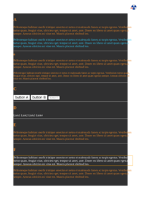

## <a name="NOT" id="NOT">#</a> NOT

[📄 Input HTML](/html/CSS%20Selectors/N/not.html)

### Output PDF

| mPDF | typeset.sh | PDFreactor |
|---------|---------|---------|
|  |  |  |
| [📕 mPDF Output](mpdf__html_CSS_Selectors_N_not.html.pdf) | [📕 typeset Output](typeset__html_CSS_Selectors_N_not.html.pdf) | [📕 PDFreactor Output](pdfreactor__html_CSS_Selectors_N_not.html.pdf) |

## <a name="NTH-CHILD" id="NTH-CHILD">#</a> NTH-CHILD

[📄 Input HTML](/html/CSS%20Selectors/N/nth-child.html)

### Output PDF

| mPDF | typeset.sh | PDFreactor |
|---------|---------|---------|
|  |  |  |
| [📕 mPDF Output](mpdf__html_CSS_Selectors_N_nth-child.html.pdf) | [📕 typeset Output](typeset__html_CSS_Selectors_N_nth-child.html.pdf) | [📕 PDFreactor Output](pdfreactor__html_CSS_Selectors_N_nth-child.html.pdf) |

## <a name="NTH-LAST-CHILD" id="NTH-LAST-CHILD">#</a> NTH-LAST-CHILD

[📄 Input HTML](/html/CSS%20Selectors/N/nth-last-child.html)

### Output PDF

| mPDF | typeset.sh | PDFreactor |
|---------|---------|---------|
|  |  |  |
| [📕 mPDF Output](mpdf__html_CSS_Selectors_N_nth-last-child.html.pdf) | [📕 typeset Output](typeset__html_CSS_Selectors_N_nth-last-child.html.pdf) | [📕 PDFreactor Output](pdfreactor__html_CSS_Selectors_N_nth-last-child.html.pdf) |

## <a name="NTH-LAST-OF-TYPE" id="NTH-LAST-OF-TYPE">#</a> NTH-LAST-OF-TYPE

[📄 Input HTML](/html/CSS%20Selectors/N/nth-last-of-type.html)

### Output PDF

| mPDF | typeset.sh | PDFreactor |
|---------|---------|---------|
|  |  |  |
| [📕 mPDF Output](mpdf__html_CSS_Selectors_N_nth-last-of-type.html.pdf) | [📕 typeset Output](typeset__html_CSS_Selectors_N_nth-last-of-type.html.pdf) | [📕 PDFreactor Output](pdfreactor__html_CSS_Selectors_N_nth-last-of-type.html.pdf) |

## <a name="NTH-OF-TYPE" id="NTH-OF-TYPE">#</a> NTH-OF-TYPE

[📄 Input HTML](/html/CSS%20Selectors/N/nth-of-type.html)

### Output PDF

| mPDF | typeset.sh | PDFreactor |
|---------|---------|---------|
|  |  |  |
| [📕 mPDF Output](mpdf__html_CSS_Selectors_N_nth-of-type.html.pdf) | [📕 typeset Output](typeset__html_CSS_Selectors_N_nth-of-type.html.pdf) | [📕 PDFreactor Output](pdfreactor__html_CSS_Selectors_N_nth-of-type.html.pdf) |

