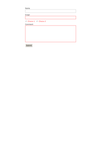

## 🔬 READ-ONLY

### Input HTML & CSS

[📄 View Input HTML on GitHub](https://raw.githubusercontent.com/azettl/compare.html2pdf.tools/master//html/CSS%20Selectors/R/read-only.html){:target="_blank"}

    

        View READ-ONLY Code
    

    <pre><code class="hljs xml">&lt;!DOCTYPE html&gt;
&lt;!-- Sample from https://www.w3schools.com/cssref/tryit.asp?filename=trycss_sel_read-only --&gt;
&lt;html lang="en"&gt;
    &lt;head&gt;
        &lt;style&gt;
        input:-moz-read-only { /* For Firefox */
  background-color: yellow;
}

input:read-only {
  background-color: yellow;
}
        &lt;/style&gt;
    &lt;/head&gt;
    &lt;body&gt;
        &lt;h3&gt;A demonstration of the :read-only selector.&lt;/h3&gt;

        &lt;p&gt;A normal input element:&lt;br&gt;&lt;input value="hello"&gt;&lt;/p&gt;
        
        &lt;p&gt;A readonly input element:&lt;br&gt;&lt;input readonly value="hello"&gt;&lt;/p&gt;
        
        &lt;p&gt;The :read-only selector selects form elements with a "readonly" attribute.&lt;/p&gt;
        
    &lt;/body&gt;
&lt;/html&gt;</code></pre>

### Output PDF

| mPDF | typeset.sh | PDFreactor | wkhtmltopdf
|---------|---------|---------|---------|
|  |  |  |  |
| [📕 mPDF Output](mpdf__html_CSS_Selectors_R_read-only.html.pdf){:target="_blank"} | [📕 typeset Output](typeset__html_CSS_Selectors_R_read-only.html.pdf){:target="_blank"} | [📕 PDFreactor Output](pdfreactor__html_CSS_Selectors_R_read-only.html.pdf){:target="_blank"} | [📕 wkhtmltopdf Output](wkhtmltopdf__html_CSS_Selectors_R_read-only.html.pdf){:target="_blank"} |

## 🔬 READ-WRITE

### Input HTML & CSS

[📄 View Input HTML on GitHub](https://raw.githubusercontent.com/azettl/compare.html2pdf.tools/master//html/CSS%20Selectors/R/read-write.html){:target="_blank"}

    

        View READ-WRITE Code
    

    <pre><code class="hljs xml">&lt;!DOCTYPE html&gt;
&lt;!-- Sample from https://www.w3schools.com/cssref/tryit.asp?filename=trycss_sel_read-write --&gt;
&lt;html lang="en"&gt;
    &lt;head&gt;
        &lt;style&gt;
        input:-moz-read-write { /* For Firefox */
  background-color: yellow;
}

input:read-write {
  background-color: yellow;
}
        &lt;/style&gt;
    &lt;/head&gt;
    &lt;body&gt;
    
&lt;h3&gt;A demonstration of the :read-write selector.&lt;/h3&gt;

&lt;p&gt;A normal input element:&lt;br&gt;&lt;input value="hello"&gt;&lt;/p&gt;

&lt;p&gt;A readonly input element:&lt;br&gt;&lt;input readonly value="hello"&gt;&lt;/p&gt;

&lt;p&gt;The :read-write selector selects form elements with no "readonly" attribute.&lt;/p&gt;

    &lt;/body&gt;
&lt;/html&gt;</code></pre>

### Output PDF

| mPDF | typeset.sh | PDFreactor | wkhtmltopdf
|---------|---------|---------|---------|
|  |  |  |  |
| [📕 mPDF Output](mpdf__html_CSS_Selectors_R_read-write.html.pdf){:target="_blank"} | [📕 typeset Output](typeset__html_CSS_Selectors_R_read-write.html.pdf){:target="_blank"} | [📕 PDFreactor Output](pdfreactor__html_CSS_Selectors_R_read-write.html.pdf){:target="_blank"} | [📕 wkhtmltopdf Output](wkhtmltopdf__html_CSS_Selectors_R_read-write.html.pdf){:target="_blank"} |

## 🔬 REQUIRED

### Input HTML & CSS

[📄 View Input HTML on GitHub](https://raw.githubusercontent.com/azettl/compare.html2pdf.tools/master//html/CSS%20Selectors/R/required.html){:target="_blank"}

    

        View REQUIRED Code
    

    <pre><code class="hljs xml">&lt;!DOCTYPE html&gt;
&lt;!-- Sample from https://css-tricks.com/almanac/selectors/r/required/ --&gt;
&lt;html lang="en"&gt;
    &lt;head&gt;
        &lt;style&gt;
        input:required,
textarea:required {
  border-color: red !important;
}
input:required + label {
  color: red;
}

form {
  padding: 20px; 
  max-width: 500px;
  margin: 0 auto;
}
form div {
  padding: 5px;
}
label {
  display: block;
}
input + label {
  display: inline-block;
  margin-right: 10px;
}

input[type=text],
input[type=email],
textarea {
  border: 1px solid #999;
  padding: 5px;
  width: 100%;
}
        &lt;/style&gt;
    &lt;/head&gt;
    &lt;body&gt;
        &lt;form&gt;
  
            &lt;div&gt;
              &lt;label for="name"&gt;Name&lt;/label&gt;
              &lt;input type="text" name="name" id="name" /&gt;
            &lt;/div&gt;
            
            &lt;div&gt;
              &lt;label for="email"&gt;Email&lt;/label&gt;
              &lt;input type="email" name="email" id="email" required /&gt;
            &lt;/div&gt;
          
            &lt;div&gt;
              &lt;input type="radio" name="radio-choice" id="radio-choice-1" value="choice-1" required /&gt;
              &lt;label for="radio-choice-1"&gt;Choice 1&lt;/label&gt;
              
              &lt;input type="radio" name="radio-choice" id="radio-choice-2" value="choice-2" required /&gt;
              &lt;label for="radio-choice-2"&gt;Choice 2&lt;/label&gt;
            &lt;/div&gt;
              
            &lt;div&gt;
              &lt;label for="textarea"&gt;Comment&lt;/label&gt;
              &lt;textarea cols="40" rows="8" name="textarea" id="textarea" required&gt;&lt;/textarea&gt;
            &lt;/div&gt;
          
            &lt;div class="buttons"&gt;
              &lt;input type="submit" value="Submit" /&gt;
            &lt;/div&gt;
          &lt;/form&gt;  
    &lt;/body&gt;
&lt;/html&gt;</code></pre>

### Output PDF

| mPDF | typeset.sh | PDFreactor | wkhtmltopdf
|---------|---------|---------|---------|
|  |  |  |  |
| [📕 mPDF Output](mpdf__html_CSS_Selectors_R_required.html.pdf){:target="_blank"} | [📕 typeset Output](typeset__html_CSS_Selectors_R_required.html.pdf){:target="_blank"} | [📕 PDFreactor Output](pdfreactor__html_CSS_Selectors_R_required.html.pdf){:target="_blank"} | [📕 wkhtmltopdf Output](wkhtmltopdf__html_CSS_Selectors_R_required.html.pdf){:target="_blank"} |

## 🔬 ROOT

### Input HTML & CSS

[📄 View Input HTML on GitHub](https://raw.githubusercontent.com/azettl/compare.html2pdf.tools/master//html/CSS%20Selectors/R/root.html){:target="_blank"}

    

        View ROOT Code
    

    <pre><code class="hljs xml">&lt;!DOCTYPE html&gt;
&lt;!-- Sample from https://css-tricks.com/almanac/selectors/r/root/ --&gt;
&lt;html lang="en"&gt;
    &lt;head&gt;
        &lt;style&gt;
        :root {
  background-color: cornflowerblue;
  padding: 3em;
}

body {
  background-color: white;
  padding: 1.5em;
}
        &lt;/style&gt;
    &lt;/head&gt;
    &lt;body&gt;
        &lt;p&gt;We can take advantage of being able to apply CSS to the &lt;code&gt;&amp;lt;html&amp;gt;&lt;/code&gt; element to skip the wrapper &lt;code&gt;div&lt;/code&gt; and keep our markup clean!&lt;/p&gt;
    &lt;/body&gt;
&lt;/html&gt;</code></pre>

### Output PDF

| mPDF | typeset.sh | PDFreactor | wkhtmltopdf
|---------|---------|---------|---------|
|  |  |  |  |
| [📕 mPDF Output](mpdf__html_CSS_Selectors_R_root.html.pdf){:target="_blank"} | [📕 typeset Output](typeset__html_CSS_Selectors_R_root.html.pdf){:target="_blank"} | [📕 PDFreactor Output](pdfreactor__html_CSS_Selectors_R_root.html.pdf){:target="_blank"} | [📕 wkhtmltopdf Output](wkhtmltopdf__html_CSS_Selectors_R_root.html.pdf){:target="_blank"} |

