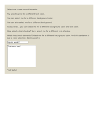

## 🔬 SELECTION

### Input HTML & CSS

[📄 View Input HTML on GitHub](https://raw.githubusercontent.com/azettl/compare.html2pdf.tools/master//html/CSS%20Selectors/S/selection.html){:target="_blank"}

    

        View SELECTION Code
    

    <pre><code class="hljs xml">&lt;!DOCTYPE html&gt;
&lt;!-- Sample from https://css-tricks.com/almanac/selectors/s/selection/ --&gt;
&lt;html lang="en"&gt;
    &lt;head&gt;
        &lt;style&gt;
        .example-color::selection {
  color: #8e44ad;
}
.example-background-color::selection {
  background-color: #f1c40f;
}
.example-background::selection {
  background: #e74c3c;
}
.example-both::selection {
  background-color: #8e44ad;
  color: white;
}
.example-shadow::selection {
  text-shadow: 1px 1px 0 #27ae60;
}
.example-input::selection {
  background: #2ecc71;
}
.example-textarea::selection {
  background: #34495e;
  color: white;
}
body {
  font-family: 'Source Sans Pro', Arial, sans-serif;
  line-height: 1.45;
  background: #E0DCCC;
  color: #333;
  padding: 1em;
  font-size: 18px;
}

p,input,textarea  {
  margin-bottom: 1em;
}
input,textarea {
  display: block;
  font-size: 1em;
  font-family: inherit;
}

        &lt;/style&gt;
    &lt;/head&gt;
    &lt;body&gt;
        &lt;p&gt;Select me to see normal behavior.&lt;/p&gt;
        &lt;p class='example-color'&gt;Try selecting me for a different text color.&lt;/p&gt;
        &lt;p class='example-background-color'&gt;You can select me for a different background color.&lt;/p&gt;
        &lt;p class='example-background'&gt;You can also select me for a different background.&lt;/p&gt;
        &lt;p class='example-both'&gt;Guess what&amp;hellip; you can select me for a different background color and text color.&lt;/p&gt;
        &lt;p class='example-shadow'&gt;How about a text-shadow? Sure, select me for a different text-shadow.&lt;/p&gt;
        &lt;p class='example-background-color'&gt;
          What about nest elements? Select me for a different background color.
          &lt;span class='example-color'&gt;And this sentence is just a color selection.&lt;/span&gt;
          Nesting works!
        &lt;/p&gt;
        &lt;input class='example-input' type='text' value='Inputs work!*'&gt;
        &lt;textarea class='example-textarea' cols='30' name='' rows='10'&gt;Textarea, too!*&lt;/textarea&gt;
        &lt;div class='foot-notes'&gt;*not Safari&lt;/div&gt;
    &lt;/body&gt;
&lt;/html&gt;</code></pre>

### Output PDF

| mPDF | typeset.sh | PDFreactor | wkhtmltopdf
|---------|---------|---------|---------|
|  |  |  |  |
| [📕 mPDF Output](mpdf__html_CSS_Selectors_S_selection.html.pdf){:target="_blank"} | [📕 typeset Output](typeset__html_CSS_Selectors_S_selection.html.pdf){:target="_blank"} | [📕 PDFreactor Output](pdfreactor__html_CSS_Selectors_S_selection.html.pdf){:target="_blank"} | [📕 wkhtmltopdf Output](wkhtmltopdf__html_CSS_Selectors_S_selection.html.pdf){:target="_blank"} |

