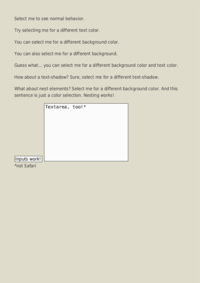
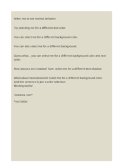
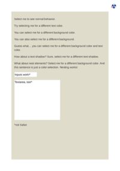

## <a name="SELECTION" id="SELECTION" href="#SELECTION">#</a> SELECTION

[📄 Input HTML](/html/CSS%20Selectors/S/selection.html)

### Output PDF

| mPDF | typeset.sh | PDFreactor |
|---------|---------|---------|
|  |  |  |
| [📕 mPDF Output](mpdf__html_CSS_Selectors_S_selection.html.pdf) | [📕 typeset Output](typeset__html_CSS_Selectors_S_selection.html.pdf) | [📕 PDFreactor Output](pdfreactor__html_CSS_Selectors_S_selection.html.pdf) |

