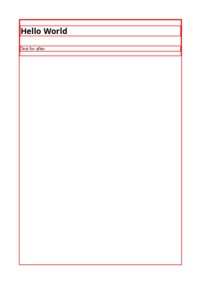

# U

## Sub Pages

## Direct HTML Files

| HTML File | mPDF Result | typeset.sh Result | PDFreactor Result |
|---------|---------|---------|---------|
| [universal.html](/html/CSS%20Selectors/U/universal.html) |  [mpdf__html_CSS_Selectors_U_universal.html.pdf](mpdf__html_CSS_Selectors_U_universal.html.pdf) |  [typeset__html_CSS_Selectors_U_universal.html.pdf](typeset__html_CSS_Selectors_U_universal.html.pdf) |  [pdfreactor__html_CSS_Selectors_U_universal.html.pdf](pdfreactor__html_CSS_Selectors_U_universal.html.pdf) |
| [user-invalid.html](/html/CSS%20Selectors/U/user-invalid.html) |  [mpdf__html_CSS_Selectors_U_user-invalid.html.pdf](mpdf__html_CSS_Selectors_U_user-invalid.html.pdf) |  [typeset__html_CSS_Selectors_U_user-invalid.html.pdf](typeset__html_CSS_Selectors_U_user-invalid.html.pdf) |  [pdfreactor__html_CSS_Selectors_U_user-invalid.html.pdf](pdfreactor__html_CSS_Selectors_U_user-invalid.html.pdf) |
