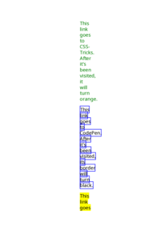

## 🔬 VALID

### Input HTML & CSS

[📄 Input HTML](https://raw.githubusercontent.com/azettl/compare.html2pdf.tools/master//html/CSS%20Selectors/V/valid.html)

    

        View VALID Code
    

    <pre><code class="hljs xml">&lt;!DOCTYPE html&gt;
&lt;!-- Sample from https://css-tricks.com/almanac/selectors/v/valid/ --&gt;
&lt;html lang="en"&gt;
    &lt;head&gt;
        &lt;style&gt;
        input:invalid {
  background: hsla(0, 90%, 70%, 1);
}

input:valid {
  background: hsla(100, 90%, 70%, 1);
}

body {
  padding: 3em;
}
label {
  display: block;
}
input {
  padding: 0.25em 0;
  margin-bottom: 0.75em;
}
        &lt;/style&gt;
    &lt;/head&gt;
    &lt;body&gt;
        &lt;label for="email"&gt;Email:&lt;/label&gt;
        &lt;input type="email" id="email" name="email" /&gt;
        
        &lt;label for="emailRequired"&gt;Email (required):&lt;/label&gt;
        &lt;input type="email" id="emailRequired" name="emailRequired" required /&gt;
        
        &lt;form action="#"&gt;
          &lt;label id="guess"&gt;Enter a number 1 through 9:&lt;/label&gt;
          &lt;input type="text" id="guess" name="guess" pattern="[1-9]{1}" required /&gt;
        &lt;/form&gt;
    &lt;/body&gt;
&lt;/html&gt;</code></pre>

### Output PDF

| mPDF | typeset.sh | PDFreactor |
|---------|---------|---------|
|  |  |  |
| [📕 mPDF Output](mpdf__html_CSS_Selectors_V_valid.html.pdf) | [📕 typeset Output](typeset__html_CSS_Selectors_V_valid.html.pdf) | [📕 PDFreactor Output](pdfreactor__html_CSS_Selectors_V_valid.html.pdf) |

## 🔬 VISITED

### Input HTML & CSS

[📄 Input HTML](https://raw.githubusercontent.com/azettl/compare.html2pdf.tools/master//html/CSS%20Selectors/V/visited.html)

    

        View VISITED Code
    

    <pre><code class="hljs xml">&lt;!DOCTYPE html&gt;
&lt;!-- Sample from https://css-tricks.com/almanac/selectors/v/visited/ --&gt;
&lt;html lang="en"&gt;
    &lt;head&gt;
        &lt;style&gt;
        a.csstricks {
  color: green;
}

a.csstricks:visited {
  color: #E18728;
}

a.codepen {
  border: 2px solid blue;
}

a.codepen:visited {
  border: 2px solid black;
}

a.google {
  background-color: yellow;
  color: black;
}

a.google:visited {
  background-color: #E18728;
  color: white;
}
/* Pen styling, unrelated to :visited */

.links {
  max-width: 70vw;
  margin: 0 auto;
  font-size: 1.5em;
  font-family: 'Source Sans Pro', sans-serif;
}
        &lt;/style&gt;
    &lt;/head&gt;
    &lt;body&gt;
        &lt;section class="links"&gt;
            &lt;p&gt;&lt;a href="https://www.css-tricks.com" class="csstricks"&gt;This link goes to CSS-Tricks. After it's been visited, it will turn orange.&lt;/a&gt;&lt;/p&gt;
            &lt;p&gt;&lt;a href="https://www.codepen.io" class="codepen"&gt;This link goes to CodePen. After it's been visited, its border will turn black.&lt;/a&gt;&lt;/p&gt;
            &lt;p&gt;&lt;a href="https://www.google.com" class="google"&gt;This link goes to Google. After it's been visited, it will turn white and the background will turn orange. &lt;/a&gt;&lt;/p&gt;
          &lt;/section&gt;
    &lt;/body&gt;
&lt;/html&gt;</code></pre>

### Output PDF

| mPDF | typeset.sh | PDFreactor |
|---------|---------|---------|
|  |  |  |
| [📕 mPDF Output](mpdf__html_CSS_Selectors_V_visited.html.pdf) | [📕 typeset Output](typeset__html_CSS_Selectors_V_visited.html.pdf) | [📕 PDFreactor Output](pdfreactor__html_CSS_Selectors_V_visited.html.pdf) |

