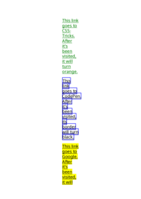
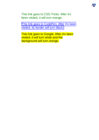

## <a name="VALID" id="VALID">#</a> VALID

[📄 Input HTML](/html/CSS%20Selectors/V/valid.html)

### Output PDF

| mPDF | typeset.sh | PDFreactor |
|---------|---------|---------|
|  |  |  |
| [📕 mPDF Output](mpdf__html_CSS_Selectors_V_valid.html.pdf) | [📕 typeset Output](typeset__html_CSS_Selectors_V_valid.html.pdf) | [📕 PDFreactor Output](pdfreactor__html_CSS_Selectors_V_valid.html.pdf) |

## <a name="VISITED" id="VISITED">#</a> VISITED

[📄 Input HTML](/html/CSS%20Selectors/V/visited.html)

### Output PDF

| mPDF | typeset.sh | PDFreactor |
|---------|---------|---------|
|  |  |  |
| [📕 mPDF Output](mpdf__html_CSS_Selectors_V_visited.html.pdf) | [📕 typeset Output](typeset__html_CSS_Selectors_V_visited.html.pdf) | [📕 PDFreactor Output](pdfreactor__html_CSS_Selectors_V_visited.html.pdf) |

