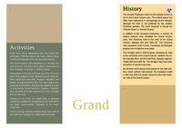

## Index

                            <a href="/compare.html2pdf.tools/docs/PDFreactor-Examples/brochure/fnt/">
                                fnt
                            </a>

                            <a href="/compare.html2pdf.tools/docs/PDFreactor-Examples/brochure/img/">
                                img
                            </a>

## BROCHURE

[📄 Input HTML](/html/PDFreactor%20Examples/brochure/brochure.html):

| mPDF | typeset.sh | PDFreactor |
|---------|---------|---------|
|  |  |  |
| [📕 mPDF Output](mpdf__html_PDFreactor_Examples_brochure_brochure.html.pdf) | [📕 typeset Output](typeset__html_PDFreactor_Examples_brochure_brochure.html.pdf) | [📕 PDFreactor Output](pdfreactor__html_PDFreactor_Examples_brochure_brochure.html.pdf) |

