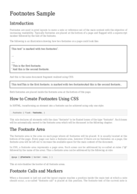

## 🔬 FOOTNOTES

### Input HTML & CSS

[📄 Input HTML](https://raw.githubusercontent.com/azettl/compare.html2pdf.tools/master//html/PDFreactor%20Examples/footnotes/footnotes.html)

    

        View FOOTNOTES Code
    

    <pre>
        <code>
            
        </code>
    </pre>

### Output PDF

| mPDF | typeset.sh | PDFreactor |
|---------|---------|---------|
|  |  |  |
| [📕 mPDF Output](mpdf__html_PDFreactor_Examples_footnotes_footnotes.html.pdf) | [📕 typeset Output](typeset__html_PDFreactor_Examples_footnotes_footnotes.html.pdf) | [📕 PDFreactor Output](pdfreactor__html_PDFreactor_Examples_footnotes_footnotes.html.pdf) |

