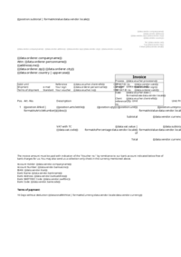
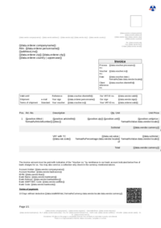

## Index

                            <a href="/compare.html2pdf.tools/PDFreactor-Examples/invoice/scripts/">
                                scripts
                            </a>

## 🔬 INVOICE

[📄 Input HTML](https://raw.githubusercontent.com/azettl/compare.html2pdf.tools/master//html/PDFreactor%20Examples/invoice/invoice.html)

### Output PDF

| mPDF | typeset.sh | PDFreactor |
|---------|---------|---------|
|  |  |  |
| [📕 mPDF Output](mpdf__html_PDFreactor_Examples_invoice_invoice.html.pdf) | [📕 typeset Output](typeset__html_PDFreactor_Examples_invoice_invoice.html.pdf) | [📕 PDFreactor Output](pdfreactor__html_PDFreactor_Examples_invoice_invoice.html.pdf) |

