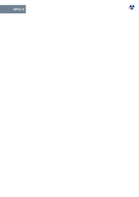

## Index

                            <a href="/compare.html2pdf.tools/PDFreactor-Examples/magazine/fnt/">
                                fnt
                            </a>

                            <a href="/compare.html2pdf.tools/PDFreactor-Examples/magazine/img/">
                                img
                            </a>

## 🔬 MAGAZINE

### Input HTML & CSS

[📄 Input HTML](https://raw.githubusercontent.com/azettl/compare.html2pdf.tools/master//html/PDFreactor%20Examples/magazine/magazine.html)

    

        View MAGAZINE Code
    

    <pre><code class="hljs xml">&lt;!DOCTYPE html&gt;
&lt;html lang="en-US"&gt;
&lt;head&gt;
    &lt;meta content="text/html; charset=UTF-8" http-equiv="Content-Type"/&gt;
    &lt;title&gt;Science Magazine&lt;/title&gt;
    &lt;style&gt;
        
        /***********************************************************
           * Fonts 
         ***********************************************************/
        
        @font-face {
            font-family: Sans;
            src: url("fnt/opensans/OpenSans-Regular.ttf");
            font-weight: normal;
            font-style: normal;
        }
        
        @font-face {
            font-family: Sans;
            src: url("fnt/opensans/OpenSans-Bold.ttf");
            font-weight: bold;
            font-style: normal;
        }
        
        @font-face {
            font-family: Sans;
            src: url("fnt/opensans/OpenSans-Italic.ttf");
            font-weight: normal;
            font-style: italic;
        }
        
        @font-face {
            font-family: Sans;
            src: url("fnt/opensans/OpenSans-BoldItalic.ttf");
            font-weight: bold;
            font-style: italic;
        }
        
        
        /***********************************************************
           * General Page Style 
         ***********************************************************/
        
        @page:first {
            counter-reset: page 17;
        }
        
        @page {
            size: A4 portrait;
            margin: 2cm 1cm;
            padding: 0cm;
            
            font-family: Sans;
        }
        
        @page:left {
            @bottom-left {
                content: counter(page);
                font-weight: bold;
                color: white;
            }
            
            @top-left-corner {
                content: "Space";
                color: white;
                font-weight: bold;
                font-size: 15pt;
                text-transform: uppercase;
                
                background-color: slategray;
                
                margin-top: 0.75cm;
                margin-left: 0px;
                margin-right: auto;
                
                width: 3.5cm;
                padding: 2mm;
            }
        }
        
        @page:right {
            @bottom-right {
                content: counter(page);
                font-weight: bold;
                color: white;
            }
        }
        
        
        /***********************************************************
           * General Document Style 
         ***********************************************************/
        
        html, body {
            padding: 0;
            margin: 0;
            line-height: 1.5;
            -ro-line-grid: create;
            font-size: 10pt;
            font-family: Sans;
        }
        
        h1 {
            font-size: 16pt;
            margin: 0;
        }
        
        h2 {
            font-size: 13pt;
            margin: 0;
        }
        
        h3 {
            font-size: 12pt;
            -ro-line-snap: contain;
            margin: 0;
        } 
        
        p, li, td, th {
            margin: 0;
            font-size: 10pt;
            hyphens: auto;
        }
        
        p {
            
            text-align: justify;
        }
        
        p + p {
            text-indent: 0.5cm;
        }
        
        table {
            width: 100%;
            border-collapse: collapse;
            padding: 0;
            margin: 0;
        }
        
        table :-ro-matches(td, th) {
            vertical-align: top;
            text-align: inherit;
        }
        
        table :-ro-matches(td, th) {
            padding: 1pt 1pt;
            border-bottom: 0.5pt solid black;
        }
        
        table tr:last-child :-ro-matches(td, th) {
            border-bottom: none;
        }
        
        table td p {
            text-indent: 0;
            margin: 0;
        }
        
        ol, ul {
            padding-left: 5mm;
        }
        
        a {
            color: black;
            font-style: italic;
        }
        
        section:first-of-type &gt; p:first-of-type::first-letter {
            float: left;
            font-size: 30pt;
            line-height: 0.5;
            padding: 0;
        }
        
        
        /***********************************************************
           * Individual Page Layout
         ***********************************************************/
        
        /* Page 1 */
        
        @page page1 {
            background-image: url("img/flickr-5959361987-original.jpg");
            background-position: -1cm -2cm;
            background-size: auto 29.7cm;
        }
        
        #page1 {
            page: page1;
        }
        
        #page1 &gt; .mainFlow {
            background-color: transparent;
            border: none;
        }
        
        #page1region1 {
            bottom: 0cm;
            left: 0cm;
            right: 0cm;
            width: auto;
        }
        
        #page1region2 {
            top: 4.2cm;
            left: 0cm;
            height: 7.7cm;
        }
        
        #page1region3 {
            top: 4.2cm;
            left: 6.5cm;
            height: 5.7cm;
        }
        
        
        /* Page 2 */
        
        @page page2 {
            background-image: url("img/flickr-5959361987-original.jpg");
            background-position: -22cm -2cm;
            background-size: auto 29.7cm;
        }
        
        #page2 {
            page: page2;
        }
        
        #page2 &gt; .mainFlow {
            background-color: transparent;
            border: none;
        }
        
        #page2region1 {
            top: 4cm;
            right: 0cm;
            height: 6.5cm;
        }
        
        #page2info {
            -ro-flow-from: shuttleProgramFlow;
            padding: 1mm 1mm;
            bottom: 0cm;
            left: 3cm;
            right: 3cm;
            height: 7.8cm;
        }
        
        
        /* Page 3 */
        
        @page page3 {
            background-image: url("img/flickr-5886117104-original.jpg");
            background-position: -2cm -2cm;
            background-size: auto 29.7cm;
        }
        
        #page3 {
            page: page3;
        }
        
        #page3region1 {
            top: 1.2cm;
            left: 1cm;
            height: 24cm;
        }
        
        #page3region2 {
            top: 19.7cm;
            left: 8cm;
            height: 5.5cm;
        }
        
        #page3info {
            -ro-flow-from: missionFactsFlow;
            padding: 1mm 1mm;
            top: 1.2cm;
            left: 8cm;
            width: 8cm;
            height: 5.9cm;
        }
        
        
        /* Page 4 */
        
        @page page4 {
            background-image: url("img/flickr-5886117104-original.jpg");
            background-position: -23.1cm -2cm;
            background-size: auto 29.7cm;
        }
        
        #page4 {
            page: page4;
        }
        
        #page4region1 {
            top: 1.2cm;
            right: 8cm;
            height: 7.6cm;
        }
        
        #page4region2 {
            top: 1.2cm;
            right: 1cm;
            padding-bottom: 10pt;
            height: auto;
        }
        
        #page4info {
            -ro-flow-from: attributionFlow;
            padding: 1mm 1mm;
            top: 20cm;
            right: 1cm;
            width: 13cm;
        }
        
        
        /***********************************************************
           * Flow Content Layout
         ***********************************************************/
        
        /* Main Flow*/
        
        #main {
            -ro-flow-into: mainFlow;
            color: white;
        }
        
        #main &gt; hgroup {
            break-after: region;
        }
        
        #main &gt; hgroup &gt; h1 {
            font-size: 59pt;
            margin-bottom: 0cm;
            
            text-shadow: 0 0 10pt white;
        }
        
        #main &gt; hgroup &gt; h2 {
            font-size: 14pt;
            margin: 0;
        }
        
        #main &gt; section {
            -ro-line-snap: baseline;
        }
        
        
        /* Shuttle Program Flow*/
        
        #shuttleProgram {
            -ro-flow-into: shuttleProgramFlow;
        }
        
        
        /* Mission Facts Flow*/
        
        #missionFacts {
            -ro-flow-into: missionFactsFlow;
        }
        
        
        /* Attribution Flow*/
        
        #attribution {
            -ro-flow-into: attributionFlow;
        }
        
        #attribution ul {
            margin: 0 1mm;
        }
        
        
        /* All Flows */
        
        article:-ro-matches(#shuttleProgram, #missionFacts, #attribution) &gt; * {
            margin: 0;
        }
        
        
        /***********************************************************
           * Region Layout
         ***********************************************************/
        
        .mainFlow {
            -ro-flow-from: mainFlow;
            position: absolute;
            width: 5.5cm;
            padding: 0 4mm;
            background-color: rgba(0,0,0,0.7);
        }
        
        .infobox {
            position: absolute;
            background-color: rgba(255,230,130,0.9);
            padding: 0mm 2mm 2mm;
        }
        
        /**********************************************************
          * ro-preferences
        ***********************************************************/
        
        @-ro-preferences {
            first-page-side: left;
            page-layout: 2 page;
            initial-zoom: fit-page;
        }
        
        .no-bookmark {
            -ro-bookmark-level: none;
        }
        
        /**********************************************************
          * browser styles
          * (so the content an be read without regions)
        ***********************************************************/
        
        @supports ( not ( -ro-flow-into: abc ) ) {
            .mainFlow, .infobox {
                display: none;
            }
            #main {
                color: black;
            }
            body {
                margin: 16px;
                column-gap: 16px;
                column-width: 300px;
            }
            hgroup {
                column-span: all;
                margin-bottom: 16px;
            }
            section:first-of-type &gt; p:first-of-type::first-letter {
                all: unset;
            }
        }
        
    &lt;/style&gt;
&lt;/head&gt;
&lt;body&gt;
    
    &lt;!----------------------------------------------------------
      - Page Layout
      ----------------------------------------------------------&gt;
    
    &lt;div id="page1" class="page"&gt;
        &lt;div id="page1region1" class="mainFlow"&gt;&lt;/div&gt;
        &lt;div id="page1region2" class="mainFlow"&gt;&lt;/div&gt;
        &lt;div id="page1region3" class="mainFlow"&gt;&lt;/div&gt;
    &lt;/div&gt;
    
    &lt;div id="page2" class="page"&gt;
        &lt;div id="page2region1" class="mainFlow"&gt;&lt;/div&gt;
        &lt;div id="page2info" class="infobox"&gt;&lt;/div&gt;
    &lt;/div&gt;
    
    &lt;div id="page3" class="page"&gt;
        &lt;div id="page3region1" class="mainFlow"&gt;&lt;/div&gt;
        &lt;div id="page3region2" class="mainFlow"&gt;&lt;/div&gt;
        &lt;div id="page3info" class="infobox"&gt;&lt;/div&gt;
    &lt;/div&gt;
    
    &lt;div id="page4" class="page"&gt;
        &lt;div id="page4region1" class="mainFlow"&gt;&lt;/div&gt;
        &lt;div id="page4region2" class="mainFlow"&gt;&lt;/div&gt;
        &lt;div id="page4info" class="infobox"&gt;&lt;/div&gt;
    &lt;/div&gt;
    
    &lt;!----------------------------------------------------------
      - Flow Content
      ----------------------------------------------------------&gt;
    
    &lt;article id="main"&gt;
        &lt;hgroup&gt;
            &lt;h1&gt;The Final Mission&lt;/h1&gt;
            &lt;h2&gt;In July 2011 the Space Shuttle Atlantis went on its 135th and final mission into space, transporting hardware to the International Space Station.&lt;/h2&gt;
        &lt;/hgroup&gt;
        
        &lt;section&gt;
            &lt;p&gt;STS-135 (ISS assembly flight ULF7) was the 135th and final mission of the American Space Shuttle program. It used the orbiter Atlantis and hardware originally processed for the STS-335 contingency mission, which was not flown. STS-135 launched on 8 July 2011, and landed on 21 July 2011, following a one-day mission extension. The four-person crew was the smallest of any shuttle mission since STS-6 in April 1983.&lt;/p&gt;
            &lt;p&gt;The mission's primary cargo was the Multi-Purpose Logistics Module (MPLM) Raffaello and a Lightweight Multi-Purpose Carrier (LMC), which were delivered to the International Space Station (ISS). The flight of Raffaello marked the only time that Atlantis carried an MPLM. Although the mission was authorized, it initially had no appropriation in the NASA budget, raising questions about whether the mission would fly.&lt;/p&gt;
            &lt;p&gt;On 20 January 2011, program managers changed STS-335 to STS-135 on the flight manifest. This allowed for training and other mission specific preparations.&lt;/p&gt;
            &lt;p&gt;On 13 February 2011, program managers told their workforce that STS-135 would fly regardless of the funding situation via a continuing resolution. Until this point, there had been no official references to the STS-135 mission in NASA official documentation for the general public.&lt;/p&gt;
            &lt;p&gt;During an address at the Marshall Space Flight Center on 16 November 2010, NASA administrator Charles Bolden said that the agency needed to fly STS-135 to the station in 2011, due to possible delays in the development of commercial rockets and spacecraft designed to transport cargo to the ISS. "We are hoping to fly a third shuttle mission (in addition to STS-133 and STS-134) in June 2011, what everybody calls the launch-on-need mission... and that's really needed to [buy down] the risk for the development time for commercial cargo," Bolden said.&lt;/p&gt;
            &lt;p&gt;The mission was included in NASA's 2011 authorization, which was signed into law on 11 October 2010, but funding remained dependent on a subsequent appropriation bill. United Space Alliance signed a contract extension for the mission, along with STS-134; the contract contained six one-month options with NASA in order to support continuing operations.&lt;/p&gt;
            &lt;p&gt;The U.S. federal budget approved in April 2011 called for $5.5 billion for NASA's space operations division, including the shuttle and space station programs. According to NASA, the budget running through 30 September 2011 ended all concerns about funding the STS-135 mission.&lt;/p&gt;
        &lt;/section&gt;
        
        &lt;section&gt;
            &lt;h3&gt;Crew&lt;/h3&gt;
            &lt;p&gt;NASA announced the STS-335&amp;#8203;/&amp;#8203;135 crew on 14 September 2010. Only four astronauts were assigned to this mission, versus the normal six or seven, because there were no other shuttles available for a rescue following the retirement of Discovery and Endeavour.&lt;/p&gt;
            &lt;p&gt;If the shuttle was seriously damaged in orbit, the crew would have moved into the International Space Station and returned in Russian Soyuz capsules, one at a time, over the course of a year. All STS-135 crew members were custom-fitted for a Russian Sokol space suit and molded Soyuz seat liner for this possibility.&lt;/p&gt;
            &lt;p&gt;The reduced crew size also allowed the mission to maximize the payload carried to the ISS. It was the only time that a Shuttle crew of four flew to the ISS. The last shuttle mission to fly with just four crew members occurred 28 years earlier: STS-6 on 4 April 1983 aboard Space Shuttle Challenger.&lt;/p&gt;
        &lt;/section&gt;
        
        &lt;section&gt;
            &lt;h3&gt;Mission Milestones&lt;/h3&gt;
            &lt;p&gt;The mission marked:&lt;/p&gt;
            &lt;ul&gt;
                &lt;li&gt;166th NASA manned space flight&lt;/li&gt;
                &lt;li&gt;135th shuttle mission since STS-1&lt;/li&gt;
                &lt;li&gt;33rd flight of Atlantis&lt;/li&gt;
                &lt;li&gt;3rd shuttle flight in 2011&lt;/li&gt;
                &lt;li&gt;37th shuttle mission to the ISS&lt;/li&gt;
                &lt;li&gt;110th post-Challenger disaster shuttle mission&lt;/li&gt;
                &lt;li&gt;22nd post-Columbia disaster shuttle mission&lt;/li&gt;
                &lt;li&gt;100th day launch&lt;/li&gt;
                &lt;li&gt;133rd landing overall, 78th at KSC, 26th night landing, and 20th night landing at KSC&lt;/li&gt;
            &lt;/ul&gt;
        &lt;/section&gt;
    &lt;/article&gt;
    
    &lt;article id="shuttleProgram"&gt;
        &lt;h1 class="no-bookmark"&gt;The Shuttle Program&lt;/h1&gt;
        &lt;p&gt;NASA's Space Shuttle Program, officially called the Space Transportation System (STS), was the United States government's manned launch vehicle program from 1981 to 2011, 
           with the program officially beginning in 1972. The winged Space Shuttle orbiter was launched vertically, usually carrying four to seven astronauts (although two and eight 
           have been carried) and up to 50,000 lb (22,700 kg) of payload into low Earth orbit (LEO).&lt;/p&gt;
        &lt;p&gt;When its mission was complete, the Shuttle could independently move itself out of orbit using its Orbital Maneuvering System (it oriented itself heads down and tail first, 
           firing its OMS engines, thus slowing it down) and re-enter the Earth's atmosphere. During descent and landing the orbiter acted as a re-entry vehicle and a glider, using 
           its RCS system and flight control surfaces to maintain altitude until it made an unpowered landing at either Kennedy Space Center or Edwards Air Force Base.&lt;/p&gt;
    &lt;/article&gt;
    
    &lt;article id="missionFacts"&gt;
        &lt;h1 class="no-bookmark"&gt;Mission Facts&lt;/h1&gt;
        &lt;table&gt;
            &lt;tr&gt;
                &lt;th&gt;Crew&lt;/th&gt;
                &lt;td&gt;
                    &lt;p&gt;Christopher Ferguson&lt;/p&gt;
                    &lt;p&gt;Douglas Hurley&lt;/p&gt;
                    &lt;p&gt;Sandra Magnus&lt;/p&gt;
                    &lt;p&gt;Rex Walheim&lt;/p&gt;
                &lt;/td&gt;
            &lt;/tr&gt;
            &lt;tr&gt;
                &lt;th&gt;Mission duration&lt;/th&gt;
                &lt;td&gt;
                    &lt;p&gt;12 days&lt;/p&gt;
                    &lt;p&gt;18 hours&lt;/p&gt;
                    &lt;p&gt;28 minutes&lt;/p&gt;
                    &lt;p&gt;50 seconds&lt;/p&gt;
                &lt;/td&gt;
            &lt;/tr&gt;
            &lt;tr&gt;
                &lt;th&gt;Distance travelled&lt;/th&gt;
                &lt;td&gt;
                    &lt;p&gt;8,505,161 km&lt;/p&gt;
                &lt;/td&gt;
            &lt;/tr&gt;
        &lt;/table&gt;
    &lt;/article&gt;
    
    &lt;article id="attribution"&gt;
        &lt;h1 class="no-bookmark"&gt;Attribution&lt;/h1&gt;
        &lt;p&gt;Excerpts from Wikipedia:&lt;/p&gt;
        &lt;ul&gt;
            &lt;li&gt;&lt;a href="http://en.wikipedia.org/wiki/STS-135"&gt;http://en.wikipedia.org/wiki/STS-135&lt;/a&gt;&lt;/li&gt;
            &lt;li&gt;&lt;a href="http://en.wikipedia.org/wiki/Space_Shuttle_program"&gt;http://en.wikipedia.org/wiki/Space_Shuttle_program&lt;/a&gt;&lt;/li&gt;
        &lt;/ul&gt;
        &lt;p&gt;Pictures:&lt;/p&gt;
        &lt;ul&gt;
            &lt;li&gt;Pages 1-2 by &lt;a href="http://www.flickr.com/photos/24662369@N07"&gt;NASA Goddard Photo and Video&lt;/a&gt; on &lt;a href="http://www.flickr.com/photos/24662369@N07/5959361987"&gt;Flickr&lt;/a&gt;.
                &lt;a href="http://creativecommons.org/licenses/by/2.0/"&gt;Some rights reserved.&lt;/a&gt;&lt;/li&gt;
        
            &lt;li&gt;Pages 3-4 by &lt;a href="http://www.flickr.com/photos/57907353@N04"&gt;Undertow851&lt;/a&gt; on &lt;a href="http://www.flickr.com/photos/57907353@N04/5886117104"&gt;Flickr&lt;/a&gt;.
                &lt;a href="http://creativecommons.org/licenses/by/2.0/"&gt;Some rights reserved.&lt;/a&gt;&lt;/li&gt;
        &lt;/ul&gt;
    &lt;/article&gt;
    
&lt;/body&gt;
&lt;/html&gt;
</code></pre>

### Output PDF

| mPDF | typeset.sh | PDFreactor |
|---------|---------|---------|
|  |  |  |
| [📕 mPDF Output](mpdf__html_PDFreactor_Examples_magazine_magazine.html.pdf) | [📕 typeset Output](typeset__html_PDFreactor_Examples_magazine_magazine.html.pdf) | [📕 PDFreactor Output](pdfreactor__html_PDFreactor_Examples_magazine_magazine.html.pdf) |

