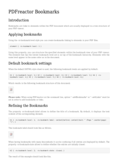
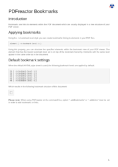
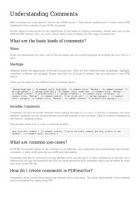
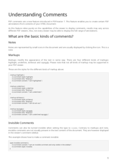
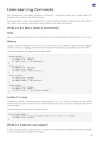

## Index

                            <a href="/compare.html2pdf.tools/PDFreactor-Examples/pdffeatures/resources/">
                                resources
                            </a>

## 🔬 BOOKMARKS

### Input HTML & CSS

[📄 Input HTML](https://raw.githubusercontent.com/azettl/compare.html2pdf.tools/master//html/PDFreactor%20Examples/pdffeatures/bookmarks.html)

    

        View BOOKMARKS Code
    

    <pre>
        <code>
            &lt;!DOCTYPE html&gt;
&lt;html lang=&quot;en-US&quot;&gt;
    &lt;head&gt;
        &lt;meta http-equiv=&quot;Content-Type&quot; content=&quot;text/html; charset=UTF-8&quot;/&gt;
        &lt;title&gt;Bookmarks Sample&lt;/title&gt;
        
        &lt;style&gt;
            /***************************************************
             * Page
             ***************************************************/
            
            @page {
                margin: 1.5cm;
                
                @bottom-right {
                    content: counter(page);
                    vertical-align: top;
                    font-size: 12pt;
                    color: black;
                }
            }
            
            /* Styles that should specifically not affect browsers */
            @media print {
                .pageBreak + * {
                    break-before: page;
                    margin-top: 0;
                }
            
                .pageBreakBefore {
                    break-before: page;
                    margin-top: 0;
                }
                
                h1 {
                    break-before: page;
                    margin-top: 0 !important;
                }
            }
            
            /* Some basic style for browsers */
            @media screen {
                
                html {
                    background-color: lightgray;
                }
                
                body {
                    max-width: 1200px;
                    margin: 8px auto;
                    
                    padding: 32px;
                    padding-top: 0;
                    border: 1px solid darkgray;
                    background-color: white;
                }
                
                img {
                    max-width: 18cm;
                }
                
                h1 {
                    margin-top: 1cm !important;
                }
            }
            
            /***************************************************
             * General
             ***************************************************/
            
            html {
                font-family: arial, sans-serif;
                font-size: 10pt;
                color: #222222;
            }
            
            div, div p, blockquote {
                color: #222222;
            }
            
            h1, h2, h3, h4, h5, h6 {
                font-weight: normal;
                margin-top: 0.6cm;
                break-after: avoid;
            }
            
            h1 {
                font-size: 24pt;
                margin-bottom: 0.5cm;
            }
            
            h2 {
                font-size: 18pt;
                margin: 0.4cm 0;
            }
            
            h3 {
                font-size: 14pt;
                margin: 0.4cm 0;
            }
            
            h4 {
                font-size: 12pt;
                text-decoration: underline;
                margin-bottom: 0.25cm;
            }
            
            p, td, th, li {
                font-size: 10pt;
                line-height: 1.25;
                color: #666666;
            }
            
            p {
                text-align: justify;
            }
            
            a {
                color: #e41d03;
                text-decoration: underline;
            }
            
            barcode, math {
                color: black;
            }
            
            blockquote {
                font-family: 'times new roman', serif;
                font-style: italic;
                margin: 2mm;
                padding: 0;
            }
            
            table {
                margin-left: auto;
                margin-right: auto;
                border-collapse: collapse;
                background-color: transparent;
            }
            
            table, td, th {
                border: thin solid #e1e1e1;
            }
            
            td, th {
                padding: 0.2cm;
            }
            
            th {
                text-align: center;
                background-color: #f5f5f5;
            }
            
            
            
            
            table.code, td.code, div.code, img.sample {
                background-color: #f5f5f5;
                break-before: avoid;
            }
            
            ul, ol {
                break-inside: avoid;
            }
            
            
            
            
            /***************************************************
             * Box Classes
             ***************************************************/
            
            div.code, div.result, div.experimentalNote, img.sample {
                margin-bottom: 0.25cm;
                border: 1pt solid #e1e1e1;
                padding: 2.5mm;
                break-before: avoid;
                break-inside: avoid;
            }
            
            div.code p {
                text-align: inherit;
            }
            
            :-ro-matches(div.code, div.result) p:first-of-type {
                margin-top: 0;
            }
            
            :-ro-matches(div.code, div.result) p:last-of-type {
                margin-bottom: 0;
            }
            
            code, .code {
                font-family: 'courier new', monospace;
                font-size: 8pt;
                line-height: 1.2;
            }
            
            code {
                white-space: pre;
            }
            
            code .comment {
                color: #3f7f5f;
            }
            
            div.result {
                font-family: 'times new roman', serif;
                border: 1pt solid #222222;
                background-color: white;
            }
            
            div.result p {
                color: #222222;
            }
            
            div.result p:first-child {
                margin-top: 0;
            }
            
            div.result p:last-child {
                margin-bottom: 0;
            }
            
            div.experimentalNote {
                border-color: yellow;
                background-color: lightyellow;
                margin: 1cm 0;
                text-align: justify;
            }
            
            /***************************************************
             * Break Classes
             ***************************************************/
            
            .columnBreak {
                break-after: column;
            }
            
            /******************************************
             * Preferences
             *******************************************/
            
            @-ro-preferences {
                page-layout: 1 column;
                initial-zoom: fit-page;
            }
            &lt;/style&gt;
        
        &lt;style type=&quot;text/css&quot;&gt;
            
            h1 {
                break-before: page;
            }
            
            #blindText {
                -ro-line-grid: create;
                -ro-line-snap: contain;
                line-height: 1.25;
            }
            
            #blindText &gt; * {
                
            }
            
            /* Counter */
            
            #blindText &gt; h1 {
                counter-increment: h1 1;
                counter-reset: h2 0;
                
                -ro-bookmark-label: content(before) content(text) &quot; (Page &quot; counter(page) &quot;)&quot;;
            }
            
            #blindText &gt; h2 {
                counter-increment: h2 1;
                counter-reset: h3 0;
                
                -ro-bookmark-state: closed;
                -ro-bookmark-label: content(before) content(text);
            }
            
            #blindText &gt; h3 {
                counter-increment: h3 1;
                
                -ro-bookmark-label: content(before) content(text);
            }
            
            #blindText &gt; h1::before {
                content: counter(h1) &quot;. &quot;;
            } 
            
            #blindText &gt; h2::before {
                content: counter(h1) &quot;.&quot; counter(h2) &quot; &quot;;
            }  
            
            #blindText &gt; h3::before {
                content: counter(h1) &quot;.&quot; counter(h2) &quot;.&quot; counter(h3) &quot; &quot;;
            }
            
            /* Bookmark Structure */
            
            div.bmlevel1 {
                -ro-bookmark-level: 1;
                border: 1px solid blue;
                margin-bottom: 1mm;
            }
            
            div.bmlevel2 {
                -ro-bookmark-level: 2;
                -ro-bookmark-state: closed;
                border: 1px solid red;
                margin-bottom: 1mm;
            }
            
            div.bmlevel3 {
                -ro-bookmark-level: 3;
                -ro-bookmark-state: closed;
                border: 1px solid green;
                margin-bottom: 1mm;
            }
            
            /* Preferences */
            
            @-ro-preferences {
                initial-zoom: 100%;
                page-layout: 2 column;
            }
            
      &lt;/style&gt;
    &lt;/head&gt;
    &lt;body&gt;
       &lt;h1&gt;PDFreactor Bookmarks&lt;/h1&gt;
       &lt;h2&gt;Introduction&lt;/h2&gt;
       &lt;p&gt;
         Bookmarks are links to elements within the PDF document which are
         usually displayed in a tree structure of your PDF viewer.
       &lt;/p&gt;  
       &lt;h2&gt;Applying bookmarks&lt;/h2&gt;
       &lt;p&gt;
         Using the -ro-bookmark-level style you can create bookmarks 
         linking to elements in your PDF files.
       &lt;/p&gt;
       &lt;div class=&quot;code&quot;&gt;&lt;code&gt;element { -ro-bookmark-level: 1 }&lt;/code&gt;&lt;/div&gt;
       &lt;p&gt;
        Using this property, you can structure the specified elements 
        within the bookmark view of your PDF viewer. The element that has 
        the lowest bookmark level set is on top of the bookmark hierarchy.
        Elements with the same level appear in the same order as in the document.
        &lt;/p&gt;
        &lt;h2&gt;Default bookmark settings&lt;/h2&gt;
        &lt;p&gt;When the default XHTML style sheet is used, the following bookmark levels 
        are applied by default:&lt;/p&gt;
&lt;div class=&quot;code&quot;&gt;&lt;code&gt;h1 { -ro-bookmark-level: 1;}
h2 { -ro-bookmark-level: 2;}
h3 { -ro-bookmark-level: 3;}
h4 { -ro-bookmark-level: 4;}
h5 { -ro-bookmark-level: 5;}
h6 { -ro-bookmark-level: 6;}&lt;/code&gt;&lt;/div&gt;
        &lt;p&gt;Which results in the following bookmark structure of this document:&lt;/p&gt;
        &lt;img class=&quot;sample&quot; alt=&quot;Bookmark Structure&quot; src=&quot;resources/bookmarks.png&quot; /&gt;
        &lt;p class=&quot;pageBreak&quot;&gt;&lt;strong&gt;Please note:&lt;/strong&gt; When using PDFreactor on the command line,
        option &quot;--addBookmarks&quot; or &quot;--addLinks&quot; must be set in order to add bookmarks or links.
        &lt;/p&gt;
        &lt;h2&gt;Refining the Bookmarks&lt;/h2&gt;
        &lt;p&gt;The property -ro-bookmark-label allows to define the title of a bookmark. 
        By default, it displays the text content of the corresponding element.&lt;/p&gt;
        &lt;div class=&quot;code&quot;&gt;&lt;code&gt;h1 { 
  -ro-bookmark-level: 1;
  -ro-bookmark-label: content(before) content(text) &quot; (Page &quot; counter(page) &quot;)&quot;;
}&lt;/code&gt;&lt;/div&gt;
        &lt;p&gt;This bookmark label should look like as follows.&lt;/p&gt;
        &lt;img class=&quot;sample&quot; alt=&quot;Refined Bookmark Structure&quot; src=&quot;resources/refiningBookmarks.png&quot; /&gt;
        &lt;p&gt;When having bookmarks with many descendants it can be confusing if all entries 
        are displayed by default. The property -ro-bookmark-state allows to define whether
        the entries are initially closed:&lt;/p&gt;
        &lt;div class=&quot;code&quot;&gt;&lt;code&gt;h2 { 
  -ro-bookmark-level: 2;
  -ro-bookmark-state: closed;
}&lt;/code&gt;&lt;/div&gt;
        &lt;p&gt;The result of this example should look like this.&lt;/p&gt;
        &lt;img class=&quot;sample&quot; alt=&quot;Refined Bookmark Structure Closed&quot; src=&quot;resources/refiningBookmarksClosed.png&quot; /&gt;
        &lt;h2 class=&quot;pageBreakBefore&quot;&gt;Defining other elements as bookmarks&lt;/h2&gt;
        &lt;p&gt;
        Analogous to the default bookmark styles, it's easily possible to define other elements,
        than headlines for bookmarks:&lt;/p&gt;
&lt;div class=&quot;code&quot;&gt;&lt;code&gt;div.bmlevel1 {
  -ro-bookmark-level: 1;
  border: 1px solid blue;
  margin-bottom: 1mm;
}

div.bmlevel2 {
  -ro-bookmark-level: 2;
  border: 1px solid red;
  margin-bottom: 1mm;
}

div.bmlevel3 {
  -ro-bookmark-level: 3;
  border: 1px solid green;
  margin-bottom: 1mm;
}&lt;/code&gt;&lt;/div&gt;
        &lt;div class=&quot;bmlevel1&quot;&gt;This &amp;lt;div&amp;gt; should be bookmarked with level 1&lt;/div&gt;
        &lt;div class=&quot;bmlevel2&quot;&gt;This &amp;lt;div&amp;gt; should be bookmarked with level 2&lt;/div&gt;
        &lt;div class=&quot;bmlevel3&quot;&gt;This &amp;lt;div&amp;gt; should be bookmarked with level 3&lt;/div&gt;
        &lt;p&gt;Which results in the following bookmark structure:&lt;/p&gt; 
        &lt;img class=&quot;sample&quot; alt=&quot;Custom Bookmark Structure&quot; src=&quot;resources/custombookmarks.png&quot; /&gt;
        
        &lt;div id=&quot;blindText&quot;&gt;
            &lt;h1&gt;The following chapters contain some blind text to demonstrate the numbering&lt;/h1&gt;
            &lt;h2&gt;Chapter&lt;/h2&gt;
            &lt;p&gt;Lorem ipsum dolor sit amet, consectetuer adipiscing elit. Cras ante. Praesent at lorem ac massa facilisis convallis. Suspendisse potenti. Sed convallis dignissim pede. Sed lobortis sodales lectus. Vivamus quam. Morbi pulvinar cursus ipsum. Duis tristique, tellus vitae suscipit egestas, enim nisl tempus augue, eget feugiat tellus urna lobortis diam. Sed quis est. Sed malesuada, lorem non placerat convallis, arcu sapien pretium dui, eget fringilla urna velit lacinia nisi. Ut in tellus non ante sagittis lacinia. Vestibulum sed turpis nec felis adipiscing lobortis.&lt;/p&gt;
            &lt;p&gt;Proin risus nibh, commodo nec, facilisis a, consectetuer in, urna. Maecenas vitae tortor. Donec dictum pharetra lacus. Duis arcu neque, eleifend id, varius non, lobortis hendrerit, mauris. Donec scelerisque felis a sem. Vivamus semper est non ipsum. Nam malesuada blandit orci. Aliquam quam. Aenean pharetra fermentum magna. In et nibh. Donec consequat elit a felis. Ut convallis, enim at feugiat sodales, nisi mauris sagittis erat, eu egestas velit nisi sed nibh. Duis facilisis mi non lacus. In id justo. Lorem ipsum dolor sit amet, consectetuer adipiscing elit. Nunc sed sem. Sed sed mi. Maecenas dignissim, felis id vehicula aliquet, justo metus sagittis sem, eu semper ligula purus a odio.&lt;/p&gt;
            &lt;p&gt;Vivamus nunc metus, porttitor id, facilisis quis, porta non, justo. Mauris a metus rhoncus augue vulputate consequat. In vel tortor eget metus porttitor commodo. Etiam vitae quam. Duis commodo cursus nisi. Suspendisse purus ligula, vulputate scelerisque, accumsan at, accumsan non, urna. Donec congue massa a tortor ultrices convallis. Vivamus nec justo in justo rhoncus fringilla. Nam urna erat, pretium nec, tempus ut, mollis in, sem. Sed tortor felis, iaculis ut, fermentum non, euismod at, enim. Integer sagittis, magna vitae blandit cursus, diam lorem tempus sapien, commodo mollis velit augue tincidunt orci.&lt;/p&gt;
            &lt;p&gt;Curabitur posuere viverra justo. Cum sociis natoque penatibus et magnis dis parturient montes, nascetur ridiculus mus. Suspendisse quis nisi. Pellentesque tortor lorem, ullamcorper ac, lacinia non, dictum id, risus. Donec condimentum lobortis augue. Morbi sit amet turpis a velit dictum ultrices. Nulla facilisi. Pellentesque habitant morbi tristique senectus et netus et malesuada fames ac turpis egestas. Aenean sagittis, nisl vestibulum condimentum porttitor, risus felis varius urna, nec porta tortor lectus et nibh. Ut odio justo, auctor vel, scelerisque at, aliquam nec, nibh. Fusce mauris. Aenean ornare nunc sit amet arcu. Duis nec lacus eget purus tempor feugiat. Sed non velit. Etiam ultrices ullamcorper neque.&lt;/p&gt;
            &lt;p&gt;Morbi eleifend felis molestie mi euismod dictum. Morbi lacus arcu, luctus nec, rhoncus et, blandit a, felis. Morbi nunc purus, sodales sit amet, tempus vitae, ullamcorper non, elit. Cras diam. Nunc nisi. Duis id est. Quisque tempor. Sed fringilla purus sit amet metus. Lorem ipsum dolor sit amet, consectetuer adipiscing elit. Aenean sit amet elit. Donec nec erat. Nullam aliquam.&lt;/p&gt;
            &lt;h1&gt;Main Heading&lt;/h1&gt;
            &lt;h2&gt;Chapter&lt;/h2&gt;
            &lt;p&gt;Lorem ipsum dolor sit amet, consectetuer adipiscing elit. Cras ante. Praesent at lorem ac massa facilisis convallis. Suspendisse potenti. Sed convallis dignissim pede. Sed lobortis sodales lectus. Vivamus quam. Morbi pulvinar cursus ipsum. Duis tristique, tellus vitae suscipit egestas, enim nisl tempus augue, eget feugiat tellus urna lobortis diam. Sed quis est. Sed malesuada, lorem non placerat convallis, arcu sapien pretium dui, eget fringilla urna velit lacinia nisi. Ut in tellus non ante sagittis lacinia. Vestibulum sed turpis nec felis adipiscing lobortis.&lt;/p&gt;
            &lt;p&gt;Proin risus nibh, commodo nec, facilisis a, consectetuer in, urna. Maecenas vitae tortor. Donec dictum pharetra lacus. Duis arcu neque, eleifend id, varius non, lobortis hendrerit, mauris. Donec scelerisque felis a sem. Vivamus semper est non ipsum. Nam malesuada blandit orci. Aliquam quam. Aenean pharetra fermentum magna. In et nibh. Donec consequat elit a felis. Ut convallis, enim at feugiat sodales, nisi mauris sagittis erat, eu egestas velit nisi sed nibh. Duis facilisis mi non lacus. In id justo. Lorem ipsum dolor sit amet, consectetuer adipiscing elit. Nunc sed sem. Sed sed mi. Maecenas dignissim, felis id vehicula aliquet, justo metus sagittis sem, eu semper ligula purus a odio.&lt;/p&gt;
            &lt;p&gt;Vivamus nunc metus, porttitor id, facilisis quis, porta non, justo. Mauris a metus rhoncus augue vulputate consequat. In vel tortor eget metus porttitor commodo. Etiam vitae quam. Duis commodo cursus nisi. Suspendisse purus ligula, vulputate scelerisque, accumsan at, accumsan non, urna. Donec congue massa a tortor ultrices convallis. Vivamus nec justo in justo rhoncus fringilla. Nam urna erat, pretium nec, tempus ut, mollis in, sem. Sed tortor felis, iaculis ut, fermentum non, euismod at, enim. Integer sagittis, magna vitae blandit cursus, diam lorem tempus sapien, commodo mollis velit augue tincidunt orci.&lt;/p&gt;
            &lt;p&gt;Curabitur posuere viverra justo. Cum sociis natoque penatibus et magnis dis parturient montes, nascetur ridiculus mus. Suspendisse quis nisi. Pellentesque tortor lorem, ullamcorper ac, lacinia non, dictum id, risus. Donec condimentum lobortis augue. Morbi sit amet turpis a velit dictum ultrices. Nulla facilisi. Pellentesque habitant morbi tristique senectus et netus et malesuada fames ac turpis egestas. Aenean sagittis, nisl vestibulum condimentum porttitor, risus felis varius urna, nec porta tortor lectus et nibh. Ut odio justo, auctor vel, scelerisque at, aliquam nec, nibh. Fusce mauris. Aenean ornare nunc sit amet arcu. Duis nec lacus eget purus tempor feugiat. Sed non velit. Etiam ultrices ullamcorper neque.&lt;/p&gt;
            &lt;p&gt;Morbi eleifend felis molestie mi euismod dictum. Morbi lacus arcu, luctus nec, rhoncus et, blandit a, felis. Morbi nunc purus, sodales sit amet, tempus vitae, ullamcorper non, elit. Cras diam. Nunc nisi. Duis id est. Quisque tempor. Sed fringilla purus sit amet metus. Lorem ipsum dolor sit amet, consectetuer adipiscing elit. Aenean sit amet elit. Donec nec erat. Nullam aliquam.&lt;/p&gt;
            &lt;h2&gt;Chapter&lt;/h2&gt;
            &lt;p&gt;Lorem ipsum dolor sit amet, consectetuer adipiscing elit. Cras ante. Praesent at lorem ac massa facilisis convallis. Suspendisse potenti. Sed convallis dignissim pede. Sed lobortis sodales lectus. Vivamus quam. Morbi pulvinar cursus ipsum. Duis tristique, tellus vitae suscipit egestas, enim nisl tempus augue, eget feugiat tellus urna lobortis diam. Sed quis est. Sed malesuada, lorem non placerat convallis, arcu sapien pretium dui, eget fringilla urna velit lacinia nisi. Ut in tellus non ante sagittis lacinia. Vestibulum sed turpis nec felis adipiscing lobortis.&lt;/p&gt;
            &lt;p&gt;Proin risus nibh, commodo nec, facilisis a, consectetuer in, urna. Maecenas vitae tortor. Donec dictum pharetra lacus. Duis arcu neque, eleifend id, varius non, lobortis hendrerit, mauris. Donec scelerisque felis a sem. Vivamus semper est non ipsum. Nam malesuada blandit orci. Aliquam quam. Aenean pharetra fermentum magna. In et nibh. Donec consequat elit a felis. Ut convallis, enim at feugiat sodales, nisi mauris sagittis erat, eu egestas velit nisi sed nibh. Duis facilisis mi non lacus. In id justo. Lorem ipsum dolor sit amet, consectetuer adipiscing elit. Nunc sed sem. Sed sed mi. Maecenas dignissim, felis id vehicula aliquet, justo metus sagittis sem, eu semper ligula purus a odio.&lt;/p&gt;
            &lt;p&gt;Vivamus nunc metus, porttitor id, facilisis quis, porta non, justo. Mauris a metus rhoncus augue vulputate consequat. In vel tortor eget metus porttitor commodo. Etiam vitae quam. Duis commodo cursus nisi. Suspendisse purus ligula, vulputate scelerisque, accumsan at, accumsan non, urna. Donec congue massa a tortor ultrices convallis. Vivamus nec justo in justo rhoncus fringilla. Nam urna erat, pretium nec, tempus ut, mollis in, sem. Sed tortor felis, iaculis ut, fermentum non, euismod at, enim. Integer sagittis, magna vitae blandit cursus, diam lorem tempus sapien, commodo mollis velit augue tincidunt orci.&lt;/p&gt;
            &lt;p&gt;Curabitur posuere viverra justo. Cum sociis natoque penatibus et magnis dis parturient montes, nascetur ridiculus mus. Suspendisse quis nisi. Pellentesque tortor lorem, ullamcorper ac, lacinia non, dictum id, risus. Donec condimentum lobortis augue. Morbi sit amet turpis a velit dictum ultrices. Nulla facilisi. Pellentesque habitant morbi tristique senectus et netus et malesuada fames ac turpis egestas. Aenean sagittis, nisl vestibulum condimentum porttitor, risus felis varius urna, nec porta tortor lectus et nibh. Ut odio justo, auctor vel, scelerisque at, aliquam nec, nibh. Fusce mauris. Aenean ornare nunc sit amet arcu. Duis nec lacus eget purus tempor feugiat. Sed non velit. Etiam ultrices ullamcorper neque.&lt;/p&gt;
            &lt;p&gt;Morbi eleifend felis molestie mi euismod dictum. Morbi lacus arcu, luctus nec, rhoncus et, blandit a, felis. Morbi nunc purus, sodales sit amet, tempus vitae, ullamcorper non, elit. Cras diam. Nunc nisi. Duis id est. Quisque tempor. Sed fringilla purus sit amet metus. Lorem ipsum dolor sit amet, consectetuer adipiscing elit. Aenean sit amet elit. Donec nec erat. Nullam aliquam.&lt;/p&gt;
            &lt;h1&gt;Main Heading&lt;/h1&gt;
            &lt;h2&gt;Chapter&lt;/h2&gt;
            &lt;p&gt;Lorem ipsum dolor sit amet, consectetuer adipiscing elit. Cras ante. Praesent at lorem ac massa facilisis convallis. Suspendisse potenti. Sed convallis dignissim pede. Sed lobortis sodales lectus. Vivamus quam. Morbi pulvinar cursus ipsum. Duis tristique, tellus vitae suscipit egestas, enim nisl tempus augue, eget feugiat tellus urna lobortis diam. Sed quis est. Sed malesuada, lorem non placerat convallis, arcu sapien pretium dui, eget fringilla urna velit lacinia nisi. Ut in tellus non ante sagittis lacinia. Vestibulum sed turpis nec felis adipiscing lobortis.&lt;/p&gt;
            &lt;p&gt;Proin risus nibh, commodo nec, facilisis a, consectetuer in, urna. Maecenas vitae tortor. Donec dictum pharetra lacus. Duis arcu neque, eleifend id, varius non, lobortis hendrerit, mauris. Donec scelerisque felis a sem. Vivamus semper est non ipsum. Nam malesuada blandit orci. Aliquam quam. Aenean pharetra fermentum magna. In et nibh. Donec consequat elit a felis. Ut convallis, enim at feugiat sodales, nisi mauris sagittis erat, eu egestas velit nisi sed nibh. Duis facilisis mi non lacus. In id justo. Lorem ipsum dolor sit amet, consectetuer adipiscing elit. Nunc sed sem. Sed sed mi. Maecenas dignissim, felis id vehicula aliquet, justo metus sagittis sem, eu semper ligula purus a odio.&lt;/p&gt;
            &lt;p&gt;Vivamus nunc metus, porttitor id, facilisis quis, porta non, justo. Mauris a metus rhoncus augue vulputate consequat. In vel tortor eget metus porttitor commodo. Etiam vitae quam. Duis commodo cursus nisi. Suspendisse purus ligula, vulputate scelerisque, accumsan at, accumsan non, urna. Donec congue massa a tortor ultrices convallis. Vivamus nec justo in justo rhoncus fringilla. Nam urna erat, pretium nec, tempus ut, mollis in, sem. Sed tortor felis, iaculis ut, fermentum non, euismod at, enim. Integer sagittis, magna vitae blandit cursus, diam lorem tempus sapien, commodo mollis velit augue tincidunt orci.&lt;/p&gt;
            &lt;p&gt;Curabitur posuere viverra justo. Cum sociis natoque penatibus et magnis dis parturient montes, nascetur ridiculus mus. Suspendisse quis nisi. Pellentesque tortor lorem, ullamcorper ac, lacinia non, dictum id, risus. Donec condimentum lobortis augue. Morbi sit amet turpis a velit dictum ultrices. Nulla facilisi. Pellentesque habitant morbi tristique senectus et netus et malesuada fames ac turpis egestas. Aenean sagittis, nisl vestibulum condimentum porttitor, risus felis varius urna, nec porta tortor lectus et nibh. Ut odio justo, auctor vel, scelerisque at, aliquam nec, nibh. Fusce mauris. Aenean ornare nunc sit amet arcu. Duis nec lacus eget purus tempor feugiat. Sed non velit. Etiam ultrices ullamcorper neque.&lt;/p&gt;
            &lt;p&gt;Morbi eleifend felis molestie mi euismod dictum. Morbi lacus arcu, luctus nec, rhoncus et, blandit a, felis. Morbi nunc purus, sodales sit amet, tempus vitae, ullamcorper non, elit. Cras diam. Nunc nisi. Duis id est. Quisque tempor. Sed fringilla purus sit amet metus. Lorem ipsum dolor sit amet, consectetuer adipiscing elit. Aenean sit amet elit. Donec nec erat. Nullam aliquam.&lt;/p&gt;
            &lt;h1&gt;Main Heading&lt;/h1&gt;
            &lt;p&gt;Lorem ipsum dolor sit amet, consectetuer adipiscing elit. Cras ante. Praesent at lorem ac massa facilisis convallis. Suspendisse potenti. Sed convallis dignissim pede. Sed lobortis sodales lectus.&lt;/p&gt;
            &lt;h2&gt;Chapter&lt;/h2&gt;
            &lt;p&gt;Lorem ipsum dolor sit amet, consectetuer adipiscing elit. Cras ante. Praesent at lorem ac massa facilisis convallis. Suspendisse potenti. Sed convallis dignissim pede. Sed lobortis sodales lectus. Vivamus quam. Morbi pulvinar cursus ipsum. Duis tristique, tellus vitae suscipit egestas, enim nisl tempus augue, eget feugiat tellus urna lobortis diam. Sed quis est. Sed malesuada, lorem non placerat convallis, arcu sapien pretium dui, eget fringilla urna velit lacinia nisi. Ut in tellus non ante sagittis lacinia. Vestibulum sed turpis nec felis adipiscing lobortis.&lt;/p&gt;
            &lt;p&gt;Proin risus nibh, commodo nec, facilisis a, consectetuer in, urna. Maecenas vitae tortor. Donec dictum pharetra lacus. Duis arcu neque, eleifend id, varius non, lobortis hendrerit, mauris. Donec scelerisque felis a sem. Vivamus semper est non ipsum. Nam malesuada blandit orci. Aliquam quam. Aenean pharetra fermentum magna. In et nibh. Donec consequat elit a felis. Ut convallis, enim at feugiat sodales, nisi mauris sagittis erat, eu egestas velit nisi sed nibh. Duis facilisis mi non lacus. In id justo. Lorem ipsum dolor sit amet, consectetuer adipiscing elit. Nunc sed sem. Sed sed mi. Maecenas dignissim, felis id vehicula aliquet, justo metus sagittis sem, eu semper ligula purus a odio.&lt;/p&gt;
            &lt;p&gt;Vivamus nunc metus, porttitor id, facilisis quis, porta non, justo. Mauris a metus rhoncus augue vulputate consequat. In vel tortor eget metus porttitor commodo. Etiam vitae quam. Duis commodo cursus nisi. Suspendisse purus ligula, vulputate scelerisque, accumsan at, accumsan non, urna. Donec congue massa a tortor ultrices convallis. Vivamus nec justo in justo rhoncus fringilla. Nam urna erat, pretium nec, tempus ut, mollis in, sem. Sed tortor felis, iaculis ut, fermentum non, euismod at, enim. Integer sagittis, magna vitae blandit cursus, diam lorem tempus sapien, commodo mollis velit augue tincidunt orci.&lt;/p&gt;
            &lt;p&gt;Curabitur posuere viverra justo. Cum sociis natoque penatibus et magnis dis parturient montes, nascetur ridiculus mus. Suspendisse quis nisi. Pellentesque tortor lorem, ullamcorper ac, lacinia non, dictum id, risus. Donec condimentum lobortis augue. Morbi sit amet turpis a velit dictum ultrices. Nulla facilisi. Pellentesque habitant morbi tristique senectus et netus et malesuada fames ac turpis egestas. Aenean sagittis, nisl vestibulum condimentum porttitor, risus felis varius urna, nec porta tortor lectus et nibh. Ut odio justo, auctor vel, scelerisque at, aliquam nec, nibh. Fusce mauris. Aenean ornare nunc sit amet arcu. Duis nec lacus eget purus tempor feugiat. Sed non velit. Etiam ultrices ullamcorper neque.&lt;/p&gt;
            &lt;p&gt;Morbi eleifend felis molestie mi euismod dictum. Morbi lacus arcu, luctus nec, rhoncus et, blandit a, felis. Morbi nunc purus, sodales sit amet, tempus vitae, ullamcorper non, elit. Cras diam. Nunc nisi. Duis id est. Quisque tempor. Sed fringilla purus sit amet metus. Lorem ipsum dolor sit amet, consectetuer adipiscing elit. Aenean sit amet elit. Donec nec erat. Nullam aliquam.&lt;/p&gt;
            &lt;h3&gt;Subheading&lt;/h3&gt;
            &lt;p&gt;Lorem ipsum dolor sit amet, consectetuer adipiscing elit. Cras ante. Praesent at lorem ac massa facilisis convallis. Suspendisse potenti. Sed convallis dignissim pede. Sed lobortis sodales lectus. Vivamus quam. Morbi pulvinar cursus ipsum. Duis tristique, tellus vitae suscipit egestas, enim nisl tempus augue, eget feugiat tellus urna lobortis diam. Sed quis est. Sed malesuada, lorem non placerat convallis, arcu sapien pretium dui, eget fringilla urna velit lacinia nisi. Ut in tellus non ante sagittis lacinia. Vestibulum sed turpis nec felis adipiscing lobortis.&lt;/p&gt;
            &lt;p&gt;Proin risus nibh, commodo nec, facilisis a, consectetuer in, urna. Maecenas vitae tortor. Donec dictum pharetra lacus. Duis arcu neque, eleifend id, varius non, lobortis hendrerit, mauris. Donec scelerisque felis a sem. Vivamus semper est non ipsum. Nam malesuada blandit orci. Aliquam quam. Aenean pharetra fermentum magna. In et nibh. Donec consequat elit a felis. Ut convallis, enim at feugiat sodales, nisi mauris sagittis erat, eu egestas velit nisi sed nibh. Duis facilisis mi non lacus. In id justo. Lorem ipsum dolor sit amet, consectetuer adipiscing elit. Nunc sed sem. Sed sed mi. Maecenas dignissim, felis id vehicula aliquet, justo metus sagittis sem, eu semper ligula purus a odio.&lt;/p&gt;
            &lt;p&gt;Vivamus nunc metus, porttitor id, facilisis quis, porta non, justo. Mauris a metus rhoncus augue vulputate consequat. In vel tortor eget metus porttitor commodo. Etiam vitae quam. Duis commodo cursus nisi. Suspendisse purus ligula, vulputate scelerisque, accumsan at, accumsan non, urna. Donec congue massa a tortor ultrices convallis. Vivamus nec justo in justo rhoncus fringilla. Nam urna erat, pretium nec, tempus ut, mollis in, sem. Sed tortor felis, iaculis ut, fermentum non, euismod at, enim. Integer sagittis, magna vitae blandit cursus, diam lorem tempus sapien, commodo mollis velit augue tincidunt orci.&lt;/p&gt;
            &lt;p&gt;Curabitur posuere viverra justo. Cum sociis natoque penatibus et magnis dis parturient montes, nascetur ridiculus mus. Suspendisse quis nisi. Pellentesque tortor lorem, ullamcorper ac, lacinia non, dictum id, risus. Donec condimentum lobortis augue. Morbi sit amet turpis a velit dictum ultrices. Nulla facilisi. Pellentesque habitant morbi tristique senectus et netus et malesuada fames ac turpis egestas. Aenean sagittis, nisl vestibulum condimentum porttitor, risus felis varius urna, nec porta tortor lectus et nibh. Ut odio justo, auctor vel, scelerisque at, aliquam nec, nibh. Fusce mauris. Aenean ornare nunc sit amet arcu. Duis nec lacus eget purus tempor feugiat. Sed non velit. Etiam ultrices ullamcorper neque.&lt;/p&gt;
            &lt;p&gt;Morbi eleifend felis molestie mi euismod dictum. Morbi lacus arcu, luctus nec, rhoncus et, blandit a, felis. Morbi nunc purus, sodales sit amet, tempus vitae, ullamcorper non, elit. Cras diam. Nunc nisi. Duis id est. Quisque tempor. Sed fringilla purus sit amet metus. Lorem ipsum dolor sit amet, consectetuer adipiscing elit. Aenean sit amet elit. Donec nec erat. Nullam aliquam.&lt;/p&gt;
            &lt;h2&gt;Chapter&lt;/h2&gt;
            &lt;p&gt;Lorem ipsum dolor sit amet, consectetuer adipiscing elit. Cras ante. Praesent at lorem ac massa facilisis convallis. Suspendisse potenti. Sed convallis dignissim pede. Sed lobortis sodales lectus. Vivamus quam. Morbi pulvinar cursus ipsum. Duis tristique, tellus vitae suscipit egestas, enim nisl tempus augue, eget feugiat tellus urna lobortis diam. Sed quis est. Sed malesuada, lorem non placerat convallis, arcu sapien pretium dui, eget fringilla urna velit lacinia nisi. Ut in tellus non ante sagittis lacinia. Vestibulum sed turpis nec felis adipiscing lobortis.&lt;/p&gt;
            &lt;p&gt;Proin risus nibh, commodo nec, facilisis a, consectetuer in, urna. Maecenas vitae tortor. Donec dictum pharetra lacus. Duis arcu neque, eleifend id, varius non, lobortis hendrerit, mauris. Donec scelerisque felis a sem. Vivamus semper est non ipsum. Nam malesuada blandit orci. Aliquam quam. Aenean pharetra fermentum magna. In et nibh. Donec consequat elit a felis. Ut convallis, enim at feugiat sodales, nisi mauris sagittis erat, eu egestas velit nisi sed nibh. Duis facilisis mi non lacus. In id justo. Lorem ipsum dolor sit amet, consectetuer adipiscing elit. Nunc sed sem. Sed sed mi. Maecenas dignissim, felis id vehicula aliquet, justo metus sagittis sem, eu semper ligula purus a odio.&lt;/p&gt;
            &lt;p&gt;Vivamus nunc metus, porttitor id, facilisis quis, porta non, justo. Mauris a metus rhoncus augue vulputate consequat. In vel tortor eget metus porttitor commodo. Etiam vitae quam. Duis commodo cursus nisi. Suspendisse purus ligula, vulputate scelerisque, accumsan at, accumsan non, urna. Donec congue massa a tortor ultrices convallis. Vivamus nec justo in justo rhoncus fringilla. Nam urna erat, pretium nec, tempus ut, mollis in, sem. Sed tortor felis, iaculis ut, fermentum non, euismod at, enim. Integer sagittis, magna vitae blandit cursus, diam lorem tempus sapien, commodo mollis velit augue tincidunt orci.&lt;/p&gt;
            &lt;p&gt;Curabitur posuere viverra justo. Cum sociis natoque penatibus et magnis dis parturient montes, nascetur ridiculus mus. Suspendisse quis nisi. Pellentesque tortor lorem, ullamcorper ac, lacinia non, dictum id, risus. Donec condimentum lobortis augue. Morbi sit amet turpis a velit dictum ultrices. Nulla facilisi. Pellentesque habitant morbi tristique senectus et netus et malesuada fames ac turpis egestas. Aenean sagittis, nisl vestibulum condimentum porttitor, risus felis varius urna, nec porta tortor lectus et nibh. Ut odio justo, auctor vel, scelerisque at, aliquam nec, nibh. Fusce mauris. Aenean ornare nunc sit amet arcu. Duis nec lacus eget purus tempor feugiat. Sed non velit. Etiam ultrices ullamcorper neque.&lt;/p&gt;
        &lt;/div&gt;
    &lt;/body&gt;
&lt;/html&gt;

        </code>
    </pre>

### Output PDF

| mPDF | typeset.sh | PDFreactor |
|---------|---------|---------|
|  |  |  |
| [📕 mPDF Output](mpdf__html_PDFreactor_Examples_pdffeatures_bookmarks.html.pdf) | [📕 typeset Output](typeset__html_PDFreactor_Examples_pdffeatures_bookmarks.html.pdf) | [📕 PDFreactor Output](pdfreactor__html_PDFreactor_Examples_pdffeatures_bookmarks.html.pdf) |

## 🔬 COMMENTS

### Input HTML & CSS

[📄 Input HTML](https://raw.githubusercontent.com/azettl/compare.html2pdf.tools/master//html/PDFreactor%20Examples/pdffeatures/comments.html)

    

        View COMMENTS Code
    

    <pre>
        <code>
            &lt;!DOCTYPE html&gt;
&lt;html lang=&quot;en-US&quot;&gt;
    &lt;head&gt;
        &lt;meta content=&quot;text/html; charset=UTF-8&quot; http-equiv=&quot;Content-Type&quot;/&gt;
        &lt;style&gt;
            /***************************************************
             * Page
             ***************************************************/
            
            @page {
                margin: 1.5cm;
                
                @bottom-right {
                    content: counter(page);
                    vertical-align: top;
                    font-size: 12pt;
                    color: black;
                }
            }
            
            /* Styles that should specifically not affect browsers */
            @media print {
                .pageBreak + * {
                    break-before: page;
                    margin-top: 0;
                }
            
                .pageBreakBefore {
                    break-before: page;
                    margin-top: 0;
                }
                
                h1 {
                    break-before: page;
                    margin-top: 0 !important;
                }
            }
            
            /* Some basic style for browsers */
            @media screen {
                
                html {
                    background-color: lightgray;
                }
                
                body {
                    max-width: 1200px;
                    margin: 8px auto;
                    
                    padding: 32px;
                    padding-top: 0;
                    border: 1px solid darkgray;
                    background-color: white;
                }
                
                img {
                    max-width: 18cm;
                }
                
                h1 {
                    margin-top: 1cm !important;
                }
            }
            
            /***************************************************
             * General
             ***************************************************/
            
            html {
                font-family: arial, sans-serif;
                font-size: 10pt;
                color: #222222;
            }
            
            div, div p, blockquote {
                color: #222222;
            }
            
            h1, h2, h3, h4, h5, h6 {
                font-weight: normal;
                margin-top: 0.6cm;
                break-after: avoid;
            }
            
            h1 {
                font-size: 24pt;
                margin-bottom: 0.5cm;
            }
            
            h2 {
                font-size: 18pt;
                margin: 0.4cm 0;
            }
            
            h3 {
                font-size: 14pt;
                margin: 0.4cm 0;
            }
            
            h4 {
                font-size: 12pt;
                text-decoration: underline;
                margin-bottom: 0.25cm;
            }
            
            p, td, th, li {
                font-size: 10pt;
                line-height: 1.25;
                color: #666666;
            }
            
            p {
                text-align: justify;
            }
            
            a {
                color: #e41d03;
                text-decoration: underline;
            }
            
            barcode, math {
                color: black;
            }
            
            blockquote {
                font-family: 'times new roman', serif;
                font-style: italic;
                margin: 2mm;
                padding: 0;
            }
            
            table {
                margin-left: auto;
                margin-right: auto;
                border-collapse: collapse;
                background-color: transparent;
            }
            
            table, td, th {
                border: thin solid #e1e1e1;
            }
            
            td, th {
                padding: 0.2cm;
            }
            
            th {
                text-align: center;
                background-color: #f5f5f5;
            }
            
            
            
            
            table.code, td.code, div.code, img.sample {
                background-color: #f5f5f5;
                break-before: avoid;
            }
            
            ul, ol {
                break-inside: avoid;
            }
            
            
            
            
            /***************************************************
             * Box Classes
             ***************************************************/
            
            div.code, div.result, div.experimentalNote, img.sample {
                margin-bottom: 0.25cm;
                border: 1pt solid #e1e1e1;
                padding: 2.5mm;
                break-before: avoid;
                break-inside: avoid;
            }
            
            div.code p {
                text-align: inherit;
            }
            
            :-ro-matches(div.code, div.result) p:first-of-type {
                margin-top: 0;
            }
            
            :-ro-matches(div.code, div.result) p:last-of-type {
                margin-bottom: 0;
            }
            
            code, .code {
                font-family: 'courier new', monospace;
                font-size: 8pt;
                line-height: 1.2;
            }
            
            code {
                white-space: pre;
            }
            
            code .comment {
                color: #3f7f5f;
            }
            
            div.result {
                font-family: 'times new roman', serif;
                border: 1pt solid #222222;
                background-color: white;
            }
            
            div.result p {
                color: #222222;
            }
            
            div.result p:first-child {
                margin-top: 0;
            }
            
            div.result p:last-child {
                margin-bottom: 0;
            }
            
            div.experimentalNote {
                border-color: yellow;
                background-color: lightyellow;
                margin: 1cm 0;
                text-align: justify;
            }
            
            /***************************************************
             * Break Classes
             ***************************************************/
            
            .columnBreak {
                break-after: column;
            }
            
            /******************************************
             * Preferences
             *******************************************/
            
            @-ro-preferences {
                page-layout: 1 column;
                initial-zoom: fit-page;
            }
            &lt;/style&gt;
        &lt;title&gt;Comments Sample&lt;/title&gt;
        
        &lt;style&gt;
            body style.sample {
                display: block;
            }
            
            @media screen {
                .pdf-feature::after {
                    display: block;
                    color: #e41d03;
                    font-style: italic;
                    margin-top: 1em;
                    padding: 1em;
                    border: 2pt dashed #e41d03;
                    content: &quot;To see what this looks like in the PDF, please convert this document into PDF using PDFreactor.&quot;
                }
            }
            
            .comment-current-color {
                -ro-comment-content: content();
                -ro-comment-color: currentColor;
                -ro-comment-style: underline;
            }
            
            .comment-blue {
                -ro-comment-content: content();
                -ro-comment-color: cyan;
                -ro-comment-style: highlight;
            }
            
            #position p:nth-child(1) .note {
                -ro-comment-content: &quot;I cover some text :(&quot;;
            }
            
            #position p:nth-child(2) .note {
                -ro-comment-position: page-left;
                -ro-comment-content: &quot;I don't cover text because I am on the left side of the page.&quot;;
            }
            
            #position p:nth-child(3) .note {
                -ro-comment-position: page-right;
                -ro-comment-content: &quot;I don't cover text either because I am on the right side of the page.&quot;;
            }
            
            #date span.comment {
                -ro-comment-content: content();
                -ro-comment-title: &quot;Custom Date&quot;;
                -ro-comment-date: -ro-attr(data-date) -ro-attr(data-time);
                -ro-comment-dateformat: &quot;yyyy/dd/MMhh:mm:ss a&quot;;
            }
            
            .markup-highlight {
                -ro-comment-style: highlight;
                -ro-comment-title: &quot;Markup&quot;;
                -ro-comment-content: &quot;I am highlighted.&quot;;
            }
            
            .markup-underline {
                -ro-comment-style: underline;
                -ro-comment-title: &quot;Markup&quot;;
                -ro-comment-content: &quot;I am underlined.&quot;;
            }
            
            .markup-strikeout {
                -ro-comment-style: strikeout;
                -ro-comment-title: &quot;Markup&quot;;
                -ro-comment-content: &quot;I am struck out.&quot;;
            }
            
            .markup-squiggly {
                -ro-comment-style: squiggly;
                -ro-comment-title: &quot;Markup&quot;;
                -ro-comment-content: &quot;I am underlined squiggly.&quot;;
            }
            
            span.invisible-comment {
                -ro-comment-content: &quot;I am an invisible comment and only visible in the sidebar&quot;;
                -ro-comment-style: invisible;
            }
            
            span.note {
                -ro-comment-content: -ro-attr(data-content);
                -ro-comment-title: &quot;Note&quot;;
                -ro-comment-style: note;
            }
            
            span.comment {
                -ro-comment-content: -ro-attr(title);
                -ro-comment-title: -ro-attr(data-author);
                -ro-comment-style: underline;
            }
            
            commentstart {
                -ro-comment-content: -ro-attr(comment);
                -ro-comment-title: -ro-attr(title);
                -ro-comment-style: highlight;
                -ro-comment-start: -ro-attr(uid) my-comment-type;
            }
            
            commentend {
                -ro-comment-end: -ro-attr(uid) my-comment-type;
            }
            
            @-ro-preferences {
                initial-zoom: 125%;
            }
        &lt;/style&gt;
    &lt;/head&gt;
    &lt;body&gt;
        &lt;h1&gt;Understanding Comments&lt;/h1&gt;
        &lt;p&gt;PDF comments are a new feature introduced in PDFreactor 7. This feature enables you to create certain PDF
            annotations from contents of your HTML document.&lt;/p&gt;
        &lt;p&gt;As this feature relies purely on the capabilities of the viewer to display comments, results may vary
            across different PDF viewers. Also, not every viewer may be able to display the full range of
            annotations.&lt;/p&gt;
        &lt;h2&gt;What are the basic kinds of comments?&lt;/h2&gt;
        &lt;h3&gt;Notes&lt;/h3&gt;
        &lt;p&gt;Notes are represented by small icons in the document and are usually displayed by clicking the icon. This is
            a note: &lt;span class=&quot;note&quot; data-content=&quot;I am a note&quot;&gt;&lt;/span&gt;&lt;/p&gt;
        &lt;h3&gt;Markups&lt;/h3&gt;
        &lt;p&gt;Markups modify the appearance of the text in some way. There are four different kinds of markups: &lt;span class=&quot;markup-highlight&quot;&gt;highlight&lt;/span&gt;,
            &lt;span class=&quot;markup-underline&quot;&gt;underline&lt;/span&gt;, &lt;span class=&quot;markup-strikeout&quot;&gt;strikeout&lt;/span&gt; and &lt;span class=&quot;markup-squiggly&quot;&gt;squiggly&lt;/span&gt;. Please note that not all kinds of markup may be supported in your PDF viewer.&lt;/p&gt;
        &lt;p&gt;These are the styles for the different kinds of markup above:&lt;/p&gt;
&lt;div class=&quot;code&quot;&gt;&lt;code&gt;.markup-highlight {
    -ro-comment-style: highlight;
    -ro-comment-title: &quot;Markup&quot;;
    -ro-comment-content: &quot;I am highlighted.&quot;;
}

.markup-underline {
    -ro-comment-style: underline;
    -ro-comment-title: &quot;Markup&quot;;
    -ro-comment-content: &quot;I am underlined.&quot;;
}

.markup-strikeout {
    -ro-comment-style: strikeout;
    -ro-comment-title: &quot;Markup&quot;;
    -ro-comment-content: &quot;I am struck out.&quot;;
}

.markup-squiggly {
    -ro-comment-style: squiggly;
    -ro-comment-title: &quot;Markup&quot;;
    -ro-comment-content: &quot;I am underlined squiggly.&quot;;
}&lt;/code&gt;&lt;/div&gt;
        &lt;h3&gt;Invisible Comments&lt;/h3&gt;
        &lt;p&gt;Comments can also be turned &lt;span class=&quot;invisible-comment&quot;&gt;invisible&lt;/span&gt; when setting the type to &lt;code&gt;invisible&lt;/code&gt;. Contrary to 
            markups and note, invisible comments are not visually present in the text content of the document. 
            They are however displayed in the viewer's comment sidebar.&lt;/p&gt;
        &lt;p&gt;This example shows how to make a comment invisible:&lt;/p&gt;
        &lt;div class=&quot;code&quot;&gt;&lt;code&gt;span.invisible-comment {
    -ro-comment-content: &quot;I am an invisible comment and only visible in the sidebar&quot;;
    -ro-comment-style: invisible;
}&lt;/code&gt;&lt;/div&gt;
        &lt;h2&gt;What are common use-cases?&lt;/h2&gt;
        &lt;p&gt;In HTML documents shown in the browser or on websites, you sometimes have annotations like tooltips, comments
            or notes which give the user additional information.&lt;/p&gt;
        &lt;p&gt;Comments may also be interactive so that multiple users can add notes or other annotations to the text. Such
            interactivity can also be translated into PDF by using interactive PDF comments which can be edited by users
            and saved in the PDF file.&lt;/p&gt;
        &lt;h2&gt;How do I create comments in PDFreactor?&lt;/h2&gt;
        &lt;p&gt;Comments can be created from nearly any element of your document. The entire functionality of the comment
            can be customized by simply using CSS.&lt;/p&gt;
        &lt;h3&gt;Creating a note&lt;/h3&gt;
        &lt;p&gt;Notes are usually created from empty elements that have certain attributes containing the data for the comment.
            Let's assume your document structure looks like this:&lt;/p&gt;
        &lt;div class=&quot;code&quot;&gt;
            &lt;code&gt;&amp;lt;p&amp;gt;Hello, my name is Jimmy.&amp;lt;span class=&quot;note&quot; data-content=&quot;Please use your full name&quot;&amp;gt;&amp;lt;/span&amp;gt;&amp;lt;/p&amp;gt;&lt;/code&gt;
        &lt;/div&gt;
        &lt;p&gt;The span would normally not appear in the PDF since it is empty. However, you may not wish to loose the
            information stored in the attributes of the span. So you can convert it into a comment like this:&lt;/p&gt;
        &lt;div class=&quot;code&quot;&gt;&lt;code&gt;span.note {
    -ro-comment-content: -ro-attr(data-content);
    -ro-comment-title: &quot;Note&quot;;
    -ro-comment-style: note;
}&lt;/code&gt;&lt;/div&gt;
        &lt;p&gt;Here is what it looks like in the PDF:&lt;/p&gt;
        &lt;div class=&quot;result pdf-feature&quot;&gt;
            &lt;p&gt;Hello, my name is Jimmy.&lt;span class=&quot;note&quot; data-content=&quot;Please use your full name&quot;&gt;&lt;/span&gt;&lt;/p&gt;
        &lt;/div&gt;
        &lt;h3&gt;Creating a markup&lt;/h3&gt;
        &lt;p&gt;Markups highlight sections of text in some way, so they are best created from elements that have some text
            content. Let's assume your document structure looks like this:&lt;/p&gt;
        &lt;div class=&quot;code&quot;&gt;
            &lt;code&gt;&amp;lt;p&amp;gt;
    The following information is
    &amp;lt;span class=&quot;note&quot; data-author=&quot;john.smith@inbrew.com&quot; title=&quot;Why is it important?&quot;&amp;gt;
        very important
    &amp;lt;/span&amp;gt;
    !
&amp;lt;/p&amp;gt;&lt;/code&gt;
        &lt;/div&gt;
        &lt;p&gt;An appropriate style sheet could look like this:&lt;/p&gt;
        &lt;div class=&quot;code&quot;&gt;&lt;code&gt;span.comment {
    -ro-comment-content: -ro-attr(title);
    -ro-comment-title: -ro-attr(data-author);
    -ro-comment-style: underline;
}&lt;/code&gt;&lt;/div&gt;
        &lt;p&gt;Here is what it looks like in the PDF:&lt;/p&gt;
        &lt;div class=&quot;result pdf-feature&quot;&gt;
            &lt;p&gt;The following information is &lt;span class=&quot;comment&quot; data-author=&quot;john.smith@inbrew.com&quot; title=&quot;Why is it important?&quot;&gt;very important!&lt;/span&gt;&lt;/p&gt;
        &lt;/div&gt;
        &lt;h2&gt;Advanced Comments&lt;/h2&gt;
        &lt;p&gt;In certain situations it is necessary that the comment consists of a start and an end element. In this case,
            these start and end elements have to be connected to let PDFreactor know that these belong to the same
            comment. If you have the following example:&lt;/p&gt;
        &lt;div class=&quot;code&quot;&gt;
            &lt;code&gt;&amp;lt;p&amp;gt;
    This comment
    &amp;lt;commentstart title=&quot;My comment&quot; comment=&quot;I am an advanced comment.&quot; uid=&quot;c1&quot;/&amp;gt;
    spans 
&amp;lt;/p&amp;gt;
&amp;lt;p&amp;gt;
    multiple &amp;lt;commentend uid=&quot;c1&quot;/&amp;gt; paragraphs.
&amp;lt;/p&amp;gt;&lt;/code&gt;
        &lt;/div&gt;
        &lt;p&gt;To connect the start and end elements, you have to specify a identifier. This identifier is the value 
            either the &lt;code&gt;-ro-comment-start&lt;/code&gt; or the &lt;code&gt;-ro-comment-end&lt;/code&gt; property which will define the element as either a start or end element, 
            respectively. Should the identifier not be unique for the whole document (possibly different elements share the same identifier), you can optionally 
            specify a type which will help to match start and end elements. &lt;/p&gt;
        &lt;p&gt;The following example connects the start and end elements via the &quot;uid&quot; attribute which these two elements share. It is possible that the value 
            of the &quot;uid&quot; attribute is not unique for these elements, so an optional type &quot;my-comment-type&quot; is specified. 
            Here is what the style sheet looks like:&lt;/p&gt;
        &lt;div class=&quot;code&quot;&gt;
            &lt;code&gt;commentstart {
    -ro-comment-content: -ro-attr(comment);
    -ro-comment-title: -ro-attr(title);
    -ro-comment-style: highlight;
    -ro-comment-start: -ro-attr(uid) my-comment-type;
}

commentend {
    -ro-comment-end: -ro-attr(uid) my-comment-type;
}&lt;/code&gt;
        &lt;/div&gt;
        &lt;p&gt;Here is what it looks like in the PDF:&lt;/p&gt;
        &lt;div class=&quot;result pdf-feature pageBreak&quot;&gt;
            &lt;p&gt;This comment &lt;commentstart title=&quot;My comment&quot; comment=&quot;I am an advanced comment.&quot; uid=&quot;c1&quot; /&gt; spans &lt;/p&gt;
            &lt;p&gt;Multiple&lt;commentend uid=&quot;c1&quot;&gt;&lt;/commentend&gt; paragraphs.&lt;/p&gt;
        &lt;/div&gt;
        
        &lt;h2&gt;How Can I Customize Comments?&lt;/h2&gt;
        &lt;p&gt;Comments can also be customized in many ways. Besides of course the content and the title, you can also customize the following:&lt;/p&gt;
        
        &lt;h3&gt;The Position&lt;/h3&gt;
        &lt;p&gt;When using the comment style &quot;note&quot;, the PDF viewer generates icons which can usually be clicked or hovered 
            to show the comment. However, depending on the comment's location in the document, these icons may sometimes 
            cover other text content which is often undesired.&lt;/p&gt;
        &lt;p&gt;In this case you can automatically move the note icons to either side of the page using the 
            &lt;code&gt;-ro-comment-position&lt;/code&gt; property.&lt;/p&gt;
        &lt;div class=&quot;result pdf-feature&quot; id=&quot;position&quot;&gt;
            &lt;p&gt;I have a note icon&lt;span class=&quot;note&quot;&gt;&lt;/span&gt; but it covers some text.&lt;/p&gt;
            &lt;p&gt;I have a note icon&lt;span class=&quot;note&quot;&gt;&lt;/span&gt; on the left.&lt;/p&gt;
            &lt;p&gt;I have a note icon&lt;span class=&quot;note&quot;&gt;&lt;/span&gt; on the right.&lt;/p&gt;
        &lt;/div&gt;
        
        &lt;h3&gt;The Color&lt;/h3&gt;
        &lt;p&gt;By default, the color depends on the style of comment. The styles &quot;underline&quot; and &quot;squiggly&quot; are green, &quot;strikeout&quot; is red and &quot;highlight&quot; 
            and &quot;note&quot; are yellow.&lt;/p&gt;
        &lt;p&gt;The color can be customized using the &quot;-ro-comment-color&quot; property. As a value, you can use all colors supported by PDFreactor as well as the keyword &quot;currentColor&quot;. 
            This keyword sets the color of the comment to the same value as the color of the text.&lt;/p&gt;
        &lt;div class=&quot;result pdf-feature&quot;&gt;
            &lt;p&gt;My comment &lt;span class=&quot;comment-current-color&quot;&gt;color is &quot;currentColor&quot;&lt;/span&gt;.&lt;/p&gt;
            &lt;p&gt;I have &lt;span class=&quot;comment-blue&quot;&gt;a cyan highlight&lt;/span&gt;.&lt;/p&gt;
        &lt;/div&gt;
        
        &lt;h3&gt;The Date&lt;/h3&gt;
        &lt;p&gt;When no date is specified, today's date will always be used. You can customize the date by using the &lt;code&gt;-ro-comment-date&lt;/code&gt; property. However, you should also 
            specify a date format via the &lt;code&gt;-ro-comment-dateformat&lt;/code&gt; property. This defaults to the standard ISO 8601 
            date format which is &lt;code&gt;&quot;yyyy-MM-dd'T'HH:mm:ss&quot;&lt;/code&gt;. The syntax is similar to Java's &lt;a href=&quot;http://docs.oracle.com/javase/7/docs/api/java/text/SimpleDateFormat.html&quot;&gt;SimpleDateFormat&lt;/a&gt;.&lt;/p&gt;
        &lt;div id=&quot;date&quot; class=&quot;result pdf-feature&quot;&gt;
            &lt;p&gt;My &lt;span class=&quot;comment&quot; data-date=&quot;2010/02/06&quot; data-time=&quot;11:45:12 pm&quot;&gt;comment&lt;/span&gt; is not from today.&lt;/p&gt;
        &lt;/div&gt;
        
    &lt;/body&gt;
&lt;/html&gt;

        </code>
    </pre>

### Output PDF

| mPDF | typeset.sh | PDFreactor |
|---------|---------|---------|
|  |  |  |
| [📕 mPDF Output](mpdf__html_PDFreactor_Examples_pdffeatures_comments.html.pdf) | [📕 typeset Output](typeset__html_PDFreactor_Examples_pdffeatures_comments.html.pdf) | [📕 PDFreactor Output](pdfreactor__html_PDFreactor_Examples_pdffeatures_comments.html.pdf) |

