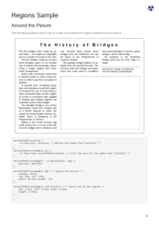

## REGIONS

[📄 Input HTML](/html/PDFreactor%20Examples/regions/regions.html):

### mPDF
 

[📕 mPDF Output](mpdf__html_PDFreactor_Examples_regions_regions.html.pdf)

### typeset.sh
 

[📕 typeset Output](typeset__html_PDFreactor_Examples_regions_regions.html.pdf)

### PDFreactor
 

[📕 PDFreactor Output](pdfreactor__html_PDFreactor_Examples_regions_regions.html.pdf)

